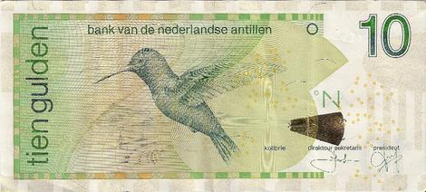

The Caribbean region, with its diverse and vibrant economies, encompasses a range of currencies, each reflecting its unique historical and economic heritage. These currencies play a crucial role both locally and globally by facilitating trade, impacting tourism, and influencing the economic stability and development of the islands. Among these, the Netherlands Antillean Guilder (ANG) stands out as a significant medium of exchange used in Curaçao and Sint Maarten. The ANG, pegged to the U.S. dollar at a fixed rate, underscores its importance by ensuring stability in trade and economic transactions in the region.

Currency is a fundamental component of global trade and finance, acting as the backbone that supports international transactions and exchanges. It is imperative for individuals and businesses to understand financial literacy concepts to optimize their participation in the global economy. This knowledge is essential not just for local economic interactions within the Caribbean but also for broader engagements in international markets.

Algorithmic trading represents a revolutionary advancement in the financial market that employs computer algorithms to automate trading strategies. This approach has gained significant traction due to its ability to execute trades with speed, efficiency, and precision unmatched by human traders. By analyzing vast datasets in real-time and executing orders at optimal prices, algorithmic trading minimizes human errors and improves decision-making processes in financial trading.

The purpose of this article is to investigate the intersection between the Netherlands Antillean Guilder and algorithmic trading. By exploring these two seemingly distinct realms, we aim to reveal the potential benefits and challenges that algorithmic trading presents to the Caribbean currency market, particularly concerning ANG. As algorithmic trading continues to evolve, it poses new questions and offers fresh opportunities for economies that aspire to integrate technology with traditional financial frameworks.

## Table of Contents

## Understanding the Netherlands Antillean Guilder (ANG)

The Netherlands Antillean Guilder (ANG) has a rich historical background, originally serving as the currency of the Netherlands Antilles, a group of Caribbean islands that were part of the Kingdom of the Netherlands. The dissolution of the Netherlands Antilles in 2010 led to a reorganization of the currency's role, yet the ANG remained significant as the official currency of Curaçao and Sint Maarten. Its resilience as a financial instrument is indicative of its relevance and utility in these jurisdictions.

The ANG is pegged to the U.S. dollar, with a fixed exchange rate of 1 USD to 1.79 ANG. This pegging plays a crucial role in stabilizing the currency and mitigating exchange rate fluctuations that could affect the islands' small, open economies. By ensuring a stable currency value relative to the U.S. dollar, ANG supports trade relations and encourages foreign investment, contributing to economic stability in Curaçao and Sint Maarten. The connection to the U.S. dollar also highlights the economic interdependence and influence of the United States in the Caribbean region.

An important development on the financial horizon for these islands is the impending transition from the Netherlands Antillean Guilder to the Caribbean guilder (Cg). This new currency is expected to replace the ANG, reflecting a regional effort to streamline and strengthen monetary practices across the participating territories. The switch aims to unify the currency systems and potentially enhance economic cooperation within the Caribbean Common Market (CARICOM).

The impact of the ANG on local and regional economies is noticeable. In Curaçao and Sint Maarten, it facilitates day-to-day transactions and serves as a repository of wealth and a means of economic calculation. The currency's stability and the forthcoming development of the Caribbean guilder hold the potential for bolstering regional integration and economic resilience. The ongoing use of ANG and the transition to the Cg are critical in shaping economic confidence and growth in this part of the Caribbean.

## Algorithmic Trading in the Currency Market

Algorithmic trading refers to the use of computer algorithms to automate trading decisions in financial markets. Typically, these algorithms are designed to execute trades at speeds unattainable by human traders, based on a pre-defined set of instructions that consider variables such as price, timing, and [volume](/wiki/volume-trading-strategy). In the context of the foreign exchange ([forex](/wiki/forex-system)) market, [algorithmic trading](/wiki/algorithmic-trading) has gained prominence due to its ability to process large amounts of market data quickly and execute orders efficiently.

The primary benefits of algorithmic trading in the forex market include speed, efficiency, and precision. Speed is crucial in the forex market, where currency prices can change rapidly. Algorithms can execute trades within milliseconds, minimizing the risk associated with manual trading's slower reaction times. Efficiency is achieved by allowing algorithms to monitor multiple markets and trading instruments simultaneously, removing human errors and biases. Precision ensures that trades are executed based on stringent criteria, optimizing the conditions under which trades are made.

Several popular algorithms are utilized in currency trading, each designed to capitalize on specific market conditions. Some include:

1. **Trend-following algorithms**: These algorithms identify and trade in the direction of market trends, utilizing technical indicators like moving averages. For instance, a basic moving average crossover strategy might buy a currency when a short-term moving average crosses above a long-term moving average and sell when the opposite occurs.

2. **Arbitrage algorithms**: These strategies exploit price discrepancies between different markets or instruments. An example could involve buying a currency in one market while simultaneously selling it in another at a higher price, capturing the spread as profit.

3. **Mean reversion algorithms**: Based on the statistical assumption that prices and returns will revert to their historical mean, these strategies buy low and sell high within a certain timeframe.

4. **Market-making algorithms**: These algorithms provide liquidity by continuously quoting both buy and sell prices. By earning the spread between the bid and ask prices, market makers maintain market activity and stability.

The growth of algorithmic trading in global markets is driven by several factors. Advances in technology, such as enhanced computational power and sophisticated software, have significantly reduced the cost and increased the accessibility of algorithmic trading. Additionally, the proliferation of high-frequency trading, where algorithms execute thousands of trades per second, underscores the need for automation. Regulatory changes that promote transparent and efficient markets further encourage algorithmic trading adoption.

Emerging trends in automated currency trading include the integration of [artificial intelligence](/wiki/ai-artificial-intelligence) and [machine learning](/wiki/machine-learning). These technologies allow algorithms to adapt and learn from market data, improving their predictive capabilities and decision-making accuracy. The increasing availability of big data analytics provides valuable insights into market behavior, enhancing algorithm performance. Furthermore, the use of natural language processing enables algorithms to interpret and react to news and events in real-time, optimizing trade execution in dynamic environments.

In summary, algorithmic trading represents a pivotal advancement in currency markets, offering unmatched speed, efficiency, and precision. As technology continues to evolve, its influence on trading strategies and market dynamics is likely to grow, driving further innovation and efficiency in global forex markets.

## Intersection of ANG and Algorithmic Trading

Algorithmic trading, a method that employs computer algorithms to automate trading strategies, offers significant potential when applied to the Netherlands Antillean Guilder (ANG) currency pairs. By leveraging the speed and statistical prowess of algorithms, traders can exploit minute price differentials in the ANG market.

### Algorithmic Trading Strategies with ANG

Algorithmic trading strategies, such as those utilizing statistical [arbitrage](/wiki/arbitrage), operate on the detection of pricing inefficiencies amongst correlated assets. For instance, traders might develop strategies involving pairs trading, where they exploit price movements between the ANG and its pegged counterpart, the U.S. dollar (USD). Given the ANG's fixed exchange rate to the USD at approximately 1.79 ANG per USD, algorithms can be programmed to identify deviations from this peg, allowing traders to capitalize on mean reversion trading tactics. 

More advanced strategies involve machine learning algorithms that adapt to market conditions. These algorithms can process vast datasets, learning from past market behaviors to predict future price movements. Techniques such as regression models, neural networks, and support vector machines (SVMs) can be integrated to forecast the ANG's micro-trends.

### Case Studies

Several case studies illustrate the efficacy of algorithmic trading with the ANG. For instance, a [hedge fund](/wiki/hedge-fund-trading-strategies) implementing a strategy where intraday trading takes advantage of predictable [liquidity](/wiki/liquidity-risk-premium) patterns in the ANG market saw significant improvements in execution efficiency and reduced transaction costs. Such algorithms harness historical trade data to predict optimal trade times, minimizing market impact and slippage.

### Challenges and Opportunities

While algorithmic trading presents opportunities for enhanced liquidity and efficiency, it also poses challenges. Markets trading in smaller currencies like the ANG often suffer from lower liquidity compared to major currencies. This can exacerbate market [volatility](/wiki/volatility-trading-strategies), increasing the impact of large trades. Deploying algorithms necessitates careful monitoring to avoid unintended market destabilization.

Moreover, the infrastructure required for algorithmic trading might not be as developed in smaller markets. Adequate technological and regulatory environments are crucial to support these systems. Investing in robust infrastructure can position local markets to benefit fully from algorithmic trading innovations.

### Stabilization vs. Destabilization

The impact of algorithmic trading on smaller markets such as those trading the ANG can be dual-edged. On one hand, it can provide liquidity and price stability by facilitating more frequent trading and tighter bid-ask spreads. However, it can also lead to destabilization if improperly managed. Algorithms may cause rapid price swings if they amplify trends through excessive buying or selling pressure. This phenomenon was observed during the infamous "Flash Crash" in larger markets and highlights the need for stringent risk management protocols.

### Future Prospects

The future of algorithmic trading in the ANG and broader Caribbean markets is promising. As financial technology evolves, smaller markets are increasingly integrating advanced analytics and automation. This development promises to enhance market efficiency and accessibility, potentially attracting more global traders to the ANG market.

In conclusion, while algorithmic trading presents both challenges and opportunities for the ANG, proper regulatory frameworks and technological investment are crucial for harnessing its potential. As the Caribbean financial landscape evolves, embracing these innovations could significantly transform the region's currency markets.

## Preparing for the Future: Financial Education and Technology

Financial literacy plays a critical role in comprehending and leveraging algorithmic trading, particularly as financial markets become increasingly sophisticated and technology-driven. Understanding the principles of financial markets and the mechanics of algorithmic trading is essential for traders, investors, and financial professionals. Financial literacy empowers individuals to make informed decisions, enhancing their ability to navigate the complexities of automated trading systems.

Technological advancements are significantly reshaping currency trading in the Caribbean and beyond. The rise of high-frequency trading platforms, sophisticated trading algorithms, and artificial intelligence are transforming how currencies, including the Netherlands Antillean Guilder (ANG), are traded. These technologies enable greater speed and efficiency, reducing latency and improving market predictions. Machine learning models, capable of analyzing vast datasets, help identify trends and opportunities, enabling more precise and profitable trading strategies.

There are numerous educational resources available for those interested in algorithmic trading and currency markets. Online courses, webinars, and workshops offered by financial educational platforms provide foundational knowledge and advanced techniques in algorithmic trading. Platforms like Coursera, edX, and Khan Academy offer courses tailored to different expertise levels, covering topics such as quantitative analysis, risk management, and trading strategy development. Additionally, [books](/wiki/algo-trading-books) and research papers written by experts in the field provide valuable insights into the latest theories and practices.

Staying updated with financial regulations and technological innovations is crucial for anyone involved in currency trading. Regulatory bodies frequently update policies to address challenges posed by technological advancements, ensuring market integrity and protecting participants. Awareness of such regulations helps traders comply with legal requirements and adopt ethical trading practices. Likewise, keeping pace with technological innovations allows traders to leverage new tools and systems, maintaining a competitive edge in the market.

To adapt and thrive in an evolving financial landscape, individuals must adopt continuous learning and flexibility. Emphasizing skill development in data analysis, programming, and machine learning can enhance one's ability to create and optimize trading algorithms. Engaging with financial communities, attending industry conferences, and participating in online forums can also provide valuable networking opportunities and insights into emerging trends. Embracing a proactive approach to education and staying informed about market dynamics will equip traders and investors to harness the potential of algorithmic trading effectively.

## Conclusion

The Netherlands Antillean Guilder (ANG) remains a pivotal currency within both Caribbean and global markets, underlining its historical and economic significance. Despite impending transitions to a new currency, the ANG continues to serve as a cornerstone of regional trade and finance. Its stability, owing to its peg to the U.S. dollar, provides a reliable medium for financial transactions and fosters economic resilience in Curaçao and Sint Maarten.

Algorithmic trading has emerged as a formidable force in modern financial markets, offering enhanced speed, efficiency, and precision. As these algorithms grow more sophisticated, they provide valuable tools for navigating the complexities of currency markets, including those associated with the ANG. However, the integration of algorithmic trading poses unique challenges, particularly concerning market volatility and liquidity, which are crucial considerations for smaller markets like that of the Caribbean.

The evolution of currency trading in the Caribbean is a testament to the region's adaptive capacity and openness to technological innovations. As algorithmic trading continues to evolve, it invites both opportunities and risks, demanding a proactive approach towards understanding and managing these dynamics. Future prospects lie in harnessing these technologies to stabilize and potentially expand the market reach of currencies like the ANG.

Promoting financial literacy and engagement through education is imperative. Understanding algorithmic trading and other financial technologies is essential for participants in these markets. Access to educational resources can empower individuals and traders, enabling them to make informed decisions and embrace technological advancements. Moreover, keeping abreast of financial regulations is vital in ensuring compliance and optimizing the benefits of emerging trading methods.

In conclusion, the advancement of financial technologies, particularly algorithmic trading, presents a transformative opportunity for the Caribbean markets. Engaging in continuous research and embracing these advancements will not only solidify the economic standing of currencies like the ANG but also prepare the Caribbean for future financial challenges and opportunities. As technology reshapes the trading landscape, active participation and adaptation will be crucial in securing economic growth and stability.

## References & Further Reading

[1]: Lopez de Prado, M. (2018). ["Advances in Financial Machine Learning"](https://www.amazon.com/Advances-Financial-Machine-Learning-Marcos/dp/1119482089). Wiley.

[2]: Aronson, D. R. (2006). ["Evidence-Based Technical Analysis: Applying the Scientific Method and Statistical Inference to Trading Signals"](https://www.amazon.com/Evidence-Based-Technical-Analysis-Scientific-Statistical/dp/0470008741). Wiley.

[3]: Jansen, S. (2020). ["Machine Learning for Algorithmic Trading"](https://github.com/stefan-jansen/machine-learning-for-trading). Packt Publishing.

[4]: Chan, E. P. (2009). ["Quantitative Trading: How to Build Your Own Algorithmic Trading Business"](https://github.com/ftvision/quant_trading_echan_book). Wiley Trading.

[5]: Harvey, C. R., Liu, Y., & Zhu, H. (2016). ["… and the Cross-Section of Expected Returns."](https://people.duke.edu/~charvey/Research/Published_Papers/P118_and_the_cross.PDF) Review of Financial Studies, 29(1), 5-68.