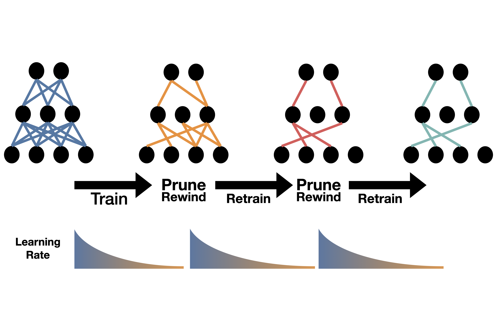

## Table of Contents

## What is network shrinking in machine learning?

Network shrinking in machine learning is a technique used to make neural networks smaller and more efficient. This is important because smaller networks use less memory and can process information faster. The main idea is to remove parts of the network that are not very important, so the network still works well but is simpler. This can be done by looking at the weights of the network. If a weight is very small, it means that part of the network is not doing much, so it can be removed or made smaller.

One common way to shrink a network is by using a method called pruning. Pruning involves cutting away the connections or neurons that have the smallest weights. For example, if a weight $$w$$ is close to zero, it might be removed. After pruning, the network might need to be retrained a bit to make sure it still works well. Another way to shrink a network is by quantization, which means using fewer bits to store the weights. This makes the network smaller but can also make it a bit less accurate. Both methods help in making neural networks more practical for use in devices with limited resources, like mobile phones.

## Why is network shrinking important for machine learning models?

Network shrinking is important for machine learning models because it makes them smaller and faster. When a model is smaller, it uses less memory and can run on devices with limited resources, like smartphones or small computers. This means more people can use the model because it doesn't need a big, powerful computer. Also, smaller models can process information faster, which is good for applications where speed matters, like real-time image recognition or voice commands.

Another reason network shrinking is important is that it can make models more efficient without losing much accuracy. By removing parts of the model that don't contribute much, like connections with small weights, the model stays useful but becomes simpler. For example, if a weight $$w$$ is close to zero, it might not be very important, so it can be removed. This process, called pruning, helps keep the model effective while making it easier to use and maintain.

## What are the benefits of using network shrinking techniques like TinyNet?

Using network shrinking techniques like TinyNet can make [machine learning](/wiki/machine-learning) models smaller and faster. This is really helpful because smaller models use less memory and can run on devices like phones or small computers. These devices don't have a lot of power, so having a smaller model means more people can use it. For example, if someone wants to use a model to recognize pictures on their phone, a smaller model like TinyNet would work better because it doesn't need a lot of space or power.

Another benefit of using TinyNet is that it can keep the model accurate even after making it smaller. This is done by removing parts of the model that don't do much, like connections with very small weights. If a weight $$w$$ is close to zero, it might not be very important, so it can be removed. This process, called pruning, helps the model stay useful but become simpler. This way, the model can still do its job well but is easier to use and maintain.

## How does NetAdapt approach network shrinking?

NetAdapt is a method used to make neural networks smaller and faster. It does this by figuring out which parts of the network can be taken away without making it worse at its job. NetAdapt looks at how well the network works and tries different ways to make it smaller. It starts with a big network and then slowly removes parts of it, checking after each change to see if the network still works well. If it does, the change is kept. This way, NetAdapt can make the network smaller without losing much accuracy.

One cool thing about NetAdapt is that it doesn't just guess which parts to remove. It uses a smart way to test different changes and pick the best one. For example, if a weight $$w$$ in the network is very small, it might not be very important, so NetAdapt might try removing it. If the network still works well after this change, the weight is taken out for good. This method helps make the network simpler but still good at what it does.

## What are the key differences between TinyNet and NetAdapt?

TinyNet and NetAdapt are both ways to make neural networks smaller and faster, but they do it a bit differently. TinyNet focuses on making the network smaller by removing parts that don't do much, like connections with very small weights. For example, if a weight $$w$$ is close to zero, TinyNet might remove it because it's not very important. This helps the network use less memory and run on devices like phones, which don't have a lot of power.

NetAdapt, on the other hand, takes a more careful approach. It starts with a big network and then slowly tries different ways to make it smaller. NetAdapt checks after each change to see if the network still works well. If it does, the change is kept. This way, NetAdapt can make the network smaller without losing much accuracy. It's like trying on different clothes to see which ones fit best, but for neural networks.

Both methods help make neural networks more practical for use in devices with limited resources, but they do it in their own special ways. TinyNet is more about cutting out the less important parts quickly, while NetAdapt takes its time to make sure each change is good for the network.

## Can you explain the process of implementing network shrinking in a model?

To implement network shrinking in a model, you start with a big [neural network](/wiki/neural-network) and then look for parts that you can remove or make smaller. One way to do this is by using a method called pruning. Pruning involves cutting away connections or neurons that have very small weights. For example, if a weight $$w$$ in the network is close to zero, it means that part of the network isn't doing much, so you might remove it. After pruning, you might need to retrain the network a bit to make sure it still works well. This helps make the network smaller and faster, which is good for devices like phones that don't have a lot of power.

Another way to shrink a network is by using a method called quantization. Quantization means using fewer bits to store the weights in the network. This makes the network smaller because it takes up less memory, but it can also make the network a bit less accurate. After quantization, you might also need to do some fine-tuning to make sure the network still does its job well. Both pruning and quantization help make neural networks more practical for use in devices with limited resources, like smartphones or small computers.

## What metrics should be considered when evaluating the effectiveness of network shrinking?

When evaluating the effectiveness of network shrinking, one important metric to consider is the model's accuracy. After shrinking the network, you want to make sure it still does its job well. For example, if the network is used for image recognition, you would check if it can still correctly identify images after being made smaller. If the accuracy drops too much, the shrinking might not be worth it. Another key metric is the model's size, measured in terms of memory usage or the number of parameters. A smaller model uses less memory, which is good for devices like phones that don't have a lot of space.

Another metric to look at is the model's speed, or how fast it can process information. A smaller network should be able to run faster, which is important for applications where speed matters, like real-time voice commands. You can measure this by looking at the time it takes for the model to make predictions. Finally, consider the trade-off between these metrics. Sometimes, making a model smaller might make it a bit less accurate, but if the speed and size improvements are big enough, it might still be a good choice. Balancing these factors is key to deciding if network shrinking is effective for your specific needs.

## How does network shrinking impact the performance of a machine learning model?

Network shrinking can make a machine learning model smaller and faster. When you shrink a network, you remove parts that don't do much, like connections with very small weights. For example, if a weight $$w$$ is close to zero, it might not be very important, so you can remove it. This makes the model use less memory, which is good for devices like phones that don't have a lot of space. It also makes the model run faster, which is important for things like real-time voice commands or image recognition.

However, shrinking a network can also make it a bit less accurate. When you remove parts of the network, you might lose some of the information it was using to make predictions. This means the model might not be as good at its job after shrinking. The key is to find a balance between making the model smaller and keeping it accurate enough for what you need. Sometimes, a little drop in accuracy might be okay if the model is much smaller and faster.

## What are some common challenges faced when applying network shrinking techniques?

One common challenge when applying network shrinking techniques is maintaining the model's accuracy. When you remove parts of a network, like connections with small weights, you might lose important information that the model was using to make predictions. For example, if a weight $$w$$ is close to zero, it might seem unimportant, but removing it could still affect the model's performance. This means you have to be careful and often need to retrain the model after shrinking to make sure it still works well.

Another challenge is finding the right balance between shrinking the network and keeping it useful. Making a model smaller can make it faster and use less memory, which is great for devices like phones. But if you shrink it too much, the model might not be able to do its job anymore. This trade-off requires a lot of testing and tweaking to get right. Sometimes, you might need to try different shrinking methods, like pruning or quantization, to see which one works best for your specific model and needs.

## How can network shrinking be optimized for different types of neural networks?

Network shrinking can be optimized for different types of neural networks by using methods that fit each network's structure. For example, in convolutional neural networks (CNNs), which are often used for image recognition, you might focus on pruning filters or layers that have the least impact on the model's performance. If a weight $$w$$ in a filter is close to zero, it might not be very important, so you can remove it to make the network smaller. This helps keep the network good at recognizing images but makes it easier to use on devices like phones.

For recurrent neural networks (RNNs), which are used for tasks like language processing, you might need to be careful about which connections you remove. RNNs have loops that allow information to persist, so removing the wrong connection could mess up this flow. You might try different ways of pruning and see which one keeps the network's accuracy high while making it smaller. Both types of networks need careful testing and tweaking to make sure the shrinking doesn't hurt their performance too much.

## What are the latest advancements in network shrinking research?

Recent advancements in network shrinking research have focused on making the process more automatic and efficient. One key development is the use of [reinforcement learning](/wiki/reinforcement-learning) to guide the pruning process. Instead of manually deciding which parts of the network to remove, researchers are training [agents](/wiki/agents) to learn the best way to shrink a network while keeping its accuracy high. For example, if a weight $$w$$ in the network is close to zero, the agent might learn to remove it because it's not very important. This method helps find the best balance between making the network smaller and keeping it useful.

Another advancement is the development of new techniques for quantization. Quantization means using fewer bits to store the weights in the network, which makes it smaller but can also make it less accurate. Researchers are working on ways to do quantization that keep the network's performance high. One approach is to use mixed-precision quantization, where different parts of the network use different numbers of bits. This way, the most important parts of the network can keep more precision, while less important parts can be made smaller. These advancements are helping make neural networks more practical for use in devices with limited resources, like smartphones.

## How can network shrinking be integrated with other model optimization techniques?

Network shrinking can be combined with other model optimization techniques to make neural networks even better. One way to do this is by using network shrinking along with model compression methods like knowledge distillation. In knowledge distillation, a smaller model learns to mimic a bigger, more accurate model. By shrinking the smaller model and then using knowledge distillation, you can make it even smaller while still keeping it accurate. For example, if a weight $$w$$ in the smaller model is close to zero, you might remove it to make the model smaller, and then use knowledge distillation to help it learn from the bigger model.

Another way to integrate network shrinking with other techniques is by using it with model quantization. Quantization means using fewer bits to store the weights in the network, which makes it smaller but can also make it less accurate. By shrinking the network first and then applying quantization, you can make the model even smaller. After quantization, you might need to do some fine-tuning to make sure the model still works well. Both of these methods help make neural networks more practical for use in devices like phones, which don't have a lot of power or memory.