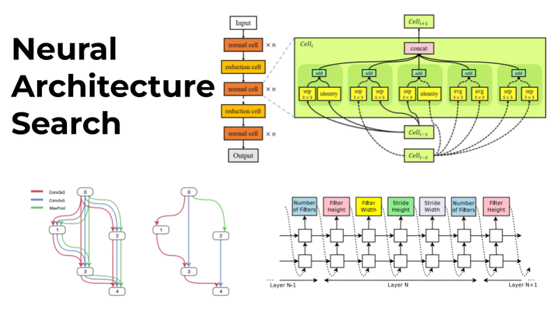

## Table of Contents

## What is Neural Architecture Search (NAS) in machine learning?

Neural Architecture Search (NAS) is a technique used in machine learning to automatically design the best neural network for a specific task. Instead of humans manually creating the structure of a neural network, NAS uses algorithms to search through a vast space of possible network designs to find the one that performs the best. This is especially useful because it can save a lot of time and effort, and sometimes even find better network designs than those created by experts.

The process of NAS usually involves three main steps: a search space, a search strategy, and a performance estimation strategy. The search space is like a big collection of all possible neural network designs that the algorithm can choose from. The search strategy is the method used to explore this space, such as using reinforcement learning or evolutionary algorithms. Finally, the performance estimation strategy is how the algorithm decides which network designs are good or bad, often by training them on a small dataset and seeing how well they perform. By automating these steps, NAS can help create more efficient and effective neural networks for various applications.

## How does NAS differ from traditional neural network design?

In traditional neural network design, experts manually create the structure of the network. They decide how many layers the network should have, what type of layers to use, and how the layers should be connected. This process can be time-consuming and requires a lot of trial and error to find a good design. The performance of the network depends a lot on the designer's experience and intuition.

Neural Architecture Search (NAS) is different because it automates the design process. Instead of relying on human experts, NAS uses algorithms to search through many possible network designs. It tries different combinations of layers and connections to find the best one for a specific task. This can be much faster and sometimes even find better designs than those created by humans.

For example, while a human might spend weeks tweaking a network design, NAS can explore thousands of designs in a much shorter time. This is done by defining a search space of possible designs, using a search strategy to explore this space, and evaluating the performance of different designs. By automating these steps, NAS can help create more efficient and effective neural networks.

## What are the main components of a NAS system?

The main components of a Neural Architecture Search (NAS) system are the search space, the search strategy, and the performance estimation strategy. The search space is like a big collection of all possible neural network designs that the algorithm can choose from. It includes different types of layers, how they can be connected, and other details about the network structure. The search space is important because it defines what designs the NAS system can explore.

The search strategy is the method used to explore the search space. It decides how the NAS system will try different network designs. Common search strategies include reinforcement learning, where the system learns from its choices, and evolutionary algorithms, where the system evolves better designs over time. The search strategy is crucial because it determines how efficiently the NAS system can find good network designs.

The performance estimation strategy is how the NAS system decides which network designs are good or bad. It usually involves training the network on a small dataset and seeing how well it performs. This step is important because it helps the NAS system to quickly evaluate many different designs. By combining these three components, a NAS system can automatically find the best neural network design for a specific task.

## Can you explain the basic process of how NAS works?

Neural Architecture Search (NAS) works by automatically finding the best design for a neural network. It starts with a big collection of all possible network designs, called the search space. This space includes different types of layers and how they can be connected. The NAS system then uses a method, called the search strategy, to explore this space. It tries different combinations of layers and connections to see which ones work best. Common search strategies include reinforcement learning, where the system learns from its choices, and evolutionary algorithms, where the system evolves better designs over time.

Once the NAS system has tried different network designs, it needs to decide which ones are good or bad. This is done using a performance estimation strategy. The system trains each design on a small dataset and sees how well it performs. If a design does well, the NAS system keeps it and tries to make it even better. If a design does poorly, the system moves on to try other designs. By repeating this process, the NAS system can find the best neural network design for a specific task without needing a human to manually create it.

## What are some common search strategies used in NAS?

One common search strategy used in NAS is reinforcement learning. In this approach, the NAS system acts like a learner that gets rewards or penalties based on how well the neural network designs it picks perform. It keeps trying different designs and learns from its experiences to choose better designs over time. This method can be very effective, but it can also take a lot of time and computing power because it needs to try many different designs.

Another popular search strategy is evolutionary algorithms. These algorithms work by starting with a group of network designs and then using ideas from natural evolution to improve them. The system creates new designs by mixing and changing the existing ones, and then keeps the best ones while getting rid of the worst. This process repeats over many generations, slowly improving the designs. Evolutionary algorithms can be good at exploring a wide range of possible designs, but they might need a lot of time to find the best one.

A third strategy is Bayesian optimization. This method uses a mathematical model to predict how well different network designs will perform. It then chooses the next design to try based on these predictions, trying to balance exploring new designs and improving the best ones it has found so far. Bayesian optimization can be faster than other methods because it uses smart guesses to find good designs quickly, but it might not always find the very best design if the search space is very large.

## What are the advantages of using NAS over manual architecture design?

Using Neural Architecture Search (NAS) has big advantages over manually designing a neural network. NAS can save a lot of time because it automatically tries many different designs. Instead of a person spending weeks or months trying to find the best network, NAS can do it much faster. This means you can quickly find a good design for your task without needing to be an expert in neural networks. Also, NAS can sometimes find better designs than humans because it can explore a huge number of possibilities that a person might not think of.

Another advantage of NAS is that it can be more consistent and less dependent on the designer's experience. When people design networks, the results can vary a lot depending on their knowledge and intuition. NAS uses algorithms to search through the design space, so it can give more reliable results. This makes it easier to compare different designs and choose the best one. Overall, NAS helps create more efficient and effective neural networks by automating the design process and reducing the need for human expertise.

## What are the challenges and limitations faced when implementing NAS?

Implementing Neural Architecture Search (NAS) can be challenging because it requires a lot of computing power. Searching through all the possible network designs takes a lot of time and needs powerful computers. This can make NAS expensive and not always practical for everyone. Also, the search space in NAS can be very big, and it's hard to make sure the algorithm explores it well. If the search space is not set up right, the NAS system might miss good designs or get stuck on bad ones.

Another limitation of NAS is that it can be hard to understand why a certain design works well. When a person designs a network, they can explain their choices based on what they know about the task. But with NAS, the algorithm finds the best design automatically, and it can be tough to figure out why it works. This makes it harder to improve the design or use it for other tasks. Also, NAS might not always find the very best design because it depends on how the search strategy and performance estimation work. If these are not set up well, the results might not be as good as they could be.

## How can NAS be integrated into existing machine learning workflows?

Integrating Neural Architecture Search (NAS) into existing machine learning workflows can be done by adding NAS as a step before training the final model. In a typical workflow, you might start by preparing your data, then design a neural network, train it, and finally evaluate its performance. With NAS, you would add a step where you let the NAS system search for the best network design. After NAS finds a good design, you can use that design to train your final model. This way, you can still use your usual tools and processes, but with the advantage of having a better network design.

One way to do this is by using existing NAS libraries and frameworks that can be easily added to your workflow. For example, you could use a library like AutoKeras or NAS-Bench-101, which are designed to work with popular machine learning frameworks like TensorFlow or PyTorch. These libraries provide tools that you can call from your existing code to run the NAS process. After NAS finishes, it gives you a network design that you can then use in your regular training and evaluation steps. This makes it easier to try NAS without having to change your entire workflow.

## What are some popular NAS algorithms and frameworks?

Some popular NAS algorithms include reinforcement learning-based methods like ENAS (Efficient Neural Architecture Search) and evolutionary algorithms like AmoebaNet. ENAS uses a controller network to generate network designs and then trains these designs using shared weights, which makes the search process much faster. AmoebaNet, on the other hand, uses an evolutionary approach where it starts with a population of network designs, and through mutation and selection, it evolves better designs over time. Both methods have shown good results, but they can be computationally expensive.

Popular NAS frameworks include AutoKeras and NAS-Bench-101. AutoKeras is a user-friendly library that automates the process of finding the best neural network architecture. It works with popular machine learning frameworks like TensorFlow and can be easily added to existing workflows. NAS-Bench-101 is a benchmark dataset that provides pre-computed results for many network designs on a specific task. This makes it easier to test and compare different NAS algorithms without needing to run the search process from scratch. Both frameworks help make NAS more accessible and efficient for users.

## How do performance metrics and validation strategies impact NAS?

Performance metrics and validation strategies are really important in Neural Architecture Search (NAS) because they help decide which network designs are good or bad. The performance metric is like a score that tells how well a network design works on a task. Common metrics include accuracy, which measures how often the network gets the right answer, and loss, which shows how far off the network's predictions are from the true answers. The choice of metric can change what kind of designs NAS finds. For example, if you use accuracy, NAS might find designs that are good at getting the right answer but might not be the best at other things like speed or using less memory.

Validation strategies are also key because they help make sure the network designs work well not just on the data used for training but also on new data. A common strategy is to use a separate validation set, which is data the network hasn't seen during training. This helps check if the design will work well in real life. Another strategy is cross-validation, where you split the data into different parts and train the network multiple times, each time using a different part for validation. This can give a more reliable estimate of how well the design will perform. Both the performance metric and validation strategy need to be chosen carefully to make sure NAS finds the best network design for your task.

## What are the latest advancements in NAS research?

The latest advancements in Neural Architecture Search (NAS) research focus on making the search process faster and more efficient. One big step forward is the development of one-shot NAS methods. These methods use a single super-network that contains many different smaller networks inside it. By training this super-network once, you can quickly try out many different network designs without needing to train each one from scratch. This saves a lot of time and computing power. Another advancement is the use of meta-learning in NAS. Meta-learning helps the NAS system learn how to search for good network designs more quickly by using what it learned from past searches. This makes the whole process smarter and faster.

Another important area of advancement is in making NAS more accessible and easier to use. Researchers have been working on creating better tools and frameworks that let people use NAS without needing to be experts. For example, AutoKeras is a user-friendly library that makes it easy to add NAS to your machine learning workflow. Also, there are now benchmark datasets like NAS-Bench-101 that help researchers test and compare different NAS methods more easily. These tools make it simpler for more people to use NAS and find the best network designs for their tasks.

## How can NAS be applied to specific domains like computer vision or natural language processing?

In computer vision, NAS can be used to find the best network designs for tasks like image classification, object detection, and image segmentation. For example, if you want to build a system that can tell what's in a picture, you can use NAS to search for the best network that does this job well. NAS can try different types of layers and connections to see which ones work best for recognizing things in images. This is really helpful because it can find designs that are better than those made by humans, and it saves a lot of time. Researchers have used NAS to create networks like EfficientNet, which are very good at understanding images while using less computing power.

In natural language processing (NLP), NAS can help find the best network designs for tasks like text classification, machine translation, and sentiment analysis. If you want to build a system that can understand and translate languages, NAS can search for the best network that does this well. It can try different combinations of layers and connections to see which ones are good at understanding and generating text. This is useful because it can find designs that work better than those made by people, and it can do this faster. For example, NAS has been used to create networks like Evolved Transformer, which are very good at tasks like translating text from one language to another.