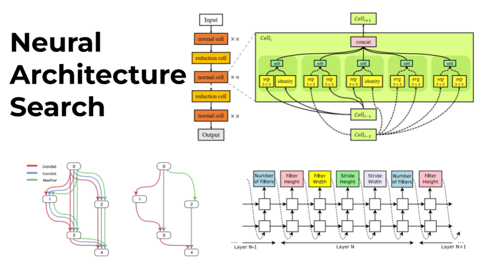

## Table of Contents

## What is Neural Architecture Search (NAS) and why is it important in machine learning?

Neural Architecture Search (NAS) is a technique used in machine learning to automatically design the best neural network for a specific task. Instead of humans manually creating and testing different network designs, NAS uses algorithms to search through a vast space of possible architectures to find the one that performs the best. This process can save a lot of time and effort because designing neural networks by hand can be very complex and time-consuming.

NAS is important because it helps make machine learning more efficient and effective. By automating the design of neural networks, researchers and engineers can focus more on other aspects of their projects, like improving data quality or developing new algorithms. Additionally, NAS can often find network architectures that perform better than those designed by humans, leading to more accurate and powerful machine learning models. This is especially useful in fields like healthcare, finance, and autonomous driving, where better performance can lead to significant improvements in outcomes.

## How does NAS differ from traditional neural network design?

In traditional neural network design, experts manually create the structure of the network. They decide how many layers the network should have, what type of layers to use, and how the layers should be connected. This process can take a lot of time and requires a deep understanding of both the task at hand and neural network theory. If the initial design doesn't work well, experts have to go back and make changes, testing different configurations until they find one that works best.

Neural Architecture Search (NAS) automates this process. Instead of humans designing the network, NAS uses algorithms to search through many possible network structures. It tries different combinations of layers and connections, evaluating how well each one performs on the task. This means that NAS can explore a much larger number of designs than a human could, often finding better solutions more quickly. By automating the design process, NAS makes it easier to create effective neural networks without needing as much manual work or expertise.

## What are the main approaches to Neural Architecture Search?

There are three main ways to do Neural Architecture Search: [reinforcement learning](/wiki/reinforcement-learning), evolutionary algorithms, and gradient-based methods. Reinforcement learning uses a controller that tries different network designs and gets feedback on how well they work. It learns from this feedback to make better choices about what designs to try next. Evolutionary algorithms work by creating a population of network designs and then using processes like mutation and crossover to create new designs. The best designs are kept and used to create even better ones over time. Gradient-based methods use math to figure out how small changes to the network design will affect its performance. They use this information to make small adjustments that improve the network step by step.

Each of these approaches has its own strengths and weaknesses. Reinforcement learning can find very good designs but can take a long time because it needs to try a lot of different options. Evolutionary algorithms are good at exploring a wide range of designs and can be very flexible, but they can also be slow and need a lot of computing power. Gradient-based methods are usually faster because they can make small improvements quickly, but they might not be as good at finding completely new types of network designs. Choosing the right approach depends on the specific task and the resources available.

## Can you explain the concept of reinforcement learning in the context of NAS?

Reinforcement learning in Neural Architecture Search works like a game where a player, called a controller, tries different [neural network](/wiki/neural-network) designs to see which one works best for a task. The controller starts with a random design and then gets a score based on how well the network performs. If the score is good, the controller learns to make similar designs in the future. If the score is bad, it learns to try something different. This process repeats many times, with the controller getting better at choosing good designs over time.

The key part of this method is how the controller learns from the scores it gets. It uses a special kind of math called a policy gradient to figure out how to change its choices to get better scores. The controller keeps a record of what designs it tried and what scores they got, and it uses this information to decide what to try next. Over many tries, the controller can find a really good neural network design that performs much better than what a person might come up with by hand.

## What is the role of evolutionary algorithms in NAS?

Evolutionary algorithms in Neural Architecture Search work like a process of natural selection but for neural networks. They start with a group of different network designs, called a population. Each design is tested to see how well it works on a task. The best designs are kept, and new designs are made by changing or combining the good ones. This is like how animals evolve over time, with the fittest surviving and passing on their traits to the next generation. Over many rounds, the evolutionary algorithm can find very good network designs that might be hard for humans to think of.

The main steps in this process are mutation and crossover. Mutation means making small changes to a design, like adding or removing a layer, to see if it works better. Crossover means taking parts of two good designs and combining them to make a new one. These steps help the algorithm explore a lot of different designs and find the best ones. Evolutionary algorithms are good at finding creative solutions, but they can take a long time because they need to try many different designs.

## How does Differentiable NAS (DNAS) work and what are its advantages?

Differentiable Neural Architecture Search (DNAS) is a method that makes the process of finding the best neural network design easier and faster. In DNAS, instead of trying out many different network designs one by one, we use a special way to look at all possible designs at the same time. We do this by creating a big network that includes all the possible designs we want to try. Then, we use math to figure out which parts of this big network are most important for the task. We use a thing called a "relaxation" method to make this big network easier to work with. This means we treat the choices about which parts of the network to use as numbers between 0 and 1, instead of just yes or no. By doing this, we can use simple math to find the best design without trying each one separately.

The main advantage of DNAS is that it is much faster than other methods. Because it looks at all possible designs at once, it can find a good design in less time than methods like reinforcement learning or evolutionary algorithms, which have to try many designs one by one. This makes DNAS very useful when you need to find a good network quickly. Another advantage is that DNAS can use the same math that is used to train neural networks, so it fits well with other [machine learning](/wiki/machine-learning) tools. This makes it easier to use and understand. Overall, DNAS makes the process of designing neural networks more efficient and effective.

## What is DARTS and how does it simplify the NAS process?

DARTS, which stands for Differentiable Architecture Search, is a method that makes finding the best neural network design easier and faster. In DARTS, we start by creating a big network that includes all the possible designs we want to try. Instead of testing each design one by one, DARTS uses a special way to look at all the designs at the same time. We treat the choices about which parts of the network to use as numbers between 0 and 1, rather than just yes or no. This is done using a method called "relaxation." By doing this, we can use simple math to figure out which parts of the network are most important for the task we are working on.

The main way DARTS simplifies the NAS process is by making it much quicker. Because DARTS looks at all possible designs at the same time, it can find a good design in less time than other methods, like reinforcement learning or evolutionary algorithms, which have to try many designs one by one. This makes DARTS very useful when you need to find a good network quickly. Also, DARTS uses the same kind of math that is used to train neural networks, so it fits well with other machine learning tools. This makes it easier to use and understand, helping researchers and engineers design better neural networks more efficiently.

## Can you describe the ProxylessNAS method and its benefits over other NAS techniques?

ProxylessNAS is a way to find the best neural network design without using a smaller, simpler version of the task first. In other methods, people often use a smaller version of the task, called a proxy, to quickly test different designs. But with ProxylessNAS, we test the designs directly on the real task. This means we don't have to worry about the designs working well on the proxy but not on the real task. ProxylessNAS uses a special way of looking at all possible designs at the same time, similar to DARTS. It treats the choices about which parts of the network to use as numbers between 0 and 1, making it easier to find the best design using math.

The main benefit of ProxylessNAS over other NAS techniques is that it finds designs that work well on the real task right away. This saves time because we don't have to go back and test the designs on the real task after using a proxy. It also means the designs are more likely to be good for the task we actually care about. Another benefit is that ProxylessNAS can be faster than some other methods because it doesn't need to try many different designs one by one. Instead, it uses math to look at all possible designs at once, making the search process more efficient.

## What are some of the challenges faced when implementing NAS in real-world applications?

Implementing Neural Architecture Search in real-world applications can be tricky because it often needs a lot of computing power. Searching through many different neural network designs takes a long time, and you need strong computers to do it quickly. This can be expensive and not everyone has access to the kind of machines needed to run NAS effectively. Also, NAS can use up a lot of energy, which is not good for the environment. People are working on ways to make NAS use less power and be faster, but it's still a big challenge.

Another challenge is making sure that the designs NAS finds actually work well in the real world. Sometimes, a design might work great on a test set but not as well when used in real life. This is called overfitting, and it can be hard to avoid. Researchers are trying to come up with ways to make NAS find designs that are more likely to work well in real situations, but it's not easy. They also need to make sure the designs are not too complicated, because simpler designs are often easier to use and understand. Balancing these things is a big part of making NAS useful for real-world applications.

## How do advanced NAS methods like AutoGAN and SCARLET-NAS improve upon earlier techniques?

AutoGAN and SCARLET-NAS are advanced methods that make finding the best neural network designs easier and better than older methods. AutoGAN uses a special kind of math called Generative Adversarial Networks (GANs) to create and improve network designs. It does this by having two parts of the system work against each other: one part tries to make good designs, and the other part tries to find flaws in those designs. This back-and-forth helps AutoGAN find really good designs quickly. SCARLET-NAS, on the other hand, focuses on making the search process faster by using a clever way to look at many designs at once. It uses a method called "supernet" to test different parts of the network together, which saves time and makes the search more efficient.

Both AutoGAN and SCARLET-NAS improve on earlier techniques by being faster and more accurate. AutoGAN's use of GANs means it can explore a wider range of designs and find ones that might be hard to think of otherwise. This is good because it can lead to better performance on tasks. SCARLET-NAS's supernet approach means it can find good designs without needing as much computing power as some other methods. This makes it more practical for real-world use because it's faster and uses less energy. Overall, these advanced methods make NAS more useful and easier to apply to different kinds of problems.

## What is the significance of hyperparameter optimization in the context of NAS?

Hyperparameter optimization is very important when using Neural Architecture Search (NAS) because it helps make the search for the best neural network design even better. Hyperparameters are like the settings you can change in a neural network, like how fast it learns or how many layers it has. When you're using NAS to find the best design, you also need to find the best settings for those hyperparameters. By optimizing these settings along with the design, you can make sure the network works as well as it can.

This process can be tricky because there are so many different settings to try, and it can take a long time to test them all. But by using special methods to find the best hyperparameters, like grid search or random search, you can make the whole NAS process more efficient. This means you can find a really good neural network design that not only has the right structure but also the right settings, making it work better on the task you care about.

## How can NAS be integrated with other machine learning techniques to enhance model performance?

Neural Architecture Search (NAS) can be combined with other machine learning techniques to make models work better. One way to do this is by using NAS to find the best network design and then using another method, like transfer learning, to make it even better. Transfer learning means taking a network that was trained on one task and using it to help with a different task. By starting with a good design from NAS and then fine-tuning it with transfer learning, you can get a model that works really well without starting from scratch.

Another way to enhance model performance is by using NAS along with ensemble methods. Ensemble methods mean combining several different models to make one big model that works better than any single model alone. You can use NAS to find several good network designs and then combine them into an ensemble. This can help make the final model more accurate and reliable because it uses the strengths of different designs. By working together, NAS and other machine learning techniques can help create powerful models that are good at solving complex problems.