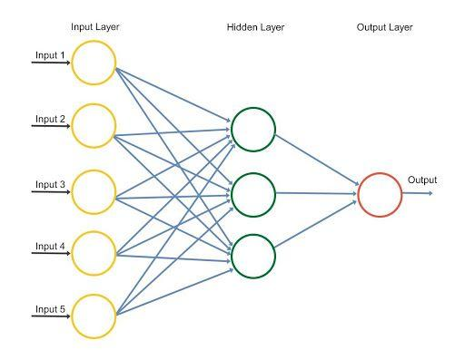

Neural networks have emerged as transformative tools across numerous domains, with algorithmic trading being one of the most promising areas for their application. In recent years, the integration of neural networks in Python has simplified the process for traders, offering an accessible platform to harness these advanced technologies. Python, with its extensive library support, provides a rich ecosystem that facilitates the development and deployment of neural networks, making it a preferred choice for implementing algorithmic trading strategies.

Algorithmic trading relies heavily on statistical models and pattern recognition to make informed decisions, tasks at which neural networks excel. The ability of these networks to learn complex patterns from vast datasets and generalize these patterns to new data aligns perfectly with the demands of financial markets, where the identification of trends and patterns is crucial. By leveraging neural networks, traders can enhance the accuracy of their models, leading to more effective and adaptive trading strategies.



This article is focused on exploring the integration of neural networks into algorithmic trading using Python. We will discuss the advantages offered by neural networks in this context, such as improved predictive performance and the ability to process and learn from large datasets. Furthermore, a concise guide will be provided on setting up neural network strategies, aimed at equipping traders with the necessary knowledge and tools to improve their trading outcomes. Through understanding and applying these technologies, traders can significantly augment their trading strategies, capitalizing on the powerful capabilities of neural networks.

## Table of Contents

## Understanding Neural Networks

Neural networks are computational models inspired by the structure and function of the brain, designed to simulate the brain's method of learning from and recognizing patterns. They consist of interconnected processing elements called neurons, which are organized into layers. Each layer performs a different function, making the network capable of processing complex patterns. 

### Components of Neural Networks

The basic components of a neural network include neurons, layers, and synapses. Neurons are the fundamental units of a network. Each neuron receives input, processes it, and transmits an output. These neurons are organized into three main types of layers:

1. **Input Layer**: The input layer receives initial data into the network. Each neuron in this layer represents a feature from the input dataset.

2. **Hidden Layers**: Situated between the input and output layers, hidden layers perform complex computations. A network may have one or multiple hidden layers, depending on its architecture.

3. **Output Layer**: This layer represents the network's final output. It could consist of one or more neurons depending on whether the network is solving a classification or regression problem.

Synapses are the connections between neurons in adjacent layers, and they are characterized by weights that represent the strength of these connections. The weights are critical as they determine the influence of one neuron on another.

### Learning Mechanisms

Learning in neural networks involves adjusting the synaptic weights based on the data presented to the network, which is fundamental to enhancing its predictive accuracy. This process is typically executed via a training algorithm, such as backpropagation, where the network learns from errors by recalculating and updating weights to minimize the difference between predicted and actual outputs.

The function that evaluates the prediction error is called the loss function. It quantifies the difference between the actual and predicted values, and common examples include mean squared error (MSE) for regression problems or categorical cross-entropy for classification tasks. Adjusting weights through optimization algorithms like stochastic gradient descent (SGD) is crucial to this learning process.

### Types of Neural Networks for Trading

Numerous types of neural networks can be applied to trading, each tailored to different tasks:

- **Perceptrons**: The simplest form of neural networks, perceptrons are foundational units capable of linear separations and often serve as building blocks for more complex architectures.

- **Feedforward Neural Networks (FNNs)**: These are composed of multiple layers through which inputs pass in one forward direction. They are well-suited for non-sequential data classification and regression tasks.

- **Convolutional Neural Networks (CNNs)**: Although primarily used in image recognition due to their ability to detect spatial patterns, they can also be applied to 1D time-series data typical in trading.

- **Recurrent Neural Networks (RNNs)**: These networks are designed for sequential data as they incorporate memory to process inputs with temporal dependencies. They are particularly useful for time-series forecasting in financial trading.

### Importance in Trading Strategies

Understanding how neural networks work is crucial for effectively using them in trading strategies. By configuring neural networks to suit specific trading objectives and market conditions, traders can leverage these models for price prediction, pattern recognition, and even risk management. The knowledge of different [neural network](/wiki/neural-network) architectures and their functionalities allows traders to select and tailor models best suited for their unique trading needs, thereby optimizing the decision-making process and potentially increasing trading profitability.

## Types of Neural Networks in Trading

Neural networks have found explicit applications in [algorithmic trading](/wiki/algorithmic-trading), where they can process and analyze large volumes of data to predict market trends and make informed trading decisions. Various types of neural networks, each with distinct architectures and functionalities, can be utilized in trading for specialized tasks.

### Perceptrons

The perceptron is the simplest type of artificial neural network and serves as a foundational building block for more complex architectures. A perceptron consists of a single node with adjustable weights and can be employed for binary classification tasks. Although perceptrons are limited in their ability to solve linear problems, they are crucial for understanding more advanced structures. In trading, perceptrons might be used as basic classifiers to detect buy/sell signals based on linear separable data features.

### Feedforward Networks

Feedforward neural networks (FNNs) are an extension of perceptrons wherein information moves in one direction—from input nodes, through hidden nodes (if any), to output nodes. They are well-suited for tasks requiring pattern recognition and function approximation. In trading, FNNs can be leveraged for predicting stock prices by learning complex data relationships from historical data. The architecture typically involves an input layer corresponding to features or indicators, hidden layers for processing, and an output layer that provides trading predictions.

### Convolutional Neural Networks

Convolutional neural networks (CNNs) are primarily known for their applications in image recognition due to their ability to capture spatial hierarchies in data. However, they can also be applied in trading, particularly for analyzing technical indicators represented as images or multidimensional data. Their feature extraction capability through convolutional layers makes them powerful tools in detecting patterns or anomalies in financial data. CNNs have been utilized to identify patterns in candlestick charts and other financial visualizations.

### Recurrent Neural Networks

Recurrent neural networks (RNNs) are particularly effective for time-series prediction, as they inherently capture temporal dependencies due to their recurrent connections. This capability is essential for trading strategies that require an understanding of historical price movements to make future predictions. Variants such as Long Short-Term Memory (LSTM) networks and Gated Recurrent Units (GRUs) address the vanishing gradient problem encountered in traditional RNNs and are preferred for their ability to remember and leverage past information over longer sequences.

### Impact of Network Type on Trading Strategies

The choice of neural network architecture significantly affects the success of a trading strategy. Each type of network has its strengths and drawbacks, and selecting the appropriate model depends on the specific task at hand and the nature of the data. For example, CNNs may excel in detecting visual patterns in market data, while RNNs are better suited for time-dependent patterns.

Understanding these different types of neural networks enables traders to design and implement strategies that align with their trading goals. By tailoring network selection to specific market needs, traders can enhance the precision and reliability of their algorithmic trading strategies, potentially leading to improved market performance and profitability.

## Training Neural Networks

Training neural networks for algorithmic trading involves processing data through the network and adjusting the weights within to minimize prediction errors, a fundamental goal in enhancing trading strategies.

### Gradient Descent

Gradient descent is an optimization algorithm used to minimize the cost function, a measure of how far off the network's predictions are from actual outcomes. The algorithm iterates over the network's parameters, making small adjustments to reduce error. The weight update rule for gradient descent can be expressed as:

$$

w := w - \alpha \frac{\partial J(w)}{\partial w} 
$$

where $w$ represents the network weights, $\alpha$ is the learning rate, and $J(w)$ is the cost function.

### Backpropagation

Backpropagation is a supervised learning technique used to train multilayer neural networks and is critical for calculating gradient descent. It works by propagating the error from the output layer back through the network layers, adjusting the weights to minimize the error. It involves two main phases:

1. **Forward Pass**: The input data is passed through the neural network, layer by layer, to compute the output.
2. **Backward Pass**: The error, calculated as the difference between the predicted and actual output, is propagated backward to update the weights.

### The Importance of Effective Training

The quality of the training process directly influences the predictive accuracy of the neural network. An effective training process requires:

- **Data Selection**: Choosing relevant market and historical price data that accurately reflects the trading environment.
- **Model Architecture**: Defining the network structure, including the number of layers and neurons, which impacts how well the model can learn complex patterns.
- **Optimization Techniques**: Utilization of advanced optimization algorithms beyond basic gradient descent, such as Adam or RMSprop, which adaptively adjust learning rates to enhance convergence speed and performance.

### Illustration in Python

An example of implementing gradient descent and backpropagation in Python using TensorFlow might look like this:

```python
import tensorflow as tf

# Define a simple model
model = tf.keras.Sequential([
    tf.keras.layers.Dense(units=64, activation='relu', input_shape=(Input_Size,)),
    tf.keras.layers.Dense(units=1, activation='linear')
])

# Compile the model
model.compile(optimizer='adam', loss='mean_squared_error')

# Train the model
model.fit(training_data, training_labels, epochs=num_epochs)
```

In this example, 'adam' is used as an optimizer which is an adaptive learning rate optimization algorithm designed to handle sparse gradients.

Through a focused approach of choosing appropriate data, configurations, and methods, the training process ensures neural networks effectively learn and adapt, strengthening their utility in algorithmic trading. Leveraging Python's robust framework greatly facilitates this, allowing for experimentation and fine-tuning of strategies in practical scenarios.

## Implementation in Python

Python offers a comprehensive ecosystem for implementing neural networks in algorithmic trading, providing powerful libraries like TensorFlow, Keras, and PyTorch. These libraries facilitate the construction of sophisticated models that can process financial data and make trading decisions. The implementation process comprises several critical steps, each of which can be executed efficiently using Python.

### Data Preparation
The first step in implementing neural networks is data preparation, which involves gathering relevant financial data, cleaning it, and transforming it into a suitable format for model training. Financial data often comes with noise and missing values, thus requiring preprocessing techniques such as normalization or scaling. Python's libraries like Pandas and NumPy are widely used for these tasks. Below is a simple example of data normalization using Python:

```python
import pandas as pd
from sklearn.preprocessing import MinMaxScaler

# Load data
data = pd.read_csv('historical_data.csv')

# Normalize data
scaler = MinMaxScaler()
data_scaled = scaler.fit_transform(data)
```

### Model Building
Once data is prepared, the next step is to build the neural network model. Frameworks such as TensorFlow and Keras provide high-level interfaces for creating complex architectures. A simple model can be constructed using Keras as follows:

```python
from keras.models import Sequential
from keras.layers import Dense

# Define the model
model = Sequential()
model.add(Dense(64, input_dim=10, activation='relu'))
model.add(Dense(32, activation='relu'))
model.add(Dense(1, activation='linear'))

# Compile the model
model.compile(optimizer='adam', loss='mse')
```

### Training
Training the model involves feeding it with historical data and adjusting its weights to minimize prediction errors using techniques like backpropagation and gradient descent. This phase is crucial for developing the predictive ability of the network.

```python
# Train the model
history = model.fit(train_data, train_labels, epochs=100, batch_size=10, validation_split=0.2)
```

### Evaluation
After training, evaluating the model's performance is necessary to ensure its predictive accuracy and reliability. This is typically done using a separate test dataset to prevent overfitting.

```python
# Evaluate the model
loss = model.evaluate(test_data, test_labels)
print(f'Model Loss: {loss}')
```

### Deployment
The final step is deploying the trained model in a live trading environment, which involves integrating the model with trading platforms and using real-time data for making trading decisions. Python's flexibility enables traders to seamlessly connect their models with APIs of popular trading platforms like MetaTrader or [Interactive Brokers](/wiki/interactive-brokers-api).

Python's extensive resources and tutorials facilitate the learning and implementation of neural networks in trading. Platforms like Kaggle and GitHub host numerous projects and discussions that can serve as practical guides for traders seeking to leverage neural network strategies.

By utilizing Python's robust tools and community support, traders can effectively design, test, and implement neural network strategies, enhancing their ability to adapt to the dynamic market conditions of algorithmic trading.

## Strategies for Algo Trading

Neural networks offer significant advantages in developing trading strategies, especially in the context of algorithmic trading. Their ability to manage complex pattern recognition, price prediction, and risk management tasks makes them highly valuable.

In trading strategies, neural networks are often employed for two primary objectives: short-term trading using high-frequency data and long-term forecasting involving historical data analysis.

Short-term trading strategies capitalize on short-lived market inefficiencies or price patterns. High-frequency trading ([HFT](/wiki/high-frequency-trading-strategies)) is one typical application where neural networks process large volumes of tick data quickly to detect patterns and execute trades within milliseconds. An effective neural network model for HFT must handle the rapid influx of data and swiftly adapt to changing market conditions. The model typically uses recurrent neural networks (RNNs) or [long short](/wiki/equity-long-short)-term memory (LSTM) networks to capture temporal patterns and dependencies in tick-level data.

For long-term forecasting, neural networks analyze extensive historical datasets to predict future price movements. This approach is usually suited to traders investing over weeks, months, or even years. Convolutional Neural Networks (CNNs) and Deep Feedforward Networks can be particularly effective in detecting latent patterns within historical price charts or combining multiple technical indicators. These neural networks can reflect broader market trends, applying them to enhance strategic positions.

Implementing these strategies necessitates a thorough understanding of [backtesting](/wiki/backtesting) and optimization processes. Backtesting involves simulating trades using historical data to evaluate a strategy's credibility before actual trading begins. It is crucial in refining the model by either improving its architecture or adjusting its parameters to enhance performance accuracy. The backtesting process can be executed in Python, using libraries such as `Backtrader` or `Zipline`, designed for evaluating the broad spectrum of trading strategies.

Optimization entails adjusting the neural network's parameters or hyperparameters to achieve superior performance. This could involve tuning learning rates, the number of layers, or the number of neurons within each layer. Effective optimization methods like Bayesian optimization can be utilized to identify the best configuration iteratively without exhaustive search over all possible parameters. 

In conclusion, neural network strategies for algorithmic trading require a clear alignment with overall trading objectives and a precise implementation process. By leveraging these tools, traders can achieve robust, dynamic strategies that can potentially yield higher returns while effectively managing risks.

## Case Study: Building a Simple Neural Network Trading Strategy

In this case study, we demonstrate how to create a simple neural network trading strategy using Python. The strategy leverages common financial indicators and historical price data to generate buy and sell signals, with backtesting employed to evaluate the strategy's performance over a specific period.

### Step-by-Step Implementation

#### 1. Data Collection and Preprocessing

To begin, we gather historical price data for a selected asset. This data is usually obtained from financial data providers or public APIs. In this example, we use the popular `yfinance` library in Python to download historical price data for a stock, such as Apple Inc. (AAPL).

```python
import yfinance as yf  # For more datasets, visit: https://paperswithbacktest.com/datasets
import pandas as pd

# Download historical data for Apple
data = yf.download('AAPL', start='2020-01-01', end='2023-01-01')
data = data[['Close']]

# Calculate additional financial indicators
data['SMA'] = data['Close'].rolling(window=20).mean()  # Simple Moving Average
data['EMA'] = data['Close'].ewm(span=20, adjust=False).mean()  # Exponential Moving Average
```

The data is then preprocessed to include additional technical indicators, such as the Simple Moving Average (SMA) and Exponential Moving Average (EMA), which can serve as inputs to the neural network.

#### 2. Building the Neural Network Model

Utilizing libraries like TensorFlow and Keras, we construct a simple feedforward neural network to process the input features and generate trading signals. The model architecture can vary depending on the complexity required, but a typical starting point might be a model with an input layer, one or two hidden layers, and an output layer that predicts a buy (1) or sell (0) signal.

```python
from tensorflow.keras.models import Sequential
from tensorflow.keras.layers import Dense

# Split the data into training and testing sets
X = data[['SMA', 'EMA']].dropna()
y = (data['Close'].shift(-1) > data['Close']).astype(int).dropna()

model = Sequential()
model.add(Dense(32, input_dim=X.shape[1], activation='relu'))
model.add(Dense(16, activation='relu'))
model.add(Dense(1, activation='sigmoid'))

model.compile(optimizer='adam', loss='binary_crossentropy', metrics=['accuracy'])

# Training the model
model.fit(X[:-10], y[:-10], epochs=50, batch_size=10)
```

The model is compiled with an optimizer (e.g., Adam), a loss function (e.g., binary crossentropy for classification), and an appropriate metric for evaluation.

#### 3. Performance Evaluation through Backtesting

We perform backtesting to evaluate the strategy’s historical performance using the testing dataset. The model generates signals based on the historical data it has not seen during training.

```python
# Testing the model
predictions = model.predict(X[-10:])
predicted_signals = (predictions > 0.5).astype(int)

# Backtesting results
portfolio_returns = data['Close'][-10:].pct_change().shift(-1) * (2*predicted_signals-1)
profit = portfolio_returns.sum()
print(f"Total profit from strategy: {profit:.4f}")
```

The predicted signals are converted into trading actions, and the strategy's profitability is calculated based on price changes.

### Insights and Practical Guidance

This simple neural network trading strategy provides a foundational framework for implementing more complex models. The inclusion of various financial indicators as input features can enhance accuracy, while iterative refinement of model architecture and parameters can lead to improved performance.

Backtesting provides a preliminary assessment of a strategy's effectiveness but must be complemented with live testing to account for market dynamics and transaction costs. Traders can utilize Python to systematically experiment with different model configurations, thereby tailoring strategies to align with specific trading goals and risk tolerances.

By integrating neural networks in trading strategies, traders can potentially improve their ability to anticipate market movements and execute more informed trading decisions.

## Conclusion

Neural networks have become essential in improving the predictive power of trading strategies. Their ability to learn from data and identify intricate patterns allows for more precise forecasts and profitable decision-making. To effectively leverage neural networks in algorithmic trading, it is imperative to understand the variety of architectures available, such as feedforward networks, convolutional networks, and recurrent networks. Each type brings unique advantages suitable for different trading scenarios, from time-series prediction to complex pattern detection.

Training techniques play a critical role in the successful implementation of neural networks. Techniques such as gradient descent and backpropagation are pivotal in optimizing network performance. A comprehensive understanding of these methodologies ensures that neural networks can be fine-tuned to minimize errors and enhance prediction accuracy.

Python has emerged as a powerful ally for traders looking to incorporate neural networks into their strategies. With a rich ecosystem of libraries like TensorFlow, Keras, and PyTorch, Python provides accessible tools for designing, training, and deploying neural network models. The availability of extensive resources and tutorials further aids traders in navigating the process of implementing these strategies effectively.

The dynamic nature of financial markets requires adaptive and robust strategies. Neural networks equip traders with the ability to craft more nuanced approaches that can respond to ever-evolving market conditions. By exploring the capabilities of neural networks, traders can develop strategies that are not only more predictive but also resilient, offering a distinct competitive edge in the fast-paced world of algorithmic trading.

## References & Further Reading

[1]: Bergstra, J., Bardenet, R., Bengio, Y., & Kégl, B. (2011). ["Algorithms for Hyper-Parameter Optimization."](https://proceedings.neurips.cc/paper/2011/file/86e8f7ab32cfd12577bc2619bc635690-Paper.pdf) Advances in Neural Information Processing Systems 24.

[2]: ["Advances in Financial Machine Learning"](https://www.amazon.com/Advances-Financial-Machine-Learning-Marcos/dp/1119482089) by Marcos Lopez de Prado

[3]: ["Evidence-Based Technical Analysis: Applying the Scientific Method and Statistical Inference to Trading Signals"](https://www.amazon.com/Evidence-Based-Technical-Analysis-Scientific-Statistical/dp/0470008741) by David Aronson

[4]: ["Machine Learning for Algorithmic Trading"](https://github.com/stefan-jansen/machine-learning-for-trading) by Stefan Jansen

[5]: ["Quantitative Trading: How to Build Your Own Algorithmic Trading Business"](https://books.google.com/books/about/Quantitative_Trading.html?id=j70yEAAAQBAJ) by Ernest P. Chan