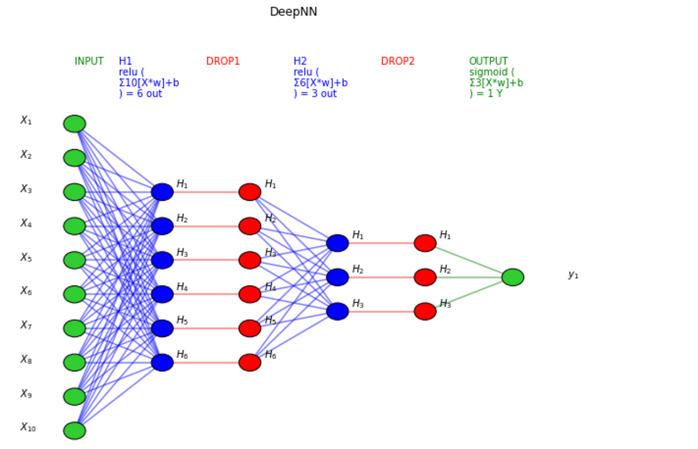

## Table of Contents

## What is a neural network and why is it important in machine learning?

A neural network is a type of computer system designed to work and learn like the human brain. It is made up of many connected units called neurons, which work together to process information and find patterns in data. Imagine it like a team of people working together, where each person can learn from the others and improve over time. Neural networks can be trained to do things like recognize images, understand speech, or predict future events by adjusting the connections between the neurons based on the data they see.

Neural networks are important in machine learning because they can solve complex problems that are difficult for traditional computer programs. They are good at handling large amounts of data and can learn from examples, which means they can improve their performance over time without being specifically programmed for each task. This makes them very useful in areas like artificial intelligence, where they can help computers to do things like drive cars, play games, or even create art. Because of their ability to learn and adapt, neural networks are a key part of many modern technologies and are helping to push the boundaries of what computers can do.

## How can you set up a basic neural network in Python using libraries like TensorFlow or PyTorch?

To set up a basic neural network in Python using TensorFlow, you first need to install the library by running `pip install tensorflow`. Once installed, you can import TensorFlow and create a simple neural network. Start by importing the necessary modules with `import tensorflow as tf`. Then, define your model using the `tf.keras.Sequential` class, which allows you to stack layers easily. For a basic network, you might use a few dense layers. For example, you could create a model like this: `model = tf.keras.Sequential([tf.keras.layers.Dense(10, activation='relu', input_shape=(input_size,)), tf.keras.layers.Dense(1, activation='sigmoid')])`. After defining the model, compile it with an optimizer and loss function, like `model.compile(optimizer='adam', loss='binary_crossentropy', metrics=['accuracy'])`. Finally, you can train your model on your data using `model.fit(X_train, y_train, epochs=10)`.

Setting up a basic neural network using PyTorch is similar but uses different syntax. Start by installing PyTorch with `pip install torch`. Import PyTorch with `import torch` and `import torch.nn as nn`. To create a model, you define a class that inherits from `nn.Module`. Inside this class, you define the layers in the `__init__` method and the forward pass in the `forward` method. For example, you might write: `class SimpleNN(nn.Module): def __init__(self, input_size): super(SimpleNN, self).__init__() self.fc1 = nn.Linear(input_size, 10) self.fc2 = nn.Linear(10, 1) def forward(self, x): x = torch.relu(self.fc1(x)) x = torch.sigmoid(self.fc2(x)) return x`. After defining the model, you instantiate it and define your loss function and optimizer, like `model = SimpleNN(input_size)`, `criterion = nn.BCELoss()`, and `optimizer = torch.optim.Adam(model.parameters())`. You can then train the model using a loop where you forward pass the data, calculate the loss, backpropagate, and update the weights.

Both TensorFlow and PyTorch provide powerful tools for building and training neural networks, and choosing between them often depends on your specific needs and preferences. With these basic setups, you can start experimenting and building more complex models as you learn more about neural networks and machine learning.

## What are the key components of a neural network, such as layers, neurons, and activation functions?

A neural network is made up of several key parts, including layers, neurons, and activation functions. Layers are like the floors of a building, where each floor has a specific job. There are different types of layers, such as input layers that take in data, hidden layers that process the data, and output layers that give the final result. Each layer is made up of many small units called neurons. Think of neurons as tiny workers that take in information, do some calculations, and pass the results along. The neurons in one layer connect to the neurons in the next layer, forming a network that can learn and make decisions.

Activation functions are another important part of a neural network. They help the neurons decide what to do with the information they receive. Imagine you're trying to decide whether to go outside based on the weather. If it's raining a lot, you might stay inside, but if it's just a little rain, you might go out. Activation functions work in a similar way, helping the network figure out how important a piece of information is and what to do with it. Common activation functions include the sigmoid function, which squashes values between 0 and 1, and the ReLU function, which helps the network learn faster by setting negative values to zero. Together, layers, neurons, and activation functions allow a neural network to process and learn from data.

## How do you train a neural network, and what is the role of backpropagation in this process?

Training a neural network is like teaching a child to recognize different animals. You show the network lots of examples, like pictures of cats and dogs, and tell it which is which. The network tries to guess the right answer and then adjusts its guesses based on how well it did. This process of showing examples and adjusting is called training. You keep doing this over and over, with more and more examples, until the network gets really good at recognizing the difference between cats and dogs. The more examples you show it, the better it gets, just like how a child learns better with more practice.

Backpropagation is a key part of how the network learns from its mistakes. Imagine you're playing a game where you have to guess a number, and after each guess, someone tells you if you're too high or too low. Backpropagation is like that feedback. When the network makes a guess and gets it wrong, backpropagation helps it figure out how to adjust its guesses to be more accurate next time. It does this by sending the error back through the network, layer by layer, and tweaking the connections between the neurons a little bit. This way, the network slowly learns to make better guesses, getting closer and closer to the right answer with each round of training.

## What are some common activation functions used in neural networks and their purposes?

Activation functions are like decision-makers in a neural network. They help the network decide what to do with the information it gets. Some common activation functions are the sigmoid function, the ReLU function, and the tanh function. The sigmoid function squashes numbers between 0 and 1, which is useful for making yes or no decisions, like in a network that tries to guess if an email is spam or not. The ReLU function, which stands for Rectified Linear Unit, is simple and fast. It turns any negative number into zero and leaves positive numbers alone. This helps the network learn faster and is often used in deep networks that recognize images or understand speech.

The tanh function, short for hyperbolic tangent, is similar to the sigmoid but squashes numbers between -1 and 1. It's good for networks that need to make decisions about things that can be positive or negative, like predicting stock prices. Each of these functions has a special job in the network. The sigmoid helps with binary choices, ReLU speeds up learning, and tanh is great for tasks where the output can be positive or negative. By choosing the right activation function, you can help your neural network do its job better.

## How can you evaluate the performance of a neural network, and what metrics should you use?

To evaluate how well a neural network is doing its job, you need to use some special numbers called metrics. These metrics help you see if the network is making good guesses or if it needs more practice. One common metric is accuracy, which tells you the percentage of times the network got the right answer. For example, if the network is trying to tell cats from dogs and it gets it right 90 times out of 100, its accuracy is 90%. Another important metric is loss, which shows how far off the network's guesses are from the correct answers. A lower loss means the network is doing better.

Besides accuracy and loss, there are other metrics you can use depending on what the network is doing. If the network is trying to guess yes or no, like whether an email is spam, you might look at precision and recall. Precision tells you how many of the network's "yes" guesses were right, while recall shows how many of the actual "yes" cases the network found. For tasks where the network is predicting numbers, like house prices, you might use mean squared error, which measures how far off the network's guesses are on average. By looking at these different metrics, you can get a good idea of how well your neural network is working and where it might need to improve.

## What is overfitting in neural networks, and how can you prevent it?

Overfitting in neural networks is like when a student memorizes answers for a test instead of learning the material. The network gets really good at the examples it has seen, but it doesn't do well with new, different examples. It's too focused on the specific details of the training data and doesn't understand the bigger picture. This can make the network perform poorly when it's used in the real world, because it can't handle situations it hasn't seen before.

To prevent overfitting, you can use a few tricks. One way is to use more data for training, so the network sees a wider variety of examples and learns the general patterns better. Another way is to use a technique called regularization, which adds a little bit of randomness to the network's learning process. This helps the network not to get too focused on the small details of the training data. You can also use a method called cross-validation, where you split your data into different parts and test the network on parts it hasn't seen during training. This helps you see how well the network will do with new data and helps you adjust it to perform better overall.

## How do you implement regularization techniques like L1 and L2 regularization in Python?

To use L1 and L2 regularization in Python, you can add these techniques to your neural network when you're training it. L1 regularization, also called Lasso, helps make some of the connections in your network weaker by adding the absolute value of the weights to the loss function. This can make your network simpler by setting some weights to zero. In TensorFlow, you can add L1 regularization to a layer by using the `kernel_regularizer` argument like this: `tf.keras.layers.Dense(10, kernel_regularizer=tf.keras.regularizers.l1(0.01))`. The number `0.01` is how strong the regularization is. In PyTorch, you can add L1 regularization by calculating it yourself in the training loop and adding it to the loss.

L2 regularization, also known as Ridge, works by adding the square of the weights to the loss function. This helps keep the weights small and stops the network from getting too focused on the training data. In TensorFlow, you can add L2 regularization to a layer like this: `tf.keras.layers.Dense(10, kernel_regularizer=tf.keras.regularizers.l2(0.01))`. The `0.01` is the strength of the regularization. In PyTorch, you can add L2 regularization by calculating it in the training loop and adding it to the loss, similar to how you would do it with L1. Both L1 and L2 regularization help your neural network learn better and avoid overfitting by keeping the weights from getting too big.

## What are convolutional neural networks (CNNs) and how do they differ from traditional neural networks?

Convolutional Neural Networks, or CNNs, are a special kind of neural network that's really good at understanding images and videos. They work by looking at small parts of an image at a time, like looking at a puzzle piece by piece. This helps them see patterns, like edges or shapes, and then put those patterns together to understand the whole image. Imagine you're trying to find a cat in a picture. A CNN would look at small sections of the picture, spot the cat's eyes, ears, and whiskers, and then figure out that all these parts together make a cat.

CNNs are different from traditional neural networks because they use something called a convolutional layer. This layer is like a special filter that slides over the image and helps the network focus on important features. Traditional neural networks, on the other hand, look at all the data at once, which can be overwhelming when dealing with images. Because of this, CNNs are much better at tasks like recognizing objects in photos or understanding what's happening in a video, while traditional neural networks are better for tasks like predicting numbers or making decisions based on simpler data.

## How can you use transfer learning to improve the performance of neural networks in Python?

Transfer learning is like using what you already know to learn something new faster. In neural networks, it means taking a model that's already good at one thing and using it to help with a different but related task. For example, if you have a model that's really good at recognizing cats and dogs, you can use it to start learning about different types of birds. You don't have to start from scratch; you can use the knowledge the model already has to make learning easier and faster. In Python, you can do this by loading a pre-trained model, like one from TensorFlow or PyTorch, and then adding new layers or adjusting the existing ones to fit your new task.

To use transfer learning in Python, you can start with a library like TensorFlow or PyTorch. For example, in TensorFlow, you can load a pre-trained model with `base_model = tf.keras.applications.VGG16(weights='imagenet', include_top=False, input_shape=(224, 224, 3))`. This model is already trained to recognize lots of different objects. Then, you can add new layers on top of it to make it learn your specific task, like `model = tf.keras.Sequential([base_model, tf.keras.layers.GlobalAveragePooling2D(), tf.keras.layers.Dense(1, activation='sigmoid')])`. After that, you can train the new layers while keeping the old ones fixed or fine-tune the entire model. This way, you're using what the model already knows to help it learn your new task more quickly and effectively.

## What are recurrent neural networks (RNNs) and their applications, and how do you implement them in Python?

Recurrent Neural Networks, or RNNs, are a type of neural network that's really good at understanding things that happen over time, like words in a sentence or notes in a song. They work by remembering what they've seen before and using that memory to make better guesses about what's coming next. Imagine you're reading a story and trying to predict what will happen next. An RNN would remember the earlier parts of the story to help it guess better. This makes RNNs great for tasks like understanding and generating text, predicting stock prices, or even helping with speech recognition.

To use RNNs in Python, you can use libraries like TensorFlow or PyTorch. In TensorFlow, you can create an RNN by defining a model with `tf.keras.Sequential` and adding an RNN layer, like `model = tf.keras.Sequential([tf.keras.layers.SimpleRNN(10, return_sequences=True, input_shape=(timesteps, features)), tf.keras.layers.Dense(1)])`. The `SimpleRNN` layer helps the model remember past information. In PyTorch, you can create an RNN by defining a class that inherits from `nn.Module` and using `nn.RNN` inside it, like `class SimpleRNN(nn.Module): def __init__(self, input_size, hidden_size, output_size): super(SimpleRNN, self).__init__() self.rnn = nn.RNN(input_size, hidden_size, batch_first=True) self.fc = nn.Linear(hidden_size, output_size) def forward(self, x): out, _ = self.rnn(x) out = self.fc(out[:, -1, :]) return out`. This way, you can train your RNN to understand and predict sequences of data.

## How can you optimize the architecture and hyperparameters of a neural network using techniques like grid search or genetic algorithms in Python?

To optimize a neural network's architecture and hyperparameters, you can use a method called grid search. Grid search is like trying out different combinations of settings to see which one works best. In Python, you can use libraries like scikit-learn to do this. For example, you might want to try different numbers of layers, different numbers of neurons in each layer, and different learning rates. You set up a grid with all these options and then test each combination to see which one gives the best results. This can take a long time because you're trying out so many different settings, but it can help you find the best way to set up your neural network.

Another way to optimize your neural network is by using genetic algorithms. Genetic algorithms are like a game of evolution where you start with a bunch of different network setups and let them "compete" to see which ones work best. The best ones get to "have children" by mixing their settings with others, and the worst ones are removed. Over time, this process helps you find the best settings for your network. In Python, you can use libraries like DEAP to set up a genetic algorithm. You define how to create and mix different network setups, and then let the algorithm run until it finds the best combination. This method can be faster than grid search because it focuses on the best options and improves them over time.

## How do you train neural networks?

Training neural networks for algorithmic trading involves processing data through the network and adjusting the weights within to minimize prediction errors, a fundamental goal in enhancing trading strategies.

### Gradient Descent

Gradient descent is an optimization algorithm used to minimize the cost function, a measure of how far off the network's predictions are from actual outcomes. The algorithm iterates over the network's parameters, making small adjustments to reduce error. The weight update rule for gradient descent can be expressed as:

$$

w := w - \alpha \frac{\partial J(w)}{\partial w} 
$$

where $w$ represents the network weights, $\alpha$ is the learning rate, and $J(w)$ is the cost function.

### Backpropagation

Backpropagation is a supervised learning technique used to train multilayer neural networks and is critical for calculating gradient descent. It works by propagating the error from the output layer back through the network layers, adjusting the weights to minimize the error. It involves two main phases:

1. **Forward Pass**: The input data is passed through the neural network, layer by layer, to compute the output.
2. **Backward Pass**: The error, calculated as the difference between the predicted and actual output, is propagated backward to update the weights.

### The Importance of Effective Training

The quality of the training process directly influences the predictive accuracy of the neural network. An effective training process requires:

- **Data Selection**: Choosing relevant market and historical price data that accurately reflects the trading environment.
- **Model Architecture**: Defining the network structure, including the number of layers and neurons, which impacts how well the model can learn complex patterns.
- **Optimization Techniques**: Utilization of advanced optimization algorithms beyond basic gradient descent, such as Adam or RMSprop, which adaptively adjust learning rates to enhance convergence speed and performance.

### Illustration in Python

An example of implementing gradient descent and backpropagation in Python using TensorFlow might look like this:

```python
import tensorflow as tf

# Define a simple model
model = tf.keras.Sequential([
    tf.keras.layers.Dense(units=64, activation='relu', input_shape=(Input_Size,)),
    tf.keras.layers.Dense(units=1, activation='linear')
])

# Compile the model
model.compile(optimizer='adam', loss='mean_squared_error')

# Train the model
model.fit(training_data, training_labels, epochs=num_epochs)
```

In this example, 'adam' is used as an optimizer which is an adaptive learning rate optimization algorithm designed to handle sparse gradients.

Through a focused approach of choosing appropriate data, configurations, and methods, the training process ensures neural networks effectively learn and adapt, strengthening their utility in algorithmic trading. Leveraging Python's robust framework greatly facilitates this, allowing for experimentation and fine-tuning of strategies in practical scenarios.

## References & Further Reading

[1]: Bergstra, J., Bardenet, R., Bengio, Y., & Kégl, B. (2011). ["Algorithms for Hyper-Parameter Optimization."](https://proceedings.neurips.cc/paper/2011/file/86e8f7ab32cfd12577bc2619bc635690-Paper.pdf) Advances in Neural Information Processing Systems 24.

[2]: ["Advances in Financial Machine Learning"](https://www.amazon.com/Advances-Financial-Machine-Learning-Marcos/dp/1119482089) by Marcos Lopez de Prado

[3]: ["Evidence-Based Technical Analysis: Applying the Scientific Method and Statistical Inference to Trading Signals"](https://www.amazon.com/Evidence-Based-Technical-Analysis-Scientific-Statistical/dp/0470008741) by David Aronson

[4]: ["Machine Learning for Algorithmic Trading"](https://github.com/stefan-jansen/machine-learning-for-trading) by Stefan Jansen

[5]: ["Quantitative Trading: How to Build Your Own Algorithmic Trading Business"](https://books.google.com/books/about/Quantitative_Trading.html?id=j70yEAAAQBAJ) by Ernest P. Chan