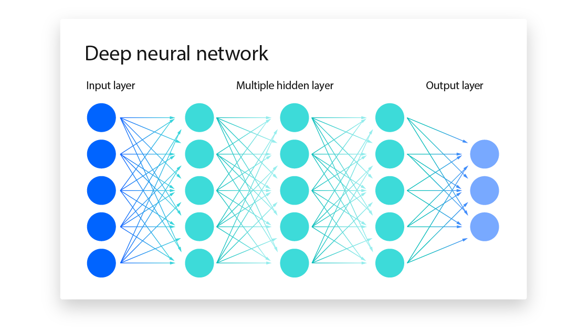

## Table of Contents

## What is a neural network?

A neural network is a type of computer system that tries to work like a human brain. It is made up of many small parts called neurons, which are connected together. These neurons can learn from examples, so the neural network can get better at doing tasks over time. For example, a neural network can learn to recognize pictures of cats by looking at many cat pictures and figuring out what makes a cat a cat.

Neural networks are used for many things, like understanding speech, recognizing faces, and even driving cars. They are good at finding patterns in data that might be hard for people to see. To use a neural network, you give it a lot of data to learn from, and then it can make guesses or decisions based on what it has learned. This makes them very useful in areas where we need computers to make smart choices, like in medical diagnosis or predicting the weather.

## How does a neural network differ from traditional algorithms?

A neural network and traditional algorithms work differently. Traditional algorithms follow a set of rules that people write. These rules tell the computer exactly what to do step by step. For example, if you want to sort numbers, you can use a sorting algorithm that follows clear instructions to put the numbers in order. Traditional algorithms are good when we know exactly what steps to take to solve a problem.

On the other hand, a neural network learns from examples instead of following rules written by people. It tries to find patterns in the data it sees and uses those patterns to make decisions. For example, if you want a computer to recognize cats in pictures, a neural network can look at many cat pictures and learn what a cat looks like on its own. This makes neural networks good at solving problems where the rules are not clear or too hard for people to write down.

In summary, traditional algorithms are like following a recipe, where every step is planned out. Neural networks are more like learning to cook by tasting and adjusting as you go, without a fixed recipe. This makes them flexible and able to handle tasks where the data is complex or the rules are not well understood.

## What are the basic components of a neural network?

The basic components of a neural network are neurons, layers, and connections. Neurons, also called nodes, are the smallest parts of a neural network. They take in information, do some math with it, and then send out a result. Layers are groups of neurons that work together. A neural network usually has an input layer to take in data, hidden layers to process the data, and an output layer to give the final result. Connections are the pathways that link neurons in different layers, allowing them to pass information from one to another.

These components work together to help the neural network learn and make decisions. When the network gets new data, it goes through the input layer, then moves through the hidden layers where the neurons process it. Each neuron does its own little calculation and sends the result to the next layer. Finally, the output layer gives the network's answer. The connections between neurons have weights that the network changes as it learns, making some connections stronger and others weaker. This is how the network gets better at its job over time.

## What is the role of neurons in a neural network?

Neurons in a neural network are like tiny workers that help the network learn and make decisions. Each neuron takes in information from other neurons or from the input data. It then does a simple math calculation with this information. This calculation involves multiplying the input by a number called a weight and adding a bias. After that, the neuron uses an activation function to decide if it should send out a signal or not. If the result of the calculation is high enough, the neuron sends out a signal to the next layer of neurons.

The role of neurons is crucial because they help the neural network find patterns in the data. As the network learns, it adjusts the weights and biases of the neurons. This makes some connections between neurons stronger and others weaker. By doing this, the network can get better at recognizing things like pictures or understanding speech. Each neuron's job is small, but when many neurons work together in layers, they can solve complex problems that would be hard for a single neuron or traditional algorithm to handle.

## How does training a neural network work?

Training a neural network is like teaching it to do a job. You start by showing the network lots of examples. For instance, if you want it to recognize cats, you show it many pictures of cats. The network tries to guess if each picture has a cat in it. At first, it might make a lot of mistakes because it doesn't know what a cat looks like. But as it sees more pictures, it starts to learn what features make a cat a cat, like the shape of their ears or the way they move.

The way the network learns is by changing the connections between its neurons. Each time it makes a guess, it checks if it was right or wrong. If it's wrong, it makes small changes to the weights and biases of its neurons. This process is called backpropagation. Over time, these small changes help the network get better at guessing. The more examples it sees, the better it gets. That's why training a neural network takes a lot of data and time, but once it's done, it can do its job much better than when it started.

## What is backpropagation and why is it important?

Backpropagation is a way for a neural network to learn from its mistakes. When the network makes a guess and it's wrong, backpropagation helps it figure out how to do better next time. It does this by looking at the error, or how far off the guess was, and then working backwards through the network. It changes the weights and biases of the neurons a little bit to make the guess closer to the right answer. It's like adjusting the knobs on a radio to get a clearer signal.

This process is important because it's how the neural network improves over time. Without backpropagation, the network wouldn't know how to fix its mistakes. By constantly tweaking the connections between neurons, the network can learn to recognize patterns better and better. This makes backpropagation a key part of training neural networks to do things like recognize speech, identify objects in pictures, or predict what might happen next based on data.

## What are some common activation functions used in neural networks?

Activation functions are special math formulas that help neurons in a neural network decide when to send out a signal. They take the input from other neurons, do a calculation, and then decide if the neuron should "fire" or stay quiet. Some common activation functions are the sigmoid, ReLU, and tanh functions. The sigmoid function squashes the input into a number between 0 and 1, which is useful for tasks like predicting probabilities. ReLU, or Rectified Linear Unit, is simple and fast because it just returns the input if it's positive, and 0 if it's negative. The tanh function is like the sigmoid but it squashes the input into a range from -1 to 1, which can be good for some types of neural networks.

Each activation function has its own strengths. Sigmoid is good for binary decisions, like yes or no, because it gives an output that can be seen as a probability. ReLU is popular in [deep learning](/wiki/deep-learning) because it helps the network learn faster and avoid a problem called the vanishing gradient, where the network stops learning. Tanh can be better than sigmoid in some cases because its output is centered around zero, which can help the network learn more smoothly. Choosing the right activation function can make a big difference in how well a neural network works.

## What is the difference between feedforward and recurrent neural networks?

A feedforward neural network is like a one-way street for information. It takes in data at the input layer, processes it through one or more hidden layers, and then gives an output at the output layer. The information only moves forward, from input to output, without looping back. This makes feedforward networks good for tasks where you need to make a prediction or decision based on a single set of data, like recognizing objects in a picture or classifying text.

On the other hand, a recurrent neural network (RNN) is like a loop where information can go in circles. It has connections that loop back on themselves, allowing the network to keep a memory of what it has seen before. This makes RNNs good for tasks where the order of data matters, like understanding a sentence or predicting the next word in a sequence. Because they can remember past inputs, RNNs are often used in areas like natural language processing and time series prediction.

## How do convolutional neural networks work and what are they used for?

Convolutional neural networks, or CNNs, are a special kind of neural network that's really good at working with pictures. They use something called a convolutional layer to look at small parts of an image at a time. This layer slides a small window, called a filter, over the image and does some math to find important features, like edges or shapes. After that, the network might use a pooling layer to make the image smaller and easier to work with. By doing this over and over, the CNN can learn to recognize things in the image, like if it's a cat or a dog.

CNNs are used a lot in things like image recognition, where you want a computer to tell what's in a picture. They're also good at tasks like finding objects in a photo, understanding handwriting, or even helping self-driving cars see the road. Because they're so good at dealing with images, CNNs have become very important in areas like medical imaging, where they can help doctors find diseases in X-rays or MRIs, and in security systems, where they can spot faces or suspicious behavior.

## What are some advanced architectures of neural networks?

Some advanced neural network architectures include deep learning models like deep belief networks, generative adversarial networks (GANs), and transformers. Deep belief networks are made up of many layers of neurons that can learn to find patterns in data by themselves. They're good at understanding things like speech or images because they can learn to see the big picture by putting together smaller pieces. GANs are special because they use two networks that work against each other. One network, called the generator, tries to make fake data that looks real, while the other, called the discriminator, tries to tell if the data is real or fake. This back-and-forth helps both networks get better at their jobs, and GANs are used to make things like realistic pictures or even new kinds of music.

Transformers are another advanced type of neural network that's really good at understanding and creating text. They work by paying attention to different parts of the input, like words in a sentence, and figuring out how they relate to each other. This makes them great for tasks like translating languages or answering questions based on a long piece of text. Transformers are used a lot in language models like those that power chatbots or help with writing. These advanced architectures show how neural networks can be designed in different ways to solve specific kinds of problems, making them very powerful tools in [artificial intelligence](/wiki/ai-artificial-intelligence).

## How can overfitting be prevented in neural networks?

Overfitting happens when a neural network learns the training data too well, including the little mistakes or random things in it. This makes the network good at guessing the training data but bad at new data it hasn't seen before. To stop overfitting, you can use a few tricks. One way is to use more data for training. The more examples the network sees, the better it can learn what's important and what's just noise. Another way is to make the network simpler by using fewer layers or neurons. A smaller network is less likely to learn the little details that don't matter.

Another good trick is called regularization. This is like putting a limit on how much the network can change its weights. There are different kinds of regularization, but they all help keep the network from getting too focused on the training data. You can also use a technique called dropout, where you randomly turn off some neurons during training. This makes the network learn to work with less information, which helps it be better at guessing new data. By using these methods, you can help your neural network learn the right things and be good at new tasks, not just the ones it was trained on.

## What are the current challenges and future directions in neural network research?

One of the main challenges in neural network research is understanding how these networks work inside. They can do amazing things like recognizing faces or understanding speech, but it's hard to know exactly why they make the decisions they do. This is called the "black box" problem. Another challenge is making neural networks faster and more efficient. They need a lot of data and computing power to learn, which can be expensive and slow. Researchers are also trying to make neural networks more trustworthy, so they don't make mistakes or get tricked by bad data.

In the future, researchers want to make neural networks that can learn with less data and less power. They're working on new ways to train networks, like teaching them to learn from fewer examples or even from other networks. Another big direction is making neural networks that can explain their decisions in a way people can understand. This is important for things like medical diagnosis or self-driving cars, where we need to trust the network's choices. Lastly, researchers are exploring how to make networks that can learn new things without forgetting what they already know, which could help them keep getting better over time.

## What is the understanding of Neural Networks?

Neural networks are a subset of [machine learning](/wiki/machine-learning) algorithms modeled after the human brain's interconnected neuron system. Originating in the mid-20th century, the concept of neural networks emerged from the work of Warren McCulloch and Walter Pitts in 1943. Their pioneering model proposed that neurons could be mathematically represented to perform logical operations, providing the foundation for today's sophisticated neural network architectures.

Neural networks operate through layers of interconnected nodes or "neurons," each performing computations. The architecture typically consists of an input layer, one or more hidden layers, and an output layer. Each neuron receives inputs, processes them through weighted sums, and applies an activation function to determine its output. The weights between neurons adjust during training, allowing the network to learn and recognize complex patterns.

The fundamental equation governing a neuron's output can be expressed as:  

$$
y = f\left(\sum_{i=1}^{n} w_i \cdot x_i + b\right) 
$$

where $ y $ is the output, $ f $ is the activation function, $ w_i $ represents the weights, $ x_i $ denotes the input features, and $ b $ is the bias term.

In [algorithmic trading](/wiki/algorithmic-trading), three main types of [neural network](/wiki/neural-network)s are utilized: feedforward, recurrent, and [convolutional neural network](/wiki/convolutional-neural-network)s. Feedforward neural networks, the simplest form, process data in a single direction from input to output without feedback loops. They are frequently used for straightforward classification and regression tasks.

Recurrent neural networks (RNNs) are designed to recognize patterns in sequences of data by incorporating loops within their architecture. This enables them to maintain a memory of previous inputs, making RNNs particularly useful for time-series prediction in trading, where historical price data is crucial.

Convolutional neural networks (CNNs), on the other hand, are renowned for their prowess in image and spatial data processing but have also been adapted for trading applications, particularly in scenarios requiring pattern recognition and feature extraction from complex datasets.

The selection of network type is contingent upon the specific needs of the trading strategy, data characteristics, and the complexity of the patterns being modeled, underscoring the versatility of neural networks in transforming algorithmic trading methodologies.

## References & Further Reading

[1]: Bergstra, J., Bardenet, R., Bengio, Y., & Kégl, B. (2011). ["Algorithms for Hyper-Parameter Optimization."](https://papers.nips.cc/paper_files/paper/2011/hash/86e8f7ab32cfd12577bc2619bc635690-Abstract.html) Advances in Neural Information Processing Systems 24.

[2]: ["Advances in Financial Machine Learning"](https://www.amazon.com/Advances-Financial-Machine-Learning-Marcos/dp/1119482089) by Marcos Lopez de Prado

[3]: ["Evidence-Based Technical Analysis: Applying the Scientific Method and Statistical Inference to Trading Signals"](https://www.wiley.com/en-gb/Evidence+Based+Technical+Analysis:+Applying+the+Scientific+Method+and+Statistical+Inference+to+Trading+Signals-p-9780470008744) by David Aronson

[4]: ["Machine Learning for Algorithmic Trading"](https://www.amazon.com/Machine-Learning-Algorithmic-Trading-intelligence/dp/9918608013) by Stefan Jansen

[5]: ["Quantitative Trading: How to Build Your Own Algorithmic Trading Business"](https://www.amazon.com/Quantitative-Trading-Build-Algorithmic-Business/dp/0470284889) by Ernest P. Chan