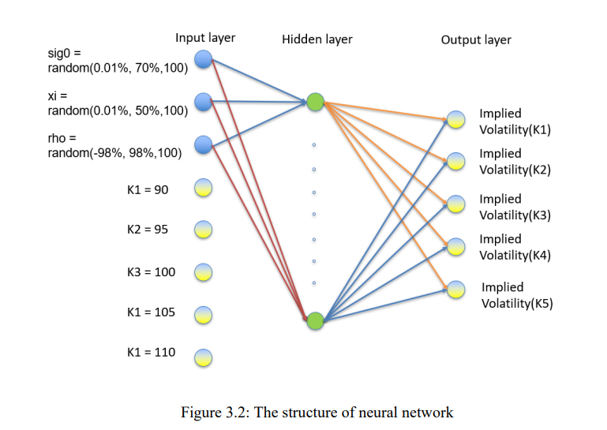

## Table of Contents

## What is a neural network and how does it work?

A neural network is a type of computer system designed to work and learn like the human brain. It is made up of many small parts called neurons, which are connected in layers. These neurons work together to process information and make decisions. Neural networks are often used in artificial intelligence and machine learning to help computers understand and predict things, like recognizing faces in photos or predicting the weather.

Neural networks learn by looking at examples. When you give a neural network a lot of examples, it adjusts the connections between its neurons to get better at its job. For example, if you want a neural network to recognize pictures of cats, you show it many pictures of cats and tell it which ones are cats. Over time, the neural network figures out what features make a picture a cat, like the shape of the ears or the eyes. Once it learns, it can then look at new pictures and say if they are cats or not. This process of learning from examples is called training, and it's what makes neural networks so powerful and useful.

## What is volatility in financial markets?

Volatility in financial markets means how much and how quickly the prices of things like stocks, bonds, or commodities go up and down. If prices move a lot in a short time, we say the market is volatile. If prices stay pretty steady, the market has low volatility. Think of it like the weather: a stormy day with big changes is like high volatility, while a calm, sunny day is like low volatility.

Volatility is important because it helps investors understand the risk of their investments. When the market is very volatile, it can be riskier because prices can drop suddenly. But it can also mean bigger chances to make money if prices go up quickly. Investors use different tools, like the VIX index, to measure volatility and make better decisions about buying or selling.

## Why is modeling volatility important in finance?

Modeling volatility is important in finance because it helps people understand how risky their investments are. When you know how much prices might go up and down, you can make better choices about what to buy or sell. For example, if a stock is very volatile, it might be riskier, but it could also give you a chance to make more money if you're willing to take that risk. By using models, investors can see what might happen in the future and plan their moves more carefully.

Another reason modeling volatility is important is that it helps in managing and reducing risk. Financial professionals use these models to create strategies that protect their investments from big losses. For instance, they might use options or other financial tools to hedge against sudden price drops. By understanding volatility, they can better prepare for different market conditions and keep their portfolios stable. This makes the whole financial system safer and more predictable.

## How can neural networks be applied to model volatility?

Neural networks can be used to model volatility by learning patterns in financial data. You give the [neural network](/wiki/neural-network) a lot of information about how prices have moved in the past, and it figures out what makes prices go up and down. The network looks at things like how big the price changes are, how often they happen, and what might cause them. After it learns from this data, the neural network can predict how much prices might change in the future. This helps investors understand how risky their investments might be.

Using neural networks for this job is helpful because they can find complex patterns that other methods might miss. Traditional ways of modeling volatility often use simpler math formulas that don't always capture all the details. But neural networks can handle a lot of data and learn from it in a more flexible way. This means they can make better predictions, which is really useful for people trying to manage their money wisely. By using neural networks, investors can make smarter choices and be better prepared for what might happen in the markets.

## What are the common types of neural networks used for volatility modeling?

One common type of neural network used for volatility modeling is the feedforward neural network. This type of network is simple and works by taking in data and passing it through layers of neurons to make predictions. It's good for looking at past price movements and figuring out how much prices might change in the future. Feedforward networks are easy to use and can learn from a lot of data, which makes them helpful for understanding volatility.

Another type is the recurrent neural network (RNN), which is good at handling data that comes in a sequence, like time series data from financial markets. RNNs can remember past information and use it to make better predictions about future volatility. They are more complex than feedforward networks but can capture more details about how prices change over time. This makes them very useful for modeling volatility in a way that takes into account the history of price movements.

A third type is the Long Short-Term Memory (LSTM) network, which is a special kind of RNN. LSTMs are even better at remembering long-term patterns in data, which is important for understanding how volatility might change over longer periods. They can learn from past price movements and use that knowledge to predict future volatility more accurately. This makes LSTMs a powerful tool for investors who want to understand and manage the risks in their investments.

## What are the key differences between traditional statistical models and neural network models for volatility?

Traditional statistical models for volatility, like the GARCH (Generalized Autoregressive Conditional Heteroskedasticity) model, use set formulas to predict how much prices might go up and down. These models look at past data to make guesses about future volatility. They are good at capturing some patterns in the data, but they can be limited because they rely on fixed rules. This means they might miss out on more complex patterns that don't fit neatly into their formulas.

On the other hand, neural network models for volatility are more flexible. They can learn from a lot of data and find patterns that traditional models might not see. Instead of using set formulas, neural networks adjust their connections between neurons to get better at predicting volatility. This makes them good at handling complicated and changing data, which is common in financial markets. However, neural networks can be harder to understand and explain because they work more like a "black box."

Overall, the main difference is that traditional statistical models are simpler and easier to understand but might miss out on complex patterns, while neural network models are more powerful and flexible but can be harder to interpret. Both types of models have their place in finance, and choosing between them often depends on what you need and how much complexity you're willing to handle.

## How do you prepare and preprocess financial data for neural network volatility modeling?

To get financial data ready for neural network volatility modeling, you first need to gather a lot of information about how prices have moved in the past. This might include daily stock prices, trading volumes, and other market data. Once you have this data, you need to clean it up. This means fixing any missing or wrong numbers and making sure all the data is in the same format. You might also need to change the data into a form that the neural network can use easily, like turning dates into numbers or making sure all the data is on the same scale.

After cleaning the data, the next step is to preprocess it. This involves creating features that the neural network can learn from. For example, you might calculate things like the daily returns or the volatility of returns over different time periods. You could also use technical indicators like moving averages or [momentum](/wiki/momentum). It's important to normalize this data, which means making sure all the numbers are on a similar scale so that the neural network can learn from them more easily. This might involve subtracting the mean and dividing by the standard deviation for each feature. By preparing and preprocessing the data carefully, you help the neural network make better predictions about future volatility.

## What performance metrics should be used to evaluate a neural network's volatility model?

To check how well a neural network is doing at predicting volatility, you need to use some special numbers called performance metrics. One important metric is the Mean Absolute Error (MAE). This tells you how far off the neural network's guesses are, on average, from the real volatility numbers. Another useful metric is the Root Mean Squared Error (RMSE), which also shows how much the predictions are off but puts more weight on bigger mistakes. The lower these numbers are, the better the neural network is at predicting volatility.

Another good metric to use is the Mean Absolute Percentage Error (MAPE). This shows how big the mistakes are as a percentage of the real numbers, which can be helpful because it gives you a sense of how big the errors are in a way that's easy to understand. You might also want to look at the R-squared value, which tells you how much of the changes in volatility the neural network can explain. A higher R-squared means the model is doing a good job. By using these metrics, you can see if your neural network is making good predictions about how much prices might go up and down.

## Can you explain the concept of overfitting in the context of volatility modeling with neural networks?

Overfitting is when a neural network gets too good at predicting the past data you showed it, but it doesn't do well with new data. In the context of volatility modeling, this means the neural network might learn all the details of the past price movements so well that it starts to see patterns that are just random noise. When you use this model to predict future volatility, it might give you answers that are way off because it's trying to use those random patterns that won't happen again.

To avoid overfitting, you need to make sure your neural network is learning the right things. One way to do this is by using a separate set of data, called a validation set, to check how well the neural network is doing while it's learning. If the neural network does well on the data it's learning from but not on the validation set, it might be overfitting. By keeping an eye on this and making adjustments, you can help the neural network learn patterns that are more likely to happen again in the future, which makes your volatility predictions more reliable.

## How do advanced techniques like LSTM or RNN improve volatility modeling?

Advanced techniques like Long Short-Term Memory (LSTM) and Recurrent Neural Networks (RNN) help make volatility modeling better by remembering past information. When you use a regular neural network, it looks at each piece of data by itself. But in financial markets, what happened before can tell you a lot about what might happen next. LSTMs and RNNs are good at understanding these time patterns because they can keep track of what they've seen before. This makes them really useful for predicting how much prices might go up and down in the future.

LSTMs are even better than regular RNNs because they can remember things that happened a long time ago, not just what's recent. This is important for volatility modeling because sometimes the reasons for big price changes can come from way back. By using LSTMs, you can catch these long-term patterns and make more accurate predictions. This helps investors understand the risks better and make smarter choices about their money.

## What are some real-world applications or case studies of neural networks in volatility modeling?

One real-world application of neural networks in volatility modeling is in the work done by JP Morgan Chase. They used a neural network to predict the volatility of stock prices. By feeding the network a lot of historical stock data, it learned to find patterns that other models might miss. This helped the bank's traders make better decisions about buying and selling stocks, which reduced their risk and increased their profits. The neural network was able to handle the complex and changing nature of the stock market better than traditional models, making it a valuable tool for the bank.

Another example comes from a study by researchers at the University of California, Berkeley. They used a type of neural network called LSTM to model the volatility of [cryptocurrency](/wiki/cryptocurrency) prices, like Bitcoin. The LSTM network was able to remember long-term patterns in the price data, which is important because cryptocurrency markets can be very unpredictable. By using the LSTM model, the researchers could predict future volatility more accurately than with other methods. This helped investors understand the risks of investing in cryptocurrencies and make more informed decisions.

## What are the current challenges and future directions in using neural networks for volatility modeling?

Using neural networks for volatility modeling is not easy because there are still some big challenges. One big problem is that neural networks can be like a "black box," which means it's hard to understand how they make their predictions. This can be a problem for people who need to explain their investment choices to others. Another challenge is that neural networks need a lot of data to learn well, and sometimes it's hard to get enough good data. Also, neural networks can sometimes overfit, which means they get too good at predicting the past but not the future. This makes their predictions less useful for real-world decisions.

In the future, people are working on making neural networks better for volatility modeling. One direction is to make the models more transparent so it's easier to see how they work. This could help people trust the predictions more. Another direction is to find ways to use less data but still get good results. Researchers are also trying to mix neural networks with other kinds of models to make them even better at predicting volatility. By solving these challenges, neural networks could become even more helpful for understanding and managing risks in financial markets.

## What is the understanding of volatility in financial markets?

Volatility in financial markets is a statistical measure that quantifies the [dispersion](/wiki/dispersion-trading) of returns for a specific security or market index. It is a key indicator of market risk, as high volatility signifies greater uncertainty about the magnitude of price changes. This uncertainty impacts decisions surrounding portfolio allocation and risk management strategies. Investors and traders often adjust their exposure to volatile assets based on their risk tolerance and market outlook.

Traditional techniques for modeling and predicting volatility include the Generalized Autoregressive Conditional Heteroskedasticity (GARCH) and Autoregressive Conditional Heteroskedasticity (ARCH) models. These econometric models are designed to capture the time-varying nature of volatility and are formulated to account for volatility clustering, a phenomenon where periods of high volatility are followed by similar periods of high volatility, and periods of low volatility follow similar periods of low volatility.

The GARCH model, building on the ARCH model’s premise, adds layers of sophistication by incorporating lagged terms of the variance. The standard GARCH(1,1) model can be represented mathematically as:

$$
\sigma_t^2 = \alpha_0 + \alpha_1 u_{t-1}^2 + \beta \sigma_{t-1}^2
$$

Here, $\sigma_t^2$ denotes the conditional variance of the asset return at time $t$, $\alpha_0$ is a constant, $u_{t-1}^2$ is the lagged squared return, and $\beta \sigma_{t-1}^2$ represents the lagged variance. While these models are effective in capturing specific patterns in [volatility](/wiki/volatility-trading-strategies), they are inherently linear and may struggle to capture more complex, non-linear market dynamics.

The limitations of traditional volatility models have propelled interest in [machine learning](/wiki/machine-learning) as a viable alternative. Machine learning algorithms, particularly neural networks, have gained attention for their ability to model non-linear relationships and adapt to new market information. Unlike traditional methods, machine learning models can process vast and complex datasets to identify intricate patterns and correlations, potentially leading to more accurate volatility forecasts.

As the complexity and interconnectivity of global financial markets continue to evolve, the ability to accurately forecast volatility becomes increasingly crucial for effective risk management and investment strategy development. Machine learning offers a promising path forward, allowing for improved modeling approaches that extend beyond the capabilities of conventional econometric models.

## References & Further Reading

[1]: Bollerslev, T. (1986). ["Generalized Autoregressive Conditional Heteroskedasticity."](https://www.sciencedirect.com/science/article/pii/0304407686900631) Journal of Econometrics, 31(3), 307-327.

[2]: Engle, R. F. (1982). ["Autoregressive Conditional Heteroscedasticity with Estimates of the Variance of United Kingdom Inflation."](https://www.jstor.org/stable/1912773) Econometrica, 50(4), 987-1007.

[3]: López de Prado, M. (2018). ["Advances in Financial Machine Learning."](https://www.amazon.com/Advances-Financial-Machine-Learning-Marcos/dp/1119482089) Wiley.

[4]: Hochreiter, S., & Schmidhuber, J. (1997). ["Long Short-Term Memory."](https://dl.acm.org/doi/10.1162/neco.1997.9.8.1735) Neural Computation, 9(8), 1735-1780.

[5]: Goodfellow, I., Bengio, Y., & Courville, A. (2016). ["Deep Learning."](https://www.deeplearningbook.org/) MIT Press.

[6]: Zhang, G. P. (2003). ["Time series forecasting using a hybrid ARIMA and neural network model."](https://dl.icdst.org/pdfs/files/2c442c738bd6bc178e715f400bec5d5f.pdf) Neurocomputing, 50, 159-175.

[7]: Tsay, R. S. (2010). ["Analysis of Financial Time Series."](https://onlinelibrary.wiley.com/doi/book/10.1002/9780470644560) Wiley.