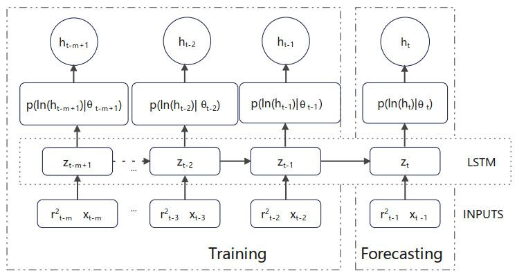

The growing complexity of financial markets necessitates the implementation of sophisticated tools for modeling and predicting volatility. As financial systems become more interconnected and dynamic, traditional models, which often rely on linear assumptions, struggle to capture the intricate relationships inherent in these markets. This limitation has accelerated the shift towards more advanced methodologies, including machine learning and neural networks. These techniques are capable of analyzing complex, non-linear relationships, making them particularly suited for volatility forecasting.

In the context of algorithmic trading, the ability to accurately forecast volatility is paramount for effective risk management and the development of robust trading strategies. Volatility, which measures the extent of variation in an asset's price, directly influences the level of risk associated with trading strategies. An inaccurate prediction can lead to suboptimal risk assessments, potentially resulting in significant financial losses.



This article investigates how neural networks can be applied to volatility forecasting, exploring their potential to enhance trading algorithms. By leveraging the pattern recognition capabilities of neural networks, traders can develop more sophisticated algorithms that not only predict volatility with greater accuracy but also adapt to new market information swiftly. This adaptability is crucial in today's fast-paced financial environment, where timely decision-making is often the key to maintaining a competitive edge. As we traverse this topic, we will highlight the advantages these advanced models offer over traditional approaches and the transformative impact they may have on algorithmic trading.

## Table of Contents

## Understanding Volatility in Financial Markets

Volatility in financial markets is a statistical measure that quantifies the dispersion of returns for a specific security or market index. It is a key indicator of market risk, as high volatility signifies greater uncertainty about the magnitude of price changes. This uncertainty impacts decisions surrounding portfolio allocation and risk management strategies. Investors and traders often adjust their exposure to volatile assets based on their risk tolerance and market outlook.

Traditional techniques for modeling and predicting volatility include the Generalized Autoregressive Conditional Heteroskedasticity (GARCH) and Autoregressive Conditional Heteroskedasticity (ARCH) models. These econometric models are designed to capture the time-varying nature of volatility and are formulated to account for volatility clustering, a phenomenon where periods of high volatility are followed by similar periods of high volatility, and periods of low volatility follow similar periods of low volatility.

The GARCH model, building on the ARCH model’s premise, adds layers of sophistication by incorporating lagged terms of the variance. The standard GARCH(1,1) model can be represented mathematically as:

$$
\sigma_t^2 = \alpha_0 + \alpha_1 u_{t-1}^2 + \beta \sigma_{t-1}^2
$$

Here, $\sigma_t^2$ denotes the conditional variance of the asset return at time $t$, $\alpha_0$ is a constant, $u_{t-1}^2$ is the lagged squared return, and $\beta \sigma_{t-1}^2$ represents the lagged variance. While these models are effective in capturing specific patterns in [volatility](/wiki/volatility-trading-strategies), they are inherently linear and may struggle to capture more complex, non-linear market dynamics.

The limitations of traditional volatility models have propelled interest in [machine learning](/wiki/machine-learning) as a viable alternative. Machine learning algorithms, particularly neural networks, have gained attention for their ability to model non-linear relationships and adapt to new market information. Unlike traditional methods, machine learning models can process vast and complex datasets to identify intricate patterns and correlations, potentially leading to more accurate volatility forecasts.

As the complexity and interconnectivity of global financial markets continue to evolve, the ability to accurately forecast volatility becomes increasingly crucial for effective risk management and investment strategy development. Machine learning offers a promising path forward, allowing for improved modeling approaches that extend beyond the capabilities of conventional econometric models.

## Neural Networks: A Modern Approach

Neural networks have become instrumental in the field of volatility forecasting due to their powerful pattern recognition capabilities. This quality makes them particularly suitable for analyzing financial data, which often involves non-linear and complex relationships. Among the various [neural network](/wiki/neural-network) architectures, three types are predominantly utilized: feedforward networks, recurrent networks, and Long Short-Term Memory networks (LSTMs). Each architecture offers distinct advantages in processing and interpreting financial data for volatility prediction.

Feedforward networks form the simplest type of artificial neural network architecture. Information flows in one direction—from input nodes, through hidden nodes (if any), to output nodes—without cycles. These networks are highly effective for tasks where input-output mappings do not require temporal dynamics. In the context of volatility forecasting, feedforward networks can be beneficial for static datasets where historical patterns directly influence volatility assessments.

Recurrent Neural Networks (RNNs) introduce loops within the network, allowing information to persist. This feature provides RNNs with a memory of previous inputs, which is crucial for time-series analysis in financial markets. Volatility in these markets is inherently time-dependent, making RNNs well-suited for capturing temporal dependencies in data. However, RNNs often struggle with long-range dependencies due to issues like vanishing gradients.

Long Short-Term Memory networks (LSTMs), a specialized form of RNNs, address the limitations of traditional RNNs by incorporating memory cells capable of maintaining information over extended periods. LSTMs are effective in learning both short and long-term dependencies, making them particularly useful for volatility forecasting, where past events can significantly influence future market behavior.

These neural network architectures are capable of learning from historical data to capture market behaviors and predict future volatility levels. They do so by approximating complex functions that describe market dynamics, which are often non-linear. The ability to model such relationships gives neural networks an edge over traditional linear models, such as GARCH and ARCH. Furthermore, neural networks can dynamically adapt to new information, ensuring they remain relevant under changing market conditions.

In Python, implementing a neural network for volatility forecasting might involve using libraries like TensorFlow or PyTorch. For example, constructing a simple LSTM model for a time-series forecasting task may involve the following code:

```python
import torch
import torch.nn as nn

class LSTMModel(nn.Module):
    def __init__(self, input_size, hidden_size, num_layers, output_size):
        super(LSTMModel, self).__init__()
        self.lstm = nn.LSTM(input_size, hidden_size, num_layers, batch_first=True)
        self.fc = nn.Linear(hidden_size, output_size)

    def forward(self, x):
        h_0 = torch.zeros(num_layers, x.size(0), hidden_size).requires_grad_()
        c_0 = torch.zeros(num_layers, x.size(0), hidden_size).requires_grad_()
        out, _ = self.lstm(x, (h_0, c_0))
        out = self.fc(out[:, -1, :])
        return out

# Example usage
input_size = 1  # number of features
hidden_size = 50  # number of features in hidden state
num_layers = 2  # number of stacked LSTM layers
output_size = 1  # prediction output

lstm_model = LSTMModel(input_size, hidden_size, num_layers, output_size)
```

This example illustrates how an LSTM can be constructed to handle input data and make future predictions by storing and updating its hidden states based on new input sequences. Such models, when trained on historical financial data, can effectively forecast volatility, enabling traders and institutions to make informed decisions.

## Application in Algorithmic Trading

Algorithmic trading has become an essential component of the financial markets, relying heavily on precise volatility forecasts to optimize decision-making and the execution of trades. Neural networks provide a modern solution to this challenge, capable of processing vast amounts of financial data to identify subtle and complex patterns that traditional statistical techniques might overlook. This capability offers traders a meaningful edge in formulating and refining trading strategies.

Neural networks, with architectures such as feedforward networks, recurrent neural networks (RNNs), and [long short](/wiki/equity-long-short)-term memory networks (LSTMs), possess the flexibility to model nonlinear relationships within financial data. For instance, a feedforward neural network could be used to forecast volatility by taking historical price data as input, allowing it to learn and adapt as new market information becomes available.

```python
import numpy as np
from keras.models import Sequential
from keras.layers import Dense

# Example of a simple feedforward neural network for volatility forecasting
model = Sequential()
model.add(Dense(64, input_dim=10, activation='relu'))  # Assume 10 input features
model.add(Dense(32, activation='relu'))
model.add(Dense(1, activation='linear'))  # Assuming output is a single volatility measure
model.compile(optimizer='adam', loss='mean_squared_error')

# Assuming X_train and y_train represent the training data and target volatility
model.fit(X_train, y_train, epochs=100, batch_size=10, verbose=1)
```

The integration of neural networks within [algorithmic trading](/wiki/algorithmic-trading) frameworks enables the development of more robust and adaptive trading strategies. By continuously learning from historical and real-time market data, neural networks can dynamically adjust to sudden market shifts, potentially increasing returns while managing risks. This adaptability is particularly valuable during periods of market volatility, where traditional models might lag.

Embedding neural networks into an existing algorithmic trading system involves several key steps. First, it requires preprocessing substantial amounts of data to ensure accuracy and relevance, which may involve filtering, normalization, and feature extraction. Once the data is prepared, the model can be trained and tested to fine-tune the network's predictive capabilities. Deployment signifies the final step, where the model's predictions are integrated into trading algorithms, thus influencing decision-making processes.

The real-time processing capabilities of neural networks allow them to react to market changes with minimal latency, an essential requirement for high-frequency trading ([HFT](/wiki/high-frequency-trading-strategies)). This speed and adaptability enhance the overall performance of trading strategies, enabling financial institutions to maintain a competitive advantage in fast-paced markets. 

In summary, neural networks substantially enrich algorithmic trading methodologies by offering advanced modeling capabilities that improve volatility forecasting. Their implementation advances trading strategy development, suggesting a significant step forward for the integration of machine learning technologies into financial market operations.

## Challenges and Considerations

In the context of employing neural networks for volatility forecasting, several challenges and considerations must be addressed to ensure accuracy and reliability. At the forefront is data quality, which is essential for training effective neural network models. Superior data quality helps build robust models, while poor-quality data can lead to inaccurate predictions and misguided trading strategies. Data preprocessing, including cleaning and normalization, is necessary to address any inconsistencies or noise present in the dataset.

Overfitting presents another significant challenge. Overfitting occurs when a model captures noise in the training data rather than underlying patterns, leading to poor generalization to new data. This issue necessitates careful model tuning and validation strategies. Techniques such as cross-validation, regularization methods like L1 and L2, and dropout can be employed to mitigate overfitting. For instance, a simple implementation of L2 regularization in Python might look like:

```python
from keras.models import Sequential
from keras.layers import Dense
from keras.regularizers import l2

model = Sequential()
model.add(Dense(64, input_dim=10, activation='relu', kernel_regularizer=l2(0.01)))
model.add(Dense(1, activation='linear', kernel_regularizer=l2(0.01)))
model.compile(optimizer='adam', loss='mean_squared_error')
```

The computational requirements of training neural networks are also significant. Given the complexity of financial markets, large datasets are often used, demanding substantial processing power and efficient resource allocation. High-performance computing environments or cloud-based platforms offering parallel processing capabilities can address these needs.

Continuous model evaluation and adjustment are necessary to maintain accuracy in a dynamic market environment. Financial markets are influenced by a multitude of factors, necessitating models that are regularly updated to reflect new data and emerging trends. Employing techniques like online learning or periodically retraining models ensures they remain relevant and effective. Moreover, integrating feedback loops that incorporate new, real-world data allows the model to adapt to changing market conditions promptly.

In summary, addressing these challenges involves ensuring high data quality, implementing effective strategies to prevent overfitting, meeting computational demands, and maintaining a dynamic model update regimen. These considerations are critical for leveraging neural networks in volatility forecasting effectively.

## Future Directions

Advancements in [artificial intelligence](/wiki/ai-artificial-intelligence) (AI) and machine learning are poised to significantly enhance the precision of volatility predictions in financial markets. As computational models gain complexity and refinement, they promise to capture financial market dynamics more accurately than ever before. Continual research in expanding AI capabilities is crucial for unlocking novel methodologies and frameworks that can address existing modeling constraints.

Emerging technologies such as quantum computing hold particular promise for the finance sector. Quantum computing could revolutionize how complex market simulations are conducted, offering computational capabilities far beyond those of classical computers. This advancement has the potential to dramatically enhance the simulation of financial markets and the forecasting of volatility by performing numerous calculations simultaneously, thereby processing vast datasets more efficiently.

Given the dynamic nature of financial markets, continued innovation and research are essential. Expanding the applicability of neural networks involves addressing current limitations, such as overfitting, computational constraints, and the need for large and representative datasets. Research initiatives focused on the development of advanced algorithms and architectures, such as transformers, could lead to more accurate and generalizable predictions across diverse market conditions.

Incorporating [alternative data](/wiki/best-alternative-data) sources into neural network models can bolster their robustness and predictive power. These data sources may include textual data from news articles and social media, sentiment analysis, or other unconventional indicators that traditional models typically overlook. By integrating this data, machine learning models can offer a more holistic view of market conditions, providing a competitive edge in algorithmic trading.

Overall, the future of volatility modeling through neural networks looks promising, with ongoing research and technological advancements setting the stage for enhanced predictive capabilities. These developments offer significant opportunities for traders and financial institutions to refine their strategies and improve performance in increasingly volatile and complex market environments.

## Conclusion

Neural networks represent a transformative force in volatility modeling for algorithmic trading. Their intrinsic ability to adapt and learn from complex patterns offers significant advantages over traditional, linear models. Unlike models such as GARCH or ARCH, neural networks capture non-linear relationships, enhancing predictive accuracy and adapting dynamically to new market information. This makes them particularly suitable for the volatile and fast-paced nature of financial markets.

For traders and financial institutions, adopting neural network models can translate into more robust trading strategies and improved portfolio performance. By processing vast datasets and identifying subtle patterns that elude conventional methods, neural networks enable more precise decision-making, ultimately optimizing trade execution and risk management. 

Moreover, the continued innovation and research in neural networks are expected to further enhance their capabilities. Developments in machine learning techniques, coupled with increased computational power, will likely improve the accuracy and robustness of volatility predictions. As these models evolve, they promise greater integration of diverse data sources, potentially incorporating alternative datasets to strengthen model predictions. 

Overall, the future of volatility modeling in algorithmic trading appears promising with neural networks at its core. Their ongoing refinement and adaptation to emerging technologies are poised to redefine trading strategies, underscoring their critical role in the evolving landscape of financial markets.

## References & Further Reading

[1]: Bollerslev, T. (1986). ["Generalized Autoregressive Conditional Heteroskedasticity."](https://www.sciencedirect.com/science/article/pii/0304407686900631) Journal of Econometrics, 31(3), 307-327.

[2]: Engle, R. F. (1982). ["Autoregressive Conditional Heteroscedasticity with Estimates of the Variance of United Kingdom Inflation."](https://www.jstor.org/stable/1912773) Econometrica, 50(4), 987-1007.

[3]: López de Prado, M. (2018). ["Advances in Financial Machine Learning."](https://www.amazon.com/Advances-Financial-Machine-Learning-Marcos/dp/1119482089) Wiley.

[4]: Hochreiter, S., & Schmidhuber, J. (1997). ["Long Short-Term Memory."](https://dl.acm.org/doi/10.1162/neco.1997.9.8.1735) Neural Computation, 9(8), 1735-1780.

[5]: Goodfellow, I., Bengio, Y., & Courville, A. (2016). ["Deep Learning."](https://www.deeplearningbook.org/) MIT Press.

[6]: Zhang, G. P. (2003). ["Time series forecasting using a hybrid ARIMA and neural network model."](https://dl.icdst.org/pdfs/files/2c442c738bd6bc178e715f400bec5d5f.pdf) Neurocomputing, 50, 159-175.

[7]: Tsay, R. S. (2010). ["Analysis of Financial Time Series."](https://onlinelibrary.wiley.com/doi/book/10.1002/9780470644560) Wiley.