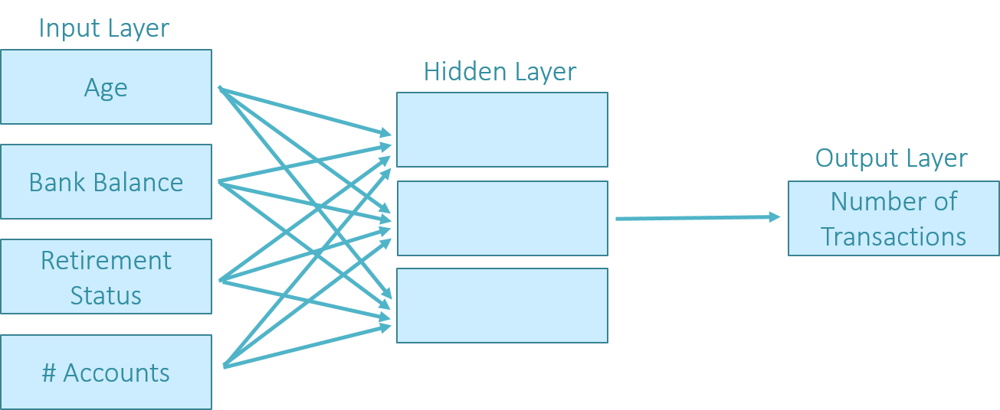

## Table of Contents

## What is a neural network and how does it work?

A neural network is a type of computer system designed to work and learn like the human brain. It is made up of many connected units called neurons, which are organized into layers. The first layer takes in information, like the pixels of an image or words in a sentence. The last layer gives the final result, like identifying what's in the image or translating the sentence. The layers in between help process the information as it moves through the network.

Neural networks learn by adjusting the connections between neurons based on the data they are given. When the network makes a mistake, it uses that mistake to change how it processes information next time. This process is called training, and it's like how a person might learn from their mistakes. Over time, with enough data and training, the neural network gets better at its job, whether that's recognizing faces, understanding speech, or playing games.

## How are neural networks applied in the field of finance?

In the world of finance, neural networks help by looking at lots of data to find patterns and make predictions. For example, banks use them to decide if someone should get a loan. The neural network looks at things like how much money the person makes, their past payments, and other information. It then guesses if the person will pay back the loan. This helps banks make better choices and reduces the chance of losing money.

Neural networks are also used for trading stocks and other investments. They can look at past prices and other information to guess where prices might go next. Traders use these guesses to buy or sell at the right times. This can help them make more money. Besides trading, neural networks help with things like spotting fraud. They can find strange patterns in transactions that might mean someone is doing something wrong. This keeps financial systems safer and more trustworthy.

## What are the basic types of neural networks used for financial prediction?

One common type of neural network used for financial prediction is the feedforward neural network. This type of network is simple and works by taking in data, like stock prices or economic indicators, and passing it through layers of neurons. Each neuron processes the data and sends it to the next layer until it reaches the output layer, which gives a prediction. For example, it might predict if a stock price will go up or down. These networks are good for finding patterns in data and are often used in trading systems.

Another type is the recurrent neural network (RNN). RNNs are special because they can remember past information. This is useful for financial predictions because things like stock prices often depend on what happened before. An RNN can look at a series of past prices and use that information to predict future prices. They are more complex than feedforward networks but can be better at understanding time-related data, making them popular for tasks like predicting stock market trends.

Lastly, convolutional neural networks (CNNs) are sometimes used in finance, especially for tasks involving images or complex data patterns. For example, a CNN might analyze financial charts or satellite images to predict economic activity. CNNs are good at recognizing patterns in data, even if the data is shifted or changed a bit. While they are more commonly used in other fields like image recognition, they can be adapted for financial prediction tasks where visual data is important.

## What data is typically used to train neural networks for financial predictions?

To train neural networks for financial predictions, people usually use a lot of different kinds of data. This includes historical prices of stocks, commodities, or currencies. They also look at economic indicators like unemployment rates, inflation, and GDP growth. Other important data can include company financials, like earnings reports and balance sheets, as well as news articles and social media sentiment. All this information helps the neural network understand patterns and trends in the financial world.

Sometimes, the data used can be more specific to the task at hand. For example, if the goal is to predict stock prices, the network might focus more on stock-specific data like trading volumes and technical indicators. If the aim is to predict broader economic trends, the network might use data from different countries and sectors. No matter what the specific task is, the key is to have a lot of good quality data that covers a long period of time. This helps the neural network learn and make better predictions.

## How do you preprocess financial data for use in neural networks?

Preprocessing financial data for neural networks involves cleaning and organizing the information so it can be used effectively. First, you need to handle missing data. Sometimes, financial data has gaps, like when a company doesn't report earnings for a quarter. You can fill these gaps by using the average of nearby data points or by using more complex methods like interpolation. Next, you should normalize the data. This means adjusting all the numbers so they are on a similar scale. For example, stock prices and trading volumes can be very different in size, so you might divide them by their maximum values to make them between 0 and 1. This helps the neural network learn better because it treats all inputs fairly.

After cleaning and normalizing, you might need to transform the data. This can involve creating new features from the existing data. For example, you could calculate moving averages or other technical indicators from stock prices. These new features can help the neural network find patterns more easily. It's also important to split the data into training, validation, and test sets. The training set is used to teach the network, the validation set helps you tune the model to work better, and the test set checks how well the network performs on new data. By carefully preprocessing the data, you give the neural network the best chance to learn and make accurate financial predictions.

## What are the common performance metrics used to evaluate neural networks in financial prediction?

When people want to see how well a neural network does at predicting financial things, they look at a few key numbers. One common number is the accuracy, which tells you how often the network's guesses are right. For example, if it predicts if a stock price will go up or down, accuracy shows how often it gets that right. Another important number is the mean squared error (MSE). This measures how far off the network's predictions are from the real values. A lower MSE means the network's guesses are closer to what actually happens.

There are also other numbers that people use. One is the mean absolute error (MAE), which is like the MSE but it doesn't square the differences, so it's easier to understand. The R-squared value is another one that shows how much of the changes in the data the network can explain. A higher R-squared means the network is better at understanding the data. Lastly, people often look at the Sharpe ratio, which tells you how good the network's predictions are compared to just guessing randomly. A higher Sharpe ratio means the network is doing a better job at predicting financial outcomes.

## How can overfitting be prevented when using neural networks for financial predictions?

Overfitting happens when a neural network gets too good at remembering the exact data it was trained on, but then it doesn't do well with new data. To stop this from happening, you can use something called regularization. This makes the network's guesses simpler and less likely to fit the training data too closely. Another way is to use dropout, where you randomly turn off some connections between neurons during training. This makes the network learn in a more general way, so it works better with new data.

You can also prevent overfitting by using more data for training. The more different kinds of data the network sees, the better it gets at understanding patterns that apply to new situations. Another good trick is to split your data into training and validation sets. You train the network on the training set and check how it's doing on the validation set. If it starts doing much worse on the validation set than on the training set, you might be overfitting. By keeping an eye on this and stopping the training at the right time, you can make sure your network works well on new financial data.

## What are the challenges and limitations of using neural networks for financial forecasting?

Using neural networks for financial forecasting can be tricky because the financial world is full of surprises and changes. Neural networks learn from past data, but the future might not follow the same patterns. For example, unexpected events like economic crises, new laws, or big news can shake up markets in ways that the network hasn't seen before. Also, the data used to train the network might not be perfect. There could be missing information or mistakes, which can make the network's predictions less reliable. Plus, it's hard to explain how a neural network makes its guesses because it's like a complicated puzzle. This can make people less trusting of the predictions, especially in the world of finance where trust is really important.

Another challenge is that neural networks can sometimes get too focused on the data they've seen, a problem called overfitting. This means they might do well with the old data but not so well with new situations. To avoid this, you need to be careful about how you train the network and use techniques like regularization and dropout. Also, training these networks takes a lot of computer power and time, which can be expensive. Even with all this effort, there's no guarantee that the network will always get it right. Financial forecasting is tough, and while neural networks can help, they're not a magic solution. They're just one tool among many that people use to try to understand the tricky world of money.

## How do advanced neural network architectures like LSTM and CNN improve financial prediction?

Advanced neural network architectures like Long Short-Term Memory (LSTM) and Convolutional Neural Networks (CNN) can make financial predictions better by understanding data in special ways. LSTMs are a type of recurrent neural network that are really good at remembering things from the past. In finance, this is helpful because what happened before often affects what will happen next. For example, an LSTM can look at a series of stock prices over time and use that information to guess where the prices might go in the future. This makes them better at predicting things like stock market trends compared to simpler neural networks.

CNNs, on the other hand, are great at finding patterns in data, even if those patterns are a bit changed or moved around. In finance, CNNs can be used to analyze things like financial charts or satellite images to predict economic activity. For example, a CNN might look at a chart of stock prices and find patterns that could help predict if the price will go up or down. While CNNs are more commonly used for tasks like image recognition, they can be adapted to help with financial predictions by looking at visual data or complex data patterns. Both LSTMs and CNNs help make financial predictions more accurate by using their special abilities to understand and process data in ways that simpler networks can't.

## What role do ensemble methods play in enhancing the accuracy of neural network-based financial predictions?

Ensemble methods help make financial predictions more accurate by combining the guesses of many different neural networks. Instead of relying on just one network, ensemble methods use a group of them. Each network might look at the data a little differently or focus on different parts of it. By putting all their guesses together, usually by taking an average or a vote, the final prediction is often better than what any single network could do on its own. This is like asking a bunch of experts for their opinion and then making a decision based on what most of them think.

In finance, where predictions can be tricky because of changing markets and unexpected events, ensemble methods can be really helpful. They can reduce the chance of making big mistakes by smoothing out the errors that individual networks might make. For example, one network might be good at predicting stock prices during stable times, while another might be better during times of big changes. By using both, the ensemble method can handle different situations better. This makes the predictions more reliable and trustworthy, which is important in the world of money where small improvements can make a big difference.

## How can neural networks be integrated with other AI techniques to optimize financial strategies?

Neural networks can work together with other AI techniques to make financial strategies even better. One way is by using them with reinforcement learning. In reinforcement learning, an AI learns by trying different actions and seeing what works best. When you combine this with a neural network, the network can help understand the data better, while the reinforcement learning part helps figure out the best moves to make. For example, in trading, the neural network could look at stock prices and other data to make predictions, and the reinforcement learning part could decide when to buy or sell based on those predictions. This teamwork can lead to smarter and more profitable trading strategies.

Another way is to use neural networks with genetic algorithms. Genetic algorithms are like a way of solving problems by mimicking how nature evolves. They start with a bunch of possible solutions and then mix and change them over time to find the best one. When you use them with neural networks, the genetic algorithm can help find the best way to set up the network, like deciding how many layers it should have or how the neurons should be connected. This can make the neural network better at predicting financial trends. By using these different AI techniques together, financial strategies can be more optimized and effective, helping to make better decisions in the complex world of finance.

## What are the latest research trends and future directions in neural networks for financial prediction?

In the world of financial prediction, researchers are always looking for new ways to make neural networks even better. One big trend is using more advanced types of neural networks, like transformers, which are good at understanding sequences of data. These can be really helpful for things like predicting stock prices because they can look at a long series of past prices and find patterns that simpler networks might miss. Another trend is using more data, not just numbers but also things like news articles and social media posts. By mixing different kinds of data, neural networks can get a fuller picture of what's going on in the financial world and make more accurate predictions.

Looking to the future, people are excited about combining neural networks with other AI techniques, like reinforcement learning, to make trading strategies smarter. They're also working on making neural networks more explainable, so it's easier to understand how they make their predictions. This is important in finance because people need to trust the predictions they're using to make big decisions. Finally, as computers get faster and more powerful, researchers will be able to train even bigger and more complex networks. This could lead to big improvements in how well we can predict financial trends and help make better decisions in the ever-changing world of money.

## What are Neural Networks?

Neural networks are computational models inspired by the human brain's architecture, consisting of interconnected nodes known as 'neurons'. These artificial neurons are organized in layers and are responsible for processing input data through assigned weights and thresholds, which influence how signals are transmitted across the network.

Each neuron receives one or more inputs, processes them, and transmits an output to the next layer or as a final result. The output of each neuron is determined by an activation function, which calculates the neuron's weighted sum and applies a threshold to decide the signal's strength. Common activation functions include the sigmoid, hyperbolic tangent (tanh), and rectified linear unit (ReLU).

$$
\text{Sigmoid function: } \sigma(x) = \frac{1}{1 + e^{-x}}
$$

$$
\text{ReLU function: } f(x) = \max(0, x)
$$

Neural networks undergo a 'training' process to enhance their predictive accuracy. Training involves adjusting the weights of the connections between neurons based on the errors produced in the network's output compared to the expected result. This process is typically executed using algorithms such as backpropagation, which iteratively fine-tunes weights by calculating the gradient of an error loss function, guiding the network towards minimizing prediction errors.

One major strength of neural networks is their proficiency in managing non-linear data and capturing intricate patterns that may not be evident through linear or traditional models. This makes them particularly valuable in financial prediction, where data can exhibit highly non-linear behaviors influenced by numerous variables and latent factors.

Neural networks are adept at learning from historical data, identifying underlying patterns and trends, and improving their forecasting accuracy over time. This adaptability facilitates predictive modeling in finance, enabling analysts to uncover market trends, anomalies, and potential future movements based on substantial datasets.

In summary, neural networks offer a robust framework for analyzing complex financial datasets, enabling insights into data that can assist in predicting market dynamics. Their capacity to learn and generalize from past data provides an advanced tool for traders and analysts seeking to refine their financial prediction models.

## References & Further Reading

[1]: ["Deep Learning for Finance"](https://www.mdpi.com/2673-2688/5/4/101) by Antonio Gulli and Sujit Pal

[2]: ["Neural Networks for Financial Forecasting"](https://medium.com/microsoftazure/neural-networks-for-forecasting-financial-and-economic-time-series-6aca370ff412) by Edward Gately

[3]: Heaton, J., Polson, N.G., & Witte, J. (2017). ["Deep Learning in Finance"](https://arxiv.org/abs/1602.06561) Journal of Financial Transformation.

[4]: Fischer, T., & Krauss, C. (2018). ["Deep learning with long short-term memory networks for financial market predictions."](https://www.sciencedirect.com/science/article/pii/S0377221717310652) European Journal of Operational Research, 270(2), 654-669.

[5]: ["Artificial Intelligence in Asset Management"](https://www.cfainstitute.org/sites/default/files/-/media/documents/book/rf-lit-review/2020/rflr-artificial-intelligence-in-asset-management.pdf) by CFA Institute Research Foundation

[6]: ["Python for Finance: Mastering Data-Driven Finance"](https://www.amazon.com/Python-Finance-Mastering-Data-Driven/dp/1492024333) by Yves Hilpisch 

[7]: ["Machine Learning for Financial Market Prediction"](https://www.researchgate.net/publication/375414050_Machine_learning-based_approaches_for_financial_market_prediction_A_comprehensive_review) by Ashish Kumar, Mukul Khullar, and Aditya Agarwal