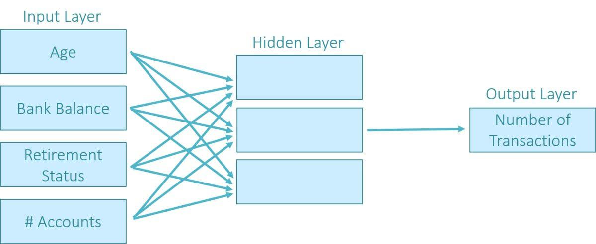

In recent years, neural networks have emerged as a significant innovation in the field of financial prediction, particularly within the scope of algorithmic trading. As financial markets grow increasingly complex, these advanced AI techniques provide traders with a reliable method to gain a competitive edge. The essence of neural networks lies in their ability to learn and adapt from vast datasets, enabling traders to identify intricate patterns and make informed decisions.

This article aims to review the application of neural networks in the realm of financial prediction and their contribution to algorithmic trading. It begins with an overview of what neural networks are, how they function, and their unique attributes that cater well to financial data analysis. The discussion progresses to their practical application in algorithmic trading, offering insights into how they can be utilized to formulate improved trading strategies. Finally, the article examines various tools and frameworks that are instrumental in developing and implementing these models; understanding these tools is essential for anyone aspiring to leverage AI for enhanced investment strategies.



A sound comprehension of neural networks and their capacity to analyze financial data is crucial for traders and analysts aiming to refine their investment approaches. These networks, inspired by the human brain’s interconnected neural structure, consist of numerous nodes—referred to as neurons—that process input data, enabling them to learn from historical data and improve predictive accuracy over time. Despite their complexity, frameworks and libraries like Keras and TensorFlow simplify the development and implementation process, making neural networks accessible to a broader audience, even those with limited programming expertise.

Neural networks in trading offer the advantage of handling large volumes of data, processing information faster than traditional models, and uncovering hidden correlations within datasets. However, integrating them as part of a broader trading strategy that includes human intuition remains essential. This combination of technology and human expertise promises enhanced decision-making capabilities and better investment outcomes.

By exploring the role of neural networks in financial prediction, traders can better position themselves to capitalize on emerging trends and opportunities within the market. The ongoing advancements in AI and machine learning continue to enhance the potential and applications of neural networks, marking them as a transformative tool in the ever-evolving landscape of financial markets.

## Table of Contents

## What are Neural Networks?

Neural networks are computational models inspired by the human brain's architecture, consisting of interconnected nodes known as 'neurons'. These artificial neurons are organized in layers and are responsible for processing input data through assigned weights and thresholds, which influence how signals are transmitted across the network.

Each neuron receives one or more inputs, processes them, and transmits an output to the next layer or as a final result. The output of each neuron is determined by an activation function, which calculates the neuron's weighted sum and applies a threshold to decide the signal's strength. Common activation functions include the sigmoid, hyperbolic tangent (tanh), and rectified linear unit (ReLU).

$$
\text{Sigmoid function: } \sigma(x) = \frac{1}{1 + e^{-x}}
$$

$$
\text{ReLU function: } f(x) = \max(0, x)
$$

Neural networks undergo a 'training' process to enhance their predictive accuracy. Training involves adjusting the weights of the connections between neurons based on the errors produced in the network's output compared to the expected result. This process is typically executed using algorithms such as backpropagation, which iteratively fine-tunes weights by calculating the gradient of an error loss function, guiding the network towards minimizing prediction errors.

One major strength of neural networks is their proficiency in managing non-linear data and capturing intricate patterns that may not be evident through linear or traditional models. This makes them particularly valuable in financial prediction, where data can exhibit highly non-linear behaviors influenced by numerous variables and latent factors.

Neural networks are adept at learning from historical data, identifying underlying patterns and trends, and improving their forecasting accuracy over time. This adaptability facilitates predictive modeling in finance, enabling analysts to uncover market trends, anomalies, and potential future movements based on substantial datasets.

In summary, neural networks offer a robust framework for analyzing complex financial datasets, enabling insights into data that can assist in predicting market dynamics. Their capacity to learn and generalize from past data provides an advanced tool for traders and analysts seeking to refine their financial prediction models.

## Using Neural Networks in Financial Trading

In financial trading, neural networks have become instrumental tools for predicting stock price movements, assessing risks, and refining trading strategies. These models leverage vast datasets to deliver insights into market conditions, rather than direct stock forecasts. This capability stems from their ability to recognize and adapt to complex data patterns, which may not be immediately evident through conventional analysis.

Traders and financial analysts employ neural networks to sift through extensive volumes of financial data, identifying opportunities and potential risks. This analytical process aids in crafting more informed trading strategies. Such networks can process variables associated with stock prices, including historical data, trading volumes, market sentiment indicators, and economic announcements. Consider a basic example in Python using TensorFlow to set up a [neural network](/wiki/neural-network) model for stock market prediction:

```python
import tensorflow as tf
from tensorflow.keras.models import Sequential
from tensorflow.keras.layers import Dense

# Define the neural network model
model = Sequential([
    Dense(64, activation='relu', input_shape=(X_train.shape[1],)),
    Dense(64, activation='relu'),
    Dense(1)
])

# Compile the model
model.compile(optimizer='adam', loss='mean_squared_error')

# Train the model
model.fit(X_train, y_train, epochs=50, batch_size=32, validation_split=0.2)
```

In this context, `X_train` represents the input features, while `y_train` corresponds to the target stock prices. The model's optimization and learning from the data help capture underlying trends crucial for predicting future price movements.

The integration of neural networks with traditional human analysis enhances trading decisions by illuminating patterns and trends not easily observed through standard analysis techniques. For instance, neural networks can pinpoint nonlinear relationships and capture interactions between multiple variables, offering nuanced insights into market dynamics.

Despite their advantages, neural networks should be part of a comprehensive strategy that encompasses market research and risk management. They complement but do not replace the need for human intuition and expertise in interpreting model outputs and making context-aware decisions. Overall, by incorporating neural networks into a broader analytical framework, traders can bolster their decision-making capabilities and potentially achieve more favorable investment outcomes.

## Benefits and Limitations

Neural networks are transformative in financial trading primarily because of their capacity for rapid data processing and pattern recognition. Their ability to learn from large volumes of data and identify hidden correlations provides traders with insights that are not easily observable through traditional methods. This capability enables traders to automate complex calculations, thus shifting focus from data analysis to strategic decision-making.

However, there are limitations to their application in trading. Neural networks require substantial datasets for effective training, which can be a barrier for some. Without enough data, the models may not generalize well, leading to inaccurate predictions. Additionally, these models are computationally intensive, requiring significant resources to train effectively.

A crucial aspect of neural network training is the careful configuration to avoid overfitting. Overfitting occurs when a model learns the noise in the training data rather than the actual underlying patterns, rendering it less effective when applied to new data. This means that the model performs exceptionally well on training data but poorly on unseen data.

Despite their advanced capabilities, neural networks do not entirely replace human intuition and expertise. Insights derived from neural networks should augment, not substitute, traditional analysis and human judgment. Experienced traders consider neural network outputs as one of many tools in their arsenal, combining them with market knowledge and strategic insights to make informed decisions.

## Tools for Building Neural Networks

Several tools are available for developing neural networks, each offering different features suitable for various applications. These tools are designed to cater to a range of users, from those with extensive programming experience to those seeking more accessible, user-friendly platforms.

Neural Designer is a notable example, providing a user-friendly interface for building AI applications without requiring users to have deep coding knowledge. This tool is particularly advantageous for users who wish to focus more on the application's design and output rather than coding intricacies. Its intuitive features make complex tasks accessible to a broader range of users, empowering them to harness the capabilities of neural networks efficiently.

Keras, a popular [deep learning](/wiki/deep-learning) library, operates on top of TensorFlow. It is well-suited for users with programming expertise, offering a more code-oriented approach to creating [machine learning](/wiki/machine-learning) models. Keras allows for rapid prototyping and is renowned for its simplicity and modularity. The ability to run on CPUs and GPUs with minimal effort enables scalable processing capabilities, making it a preferred choice for developers looking to build complex neural network models.

Other frameworks like Torch and Microsoft's Cognitive Toolkit provide robust environments for neural network development. Torch is an open-source framework known for its flexibility and speed in handling fundamental operations during model training. Microsoft's Cognitive Toolkit, also known as CNTK, is an efficient tool designed for commercial-grade AI, capable of processing large datasets and supporting multiple language interfaces.

Choosing the right tool depends on a user's specific needs, the task's complexity, and existing technical expertise. For instance, if ease of use and accessibility are priorities, Neural Designer could be the preferred choice. Conversely, for users who need advanced features and scalability, Keras, Torch, or Microsoft's Cognitive Toolkit might be more appropriate. Each of these tools offers unique advantages, allowing developers and analysts to select the most fitting platform for their intended applications in financial prediction and [algorithmic trading](/wiki/algorithmic-trading).

## Conclusion

Neural networks serve as a formidable asset in financial prediction and algorithmic trading strategies due to their adeptness at handling complex datasets and uncovering patterns not immediately apparent through traditional means. Their capacity to process and analyze substantial amounts of data provides traders with unprecedented insights, enhancing the quality of decision-making processes.

Despite their computational advantages, neural networks should be integrated into trading strategies alongside human expertise. This synthesis of machine intelligence and human intuition enables a more comprehensive approach, accounting for market nuances and emotional factors that purely algorithmic strategies might overlook.

By effectively incorporating neural networks, traders can refine their strategies, identifying trends and anomalies more accurately. This integration enhances their ability to navigate volatile markets and optimize their investment decisions, ultimately contributing to more favorable financial outcomes.

The continuous evolution of AI and machine learning tools promises further advancements in the capabilities of neural networks for financial applications. As these technologies progress, their role is likely to expand, offering even greater precision and insight into market dynamics, thus further cementing their value within the trading domain.

## References & Further Reading

[1]: ["Deep Learning for Finance"](https://www.mdpi.com/2673-2688/5/4/101) by Antonio Gulli and Sujit Pal

[2]: ["Neural Networks for Financial Forecasting"](https://medium.com/microsoftazure/neural-networks-for-forecasting-financial-and-economic-time-series-6aca370ff412) by Edward Gately

[3]: Heaton, J., Polson, N.G., & Witte, J. (2017). ["Deep Learning in Finance"](https://arxiv.org/abs/1602.06561) Journal of Financial Transformation.

[4]: Fischer, T., & Krauss, C. (2018). ["Deep learning with long short-term memory networks for financial market predictions."](https://www.sciencedirect.com/science/article/pii/S0377221717310652) European Journal of Operational Research, 270(2), 654-669.

[5]: ["Artificial Intelligence in Asset Management"](https://www.cfainstitute.org/sites/default/files/-/media/documents/book/rf-lit-review/2020/rflr-artificial-intelligence-in-asset-management.pdf) by CFA Institute Research Foundation

[6]: ["Python for Finance: Mastering Data-Driven Finance"](https://www.amazon.com/Python-Finance-Mastering-Data-Driven/dp/1492024333) by Yves Hilpisch 

[7]: ["Machine Learning for Financial Market Prediction"](https://www.researchgate.net/publication/375414050_Machine_learning-based_approaches_for_financial_market_prediction_A_comprehensive_review) by Ashish Kumar, Mukul Khullar, and Aditya Agarwal