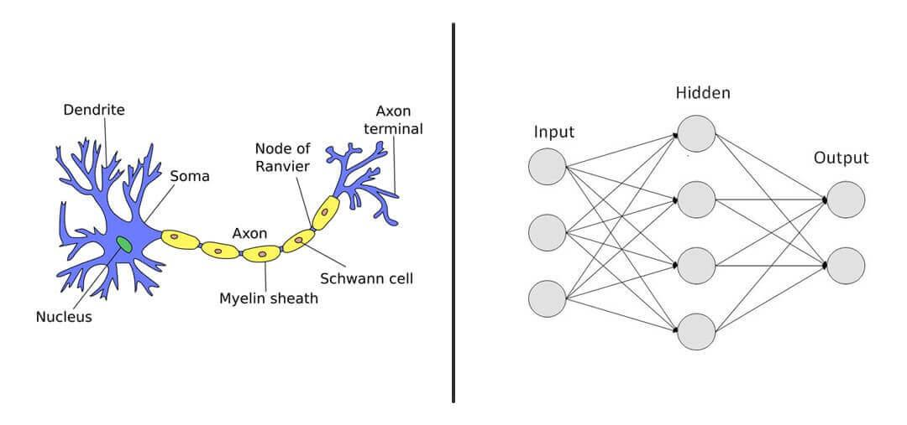

## Table of Contents

## What is a neural network?

A neural network is a type of computer system designed to work and learn like the human brain. It's made up of many connected units called neurons, which are organized in layers. These neurons process information by sending signals to each other, much like how our brain cells communicate. Neural networks are used in many areas, like recognizing images, understanding speech, and even playing games. They learn from examples, so the more data they are given, the better they get at their job.

The way a neural network learns is by adjusting the connections between its neurons. When it makes a mistake, it changes these connections to try and do better next time. This process is called training. For example, if a neural network is learning to recognize pictures of cats and dogs, it will look at many photos and adjust its connections until it can tell the difference between them. This ability to learn from experience is what makes neural networks so powerful and useful in solving complex problems.

## How does a neural network differ from traditional algorithms?

A neural network is different from traditional algorithms because it can learn from examples. Traditional algorithms follow a set of rules that a programmer writes. They do the same thing every time you run them. But a neural network changes its rules as it sees more data. It's like a student who gets better at math by doing more problems. The more examples a neural network sees, the better it gets at its job.

Another big difference is how they handle complex problems. Traditional algorithms can be good at solving problems where the rules are clear and simple. But for problems like recognizing faces in photos or understanding what people are saying, traditional algorithms can struggle. Neural networks are better at these tasks because they can find patterns in data that are hard for humans to describe with simple rules. They can learn to recognize things even when the examples are a bit different each time.

## What are the basic components of a neural network?

The basic components of a [neural network](/wiki/neural-network) are neurons, layers, and connections. Neurons are like tiny calculators inside the network. They take in information, do some math, and then send out a result. Layers are groups of these neurons. There's usually an input layer where the data goes in, hidden layers where the real work happens, and an output layer where the final result comes out. Connections are the paths that information travels between neurons. They have weights that the network changes to learn.

Think of a neural network like a team of people working together. Each person is a neuron, and they're organized into different departments, which are the layers. The input layer is like the reception area where new information comes in. The hidden layers are like the different offices where people process the information. The output layer is like the final report that gets sent out. The connections between people are like the phone lines or emails they use to communicate, and the strength of these connections can change as the team learns to work better together.

## What is the role of neurons in a neural network?

Neurons in a neural network are like tiny workers. Each neuron takes in information from other neurons, does some simple math with it, and then sends out a result. This result can go to other neurons or to the outside world. The math that a neuron does is usually just adding up the numbers it gets and then using that sum to decide what number to send out. This decision is made using something called an activation function, which is like a rule that says, "If the sum is big enough, send out a big number; if it's small, send out a small number."

The role of neurons is really important because they help the neural network learn. Each neuron has a number called a weight for each piece of information it gets. These weights can be changed to make the neuron do its job better. When the neural network makes a mistake, it changes these weights a little bit to try and do better next time. This is how the network learns from its mistakes. So, neurons are not just doing math; they are also learning and getting better at their job as the network sees more examples.

## How does the training process work in neural networks?

The training process in neural networks is like teaching a student to get better at a subject. You start by showing the network lots of examples, like giving a student homework problems. The network looks at each example and tries to guess the right answer. If it gets it wrong, it changes a little bit to try and do better next time. These changes happen inside the network, in the connections between the neurons. The network keeps doing this, looking at more examples and adjusting, until it gets really good at guessing the right answers.

This process of changing the connections is called backpropagation. It's like the network is going backward through its guesses to figure out what went wrong. The network uses a special math trick to figure out how much each connection needs to change. This trick is called the gradient descent method. It helps the network find the best way to change its connections so it can learn faster. Over time, with enough examples, the network gets really good at its job, just like a student who practices a lot gets better at math.

## What are the common activation functions used in neural networks?

Activation functions are like rules that neurons in a neural network use to decide what number to send out. One common activation function is the sigmoid function. It squashes numbers into a range between 0 and 1. This is useful for making decisions, like in a network that decides if an email is spam or not. Another popular one is the ReLU, or Rectified Linear Unit. It's simple: if the number coming in is positive, it sends it out as is; if it's negative, it sends out a zero. ReLU helps the network learn faster and is used a lot in big networks that recognize images.

There's also the tanh, or hyperbolic tangent function. It's like the sigmoid but squashes numbers between -1 and 1. This can be good for networks that need to understand both positive and negative values well. The softmax function is used at the end of a network to turn numbers into probabilities. It's great for networks that need to pick one answer out of many choices, like recognizing different types of animals in a picture. Each of these functions has its own job and helps the network do different things well.

## What is backpropagation and why is it important?

Backpropagation is a way for a neural network to learn from its mistakes. Imagine you're trying to guess the answer to a math problem. If you get it wrong, you look back at your steps to see where you made a mistake. Backpropagation is like that, but for a neural network. It looks at the final answer the network gives and compares it to the right answer. If the network got it wrong, it figures out how much each part of the network contributed to the mistake. Then, it changes those parts a little bit to make the network better at guessing next time.

This process is really important because it helps the neural network learn faster and better. Without backpropagation, the network would have a hard time figuring out how to improve. It's like trying to learn a new language without anyone correcting your mistakes. Backpropagation is the teacher that helps the network get better with each example it sees. By constantly adjusting and learning from its errors, the neural network can become very good at tasks like recognizing pictures or understanding speech.

## What are some popular types of neural network architectures?

One popular type of neural network is the feedforward neural network. It's like a one-way street where information goes in one direction, from the input layer to the output layer. It's simple but good at tasks like recognizing patterns in data. Another type is the [convolutional neural network](/wiki/convolutional-neural-network), or CNN. It's great for understanding images. It looks at small parts of an image and learns to recognize things like edges or shapes. Then it puts all these parts together to see the whole picture.

Recurrent neural networks, or RNNs, are different because they can remember things from the past. They're useful for tasks like understanding language or predicting what will happen next. A special kind of RNN is the [long short](/wiki/equity-long-short)-term memory network, or LSTM. It's even better at remembering things over a long time, which makes it good for tasks like writing stories or keeping track of long conversations. Each of these types of neural networks is good at different things, and choosing the right one depends on what you want the network to do.

## How do convolutional neural networks (CNNs) work?

Convolutional neural networks, or CNNs, are special kinds of neural networks that are really good at understanding pictures. They work by looking at small parts of an image at a time, like tiny puzzle pieces. Each part is called a filter, and the CNN slides this filter over the whole image to find patterns, like edges or shapes. As it moves the filter, it makes a new, smaller picture called a feature map. This map shows where the pattern was found in the original image. By using lots of these filters, the CNN can learn to recognize more complex things, like faces or objects.

After the CNN has looked at all the small parts, it puts them together to understand the whole image. This is done through layers, starting with the convolutional layers that make the feature maps, followed by pooling layers that shrink these maps to focus on the most important parts. Then, the information goes through fully connected layers, which are like the brain of the network. These layers take all the information from the feature maps and use it to make a final guess about what's in the picture. By doing all these steps, CNNs can learn to recognize and understand images really well.

## What are recurrent neural networks (RNNs) and their applications?

Recurrent neural networks, or RNNs, are a type of neural network that can remember things from the past. They're like a student who remembers what they learned in the last lesson and uses it to understand the next one. In an RNN, the information can loop back on itself, so the network can keep track of what it has seen before. This makes RNNs really good at understanding things that happen over time, like words in a sentence or notes in a song. They look at each piece of information in order and use what they've seen before to make better guesses about what comes next.

RNNs are used in many cool ways. They're great for understanding and generating language, like in chatbots or translation apps. When you type a message, an RNN can predict what you might say next or translate it into another language. They're also used in speech recognition, helping your phone understand what you're saying. Another use is in predicting things, like what the stock market might do next or what the weather will be like. By remembering patterns over time, RNNs can make smart guesses about the future.

## How do generative adversarial networks (GANs) function?

Generative adversarial networks, or GANs, are like two friends playing a game. One friend, called the generator, tries to make fake pictures that look real. The other friend, called the discriminator, tries to tell if the pictures are real or fake. They keep playing this game, with the generator getting better at making realistic pictures and the discriminator getting better at spotting fakes. Over time, the generator gets so good that it can make pictures that are hard to tell apart from real ones.

GANs are used for many cool things. They can create new pictures of things like faces or animals that look just like the real thing. They can also make new styles of art or even turn sketches into realistic images. By playing this game of trying to fool each other, GANs can learn to create things that are new and look very real.

## What are the current challenges and future directions in neural network research?

One of the big challenges in neural network research is making them work better with less data. Right now, neural networks need a lot of examples to learn well. This can be hard because gathering all that data can take a long time and cost a lot of money. Researchers are trying to find ways to make neural networks learn from fewer examples. They're also working on making the networks explain why they made certain decisions, which is important for things like medical diagnoses or loan approvals where people need to trust the network's choices.

Another challenge is making neural networks faster and more efficient. Big neural networks can take a lot of time and computer power to run, which can make them hard to use on things like phones or small devices. Researchers are trying to make smaller, quicker networks that still work well. They're also looking at how to make networks that can keep learning and adapting over time, even after they've been trained. This could help them stay useful as the world changes.

In the future, neural networks might be used in even more ways. They could help with things like finding new medicines, understanding how the brain works, or even creating new kinds of art and music. As they get better at learning from less data and explaining their decisions, people might trust them more and use them in important decisions. Researchers are excited about all the new possibilities that better neural networks could bring.

## References & Further Reading

[1]: Hochreiter, S., & Schmidhuber, J. (1997). ["Long Short-Term Memory."](https://www.researchgate.net/publication/13853244_Long_Short-term_Memory) Neural Computation.

[2]: Goodfellow, I., et al. (2014). ["Generative Adversarial Nets."](https://arxiv.org/abs/1406.2661) Advances in Neural Information Processing Systems.

[3]: Deng, L., & Yu, D. (2014). ["Deep Learning: Methods and Applications."](https://ieeexplore.ieee.org/document/8187230) Foundations and Trends® in Signal Processing.

[4]: ["Advances in Financial Machine Learning"](https://www.wiley.com/en-us/Advances+in+Financial+Machine+Learning-p-9781119482086) by Marcos Lopez de Prado.

[5]: ["Machine Learning for Algorithmic Trading"](https://github.com/PacktPublishing/Machine-Learning-for-Algorithmic-Trading-Second-Edition) by Stefan Jansen.