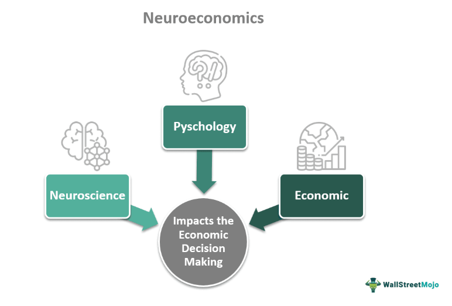

In an increasingly complex financial landscape, understanding economic behavior is vital for both individuals and institutions. As markets and investment strategies evolve, so does the need for innovative approaches to comprehend and predict economic decision-making. Neuroeconomics, an emerging field, merges neuroscience, psychology, and economics to provide deeper insights into how decisions are made. By exploring the neural mechanisms underlying choices, neuroeconomics illuminates the intrinsic factors that influence economic behaviors, offering a nuanced perspective beyond traditional models.

This interdisciplinary approach challenges the classical economic assumption of rational choice, which posits that individuals make decisions solely based on maximizing utility. Neuroeconomics suggests that human decision-making is also shaped by psychological and emotional elements. Through advanced neuroscience tools such as MRI and PET scans, researchers can observe brain activity during economic decision-making processes, linking physiological responses to economic actions. This knowledge could significantly impact trading and investment strategies, as it provides a better understanding of how decisions are driven by cognitive and emotional factors.



The exploration of neuroeconomics not only enhances our comprehension of individual decision-making but also has broader implications for economic behavior studies and algorithmic trading. By integrating insights from brain studies, the field holds potential for refining predictive models and improving the accuracy of algorithmic trading strategies. The continual interplay between economic theories, brain research, and technological advancements presents both opportunities and challenges, as the discipline seeks to bridge the gap between human behavior and economic models.

References:
- Camerer, C. F., Loewenstein, G., & Prelec, D. (2005). Neuroeconomics: How neuroscience can inform economics. Journal of Economic Literature, 43(1), 9-64.
- Glimcher, P. W., & Fehr, E. (Eds.). (2013). Neuroeconomics: Decision making and the brain. Academic Press.

## Table of Contents

## Understanding Neuroeconomics

Neuroeconomics employs neuroscience tools and methodologies to explore the neural basis of economic decision-making. By analyzing brain activity, this field seeks to link economic activities with physiological responses, offering a more nuanced understanding of the decision-making process. Traditional economic models often assume that individuals act rationally to maximize utility; however, neuroeconomics challenges these models by accounting for psychological and emotional influences that can lead to "irrational" behaviors.

Advanced imaging techniques, particularly Magnetic Resonance Imaging (MRI) and Positron Emission Tomography (PET) scans, are crucial tools in neuroeconomic research. These methodologies enable researchers to observe active brain regions during economic decision-making tasks, thus identifying the neural correlates of economic behaviors.

MRI, specifically functional MRI (fMRI), measures brain activity by detecting changes associated with blood flow. Since neural activity causes increased blood flow in the engaged brain regions, fMRI can help locate areas involved in specific economic choices. This is vital for understanding how individuals assess risk, reward, and other economic variables at a neural level.

PET scans, on the other hand, involve the use of a radioactive tracer to image the brain. This technique provides insights into metabolic processes and neurotransmitter activity, offering a different but complementary perspective to fMRI. PET scans can reveal how economic decisions may be influenced by biochemical pathways, such as those involving dopamine, which is associated with reward processing.

By integrating these imaging techniques with behavioral data, neuroeconomics aims to create a more comprehensive framework for understanding economic decision-making. This approach accounts for factors like emotion and cognition, offering explanations for behaviors that diverge from the predictions of traditional rational choice models. Ultimately, neuroeconomics opens new avenues for understanding how complex neural processes underpin economic choices, suggesting that both cognitive and emotional influences are integral to decision-making.

## Economic Behavior and Brain Studies

Economic behavior is influenced by an intricate interplay of cognitive and emotional factors, as demonstrated through neuroeconomic studies. These studies leverage advanced neuroimaging techniques and psychological assessments to understand how various brain regions facilitate decision-making processes involved in economic activities.

Research in neuroeconomics has pinpointed the role of distinct brain areas in assessing risks and rewards. For instance, the ventromedial prefrontal cortex (vmPFC) is crucial for subjective value assessment. This region aids individuals in evaluating the desirability of different outcomes, taking into account personal preferences and past experiences. Additionally, the vmPFC integrates emotional input with cognitive processes to drive decision-making, highlighting its multifaceted contribution to evaluating economic choices.

Moreover, the insular cortex is pivotal for risk evaluation. This region is activated in response to uncertainty and potential loss, allowing individuals to gauge the stakes involved in their decisions. The insular cortex helps mediate the emotional response to perceived risks, influencing how choices are made under conditions of uncertainty.

Social decision-making, another critical aspect of economic behavior, is also significantly influenced by neuroanatomical structures. The dorsolateral prefrontal cortex (dlPFC) is instrumental in regulating social preferences such as trust and fairness. This area of the brain is essential for implementing socially-driven strategies that can affect economic interactions. The dlPFC supports executive functions that allow individuals to override impulsive responses and adhere to social norms, thus facilitating cooperative behavior and fair exchanges.

These findings indicate that economic behavior cannot be solely attributed to rational calculations; rather, it emerges from the complex interactions within the brain where cognitive and emotional elements converge. Neuroeconomic research continues to expand our understanding of these processes, providing deeper insights into how individuals make choices involving financial and social stakes.

## Neuroeconomics and Algorithmic Trading

Algorithmic trading has transformed the financial markets, leveraging high-speed data processing and sophisticated algorithms to make informed trading decisions. Neuroeconomics, a novel interdisciplinary field, offers valuable insights that can further enhance these algorithms by integrating human cognitive and emotional factors into predictive models.

One of the key contributions of neuroeconomics is its understanding of human biases and irrationalities. Traditional economic models often assume rational behavior, but neuroeconomic research highlights that decisions are frequently influenced by cognitive biases, such as overconfidence, anchoring, and loss aversion. These biases can affect market trends and investor behavior, leading to potentially suboptimal trading decisions. By incorporating neuroeconomic insights into [algorithmic trading](/wiki/algorithmic-trading), models can better account for these irrational behaviors, allowing algorithms to predict more accurately how markets will respond to certain stimuli.

Moreover, understanding how traders' brains react to risk and uncertainty is crucial for developing advanced trading strategies. Neuroeconomics has identified specific brain regions involved in processing risk and uncertainty, such as the amygdala and prefrontal cortex, which govern fear and decision-making under pressure. Algorithms that simulate expert strategies can be improved by mimicking these neural processes, leading to more robust trading systems that are better equipped to navigate volatile markets.

Neuroeconomic findings can also enhance the precision of quantitative models used in trading. For example, by applying functional MRI (fMRI) data to understand how different stimuli affect traders' choices, these insights can be used to refine [machine learning](/wiki/machine-learning) algorithms, making them more adept at capturing complex market dynamics. An algorithm could be trained to recognize patterns of emotional responses that precede significant market shifts, thereby increasing its predictive accuracy.

In Python, a simple model to simulate risk assessment could involve detecting changes in market conditions and adjusting predicted outcomes based on bias-corrected neural data inputs:

```python
import numpy as np
from sklearn.linear_model import LinearRegression

# Simulate market data with biases
market_data = np.array([[datum, bias_factor] for datum, bias_factor in zip(np.random.rand(100), np.random.normal(0, 0.1, 100))])

# Simulate neural responses
neural_responses = np.random.rand(100)

# Correcting neural responses based on neuroeconomic insights
corrected_responses = neural_responses * (1 - market_data[:, 1]) 

# Linear regression model for prediction
model = LinearRegression()
model.fit(market_data[:, 0].reshape(-1, 1), corrected_responses)

# Predict future market trends
predictions = model.predict(np.random.rand(10).reshape(-1, 1))
```

Through the integration of neuroeconomic principles, algorithmic trading can become more attuned to the less predictable elements of human behavior, enhancing both the efficiency and accuracy of financial models. As neuroeconomics continues to evolve, its potential to revolutionize trading strategies remains substantial, promising further advancements in the financial sector.

## Future Directions and Challenges

As neuroeconomics continues to evolve, it holds the potential to significantly influence economic theories and reshape financial models. The ability to integrate findings from neuroscience into economic frameworks can improve our understanding of decision-making processes and enhance predictive capabilities in financial markets.

One pivotal direction for future research is the development of more ecologically valid experimental designs. Traditional laboratory settings often fail to capture the complexities of real-world decision-making. By creating environments that more closely resemble actual economic scenarios, researchers can gather data that better reflect true human behavior. This approach will require collaboration with behavioral economists and neuropsychologists to construct scenarios that faithfully replicate market conditions and consumer interactions.

Ethical considerations and data privacy are crucial as neuroeconomics advances. The use of neural data introduces privacy concerns, as brain scans can reveal sensitive information about individuals. Establishing guidelines that protect participants' privacy and ensure informed consent is imperative. Ethical considerations also extend to the interpretation and application of neuroeconomic findings, which must be handled responsibly to avoid misuse in areas like advertising and public policy.

Interdisciplinary collaboration is essential for furthering neuroeconomic research. Bridging neuroscience, economics, and technology requires open communication and shared goals among professionals from these fields. Collaborative efforts can lead to the development of innovative tools and methodologies for studying economic behavior. Moreover, this integration can result in more effective strategies for implementing neuroeconomic insights into practical financial models and decision-making algorithms.

Overall, as neuroeconomics advances, it must address these challenges while exploring new frontiers. By doing so, it can offer profound insights into economic behavior and contribute to more robust financial strategies and policies.

## Conclusion

Neuroeconomics provides a promising framework for exploring the complexities of economic behavior through its integration of brain studies. By employing advanced neural imaging techniques, the field allows for an unprecedented examination of how cognitive processes influence economic decisions. This understanding is not only of academic interest but also has practical applications, particularly in algorithmic trading. Neuroeconomic insights into human biases and decision-making processes can significantly enhance algorithmic models, allowing for more accurate predictions of market behavior and improved trading strategies.

The application of neuroeconomics extends beyond trading. By elucidating how individuals evaluate risk, reward, and fairness, it offers the potential to inform both economic policies and business practices. For instance, insights into how different brain regions contribute to economic choices can aid in the development of policies that better align with human behavior, improving their effectiveness and acceptance. Furthermore, businesses can leverage these insights to enhance customer engagement, tailor products, and design marketing strategies that resonate more deeply with consumer decision-making processes.

In conclusion, neuroeconomics has the capacity to significantly advance financial strategies and economic models. By enhancing our understanding of the neural underpinnings of decision-making, the field can contribute to the development of more informed and effective economic policies and business practices, ultimately leading to a more nuanced understanding of economic phenomena.

## References & Further Reading

[1]: Camerer, C. F., Loewenstein, G., & Prelec, D. (2005). ["Neuroeconomics: How neuroscience can inform economics."](https://www.aeaweb.org/articles?id=10.1257/0022051053737843) Journal of Economic Literature, 43(1), 9-64.

[2]: Glimcher, P. W., & Fehr, E. (Eds.). (2013). ["Neuroeconomics: Decision making and the brain."](https://shop.elsevier.com/books/neuroeconomics/glimcher/978-0-12-416008-8) Academic Press.

[3]: McClure, S. M., Laibson, D. I., Loewenstein, G., & Cohen, J. D. (2004). ["Separate neural systems value immediate and delayed monetary rewards."](https://pubmed.ncbi.nlm.nih.gov/15486304/) Science, 306(5695), 503-507.

[4]: Rustichini, A. (2005). ["Neuroeconomics: Present and future."](https://www.academia.edu/59177078/Neuroeconomics_Present_and_future) Games and Economic Behavior, 52(2), 201-212.

[5]: Knutson, B., Rick, S., Wimmer, G. E., Prelec, D., & Loewenstein, G. (2007). ["Neural predictors of purchases."](https://www.sciencedirect.com/science/article/pii/S0896627306009044) Neuron, 53(1), 147-156.

[6]: Bossaerts, P., & Murawski, C. (2017). ["Computational neuroeconomics and the human brain: The task of understanding task complexity."](https://pmc.ncbi.nlm.nih.gov/articles/PMC8193060/) Social Cognitive and Affective Neuroscience, 12(5), 753-764.