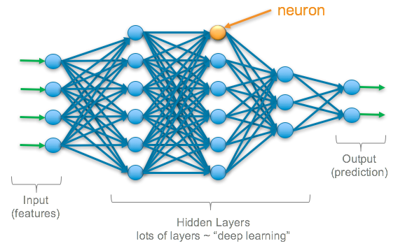

## Table of Contents

## What is a neuron in the context of machine learning?

In machine learning, a neuron is a basic building block of neural networks, which are a type of model inspired by the human brain. A neuron takes in multiple inputs, processes them, and produces an output. Think of it like a tiny decision-maker that helps the neural network learn and make predictions. Each input to a neuron is multiplied by a weight, which determines how important that input is. The weighted inputs are then summed up and passed through an activation function, which decides whether the neuron should "fire" or not.

The activation function is crucial because it introduces non-linearity into the model, allowing the neural network to learn complex patterns. Common activation functions include the sigmoid, ReLU (Rectified Linear Unit), and tanh. For example, the ReLU function can be written as $$ \text{ReLU}(x) = \max(0, x) $$. This function returns the input if it's positive, and zero otherwise. By combining many neurons in layers, neural networks can learn to recognize images, understand speech, and even generate text, making them powerful tools in machine learning.

## How does a neuron in a neural network process information?

A neuron in a neural network takes in information from other neurons or directly from the input data. Each piece of information, or input, is multiplied by a number called a weight. These weights help the neuron decide how important each input is. After multiplying all the inputs by their weights, the neuron adds them all together. This sum is then passed through a special function called an activation function. The activation function decides if the neuron should send out a signal or not. If the sum is high enough, the neuron "fires" and sends its output to the next layer of neurons.

The activation function is really important because it helps the neural network learn complex things. A common activation function is the ReLU, which stands for Rectified Linear Unit. The ReLU function can be written as $$ \text{ReLU}(x) = \max(0, x) $$. This means if the sum is positive, the neuron sends out that positive value. If the sum is zero or negative, the neuron sends out zero. By using many neurons connected in layers, the neural network can learn to recognize patterns in data, like images or sounds, and make predictions or decisions based on what it has learned.

## What is the role of weights and biases in a neuron?

Weights and biases help a neuron in a neural network decide what to do with the information it gets. Think of weights as knobs that can be turned to make some information more important than others. When a neuron gets inputs, it multiplies each input by its weight. This means if a weight is big, that input will have a bigger effect on what the neuron does. If a weight is small or negative, that input won't matter as much. So, weights help the neuron focus on the most important pieces of information.

Biases are like a starting point for the neuron. Even if all the inputs are zero, the bias can make the neuron send out a signal. The bias is added to the sum of the weighted inputs before the sum goes through the activation function. For example, if the sum of the weighted inputs is $$ \sum (w_i \cdot x_i) $$, the bias $$ b $$ is added to get $$ \sum (w_i \cdot x_i) + b $$. This way, the bias can help the neuron decide to fire even if the inputs alone wouldn't be enough. Together, weights and biases let the neuron learn and make better decisions over time.

## How is the activation function used in a neuron?

The activation function in a neuron decides if it should send out a signal or not. It takes the sum of all the inputs multiplied by their weights, plus the bias, and uses this to figure out the neuron's output. Think of it like a gatekeeper that only lets the neuron send out a signal if the sum is important enough. If the sum is too low, the activation function might return zero, meaning the neuron doesn't fire. But if the sum is high enough, the activation function lets the neuron send out a signal, which can be the sum itself or some other value.

A common activation function is the ReLU, which stands for Rectified Linear Unit. The ReLU function can be written as $$ \text{ReLU}(x) = \max(0, x) $$. This means if the sum is positive, the neuron sends out that positive value. If the sum is zero or negative, the neuron sends out zero. This helps the neural network learn complex patterns because it can turn off neurons that aren't needed and let others focus on important information. By using different activation functions, neural networks can learn to do things like recognize pictures, understand speech, and even create new text.

## What are the common types of activation functions used in neurons?

There are several common types of activation functions used in neurons. One of the most popular is the ReLU, which stands for Rectified Linear Unit. The ReLU function is simple and works well for many types of neural networks. It can be written as $$ \text{ReLU}(x) = \max(0, x) $$. This means if the input is positive, the output is the same as the input. If the input is zero or negative, the output is zero. Another common activation function is the sigmoid function, which looks like an "S" shape. It can be written as $$ \text{sigmoid}(x) = \frac{1}{1 + e^{-x}} $$. The sigmoid function squashes the input into a range between 0 and 1, which is useful for tasks like binary classification.

Another popular activation function is the tanh, which stands for hyperbolic tangent. It's similar to the sigmoid but squashes the input into a range between -1 and 1. The tanh function can be written as $$ \text{tanh}(x) = \frac{e^x - e^{-x}}{e^x + e^{-x}} $$. This function is often used in the hidden layers of a neural network because it can help the network learn faster. Lastly, there's the softmax function, which is often used in the output layer of a neural network for multi-class classification. It turns the outputs into probabilities that add up to 1. The softmax function for an input vector $$ z $$ can be written as $$ \text{softmax}(z_i) = \frac{e^{z_i}}{\sum_{j} e^{z_j}} $$. Each of these activation functions helps the neural network learn and make decisions in different ways.

## Can you explain the concept of a neuron's output in a neural network?

A neuron's output in a neural network is what the neuron sends to the next layer of neurons or to the final output of the network. It's like the neuron's decision based on all the information it received. The neuron takes in inputs, multiplies each input by a weight, adds them all up, and then adds a bias. This sum is then passed through an activation function, which decides if the neuron should send out a signal or not. If the sum is high enough, the neuron "fires" and sends its output to the next layer.

The activation function is crucial because it helps the neuron decide what to do with the sum. A common activation function is the ReLU, which stands for Rectified Linear Unit. The ReLU function can be written as $$ \text{ReLU}(x) = \max(0, x) $$. This means if the sum is positive, the neuron sends out that positive value. If the sum is zero or negative, the neuron sends out zero. By using different activation functions, the neural network can learn to do things like recognize pictures, understand speech, and even create new text.

## How do neurons contribute to the learning process in neural networks?

Neurons in a neural network help the network learn by making small changes to their weights and biases. When the network gets new information, it tries to guess the right answer. If the guess is wrong, the network uses something called backpropagation to figure out how to make the guess better next time. During backpropagation, the network looks at how each neuron's output affected the final guess. Then, it tweaks the weights and biases a little bit to make the guess more accurate. This process happens over and over again, with the network learning from its mistakes each time.

Each neuron's role in learning is important because it helps the network understand different parts of the information it gets. For example, in a network that recognizes pictures, some neurons might learn to spot edges, while others might learn to recognize colors or shapes. As the network keeps learning, these neurons get better at their jobs by adjusting their weights and biases. This way, the whole network can work together to make better guesses and learn more complex patterns. By using many neurons connected in layers, the neural network can learn to do things like recognize pictures, understand speech, and even create new text.

## What is backpropagation and how does it affect individual neurons?

Backpropagation is a way for a neural network to learn from its mistakes. When the network makes a guess and it's wrong, backpropagation helps figure out how to make the guess better next time. It does this by looking at how each neuron's output affected the final guess. Then, it makes small changes to the weights and biases of the neurons to improve the guess. This process keeps happening over and over, with the network learning a bit more each time.

Each neuron in the network gets affected by backpropagation because it helps them adjust their weights and biases. If a neuron's output made the final guess worse, backpropagation might make its weights smaller so that neuron doesn't have as much of an effect next time. If the neuron's output helped make the guess better, backpropagation might make its weights bigger to give that neuron more influence. This way, every neuron in the network learns to do its job better, helping the whole network get smarter.

## How do you initialize the weights of a neuron and why is it important?

When you start training a neural network, you need to set the weights of each neuron to some starting values. This is called weight initialization. A common way to do this is to use random numbers. For example, you might use a normal distribution to pick random numbers for the weights. This can be written as $$ w \sim \mathcal{N}(0, \sigma^2) $$, where $$ w $$ is the weight, and $$ \mathcal{N}(0, \sigma^2) $$ means a normal distribution with a mean of 0 and a variance of $$ \sigma^2 $$. Another way is to use the Xavier or He initialization methods, which are designed to help the network learn better.

Weight initialization is important because it affects how well the neural network can learn. If you start with weights that are all the same or too big, the network might have a hard time learning. It could get stuck or take a long time to find the right answers. By starting with good initial weights, you help the network learn faster and more accurately. This makes the whole training process easier and more effective.

## What are some advanced techniques for optimizing neuron performance?

One advanced technique for optimizing neuron performance is using dropout. Dropout is like a training trick where you randomly turn off some neurons during training. This helps the neural network not to rely too much on any single neuron and makes it learn better overall. Imagine you're training a team, and sometimes you make some players sit out. The rest of the team has to step up and learn to work together better. In dropout, you might turn off a neuron with a certain probability, like $$ p = 0.5 $$. This means each neuron has a 50% chance of being turned off during each training step. By doing this, the network learns to be more robust and performs better on new data.

Another technique is batch normalization. Batch normalization helps the network learn faster by making the inputs to each layer more consistent. It does this by normalizing the inputs to have a mean of zero and a standard deviation of one. This can be written as $$ \hat{x} = \frac{x - \mu_B}{\sqrt{\sigma_B^2 + \epsilon}} $$, where $$ x $$ is the input, $$ \mu_B $$ is the mean of the batch, $$ \sigma_B^2 $$ is the variance of the batch, and $$ \epsilon $$ is a small number to avoid division by zero. After normalizing, batch normalization lets the network scale and shift the normalized values. This helps the network learn better and can make training more stable and faster.

## How do neurons in different layers of a neural network differ in function?

In a neural network, neurons in different layers have different jobs. The first layer, called the input layer, takes in the raw data. Each neuron in this layer gets one piece of the data, like a pixel from an image or a word from a sentence. These neurons don't change the data; they just pass it on to the next layer. The last layer, called the output layer, gives the final answer. For example, if the network is trying to recognize a picture, the output layer might say which object it thinks is in the picture. The neurons in this layer combine all the information from the previous layers to make the final decision.

The layers in between the input and output layers are called hidden layers. Neurons in these layers do the heavy lifting of learning and figuring out patterns. Each neuron in a hidden layer takes in information from the previous layer, does some math with it, and sends out a signal to the next layer. This math involves multiplying the inputs by weights, adding them up, adding a bias, and then passing the result through an activation function like $$ \text{ReLU}(x) = \max(0, x) $$. The neurons in different hidden layers might focus on different things. For example, in a network that recognizes pictures, early hidden layers might learn to spot edges or simple shapes, while later hidden layers might learn to recognize more complex patterns like faces or objects.

## What are the current research trends in neuron design and functionality?

One big trend in neuron design and functionality is making neurons more like the ones in our brains. Scientists are trying to make artificial neurons that can do more than just simple math. They want these neurons to be able to change and learn on their own, just like real brain cells. This is called neuromorphic computing. By making neurons that work more like real ones, researchers hope to build computers that can learn and think in new ways. For example, they might use something called spiking neural networks, where neurons send out quick bursts of signals, just like real brain cells. This could help computers use less energy and solve problems that are hard for regular neural networks.

Another trend is making neurons better at working together. Researchers are looking at how to make the connections between neurons stronger and more flexible. They're using ideas like attention mechanisms, which help neurons focus on the most important information. This is like how you might pay more attention to certain things when you're trying to learn or solve a problem. By making neurons better at working together, neural networks can learn faster and make better decisions. For example, in a network that understands language, neurons might use attention to focus on key words in a sentence, helping the network understand the meaning better.