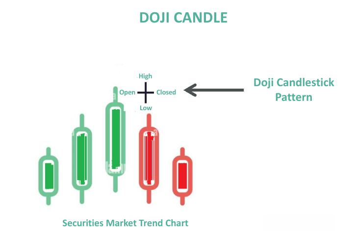

## Table of Contents

## What is a Neutral Doji candlestick pattern?

A Neutral Doji candlestick pattern is a type of candlestick that shows up on a price chart. It happens when the opening and closing prices of a trading period are very close or exactly the same. This makes the candlestick look like a cross or plus sign because it has a small or no body, and it often has a thin line called a wick or shadow on both the top and bottom.

The Neutral Doji tells us that the market is unsure about which way prices will go next. It shows that neither buyers nor sellers were strong enough to push the price in one direction during the trading period. Traders watch for Doji patterns because they can signal that a change in the market trend might be coming, but they need to look at other signs and patterns too before making decisions.

## How can you identify a Neutral Doji on a price chart?

To find a Neutral Doji on a price chart, look for a candlestick that looks like a plus sign or a cross. The key thing about a Neutral Doji is that the opening price and the closing price are very close or exactly the same. This makes the body of the candlestick very small or non-existent. You'll also see a thin line, called a wick or shadow, sticking out from the top and bottom of the cross. These wicks show that the price moved up and down during the trading period but ended up back near where it started.

When you spot a Neutral Doji, it tells you that the market is unsure about what will happen next. It means that neither the buyers nor the sellers were strong enough to move the price much in their favor during that time. This can be a sign that the current trend might be losing steam, and a change could be coming. But remember, a Neutral Doji by itself isn't enough to make a trading decision. You should look at other patterns and signals on the chart too before deciding what to do.

## What does a Neutral Doji indicate about market sentiment?

A Neutral Doji shows that the market is feeling unsure. It happens when the price at the start of the trading time is the same or very close to the price at the end. This makes the candlestick look like a cross or plus sign. When you see this, it means that neither the people who want to buy nor the people who want to sell were strong enough to push the price in one direction. It's like the market is taking a break and thinking about what to do next.

This pattern can be a hint that the way prices have been moving might be about to change. If prices have been going up or down a lot before the Neutral Doji, it could mean that the trend is getting tired. But just seeing a Neutral Doji isn't enough to know for sure what will happen. Traders need to look at other signs on the chart too before making any decisions. It's like a piece of a puzzle that helps them understand the bigger picture of what the market might do next.

## Can you explain the different types of Doji patterns and how the Neutral Doji fits in?

Doji patterns come in different shapes and sizes, but they all show that the opening and closing prices are very close or the same. The main types of Doji patterns are the Neutral Doji, Long-Legged Doji, Dragonfly Doji, and Gravestone Doji. Each type has its own special look and can tell traders something different about what might happen next with the price. The Neutral Doji is one of these types, and it's the simplest one. It looks like a plus sign or a cross with short lines above and below the middle, showing that the market is unsure and might be ready for a change.

The Neutral Doji fits into the family of Doji patterns as the one that shows the most balance between buyers and sellers. It's called "neutral" because it doesn't lean towards a bullish or bearish outlook; it just says the market is in a state of balance. This type of Doji is often seen as a sign that the current trend might be losing strength, but it needs other patterns and signs to confirm this. Other Doji patterns like the Long-Legged Doji, which has longer lines above and below, can show even more uncertainty. The Dragonfly Doji, which looks like a "T" with a long line below, can signal that buyers might be coming back. The Gravestone Doji, looking like an upside-down "T" with a long line above, can suggest that sellers might be taking over. Each type adds a bit more information to help traders understand what the market might do next.

## What are the key differences between a Neutral Doji and other Doji patterns?

The Neutral Doji is different from other Doji patterns because it shows the most balance between buyers and sellers. It looks like a simple plus sign or cross, with short lines above and below the middle. This pattern tells us that the market is unsure and doesn't lean towards prices going up or down. It's called "neutral" because it doesn't give a strong hint about what might happen next. Other Doji patterns, like the Long-Legged Doji, Dragonfly Doji, and Gravestone Doji, have different shapes and can tell us more specific things about what the market might do.

The Long-Legged Doji has longer lines above and below the middle, showing even more uncertainty than the Neutral Doji. It means that prices moved a lot during the trading time but ended up back near where they started. The Dragonfly Doji looks like a "T" with a long line below and a short or no line above. This pattern can be a sign that buyers might be coming back into the market, especially if it shows up after prices have been going down. The Gravestone Doji is the opposite; it looks like an upside-down "T" with a long line above and a short or no line below. This can suggest that sellers might be taking over, especially if it comes after prices have been going up. Each of these Doji patterns adds a bit more information to help traders understand what the market might do next.

## How should traders interpret a Neutral Doji in different market contexts?

A Neutral Doji shows up when the market is unsure about what will happen next. It looks like a plus sign or cross on the chart, with the opening and closing prices very close or the same. In a market where prices have been going up or down a lot, seeing a Neutral Doji can mean that the trend might be getting tired. It's like the market is taking a break to think about what to do next. Traders need to look at other signs on the chart too, because a Neutral Doji by itself doesn't tell the whole story.

In a market that's been going up, a Neutral Doji can be a warning sign that the upward trend might be losing steam. It's a good idea for traders to be careful and maybe think about taking some profits or getting ready for a change in direction. In a market that's been going down, seeing a Neutral Doji might mean the downward trend is slowing down. Traders might start to look for signs that prices could start going up again. No matter what the market is doing, a Neutral Doji tells traders to pay close attention to other patterns and signals before making any big moves.

## What are the potential trading strategies that can be applied when a Neutral Doji appears?

When a Neutral Doji shows up on a price chart, traders might want to take a careful approach. This pattern tells us that the market is unsure about what will happen next, so it's a good time to wait and see what other signs appear. Traders could use this time to look at other patterns and signals on the chart. If the market has been going up or down a lot before the Neutral Doji, it might be a good idea to think about taking some profits or getting ready for a possible change in the trend. The key is to be patient and not rush into making big decisions right away.

Another strategy is to watch for what happens after the Neutral Doji appears. If the next few candles show that prices are starting to move in a new direction, traders can use this information to make their next move. For example, if the market has been going up and a Neutral Doji appears, followed by candles that start going down, it might be a sign to sell or take profits. On the other hand, if the market has been going down and a Neutral Doji is followed by candles that start going up, it could be a sign to buy or hold onto positions. The important thing is to use the Neutral Doji as a part of a bigger picture, combining it with other signals to make smarter trading choices.

## How reliable is a Neutral Doji as a predictor of future price movements?

A Neutral Doji by itself isn't a very strong predictor of future price movements. It just tells us that the market is unsure and taking a break. It's like the market is thinking about what to do next. Because of this, traders shouldn't make big decisions based only on seeing a Neutral Doji. They need to look at other signs and patterns on the chart to get a better idea of what might happen next.

When a Neutral Doji shows up after prices have been going up or down a lot, it can be a hint that the trend might be getting tired. But it's not a sure thing. Traders should wait to see what happens in the next few candles before making a move. If the candles after the Neutral Doji start to move in a new direction, that can give a stronger hint about what the market might do next. So, while a Neutral Doji can be a useful part of the puzzle, it's not a reliable predictor all by itself.

## Can you discuss any historical examples where a Neutral Doji had a significant impact on market trends?

One historical example where a Neutral Doji had a significant impact on market trends was during the stock market in late 2007. Just before the big financial crisis in 2008, a Neutral Doji appeared on the chart of the S&P 500 in October 2007. This Doji showed up after a long period of the market going up, and it was a sign that the upward trend might be getting tired. Traders who saw this pattern and looked at other signs on the chart got ready for a change. Sure enough, the market started to go down after that, and it was the beginning of a big drop that lasted for over a year.

Another example happened in the [forex](/wiki/forex-system) market with the EUR/USD pair in early 2011. After the pair had been going up for a while, a Neutral Doji showed up on the chart in February 2011. This Doji was a hint that the upward trend might be losing steam. Traders who paid attention to this and other signals started to be more careful. Soon after, the EUR/USD started to go down, and it marked the start of a new downward trend that lasted for several months. These examples show how a Neutral Doji, when combined with other signs, can help traders get ready for big changes in the market.

## What are the limitations and risks of relying on a Neutral Doji for trading decisions?

Relying on a Neutral Doji for trading decisions has some big limitations and risks. A Neutral Doji just shows that the market is unsure and taking a break. It doesn't tell us for sure what will happen next. Because of this, if traders make big decisions based only on seeing a Neutral Doji, they might be making a mistake. The market can keep going the same way or change direction, and a Neutral Doji by itself can't predict which one it will be. Traders need to look at other signs and patterns on the chart to get a better idea of what might happen.

Another risk is that traders might act too quickly after seeing a Neutral Doji. They might think it's a sign that the trend is about to change and rush into buying or selling. But if they don't wait to see what happens next, they could end up losing money. The market needs time to show its next move, and traders should be patient. Using a Neutral Doji as just one piece of information, along with other signals, can help traders make smarter choices and avoid big risks.

## How can technical indicators be used in conjunction with a Neutral Doji to improve trading accuracy?

Using technical indicators with a Neutral Doji can help traders make better decisions. A Neutral Doji shows that the market is unsure, but it doesn't tell us what will happen next. By looking at technical indicators like the Relative Strength Index (RSI), Moving Averages, or the MACD, traders can get more clues about the market's direction. For example, if the RSI is showing that the market is overbought or oversold, it can help traders decide if the Neutral Doji means a trend change is coming. These indicators can give extra information that makes the Neutral Doji more useful.

When a Neutral Doji appears after a strong trend, technical indicators can help traders see if the trend is really losing steam. If the Moving Averages start to cross or the MACD shows a change in [momentum](/wiki/momentum), it can support the idea that the Neutral Doji is signaling a possible shift. Traders should use these indicators to confirm what the Neutral Doji is suggesting, rather than relying on the Doji alone. This way, they can make more accurate trading decisions and avoid acting too quickly on just one signal.

## What advanced analysis techniques can traders use to enhance the effectiveness of a Neutral Doji pattern?

Traders can use advanced analysis techniques like [volume](/wiki/volume-trading-strategy) analysis to make a Neutral Doji more useful. When a Neutral Doji shows up, looking at the trading volume can tell traders if the market's uncertainty is strong or weak. If the volume is high, it means more people are unsure about the market, which can be a stronger sign that a trend might change. If the volume is low, the Neutral Doji might not mean as much, and traders should be careful about making big moves based on it. By combining volume analysis with the Neutral Doji, traders can get a better idea of what the market might do next.

Another technique is to use multiple time frame analysis. When traders see a Neutral Doji on a daily chart, they can look at shorter time frames like hourly charts or longer ones like weekly charts to see if the same pattern shows up. If the Neutral Doji appears on different time frames, it can be a stronger signal that the market is really unsure and might be ready for a change. Traders can also use this technique to find the best times to enter or [exit](/wiki/exit-strategy) trades, based on how the Neutral Doji looks on different charts. This can help them make more accurate trading decisions and improve their chances of success.

## How can Neutral Doji be incorporated into algorithmic trading strategies?

Utilizing neutral doji patterns in [algorithmic trading](/wiki/algorithmic-trading) strategies involves the integration of technical indicators to bolster the reliability of trade signals. The combination of doji patterns with indicators such as Bollinger Bands and the Relative Strength Index (RSI) can significantly enhance decision-making processes.

**Bollinger Bands** are a widely used technical indicator that consists of a middle band (simple moving average) and two outer bands set at standard deviations away from the middle band. The formula for Bollinger Bands is given by:

$$
\text{Upper Band} = \text{SMA}(n) + k \times \sigma
$$
$$
\text{Lower Band} = \text{SMA}(n) - k \times \sigma
$$

where $\text{SMA}(n)$ is the n-period simple moving average, $k$ is the number of standard deviations, and $\sigma$ is the standard deviation of the dataset. When a neutral doji appears near these bands, it may indicate enhanced potential for a price reversal, providing traders critical insights alongside the indecision denoted by the doji.

**Relative Strength Index (RSI)** is another powerful tool that helps assess overbought or oversold conditions. The RSI is calculated using the formula:

$$
\text{RSI} = 100 - \left( \frac{100}{1 + \frac{\text{Average Gain}}{\text{Average Loss}}} \right)
$$

In algorithmic trading, the presence of a neutral doji near extreme RSI values—say, above 70 for overbought or below 30 for oversold—can provide a more reliable signal of potential reversals.

Algorithmic strategies can automate the detection of neutral doji patterns and integrate these indicators for optimized execution. Python, a versatile programming language, is well-suited for developing such strategies. Here is an example of how a simplified algorithm might be structured to identify neutral doji patterns with Bollinger Bands:

```python
import pandas as pd
import talib

def identify_doji_with_bollinger(data):
    data['SMA'] = talib.SMA(data['Close'], timeperiod=20)
    data['Upper Band'], data['Middle Band'], data['Lower Band'] = talib.BBANDS(data['Close'], matype=0)
    # Identify doji patterns
    data['Doji'] = (abs(data['Open'] - data['Close']) <= (data['High'] - data['Low']) * 0.1)

    # Apply the strategy
    potential_reversal = data[(data['Doji']) & 
                              ((data['Close'] >= data['Upper Band']) | 
                               (data['Close'] <= data['Lower Band']))]
    return potential_reversal

# Assuming 'data' is a pandas DataFrame with columns ['Open', 'High', 'Low', 'Close']
potential_reversal_signals = identify_doji_with_bollinger(data)
```

This script identifies doji patterns and checks their proximity to Bollinger Bands, flagging potential reversal points for further evaluation by traders. By leveraging the computational efficiency of automated trading systems, traders can swiftly adapt to changing market dynamics, enhancing the precision and timeliness of their trades.

## References & Further Reading

[1]: Bergstra, J., Bardenet, R., Bengio, Y., & Kégl, B. (2011). ["Algorithms for Hyper-Parameter Optimization."](https://papers.nips.cc/paper/4443-algorithms-for-hyper-parameter-optimization) Advances in Neural Information Processing Systems 24.

[2]: ["Advances in Financial Machine Learning"](https://www.amazon.com/Advances-Financial-Machine-Learning-Marcos/dp/1119482089) by Marcos Lopez de Prado

[3]: ["Evidence-Based Technical Analysis: Applying the Scientific Method and Statistical Inference to Trading Signals"](https://www.amazon.com/Evidence-Based-Technical-Analysis-Scientific-Statistical/dp/0470008741) by David Aronson

[4]: ["Machine Learning for Algorithmic Trading"](https://github.com/stefan-jansen/machine-learning-for-trading) by Stefan Jansen

[5]: ["Quantitative Trading: How to Build Your Own Algorithmic Trading Business"](https://books.google.com/books/about/Quantitative_Trading.html?id=j70yEAAAQBAJ) by Ernest P. Chan