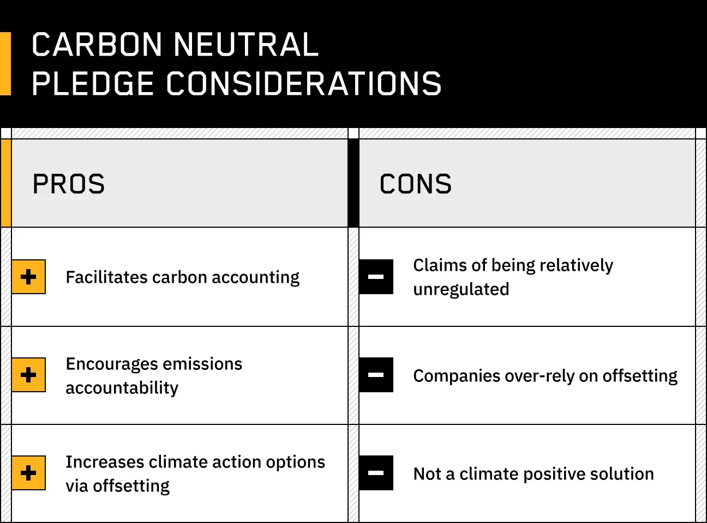

Algorithmic trading, often referred to as algo trading, has significantly revolutionized financial markets. It leverages computer algorithms to execute trades at speeds and frequencies that are impossible for human traders. This advancement has enabled the exploitation of transient market inefficiencies that arise momentarily, providing opportunities for enhanced returns. 

The focus of this article is on neutrality strategies within the domain of algo trading, with a particular emphasis on market-neutral strategies. These strategies are designed to generate profits irrespective of the overall market direction, making them highly attractive to investors who aim to manage and, ideally, reduce market risks. By constructing a portfolio that offsets long positions with short ones, market-neutral strategies seek to balance exposure to market movements, aiming to capitalize on relative value differences rather than broad market trends.



In the subsequent sections, we will explore the advantages and disadvantages associated with these strategies. This exploration will extend to practical applications in algorithmic trading, illustrating how such strategies can be implemented effectively and the complexities involved therein. The objective is to provide a comprehensive insight into market-neutral strategies, helping investors and traders understand their potential within the context of algorithmic trading.

## Table of Contents

## Understanding Algo Trading and Neutrality

Algorithmic trading, commonly known as algo trading, involves the use of computer algorithms to execute trading orders with minimal human intervention. These algorithms are built on pre-defined rules that can incorporate timing, price, and quantity, allowing for rapid and precise execution of trades. The primary objective of algo trading is to leverage computational efficiency to minimize human error and improve the effectiveness of trading strategies.

Neutrality in trading refers to maintaining positions that are insulated from the directional movements of the market. This concept is central to market-neutral strategies, which seek to achieve returns that are independent of market direction. By focusing on relative price movements between selected securities, these strategies aim to mitigate exposure to systematic risks such as market volatility.

Neutral strategies are particularly appealing in stable or sideways market conditions. In these environments, absolute price trends may be less pronounced, making it difficult to generate profits through traditional directional trading. By contrast, neutral strategies can capitalize on relative price movements, exploiting transient market inefficiencies and maintaining a balanced portfolio that is less susceptible to market-wide fluctuations.

### Python Example: Simple Market-Neutral Strategy

Consider a simple pairs trading strategy, which is a type of market-neutral strategy:

```python
import numpy as np
import pandas as pd
import statsmodels.api as sm

# Fetch historical price data
# Here, we assume 'stock1' and 'stock2' are pandas DataFrames with columns ['Date', 'Price']

# Calculate log returns
stock1['log_return'] = np.log(stock1['Price'] / stock1['Price'].shift(1))
stock2['log_return'] = np.log(stock2['Price'] / stock2['Price'].shift(1))

# Regress returns of one stock against the other
X = sm.add_constant(stock1['log_return'].dropna())
model = sm.OLS(stock2['log_return'].dropna(), X).fit()

# Calculate the spread
spread = stock2['log_return'] - model.params[1] * stock1['log_return']
spread_mean = np.mean(spread)
spread_std = np.std(spread)

# Implement a simple trading signal
signal = (spread - spread_mean) / spread_std

# Generate trading orders
stock1['position'] = -np.sign(signal)
stock2['position'] = np.sign(signal)

# Positions will be long (1), short (-1), or flat (0) depending on the z-score
```

This example highlights how a basic market-neutral strategy can be implemented using statistical techniques to identify and act on relative price movements between two correlated stocks. The algorithm calculates the spread, determines trading signals based on the spread's deviation from its mean, and generates positions accordingly. Such techniques enable market participants to potentially achieve profitability even when broader market trends are not favorable.

## Types of Neutrality Strategies

Algorithmic trading leverages various types of neutrality strategies to minimize exposure to market risks while aiming for profit. One prevalent approach is the market-neutral strategy, which seeks to balance long and short positions to mitigate systematic risks inherent in the market. By holding a combination of long and short positions, the strategy effectively cancels out the effects of broader market movements, allowing traders to isolate gains from specific security selection.

Pairs trading is another widely used market-neutral strategy. It involves trading two correlated securities, typically stocks, where one is held long and the other short. The idea is that the two securities will eventually revert to a historical price relationship, allowing the trader to profit from the spread without relying on the overall market direction. For instance, if two stocks A and B have a high correlation, but A is currently overperforming relative to B, a trader might short A and go long on B. Should the prices realign, the gains from B will offset the losses from A, or vice versa.

Delta-neutral strategies utilize options to create a position where the portfolio's overall delta – the sensitivity of an option's price to changes in the underlying asset's price – is zero. This is achieved by balancing the quantity of options with the number of underlying assets, such that their price movements offset each other. Delta neutrality is instrumental in options trading to hedge against small price movements in the underlying asset. Traders regularly adjust their positions to maintain this neutrality as market conditions change.

Dispersion trading is a more complex strategy that involves trading the implied [volatility](/wiki/volatility-trading-strategies) of index options against the implied volatility of the individual options that make up the index. This strategy bets on the relative [dispersion](/wiki/dispersion-trading), or the difference in volatility between the index and its components. By simultaneously holding offsetting positions in the individual components and the index, traders can profit from the divergence in their volatilities.

Each of these strategies leverages statistical and mathematical models, often executed through algorithmic means, to exploit perceived inefficiencies or correlations in the market, minimizing systemic exposure while capitalizing on specific trading opportunities.

## Advantages of Neutrality Strategies

Neutral strategies in [algorithmic trading](/wiki/algorithmic-trading) offer several advantages that make them appealing to investors. One key benefit is their ability to reduce exposure to market volatility, thereby providing more consistent and stable returns. By constructing portfolios that are not dependent on the overall direction of the market, these strategies offer a buffer against the inherent unpredictability of financial markets.

A notable feature of neutrality strategies is their focus on capitalizing on relative price movements rather than relying solely on absolute price trends. This attribute enables them to generate profits from the relative performance of different assets or securities. For example, a pairs trading strategy, a form of market-neutral strategy, can involve buying an undervalued security while simultaneously selling an overvalued counterpart, thus profiting from the correction of pricing discrepancies between the two without being affected by broader market trends.

Moreover, with proper implementation, neutrality strategies can exploit specific market inefficiencies. These inefficiencies may arise from factors such as mispricings, temporary supply-demand imbalances, or discrepancies in market information dissemination. By utilizing sophisticated models and algorithms, traders can identify and act on these inefficiencies, potentially yielding gains that are not available through conventional directional trading strategies.

Furthermore, algorithmic execution ensures precision and speed, essential for exploiting fleeting market opportunities. The use of advanced technology and data analytics allows for continuous market monitoring and enables the rapid adjustment of trading positions, thereby maintaining neutrality over time. This capability is crucial for adapting to fast-changing market conditions and preserving the intended risk and return profile of the strategy.

## Disadvantages of Neutrality Strategies

Neutrality strategies in algorithmic trading, while offering potential benefits, also present a range of challenges and drawbacks. One primary issue is the complexity inherent in these strategies. Implementing them effectively demands a high level of expertise in quantitative finance and advanced computational resources. Designing algorithms that can effectively maintain neutrality requires not only robust statistical models but also sophisticated programming skills. The necessity for continuous adjustment and optimization of these strategies necessitates considerable computational power, especially in high-frequency trading environments where trades must be executed within fractions of a second.

Frequent trading activity to maintain market neutrality results in high transaction costs. Every trade incurs costs such as brokerage fees, and when trades are executed constantly, these costs can accumulate quickly, reducing overall profitability. For instance, consider a market-neutral strategy which involves buying stock A and shorting stock B to capitalize on their price divergence. Frequent rebalancing to maintain the neutral position as market conditions evolve could significantly erode profits through transaction fees.

Additionally, neutrality strategies are not impervious to risks. They can be susceptible to model errors if the assumptions underpinning the strategy prove incorrect. For example, a pairs trading strategy assumes a stable historical correlation between two assets. If this correlation breaks down due to changes in market conditions or unforeseen events, the strategy may incur substantial losses. Furthermore, these strategies are vulnerable to unexpected market events, such as flash crashes or sudden regulatory changes, which can lead to significant mispricing or [liquidity](/wiki/liquidity-risk-premium) issues.

Ultimately, while neutrality strategies provide the promise of consistent returns free from the broader market direction, their implementation must be approached with caution. Adequate resources, thorough [backtesting](/wiki/backtesting), and ongoing risk management are essential to mitigate the potential downsides associated with these intricate trading paradigms.

## Implementing Neutral Strategies in Algo Trading

Implementing neutral strategies in algorithmic trading requires a detailed approach that combines advanced statistical models with robust backtesting mechanisms to ensure strategy viability. Backtesting assesses how a strategy would have performed using historical data, providing insights into its expected performance and highlighting potential risks. This process relies heavily on statistical techniques to accurately model and forecast market behavior. These models often employ various statistical methods, such as regression analysis or [machine learning](/wiki/machine-learning) algorithms, to predict price movements and identify profitable opportunities.

Machine learning, specifically, has become a powerful tool in enhancing the identification and execution of trades within market-neutral strategies. Techniques like supervised learning can be used to train models on historical trades, learning patterns that might indicate successful trading signals. Additionally, [reinforcement learning](/wiki/reinforcement-learning) can adaptively optimize trading strategies in real-time by learning from continuous market feedback. For example, a reinforcement learning algorithm might adjust the ratio of long to short positions dynamically to optimize returns while maintaining a market-neutral stance.

Quantitative techniques extend beyond machine learning, incorporating mathematical optimization to fine-tune portfolio allocations. The optimization process often involves defining a loss function that penalizes deviations from neutrality or expected return thresholds, which is then minimized using algorithms like gradient descent or genetic algorithms.

In Python, implementing such strategies might involve libraries like NumPy and pandas for data handling, scikit-learn for machine learning, and frameworks like PyTorch for [deep learning](/wiki/deep-learning) models. Below is a basic Python snippet illustrating a machine learning model applied to a neutral strategy:

```python
import pandas as pd
from sklearn.model_selection import train_test_split
from sklearn.ensemble import RandomForestRegressor
from sklearn.metrics import mean_squared_error

# Load dataset
data = pd.read_csv('market_data.csv')

# Preprocess and split data
X = data.drop(columns=['target'])
y = data['target']
X_train, X_test, y_train, y_test = train_test_split(X, y, test_size=0.2, random_state=42)

# Define and train model
model = RandomForestRegressor(n_estimators=100)
model.fit(X_train, y_train)

# Predictions and evaluation
predictions = model.predict(X_test)
mse = mean_squared_error(y_test, predictions)
print(f'Mean Squared Error: {mse}')
```

Continuous monitoring and adjustments are indispensable for maintaining a market-neutral position. Markets are inherently dynamic, so strategies must evolve in response to shifting conditions. This involves recalibrating models to account for new data, reassessing model assumptions, and adjusting to unexpected market events. Tools like real-time data feeds and automated trading platforms facilitate these processes, enabling traders to act swiftly to maintain neutrality.

In conclusion, implementing neutral strategies in algo trading demands an integration of sophisticated statistical modeling, machine learning, and continuous strategy adjustment. These elements combined allow traders to respond effectively to market volatility and sustain the predefined neutrality that characterizes market-neutral strategies.

## Conclusion

Neutrality strategies in algorithmic trading serve as effective tools for navigating volatile markets by balancing long and short positions. These strategies are designed to extract profits from market inefficiencies, allowing for gains irrespective of the broader market trends. They effectively mitigate systematic risks, providing investors with an opportunity to achieve returns that are independent of market directions.

Although neutrality strategies offer distinct advantages, their implementation demands careful consideration due to their inherent complexity and associated costs. Successful deployment requires significant computational resources and specialized expertise to develop, maintain, and adjust strategies in response to evolving market dynamics. As a result, these strategies necessitate a comprehensive understanding of quantitative models and the capability to adapt swiftly to market changes—a challenging yet rewarding endeavor.

Selecting the appropriate neutrality strategy requires careful alignment with an investor's risk tolerance, market outlook, and the technological infrastructure at their disposal. Investors must assess their capability to withstand the intricate demands of strategy maintenance while ensuring they possess the necessary analytical tools to identify and capitalize on transient market opportunities. Ultimately, the decision to pursue market-neutral strategies should be grounded in a holistic evaluation of these factors, ensuring that the adopted approach complements both the investor's financial objectives and available resources.

## References & Further Reading

[1]: ["Algorithmic and High-Frequency Trading"](https://assets.cambridge.org/97811070/91146/frontmatter/9781107091146_frontmatter.pdf) by Álvaro Cartea, Sebastian Jaimungal, and José Penalva

[2]: Bergstra, J., Bardenet, R., Bengio, Y., & Kégl, B. (2011). ["Algorithms for Hyper-Parameter Optimization."](https://dl.acm.org/doi/10.5555/2986459.2986743) Advances in Neural Information Processing Systems 24.

[3]: ["Advances in Financial Machine Learning"](https://www.amazon.com/Advances-Financial-Machine-Learning-Marcos/dp/1119482089) by Marcos Lopez de Prado

[4]: Ferguson, R., et al. (2017). ["Machine Learning and Asset Management: The Decision Tree Alternative."](https://www.researchgate.net/publication/317473314_Gregory_A_Fergus_E_2017_Social-Emotional_Learning_and_Equity_in_School_Discipline_In_S_M_Jones_E_Doolittle_S_McLanahan_Eds_The_Future_of_Children_27_special_issue_on_Social-Emotional_Learning_117-136) Financial Analysts Journal.

[5]: Pardo, R. (2008). ["The Evaluation and Optimization of Trading Strategies"](https://onlinelibrary.wiley.com/doi/book/10.1002/9781119196969) by Robert Pardo

[6]: ["Machine Learning for Algorithmic Trading"](https://github.com/stefan-jansen/machine-learning-for-trading) by Stefan Jansen

[7]: ["Quantitative Trading: How to Build Your Own Algorithmic Trading Business"](https://www.amazon.com/Quantitative-Trading-Build-Algorithmic-Business/dp/1119800064) by Ernest P. Chan