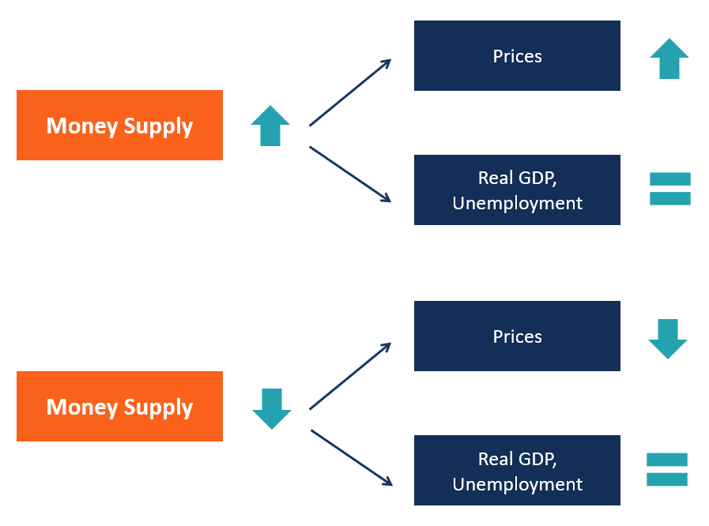

## Table of Contents

## What is the Neutrality of Money Theory?

The Neutrality of Money Theory is an economic idea that says changes in the amount of money in an economy don't affect real economic factors like output, employment, or real interest rates in the long run. Instead, it only changes the general price level. This means that if the government prints more money, prices will go up, but the actual goods and services produced won't change.

This theory is based on the idea that money is just a tool used for buying and selling things. It doesn't directly create more goods or make people work more. In the long run, the economy will find a new balance where the extra money just means higher prices, but everything else stays the same. Economists often use this theory to understand how money supply affects the economy over time.

## Who first proposed the Neutrality of Money Theory?

The Neutrality of Money Theory was first proposed by the classical economists, with David Hume being one of the earliest to discuss it in the 18th century. Hume wrote about how an increase in the money supply would eventually just lead to higher prices, without changing the real output of the economy. He used the example of gold discoveries to explain how more money would circulate, but the economy would adjust so that the only lasting effect would be inflation.

Later, this idea was developed further by economists like Irving Fisher in the early 20th century. Fisher's work on the quantity theory of money helped to formalize the concept of money neutrality. He argued that changes in the money supply would only affect nominal variables, like prices, and not real variables, like employment or production. This laid the groundwork for the theory to become a key part of classical and neoclassical economic thought.

## How does the Neutrality of Money Theory relate to classical economics?

The Neutrality of Money Theory is a big part of classical economics. Classical economists believe that the economy works best when it's left alone, without too much government help. They think that money is just a tool we use to buy things, and it doesn't really change how much stuff we make or how many people have jobs. According to this theory, if the government prints more money, all that happens is that prices go up. The real economy, like how many cars are made or how many people are working, stays the same.

This idea fits well with the classical view that markets will balance themselves out over time. If there's more money, people will spend more, but businesses will just raise their prices to match. In the end, everything goes back to normal, but with higher prices. This is why classical economists focus on things like how much stuff is made and how many people are working, rather than worrying about how much money is in the economy. They think that in the long run, money doesn't really matter for the real economy.

## What is the difference between short-run and long-run neutrality of money?

The short-run neutrality of money says that changes in the money supply can affect real economic things like how much stuff is made or how many people have jobs right away. If the government prints more money, people might spend more, and this can make businesses produce more and hire more workers. So, in the short run, more money can make the economy grow faster or slow down, depending on how it's used.

But, the long-run neutrality of money says that over time, changes in the money supply only affect prices, not the real stuff in the economy. After a while, if there's more money, businesses will just raise their prices to match. The amount of stuff made and the number of people working will go back to what they were before. So, in the long run, more money just means higher prices, but the real economy stays the same.

## Can you explain the concept of money neutrality with an example?

Imagine a small town where everyone uses gold coins to buy things. One day, a big treasure of gold is found nearby, and suddenly everyone has a lot more gold coins. At first, people start spending more because they feel richer. Shops see more customers and might hire more workers or make more goods to meet the demand. So, in the short run, the town's economy grows because of the extra gold.

But over time, something changes. Shop owners start to notice that everyone has more gold, so they raise their prices. A loaf of bread that used to cost one gold coin now costs two. As prices go up, people realize they're not actually richer; they just need more gold to buy the same things. Eventually, the shops go back to their normal number of workers and goods because people aren't buying more than before, just paying more for it. In the long run, the extra gold only made prices higher, but the town's economy is the same as it was before the treasure was found.

## How does the Neutrality of Money Theory affect inflation?

The Neutrality of Money Theory says that when the amount of money in an economy goes up, it doesn't change how much stuff is made or how many people have jobs in the long run. Instead, it just makes prices go up. This means that if the government prints more money, the only thing that changes is that everything costs more. People might feel richer at first because they have more money, but soon they'll see that they need more money to buy the same things.

This theory helps explain why inflation happens. Inflation is when prices go up over time. According to the Neutrality of Money Theory, if there's more money around, businesses will raise their prices because they know people have more money to spend. In the end, the extra money just makes everything more expensive, but the real economy stays the same. So, the theory shows that inflation is mostly about changes in the money supply, not about changes in how much stuff is made or how many people are working.

## What are the criticisms of the Neutrality of Money Theory?

Some people think the Neutrality of Money Theory doesn't always work in real life. They say that money can affect things like how much stuff is made and how many people have jobs, not just prices. For example, if the government prints more money and gives it to people, they might spend more and help the economy grow. This can lead to more jobs and more things being made, at least for a while. So, critics argue that money isn't always neutral, especially in the short run.

Another problem with the theory is that it assumes that prices can change quickly and easily. In reality, changing prices can be hard for businesses. They might not raise prices right away when there's more money around. This means that the extra money can affect the real economy for longer than the theory says. Also, some people think that money can change how people feel about the future. If they think prices will keep going up, they might spend more now, which can make the economy grow or shrink in ways the theory doesn't predict.

## How does the Neutrality of Money Theory interact with monetary policy?

The Neutrality of Money Theory says that changing how much money is in the economy doesn't change how much stuff is made or how many people have jobs in the long run. It only changes prices. This means that if the government uses monetary policy to print more money or change interest rates, the only big change they'll see over time is that everything costs more. So, according to this theory, monetary policy can't really help the real economy grow in the long run; it just makes things more expensive.

But in the short run, things can be different. If the government prints more money and gives it to people, they might spend more right away. This can make businesses produce more and hire more workers. So, some people think that monetary policy can help the economy in the short run, even if the Neutrality of Money Theory says it won't matter in the long run. This is why central banks often use monetary policy to try to help the economy grow or slow down inflation, even if the long-term effects might just be higher prices.

## What empirical evidence supports or contradicts the Neutrality of Money Theory?

Some studies have found evidence that supports the Neutrality of Money Theory. For example, when looking at long periods of time, like decades, researchers have seen that changes in the money supply mostly affect prices, not how much stuff is made or how many people have jobs. This fits with the idea that money is neutral in the long run. Also, when countries have had big changes in their money supply, like after finding new gold or during times of high inflation, the main thing that changed was the price level, not the real economy.

But other studies have found evidence that contradicts the theory. In the short run, changes in the money supply can affect how much stuff is made and how many people have jobs. For example, when the government prints more money and gives it to people, they might spend more right away, which can help the economy grow for a while. Also, some research has shown that money can affect how people feel about the future, which can change their spending and saving habits. This means that money might not be neutral, at least not in the short run.

## How do different schools of economic thought view the Neutrality of Money Theory?

Classical and neoclassical economists really like the Neutrality of Money Theory. They think that money is just a tool for buying and selling things, and it doesn't change how much stuff is made or how many people have jobs in the long run. They believe that if the government prints more money, prices will go up, but the real economy will stay the same. This fits with their idea that markets will balance themselves out over time, and that the government shouldn't try to control the economy too much.

But Keynesian economists don't agree with the Neutrality of Money Theory. They think that money can affect the real economy, especially in the short run. If the government prints more money and gives it to people, they might spend more, which can help the economy grow and create more jobs. Keynesians believe that the government should use monetary policy to help the economy, even if it might just make prices go up in the long run. They think that money isn't neutral and can make a big difference in how the economy works.

## What are the implications of the Neutrality of Money Theory for economic modeling?

The Neutrality of Money Theory means that when economists make models of the economy, they should focus on how much stuff is made and how many people have jobs, not on how much money is in the economy. This theory says that in the long run, more money just makes prices go up, but it doesn't change the real economy. So, when building economic models, classical and neoclassical economists think it's more important to look at things like how many cars are made or how many people are working, rather than how much money people have.

But, the theory also means that models need to think about the short run differently. In the short run, more money can make people spend more, which can help the economy grow and create more jobs. So, models that try to explain what happens in the short run might need to include how changes in the money supply can affect the real economy. This is important for economists who want to understand how things like interest rates or printing more money can help or hurt the economy in the short term.

## How has the Neutrality of Money Theory evolved over time in economic literature?

The Neutrality of Money Theory started a long time ago with classical economists like David Hume. Hume said that if more gold was found, it would just make prices go up, but it wouldn't change how much stuff people made or how many people had jobs. Later, economists like Irving Fisher made the theory more detailed. Fisher said that changes in the money supply would only affect prices, not the real economy. This idea became a big part of classical and neoclassical economics, which says that markets will balance out over time and that the government shouldn't try to control the economy too much.

But as time went on, other economists started to question the Neutrality of Money Theory. Keynesian economists, like John Maynard Keynes, said that money can affect the real economy, especially in the short run. They thought that if the government printed more money and gave it to people, it could help the economy grow and create more jobs. This led to a lot of debate about whether money is really neutral. Some studies found that in the long run, money does seem to only affect prices, but in the short run, it can make a big difference in how the economy works. So, the theory has evolved to include the idea that money might not be neutral in the short run, even if it is in the long run.

## What is Understanding Monetary Theory?

Monetary theory is a cornerstone of macroeconomics, focusing on the role of money in the economy. It examines the functions of money, which include serving as a medium of exchange, a unit of account, and a store of value. These functions are critical for facilitating economic activities and reducing transaction costs. Money supply, which represents the total amount of monetary assets available in an economy at a specific time, is another central concept in monetary theory. A country's central bank manages the money supply, and its control is a crucial aspect of economic policy. 

Central banks utilize monetary policy as a mechanism to influence economic conditions, primarily through activities that adjust the money supply and interest rates. For instance, by lowering interest rates, a central bank can encourage borrowing and investment, thereby stimulating economic growth. Conversely, increasing interest rates can help control inflation by reducing spending. Tools such as open market operations, setting reserve requirements, and adjusting the discount rate are part of the central bank’s toolkit for implementing monetary policy.

Monetary theory can be broadly classified into classical and Keynesian perspectives, each with distinct views on how money affects the economy. The classical theory, rooted in the Quantity Theory of Money, asserts that changes in the money supply only affect price levels in the long run but do not influence real economic variables like output or employment. This view is encapsulated in the equation of exchange: 

$$
MV = PY
$$

where $M$ is the money supply, $V$ is the velocity of money, $P$ is the price level, and $Y$ is the real output. According to classical theorists, changes in $M$ will lead to proportional changes in $P$ when $V$ and $Y$ are constant.

In contrast, Keynesian monetary theory posits that money can have significant short- and long-term impacts on the economy. Keynesians argue that changes in the money supply can affect output and employment through their influence on interest rates and aggregate demand. This perspective emphasizes the role of monetary policy in managing economic fluctuations and addressing issues like unemployment and recession.

Both schools of thought contribute to a comprehensive understanding of monetary theory, providing insights into how variations in money supply and policy actions can impact economic stability and growth. Understanding these fundamental concepts is essential for analyzing modern financial systems and developing effective economic policies.

## References & Further Reading

[1]: Friedman, M. (1968). ["The Role of Monetary Policy"](https://www.aeaweb.org/aer/top20/58.1.1-17.pdf). The American Economic Review, 58(1), 1-17.

[2]: Lucas, R. E. Jr. (1972). ["Expectations and the Neutrality of Money."](https://www.sciencedirect.com/science/article/pii/0022053172901421) Journal of Economic Theory, 4(2), 103-124.

[3]: Keynes, J. M. (1936). ["The General Theory of Employment, Interest, and Money."](https://link.springer.com/book/10.1007/978-3-319-70344-2) Palgrave Macmillan.

[4]: Malmendier, U., & Nagel, S. (2016). ["Learning from Inflation Experiences."](https://academic.oup.com/qje/article-abstract/131/1/53/2461168) The Quarterly Journal of Economics, 131(1), 53–87.

[5]: Murphy, C. (2014). ["Algorithmic Trading and Its Impact on Financial Markets."](https://www.academia.edu/97573395/Moores_Law_versus_Murphys_Law_Algorithmic_Trading_and_Its_Discontents) Review of Business and Economics Studies, 6(2), 36-48.