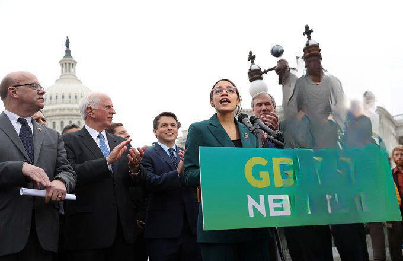

The New Deal was a transformative series of political and economic reforms initiated by President Franklin D. Roosevelt in response to the catastrophic effects of the Great Depression. Spanning from 1933 to 1939, these reforms aimed to stabilize a faltering U.S. economy, provide jobs, and implement a more robust financial system. The New Deal's multifaceted approach consisted of relief for the unemployed and poor, recovery of the economy to normal levels, and reform of the financial system to prevent a repeated economic downturn. 

Roosevelt's policies introduced significant initiatives such as the Civilian Conservation Corps (CCC), the Social Security Act, and the establishment of regulatory bodies like the Securities and Exchange Commission (SEC). These measures not only provided immediate relief and employment but also sought long-term economic stability through structural reforms. By addressing weaknesses in the banking systems and labor markets, the New Deal aimed to renew public confidence and lay foundations for sustainable growth.



In examining these historical economic frameworks, one can observe the parallels to modern financial methodologies like algorithmic trading. While the New Deal emphasized direct governmental intervention and regulation, today's financial systems leverage technology and data analytics to create efficiencies and manage risks. Algorithmic trading, which utilizes complex algorithms to execute orders at speeds and efficiencies unimaginable during the 1930s, represents an evolution in market operations that still aligns with the New Deal's pursuit of stability and efficiency. By understanding both historical and modern economic practices, we gain insights into their impact and relevance in shaping governmental and financial systems. This exploration underscores the significance of the New Deal in laying the groundwork for modern economic policies and financial innovations.

## Table of Contents

## The New Deal: An Overview

The New Deal, implemented under President Franklin D. Roosevelt, was a comprehensive series of programs and reforms with the primary goal of stabilizing the American economy during the Great Depression. It addressed key issues such as unemployment, economic stagnation, and societal inequities. At its core, the New Deal sought to provide immediate economic relief, spur recovery, and enact reforms to prevent future depressions.

Key programs under the New Deal included the Civilian Conservation Corps (CCC), the Works Progress Administration (WPA), and the Social Security Act, each of which played a significant role in reshaping American society. The CCC was instrumental in providing jobs for young men, focusing primarily on conservation and development of natural resources on government lands. Similarly, the WPA was one of the largest agencies, employing millions in public works projects like constructing roads, buildings, and other infrastructure. Meanwhile, the Social Security Act established a system of old-age benefits and unemployment insurance, laying the groundwork for the modern social safety net.

The New Deal was divided into two distinct phases. The First New Deal (1933) concentrated on immediate relief and economic recovery. Measures like the Emergency Banking Relief Act and the Agricultural Adjustment Act were implemented to stabilize the banking sector and assist farmers, respectively. Subsequently, the Second New Deal (1935) introduced more long-term reforms and continued recovery efforts. Landmark legislation during this period included the National Labor Relations Act and the Social Security Act, which sought to improve labor conditions and provide economic security to citizens.

The New Deal fundamentally reshaped the role of the federal government in the United States, expanding its presence in both the economy and in people's daily lives. Prior to the New Deal, federal intervention in economic and social matters was relatively limited. However, Roosevelt's policies underscored the government's responsibility to ensure economic stability and support the welfare of its citizens, setting a precedent for future administrations. This expanded federal role has had lasting implications, influencing subsequent governmental responses to economic crises and helping shape modern economic policy frameworks.

## Economic Principles of the New Deal

The New Deal, introduced by President Franklin D. Roosevelt during the Great Depression, aimed to establish financial stability and introduce regulations to protect the economy from future crises. A cornerstone of these efforts was the Glass-Steagall Act, formally known as the Banking Act of 1933. This legislation was crucial in segregating commercial banking activities from investment banking, thus significantly reducing the risks associated with speculative financial activities. By prohibiting commercial banks from engaging in the investment business, the act aimed to restore public confidence in the banking system, which had been severely shaken by the 1929 stock market crash.

In addition to the Glass-Steagall Act, the establishment of the Securities and Exchange Commission (SEC) in 1934 was another significant achievement of the New Deal. The SEC was created to regulate the stock market and prevent abuses that had previously led to economic downturns. It imposed strict disclosure requirements on publicly traded companies, ensuring transparency and fostering informed decision-making among investors. These measures were designed to curb speculative practices and fraudulent activities, such as insider trading, which had previously contributed to financial instability.

The implementation of these regulations was based on the principle that a well-regulated financial system is essential for economic stability and growth. By enforcing rules that promoted transparency and accountability, the New Deal aimed to create a safer investment environment and prevent the recurrence of economic disasters. The introduction of these regulations marked a significant shift in the relationship between government and the financial sector, as they established a framework for governmental oversight that continues to influence economic policy today.

Overall, the economic principles underlying the New Deal's reforms focused on curbing the reckless speculation that had characterized the pre-Depression era. By instituting these measures, Roosevelt's administration sought to create a more resilient economic structure capable of withstanding future shocks, thereby laying the groundwork for the modern financial regulatory landscape.

## Technological Evolution: From the New Deal to Algorithmic Trading

The evolution of technology in financial markets marks a significant departure from the economic landscape during the New Deal era. Algorithmic trading has emerged as a pivotal development, leveraging advanced computer algorithms to manage and execute market orders with unprecedented efficiency and speed. This transformation stands in stark contrast to the manual and slower processes that were prevalent during the New Deal's initial implementation in the 1930s.

Algorithmic trading employs sophisticated mathematical models and high-frequency trading strategies to capitalize on market opportunities that arise within milliseconds. These algorithms analyze vast datasets in real-time, enabling traders to make informed decisions based on predictive analytics and statistical [arbitrage](/wiki/arbitrage). The deployment of [machine learning](/wiki/machine-learning) techniques and [artificial intelligence](/wiki/ai-artificial-intelligence) further enhances these strategies by improving pattern recognition and refining trading decisions.

In the context of financial markets, [algorithmic trading](/wiki/algorithmic-trading) provides distinct advantages such as reduced transaction costs, elimination of emotional biases, and execution of complex strategies like pairs trading and market-making. The reliance on data-driven decision-making ensures consistency and accuracy, factors that were unattainable in the pre-digital age. Consider an example where a simple moving average crossover strategy is implemented in Python:

```python
import numpy as np
import pandas as pd

def moving_average_strategy(prices, short_window, long_window):
    signals = pd.DataFrame(index=prices.index)
    signals['price'] = prices
    signals['short_mavg'] = prices.rolling(window=short_window, min_periods=1).mean()
    signals['long_mavg'] = prices.rolling(window=long_window, min_periods=1).mean()
    signals['signal'] = 0.0
    signals['signal'][short_window:] = np.where(signals['short_mavg'][short_window:] > signals['long_mavg'][short_window:], 1.0, 0.0)
    signals['positions'] = signals['signal'].diff()
    return signals

# Example usage
prices = pd.Series([...])
strategy_signals = moving_average_strategy(prices, short_window=40, long_window=100)
```

The transformation from the New Deal era to the age of algorithmic trading highlights significant advancements in computer science and data analytics. This evolution has altered traditional trading paradigms, allowing for more complex, faster, and data-intensive financial analyses. This shift underscores the growing intersection between technology and finance, laying the groundwork for continued innovation in market operations. As markets evolve, the ability to harness data science effectively will remain a cornerstone of competitive advantage in trading practices.

## Economic Policies and Their Modern Equivalents

The New Deal era laid the foundation for numerous modern economic and financial policies, establishing a legacy of government intervention during times of economic distress. During the Great Depression, Franklin D. Roosevelt's administration introduced public works programs, banking reforms, and social safety nets. These efforts emphasized government responsibility in stabilizing and invigorating the economy, mirroring contemporary practices employed during economic downturns. 

One critical parallel between New Deal strategies and modern economic policies is the deployment of government stimulus packages aimed at boosting economic activity. For instance, the American Recovery and Reinvestment Act of 2009—enacted in response to the 2008 financial crisis—echoes the objectives of New Deal initiatives like the Works Progress Administration (WPA). Both approaches sought to alleviate unemployment and stimulate economic growth through substantial public investment.

In terms of banking reform, the Glass-Steagall Act of 1933 sought to restore trust in the financial system by separating commercial and investment banking activities. Similarly, the 2010 Dodd-Frank Wall Street Reform and Consumer Protection Act aimed to prevent another financial crisis by imposing stricter regulations on financial institutions. Both legislative measures reflect a governmental commitment to ensuring market integrity and protecting consumers and the wider economy.

Modern economic policies continue to echo New Deal principles by adapting to the complexities of today's financial environment. The introduction of quantitative easing (QE) as an economic intervention, for example, showcases the evolving nature of governmental tools used to influence the economy. Although QE involves central banks purchasing government securities to inject [liquidity](/wiki/liquidity-risk-premium) into the economy, the underlying intent—to stimulate activities and maintain economic stability—aligns closely with New Deal motives.

However, modern economic interventions also differ due to technological advancements and global economic integration. The sophistication of current financial systems, influenced by data analytics and algorithmic trading, presents challenges and opportunities that were not present during the New Deal era. For example, the speed and scale at which financial data can be processed and acted upon today substantially alter the landscape of financial crisis management and intervention compared to the 1930s.

In summary, modern economic policies mirror New Deal principles through their reliance on governmental intervention to mitigate economic crises and implement financial reforms. Yet, they also diverge in response to the complexities introduced by technological advancements and globalization, necessitating adaptive policy measures to maintain economic stability.

## The Legacy of the New Deal in Modern Financial Systems

The New Deal, implemented under the administration of President Franklin D. Roosevelt, left an indelible mark on the American financial landscape, particularly through its creation and reinforcement of social safety nets and regulatory frameworks. One of the most significant legacies of the New Deal is the Social Security Act of 1935. This Act established a system of old-age benefits for workers, victims of industrial accidents, unemployment insurance, aid for dependent mothers and children, the blind, and the physically handicapped. Today, Social Security remains a cornerstone of American social policy, providing financial support to millions of retirees and other eligible individuals. Modern policy measures have built upon the foundation laid by the New Deal, continually adjusting benefits, contribution rates, and qualification criteria in response to changing demographic and economic conditions.

Unemployment insurance, another New Deal initiative, was designed to provide temporary financial assistance to jobless individuals seeking new employment. This program has evolved over decades, adapting to economic cycles and labor market trends. During economic downturns, such as the Great Recession of 2007-2009 and the COVID-19 pandemic, the federal government has often expanded unemployment benefits, echoing the New Deal's approach to economic hardship. For example, the Coronavirus Aid, Relief, and Economic Security (CARES) Act of 2020 included provisions to temporarily increase unemployment benefits and extend eligibility.

The regulatory frameworks introduced during the New Deal, such as the Glass-Steagall Act and the creation of the Securities and Exchange Commission (SEC), set the groundwork for modern financial oversight. The Glass-Steagall Act's separation of commercial and investment banking was a direct response to the speculative practices that led to the 1929 stock market crash. Although key provisions of Glass-Steagall were repealed in 1999, the principles of financial regulation and oversight have continued to evolve. Current regulatory bodies like the SEC maintain and enforce standards aimed at ensuring transparency, reducing systemic risk, and protecting investors. Regulations such as the Dodd-Frank Wall Street Reform and Consumer Protection Act, enacted following the 2008 financial crisis, illustrate the New Deal's ongoing influence by addressing contemporary financial system vulnerabilities.

In conclusion, the New Deal's legacy is evident in today's financial systems through its established social safety nets and regulatory practices. By laying the groundwork for programs and oversight mechanisms, the New Deal has significantly shaped the structure and function of modern economic policies.

## Conclusion

The New Deal was a landmark series of reforms that fundamentally altered the landscape of American economic policy and governance. Its transformational power lies not only in its immediate effects during the Great Depression but also in its enduring legacy that continues to influence American society and the global economy. By implementing comprehensive measures aimed at economic recovery, job creation, and financial reform, the New Deal set a precedent for government intervention during economic crises—a concept that remains relevant today.

In the modern economic and financial landscape, many principles from the New Deal continue to manifest in policy approaches and regulatory frameworks. The creation of social safety nets like Social Security and unemployment insurance during the New Deal established foundational elements of the welfare state that are still critical components of contemporary policy discussions. These initiatives highlight the ongoing importance of governmental roles in providing economic security and stability.

Moreover, the regulatory frameworks established by the New Deal, such as those concerning financial trading and market stability, have evolved but maintain their essence in ensuring economic oversight. The Securities Exchange Commission (SEC), born out of the New Deal reforms, continues to be pivotal in maintaining market transparency and protecting investor interests.

Expanding upon these historical policy decisions could provide valuable insights into modern economic strategies. When examining government responses to more recent economic challenges—such as the 2008 financial crisis or the economic disruptions caused by the COVID-19 pandemic—it becomes evident that echoes of New Deal strategies persist. Stimulus packages and regulatory interventions during such times reveal a sturdy lineage of New Deal-inspired principles meant to stabilize and stimulate economies under duress.

Thus, further study into the connections between these historical and modern approaches not only enriches our understanding of economic policy's evolution but also informs better decision-making for future economic challenges. The New Deal's legacy, with its foundational principles of economic intervention and reform, continues to serve as a guiding light in shaping robust economic policies worldwide.

## References & Further Reading

[1]: Schlesinger, A.M. (2003). ["The Coming of the New Deal."](https://books.google.com/books/about/The_Coming_of_the_New_Deal_1933_1935.html?id=mj3VmJ38tHIC) Houghton Mifflin Harcourt.

[2]: Glass-Steagall Act, Banking Act of 1933. ["Influence on Modern Banking and Financial Systems"](https://www.federalreservehistory.org/essays/glass-steagall-act)

[3]: SEC Historical Society. ["The Creation of the SEC." ](http://sechistorical.org/)

[4]: Wigmore, B.A. (1985). ["The Crash and Its Aftermath: A History of Securities Markets in the United States, 1929-1933"](https://www.jstor.org/stable/2328537) Greenwood.

[5]: Minian, A. (2013). ["New Deal or No Deal: The Great Depression and Its Legacy"](https://oxfordre.com/americanhistory/display/10.1093/acrefore/9780199329175.001.0001/acrefore-9780199329175-e-87) The Journal of Economic History.

[6]: Johnson, L. (2001). ["Modernizing Financial Systems: Analytical Case Studies"](https://www.jstor.org/stable/pdf/2698181.pdf?addFooter=false) International Monetary Fund.

[7]: Weatherford, M. (2009). ["Franklin D. Roosevelt and the Transformation of the Supreme Court"](https://books.google.com/books/about/Franklin_D_Roosevelt_and_the_Transformat.html?id=GYLE8X84bggC) Oxford University Press.