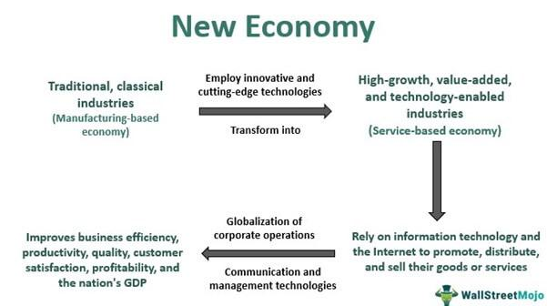

## Table of Contents

## What is the definition of the New Economy?

The New Economy refers to the shift in economic activity that has occurred due to advancements in technology and globalization. It describes a modern economic system where traditional industries like manufacturing are less dominant, and sectors like information technology, telecommunications, and services play a bigger role. This change has been driven by the internet and digital technologies, which have made it easier for businesses to operate globally and for information to spread quickly.

In the New Economy, companies often focus on innovation and intellectual property rather than physical goods. This has led to the rise of tech giants and startups that can grow rapidly with less need for large physical assets. The New Economy also emphasizes flexibility, with more people working remotely and businesses adapting quickly to changes. While this new model brings many opportunities, it also presents challenges such as job displacement in traditional sectors and concerns about data privacy and security.

## How does the New Economy differ from the traditional economy?

The New Economy and the traditional economy differ in many ways. The traditional economy is based on industries like manufacturing, agriculture, and mining. These industries need a lot of physical work and big factories or farms. In the traditional economy, businesses often grow slowly and need big investments in buildings and machines. Jobs in these industries are usually steady and long-term, and the economy moves at a slower pace.

On the other hand, the New Economy is driven by technology, especially the internet and digital tools. Companies in the New Economy, like those in tech and services, can start small and grow very fast. They focus on ideas and innovation rather than physical products. This means they can work from anywhere and reach customers all over the world easily. Jobs in the New Economy can be more flexible, with people working from home or changing jobs more often.

These differences bring both good and bad changes. The New Economy creates new opportunities for businesses and workers, but it can also make traditional jobs disappear. It also raises new issues like data privacy and the need for new skills. Overall, the New Economy is more about speed, change, and global connections than the traditional economy.

## What are the key drivers of the New Economy?

The key drivers of the New Economy are technology and globalization. Technology, especially the internet and digital tools, has changed how businesses work. Now, companies can start and grow quickly without needing big factories or lots of money for buildings. They can reach customers all over the world easily using the internet. This has made it possible for new kinds of businesses, like tech startups, to become very successful. Technology also helps businesses to be more flexible and to change quickly when they need to.

Globalization is another big driver of the New Economy. It means that businesses can work and sell things in many different countries. This is easier now because of better communication and transportation. Globalization helps companies find new customers and workers from all over the world. It also means that ideas and innovations can spread quickly from one place to another. Together, technology and globalization make the New Economy different from the old way of doing things, with more opportunities but also new challenges.

## What role does technology play in the New Economy?

Technology is a big part of the New Economy. It helps businesses start and grow quickly without needing big factories or lots of money for buildings. With the internet, companies can reach customers all over the world easily. This means that even small startups can become very successful if they have a good idea. Technology also lets businesses be more flexible. They can change quickly when they need to, and people can work from home or anywhere they want.

Technology also changes the kinds of jobs people do. In the New Economy, many jobs are about using computers and the internet. This means people need to learn new skills to work in these jobs. But it also means that some old jobs, like those in factories, might go away. Technology makes it easier for businesses to share information and work together, even if they are in different countries. This helps the economy grow faster and in new ways.

## Can you list some industries that are central to the New Economy?

The New Economy is all about technology and services. Some big industries in this economy are information technology and software. Companies like Google, Apple, and Microsoft are at the heart of the New Economy. They make things like computers, phones, and apps that people use every day. These companies grow fast and can reach customers all over the world using the internet.

Another important industry is telecommunications. This includes companies that help people talk to each other, like phone and internet service providers. They make it possible for businesses to work from anywhere and connect with customers easily. The service industry is also key. This includes things like finance, consulting, and online shopping. These services use technology to help people and businesses do things faster and better.

Overall, these industries show how the New Economy is different. It's about using technology to create new kinds of businesses and jobs. These industries help the economy grow in new ways and make life easier for people around the world.

## How has the New Economy affected job markets and employment?

The New Economy has changed the job market a lot. Many old jobs in factories and manufacturing are going away because machines and computers can do them now. This means people need to learn new skills to work in the New Economy. Jobs in technology, like programming and data analysis, are growing fast. These jobs often pay well, but they also need special skills that not everyone has. So, people might need to go back to school or learn on their own to get these jobs.

The New Economy also makes jobs more flexible. More people can work from home or work for different companies at the same time. This can be good because it gives people more freedom. But it can also make jobs less steady. People might change jobs more often or have to work harder to keep up with changes in technology. Overall, the New Economy brings new chances for jobs, but it also means people need to be ready to learn and adapt all the time.

## What are some challenges and criticisms of the New Economy?

The New Economy brings many new chances, but it also has some big problems. One big challenge is that it can make some jobs go away. Machines and computers are taking over jobs that people used to do, like working in factories. This means people need to learn new skills to find work in the New Economy. But not everyone can go back to school or learn new things easily. This can make it hard for some people to find good jobs.

Another problem is that the New Economy can make things less steady for workers. Jobs might not last as long, and people might have to change jobs more often. This can be stressful and make it hard to plan for the future. Also, working from home or having flexible jobs can be good, but it can also make people work too much and feel always connected to their job. This can make it hard to have a good balance between work and life.

Some people also worry about privacy and security in the New Economy. Companies use a lot of data about people to make their products and services better. But this can be a problem if the data is not kept safe or if it's used in ways people don't like. There are also concerns about big tech companies having too much power and control over the economy. These challenges show that while the New Economy brings many good things, it also needs careful management to make sure it works well for everyone.

## How do companies adapt to thrive in the New Economy?

Companies adapt to thrive in the New Economy by focusing on technology and innovation. They use the internet to reach customers all over the world and to grow quickly. Instead of building big factories, they invest in ideas and digital products. This means they can start small and become successful if they have a good idea. They also use data to learn about their customers and make better products. This helps them stay ahead of other companies and keep growing.

Another way companies adapt is by being flexible. They change quickly to keep up with new trends and technology. This means they might have to change their products or services often. They also let their workers work from home or different places. This can help them find the best people to work for them, no matter where they live. But it also means they need to keep learning and changing to stay successful in the New Economy.

## Can you provide examples of companies that are leading in the New Economy?

Some companies that are leading in the New Economy are Google and Amazon. Google is a big part of the New Economy because it helps people find information quickly on the internet. They make money from ads and also have other products like Google Drive and Google Maps. Google grows fast and uses a lot of data to make their products better. Amazon is another leader. They started as an online bookstore but now sell almost everything. They use technology to make shopping easy and fast. Amazon also has services like Amazon Web Services, which helps other businesses use the internet better.

Another company that is doing well in the New Economy is Apple. Apple makes popular products like the iPhone and MacBook. They focus on making things that people want to use every day. Apple uses technology to make their products work well together, like the iPhone with the Apple Watch. They also have a big online store where people can buy apps and music. Apple shows how a company can grow by focusing on technology and making things that people love.

These companies show how businesses can succeed in the New Economy. They use technology to reach customers all over the world and to make their products better. They also change quickly to keep up with new trends and what people want. This helps them stay ahead and keep growing in the New Economy.

## What metrics are used to evaluate success in the New Economy?

In the New Economy, companies often look at different numbers to see if they are doing well. One big number is how fast they are growing. This can be how much more money they are making or how many more people are using their products. Another important number is how much money they are making compared to how much they are spending. This is called profit. Companies also look at how happy their customers are. They do this by asking customers for feedback or by looking at how often people come back to use their products or services.

Another way to measure success in the New Economy is by looking at how well a company is using technology. This can be how fast they can change and come up with new ideas. Companies also look at how much data they have and how they are using it to make their products better. In the New Economy, it's also important to see how a company is doing around the world. This means looking at how many different countries they are working in and how well they are doing in each place. All these numbers help companies know if they are doing well in the New Economy.

## How does the New Economy influence global economic policies?

The New Economy changes how countries think about their money rules. Because technology and the internet are so important, countries want to make rules that help these things grow. They might give money to new tech companies or make it easier for businesses to work in different countries. This helps the economy grow faster and creates new jobs. But it also means countries need to think about how to protect people's jobs and privacy when they make these rules.

Countries also need to work together more because of the New Economy. Since businesses can work all over the world, countries have to talk to each other about their rules. They might make agreements to help businesses move and sell things easily across borders. This can help the economy grow, but it can also be hard because different countries want different things. So, they need to find ways to work together that help everyone.

## What future trends are expected in the development of the New Economy?

In the future, the New Economy will keep growing and changing a lot. More businesses will use new technology like [artificial intelligence](/wiki/ai-artificial-intelligence) and big data to make their products and services better. This means they can understand what people want and make things that fit those needs. Also, more people will work from home or different places. This can help businesses find the best workers from all over the world. But it also means people need to learn new skills to keep up with these changes.

Another big trend will be more focus on being green and sustainable. Companies will try to use less energy and make less waste. This is important because people care more about the environment. The New Economy will also see more businesses working together across different countries. This can help them grow faster and reach more customers. But it also means they need to follow rules from different places, which can be hard. Overall, the New Economy will keep bringing new chances and challenges as it grows.

## References & Further Reading

[1]: Bergstra, J., Bardenet, R., Bengio, Y., & Kégl, B. (2011). ["Algorithms for Hyper-Parameter Optimization."](https://papers.nips.cc/paper/4443-algorithms-for-hyper-parameter-optimization) Advances in Neural Information Processing Systems 24.

[2]: ["Advances in Financial Machine Learning"](https://www.wiley.com/en-us/Advances+in+Financial+Machine+Learning-p-9781119482086) by Marcos Lopez de Prado

[3]: ["Evidence-Based Technical Analysis: Applying the Scientific Method and Statistical Inference to Trading Signals"](https://www.amazon.com/Evidence-Based-Technical-Analysis-Scientific-Statistical/dp/0470008741) by David Aronson

[4]: ["Machine Learning for Algorithmic Trading"](https://github.com/stefan-jansen/machine-learning-for-trading) by Stefan Jansen

[5]: ["Quantitative Trading: How to Build Your Own Algorithmic Trading Business"](https://www.amazon.com/Quantitative-Trading-Build-Algorithmic-Business/dp/0470284889) by Ernest P. Chan