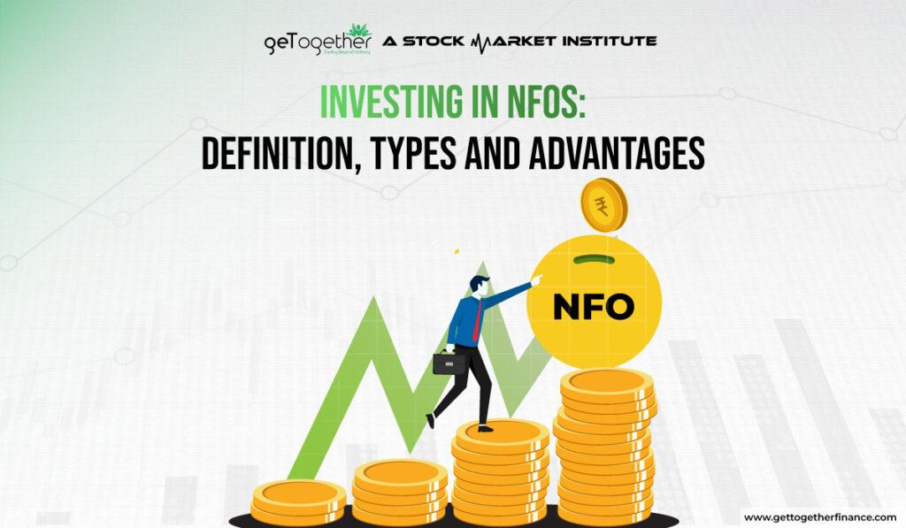

## Table of Contents

## What is a New Fund Offer (NFO)?

A New Fund Offer (NFO) is when a mutual fund company launches a new scheme and offers it to the public for the first time. It's like a new product launch in the world of mutual funds. During the NFO period, investors can buy units of the fund at a fixed price, usually set at ₹10 per unit. This is the only time when investors can buy the fund at this initial price.

After the NFO period ends, the fund is available in the market at its Net Asset Value (NAV), which can be higher or lower than the initial ₹10. NFOs are a way for fund houses to raise capital for their new schemes, and they can be a good opportunity for investors to get in on the ground floor of a new fund. However, it's important for investors to do their research and understand the fund's objectives and risks before investing.

## How does an NFO differ from an Initial Public Offering (IPO)?

A New Fund Offer (NFO) and an Initial Public Offering (IPO) are both ways for companies to raise money, but they are different. An NFO is when a mutual fund company launches a new scheme and offers it to the public for the first time. During an NFO, investors can buy units of the fund at a fixed price, usually set at ₹10 per unit. After the NFO period, the fund's price changes based on its performance in the market.

On the other hand, an IPO is when a company offers its shares to the public for the first time. This is how a private company becomes a public company. In an IPO, the share price is determined by the company and its underwriters, and it can change a lot based on how investors react. After the IPO, the shares are traded on a stock exchange, and their price can go up or down depending on the company's performance and market conditions.

So, the main difference is that an NFO is about starting a new mutual fund scheme, while an IPO is about a company selling its shares to the public. Both can be good opportunities for investors, but they work in different ways and have different risks and rewards.

## What are the different types of NFOs available to investors?

There are mainly two types of NFOs: open-ended and close-ended. An open-ended NFO is a type of mutual fund where you can buy or sell units at any time after the NFO period. This means you can invest more money or take out your money whenever you want. On the other hand, a close-ended NFO has a fixed term, usually between 3 to 5 years. You can only buy units during the NFO period, and you can't sell them until the term ends. After the term, the fund house might give you the option to redeem your units or roll over into a new scheme.

Another type of NFO is an interval fund, which is a mix of open-ended and close-ended funds. With an interval fund, you can buy or sell units only during specific times, called intervals. These intervals could be every three months or every six months, depending on the fund. This type of NFO gives you some flexibility but also has some restrictions on when you can buy or sell. Each type of NFO has its own benefits and risks, so it's important to understand them before you decide to invest.

## How can one identify when an NFO is being launched?

You can find out about a new NFO by checking the websites of mutual fund companies. They usually put up announcements and details about upcoming NFOs on their sites. You can also sign up for newsletters or alerts from these companies, so they can send you an email or message when a new NFO is coming up. Another way is to look at financial news websites and newspapers, which often report on new NFOs as they are announced.

Sometimes, mutual fund companies also use social media to spread the word about their new NFOs. They might post about it on their official pages on platforms like Twitter, Facebook, or LinkedIn. If you follow these companies or financial news pages on social media, you might see posts about new NFOs. Lastly, talking to a financial advisor can also help. They keep track of new investment opportunities and can tell you about any upcoming NFOs that might be a good fit for your investment goals.

## What are the steps to invest in an NFO?

To invest in an NFO, first, you need to find out about the new fund offer. You can do this by checking the websites of mutual fund companies, signing up for their newsletters, or looking at financial news websites and newspapers. Once you know about an NFO that interests you, read the offer document carefully. This document tells you everything about the fund, like its goals, how it will invest your money, and the risks involved. Make sure you understand all this before you decide to invest.

After you've decided to invest, you can do it online or through a financial advisor. If you're doing it online, go to the mutual fund company's website, find the NFO section, and fill out the application form. You'll need to enter your personal details and how much money you want to invest. Then, you'll need to make the payment, usually through net banking, a debit card, or a UPI app. If you're using a financial advisor, they can help you fill out the form and make the payment. Once your payment is confirmed, you'll get units of the fund at the NFO price, usually ₹10 per unit.

## What are the key benefits of investing in an NFO?

One of the main benefits of investing in an NFO is that you can buy the fund at its starting price, which is usually set at ₹10 per unit. This can be a good opportunity to get in on a new fund at a low price. If the fund does well, the price of the units can go up, and you could make a profit. Also, NFOs often come with new investment ideas or strategies that might not be available in other funds. This can be exciting for investors who want to try something new or different.

Another benefit is that NFOs can be a way to diversify your investment portfolio. By investing in a new fund, you can spread your money across different types of investments, which can help reduce risk. Plus, NFOs are often launched by well-known mutual fund companies, so you might feel more confident investing in a new fund from a company you trust. Just remember to do your research and understand the fund's goals and risks before you invest.

## How do NFOs impact the existing funds in the market?

When a new NFO comes out, it can affect the existing funds in the market. The new NFO might take some money away from other funds if investors decide to put their money into the new one instead. This can happen if the NFO has a new and exciting investment idea or if it's from a popular mutual fund company. If a lot of people invest in the NFO, it might make the existing funds a bit smaller, which could affect their performance.

On the other hand, an NFO can also bring more attention to the mutual fund market as a whole. When a new fund is launched, it can make people more interested in investing in mutual funds. This can bring more money into the market, which can be good for all funds, including the existing ones. So, while an NFO might take some money away from other funds at first, it can also help the whole market grow in the long run.

## What are the risks associated with investing in NFOs?

Investing in an NFO can be risky because it's a new fund with no past performance to look at. You don't know if the fund will do well or not. It's like buying a new product that no one has tried yet. The people who manage the fund might have a good plan, but there's no guarantee it will work out. So, you could lose money if the fund doesn't perform as expected.

Another risk is that NFOs are often used to sell new and exciting ideas. Sometimes, these ideas might sound great but might not be as good as they seem. It's easy to get caught up in the excitement of a new fund and invest without doing enough research. If you don't understand the fund's goals and risks, you might end up with an investment that doesn't fit your needs or that you're not comfortable with.

## How should one evaluate the performance potential of an NFO?

When you want to figure out if an NFO is a good investment, start by looking at the people who will manage the fund. Check their past experience and how well they've done with other funds. If they have a good track record, it might mean the new fund could do well too. Also, read the offer document carefully. It tells you the fund's goals and how it plans to invest your money. Make sure these goals match what you want from your investment.

Next, think about the fund's strategy. Is it something new and different, or is it similar to other funds already out there? Sometimes, a new strategy can be exciting, but it can also be riskier because it hasn't been tried before. Compare the NFO with other funds in the market. If the NFO doesn't offer anything special or better, you might want to stick with a fund that has a proven track record. Remember, just because it's new doesn't mean it's better.

## What role do fund managers play in the success of an NFO?

Fund managers are really important for the success of an NFO. They are the ones who decide how to invest the money that people put into the fund. If the fund managers have a lot of experience and have done well with other funds before, it can make people feel more confident about investing in the new NFO. They look at the market and pick the best investments to try to make the fund grow. So, the skills and past performance of the fund managers can make a big difference in how well the NFO does.

Also, fund managers help set the goals and strategy for the NFO. They explain these in the offer document, which tells investors what the fund is trying to achieve and how it plans to do it. If the strategy sounds smart and matches what investors are looking for, more people might want to invest. But if the strategy is too risky or doesn't make sense, it could scare people away. So, the fund managers' ability to come up with a good plan and explain it clearly is key to making the NFO successful.

## Can NFOs be compared with similar existing funds, and if so, how?

Yes, you can compare an NFO with similar existing funds to see if it's a good investment. Start by looking at the goals and strategies of both the NFO and the existing funds. If the NFO is trying to do something very different, it might be exciting but also riskier because it hasn't been tried before. On the other hand, if the NFO is similar to other funds, you can see how those funds have performed in the past. This can give you a better idea of what to expect from the NFO, even though it's new.

Also, check the fees and costs of the NFO compared to other funds. Sometimes, new funds might have lower fees to attract investors, which could be a good thing. But make sure you understand all the costs, because they can affect how much money you make in the end. Finally, think about the people managing the NFO and the existing funds. If the NFO has experienced managers with a good track record, it might do well. Comparing these things can help you decide if the NFO is worth investing in.

## What are the regulatory considerations and compliance requirements for launching an NFO?

When a mutual fund company wants to launch a new fund offer (NFO), they have to follow rules set by the Securities and Exchange Board of India (SEBI). SEBI is like a boss that makes sure everyone in the investment world plays fair. Before launching an NFO, the company has to get approval from SEBI. They need to send in a lot of paperwork, like the offer document, which explains everything about the new fund. This document has to be clear and honest so that investors know what they're getting into. The company also has to make sure they follow all the rules about advertising the NFO, so they don't trick people into investing.

Once the NFO is launched, the company has to keep following SEBI's rules. They need to make sure they manage the fund the way they said they would in the offer document. They also have to keep investors updated on how the fund is doing, usually by sending out regular reports. If anything changes with the fund, like the fees or how it invests, the company has to tell SEBI and the investors. This helps keep everything fair and transparent, so investors can trust the company and feel safe with their money.

## References & Further Reading

[1]: Dixit, S. (2019). ["A Practitioner’s Guide to New Fund Offers (NFOs)."](https://www.linkedin.com/in/ritik-dixit-1b4146173) CRISIL.

[2]: Ramaswamy, S. (2016). ["The Essential Guide to Investing in Mutual Funds."](https://en.wikipedia.org/wiki/Vivek_Ramaswamy) Jaico Publishing House.

[3]: Lopez de Prado, M. (2018). ["Advances in Financial Machine Learning."](https://www.amazon.com/Advances-Financial-Machine-Learning-Marcos/dp/1119482089) Wiley.

[4]: Aronson, D. R. (2006). ["Evidence-Based Technical Analysis: Applying the Scientific Method and Statistical Inference to Trading Signals."](https://www.amazon.com/Evidence-Based-Technical-Analysis-Scientific-Statistical/dp/0470008741) Wiley.

[5]: Chan, E. P. (2009). ["Quantitative Trading: How to Build Your Own Algorithmic Trading Business."](https://github.com/ftvision/quant_trading_echan_book) Wiley.

[6]: Jansen, S. (2018). ["Machine Learning for Algorithmic Trading: Predictive models to extract signals from market and alternative data for systematic trading strategies with Python."](https://www.amazon.com/Machine-Learning-Algorithmic-Trading-alternative/dp/1839217715) Packt Publishing.

[7]: Securities and Exchange Board of India. (2014). ["SEBI Guidelines for Mutual Funds."](https://www.sebi.gov.in/sebi_data/attachdocs/1337083696184.pdf)