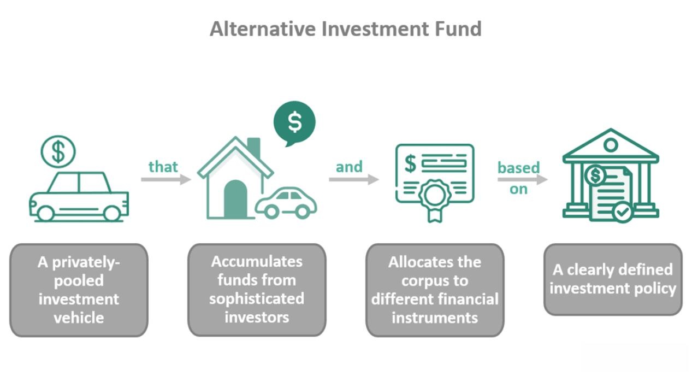

New Fund Offers (NFOs) represent a unique avenue in the mutual fund industry, offering fresh opportunities for both novice and seasoned investors. At their core, NFOs are the first subscription offerings for a new scheme launched by an asset management company (AMC). Similar to an initial public offering (IPO) in the stock market, NFOs allow investors to buy into a new mutual fund scheme at its inception, typically at a face value of Rs. 10 per unit in India. Their significance lies in the opportunity they present to invest in potentially lucrative and innovative investment strategies that may not be available in existing mutual fund offerings.

The operation of NFOs within the mutual fund market is straightforward yet distinguishes itself from subsequent fund offerings. When an AMC launches an NFO, it issues units of the new fund to the public, allowing investors to subscribe within a specified period. During this subscription phase, the fund accumulates the necessary corpus to commence its investment operations following its predetermined investment mandate. This is in contrast to ongoing mutual fund schemes, where investors can enter and exit at prevailing Net Asset Values (NAVs). After the NFO period ends, the mutual fund is listed, and units can then be bought or redeemed at the market-determined NAVs, subject to the fund's terms.

This article aims to provide a comprehensive understanding of NFOs, elucidating their operation, types, benefits, associated risks, and the emerging role of algorithmic trading in maximizing their potential. The discussion extends to the procedural aspects of launching an NFO, the regulatory environment, and how investors can strategically position NFOs within their portfolios for optimal returns. 

The growing interest in NFOs can be attributed to their potential benefits, such as access to cutting-edge investment themes and strategies, diversification opportunities, and the chance to participate in market segments poised for growth. Nevertheless, investing in NFOs also comes with challenges, which necessitates informed decision-making and strategic portfolio management.

Overall, this article seeks to equip readers with the knowledge required to assess NFOs' strategic fit within their investment goals, highlighting why staying updated on financial innovations continues to be a crucial component of successful investing.

## Table of Contents

## Understanding NFOs

A New Fund Offer (NFO) is a financial instrument used by mutual fund companies to raise capital from the market for deploying into securities such as equities, bonds, and money market instruments. Unlike existing mutual funds, NFOs represent the initial subscription offering of a new mutual fund scheme to the public. Their primary distinction from other instruments lies in their novelty and potential for establishing innovative investment themes.

### Process of Launching an NFO and Key Stakeholders

The launch of an NFO involves several critical steps. Initially, a mutual fund house, often known as an Asset Management Company (AMC), conceptualizes and designs a new fund based on market needs or investment themes. This is followed by the drafting of a detailed offer document known as the Scheme Information Document (SID), which outlines the fund's objectives, risks, costs, and other relevant information. 

Key stakeholders in this process include the AMC, the trustees who oversee the fund's operations, the fund managers responsible for executing the investment strategy, and regulatory bodies such as the Securities and Exchange Board of India (SEBI) which ensures compliance with financial regulations.

### Different Stages of an NFO

The lifecycle of an NFO can be divided into several stages:

1. **Conception and Design:** This stage involves ideation and planning by the AMC, driven by market research and investment goals.

2. **Approval:** The fund's detailed proposal is submitted to regulatory authorities for approval. In India, this involves submitting documents to SEBI.

3. **Marketing and Subscription:** With regulatory approval secured, the marketing team promotes the NFO to potential investors during the subscription period, which typically lasts a few weeks.

4. **Allotment and Launch:** Post subscription, units are allotted to investors, and the fund is officially launched. The funds collected are then invested according to the fund’s investment strategy.

5. **Continuous Fund Management:** Following the launch, the NFO transitions into a regular mutual fund, subject to ongoing management and performance evaluation.

### Importance of NFOs for Fund Houses

NFOs provide several advantages to fund houses. They are instrumental in attracting fresh investments, allowing AMCs to expand their asset management portfolio. By launching NFOs, fund houses can tap into emerging market trends and investor preferences, offering innovative products that might not be available through existing funds. Additionally, NFOs cater to various investment goals and risk appetites, broadening the fund house's investor base.

### Regulatory Framework Governing NFOs

A robust regulatory framework governs NFOs to protect investors and ensure market stability. Regulatory bodies like SEBI in India lay down the rules surrounding fund launches, disclosures, minimum subscription amounts, and operational mandates. These regulations ensure transparency and fairness, maintaining the integrity of the financial markets. The guidelines specify the need for extensive disclosures in offer documents, mandatory cooling-off periods, and stipulate penalties for non-compliance. 

The regulations governing NFOs are periodically updated in response to market innovations and economic changes, ensuring that they remain pertinent and capable of safeguarding investor interests.

## Types of NFOs

New Fund Offers (NFOs) serve as a mechanism for fund houses to introduce new mutual fund schemes to the market. These offers allow investors early access to potentially lucrative investment opportunities. NFOs can be broadly classified into three types: equity, debt, and hybrid funds, each catering to different investor needs and risk appetites.

### Types of NFOs

**Equity Funds**

Equity NFOs invest primarily in stocks and are designed for investors seeking capital appreciation over the long term. These funds can focus on various sectors, sizes of companies (large-cap, mid-cap, small-cap), or investment styles (growth, value). The primary objective of equity NFOs is to generate higher returns through stock market investments, which inherently [carry](/wiki/carry-trading) higher risks compared to other fund types. 

In an investor's portfolio, equity NFOs are suitable for those with a higher risk tolerance and a long-term investment horizon. They typically exhibit a high risk-reward profile, where potential returns can be substantial but come with significant [volatility](/wiki/volatility-trading-strategies). Recent trends have seen equity NFOs launching thematic funds that focus on future-oriented sectors such as technology, sustainability, and healthcare.

**Debt Funds**

Debt NFOs invest in fixed-income securities such as government bonds, corporate bonds, and other money market instruments. These funds target investors looking for regular income with lower risk compared to equities. The primary objective of debt NFOs is to provide stable returns while preserving capital. 

Debt NFOs fit into an investor's portfolio as a conservative investment option, ideal for those with low risk tolerance and a preference for steady income. They generally offer lower returns compared to equities, but with significantly reduced volatility. In recent years, there has been a rise in debt NFOs focusing on dynamic bond strategies and credit risk funds.

**Hybrid Funds**

Hybrid NFOs combine elements of both equity and debt funds, aiming to provide a balanced approach to investment. These funds distribute their investment across equity and debt instruments in varying proportions, depending on the sub-type: conservative, balanced, or aggressive. The goal is to achieve a mix of growth and income, leveraging the strengths of both asset classes. 

Hybrid NFOs are suitable for investors seeking moderate risk and reward profiles. They fit well in a diversified portfolio, offering a middle ground between high-risk equities and low-risk debt funds. The risk associated with hybrid NFOs varies based on their proportion of equity and debt investments, with balanced or aggressive hybrids carrying higher risk and return potential.

### Recent Trends and Popular Types

Recent trends in NFOs have shown a growing interest in thematic and sector-specific strategies, especially in the context of equity funds. The emergence of funds focusing on environmental, social, and governance ([ESG](/wiki/esg-investing)) criteria reflects the shifting preferences of socially conscious investors. Similarly, in the debt category, there is a marked inclination towards funds that enable dynamic management of [interest rate](/wiki/interest-rate-trading-strategies) risks.

Furthermore, hybrid funds are increasingly being used by investors as a tool for strategic asset allocation, adjusting equity and debt exposure based on market conditions. This adaptability makes hybrid NFOs particularly attractive in volatile market environments.

In conclusion, NFOs, whether equity, debt, or hybrid, offer diverse opportunities to meet varying investor objectives. Each type carries distinct risk and return profiles, making it crucial for investors to align these with their financial goals and risk tolerance.

## Benefits of Investing in NFOs

New Fund Offers (NFOs) present unique benefits for investors looking to optimize and diversify their portfolios. Investing early in NFOs can provide advantageous growth opportunities. One of the primary reasons is the potential for acquiring units at a nominal face value, which might not yet reflect the intrinsic value of the underlying investments. As the fund matures and gains traction in the market, early investors can potentially benefit from significant capital appreciation.

Diversification is a notable benefit when integrating NFOs into an investment portfolio. By investing in NFOs, investors can access a myriad of asset classes and strategies that might otherwise be unavailable through existing mutual funds. This can include exposure to emerging markets or newly conceptualized sectors, providing a broadened investment spectrum that mitigates unsystematic risk. 

Furthermore, NFOs are often designed to offer innovative investment themes and strategies that can be aligned with current market trends or anticipated economic shifts. Fund managers frequently leverage the opportunity of an NFO to introduce a distinct strategy that reflects specific market insights or investment philosophies. For instance, NFOs might target environmentally sustainable sectors or technology-driven industries, appealing to investors interested in cutting-edge themes.

NFOs also play a critical role in helping investors achieve long-term financial goals. These funds can be tailored to cater to specific investment time horizons and risk profiles, making them suitable vehicles for retirement planning or other substantial future financial commitments. By strategically selecting NFOs that align with personal financial objectives, investors can construct a portfolio that progressively contributes to their long-term wealth creation goals.

Despite their benefits, NFOs do pose certain challenges. One of the key concerns is the limited performance history, making it difficult for investors to assess the potential risks and returns effectively. Additionally, the novelty of the investment strategy can sometimes lead to unexpected market behavior, resulting in volatility. To mitigate these challenges, investors are encouraged to conduct thorough due diligence, scrutinizing the fund’s prospectus, management team’s credentials, and the underlying investment strategy. Engaging with a financial advisor can provide valuable insights and professional guidance to navigate these complexities. 

In summary, while NFOs offer promising advantages, including growth potential, diversification, and innovative strategies, investors must carefully evaluate and mitigate associated risks. By doing so, NFOs can be a valuable addition to a well-rounded investment strategy.

## Algo Trading and NFOs

Algorithmic trading, often referred to as algo trading, is a sophisticated method of executing trades using pre-programmed instructions accounting for variables such as timing, price, and [volume](/wiki/volume-trading-strategy). Its relevance in the context of New Fund Offers (NFOs) is growing, as it offers the potential to significantly improve the efficiency and performance of investment operations.

Algo trading enhances the efficiency of NFO investments by enabling rapid execution of trades, minimizing human error, and optimizing the timing of entry and [exit](/wiki/exit-strategy) into these funds. With the use of algorithms, investors can systematically analyze large datasets, which enables them to identify trends and make informed investment decisions at a speed and accuracy beyond human capabilities. This method is particularly beneficial during the initial phase of an NFO when investment opportunities can be rapidly evolving and require quick decision-making to capitalize on potential gains.

The synergy between NFO investment strategies and [algorithmic trading](/wiki/algorithmic-trading) lies in the ability of algorithms to tailor strategies that align with the specific objectives of each NFO. For instance, an algorithm can be designed to focus on a passive investment approach for tracking a particular index or to actively exploit specific market conditions predicted to prevail during the NFO period. This adaptability ensures that fund managers can optimize their strategies to best fit the fund's goals and investor expectations.

Despite these advantages, risks associated with algo trading in the context of NFOs must be considered. These include the potential for malfunctioning algorithms, which can lead to significant financial losses. Moreover, the reliance on historical data for algorithm formulation can result in strategies that falter during unanticipated market conditions. Additionally, the high-speed nature of algo trading increases exposure to market fluctuations, necessitating robust risk management protocols.

Future trends in this area are likely to be shaped by advancements in [artificial intelligence](/wiki/ai-artificial-intelligence) (AI) and [machine learning](/wiki/machine-learning). These technologies promise to further refine the capabilities of algorithmic trading by enabling more sophisticated predictive models and autonomous decision-making processes. For example, machine learning algorithms can continuously learn from new data inputs and adapt investment strategies accordingly, providing a dynamic approach that is responsive to real-time market conditions. As these technologies evolve, they could enhance the strategic positioning of NFOs, offering a more resilient and adaptive investment mechanism.

In conclusion, algorithmic trading presents significant opportunities to optimize the performance and efficiency of New Fund Offers. However, careful consideration of the associated risks and continued advancements in AI and machine learning will be crucial in fully realizing its potential in enriching NFO investment strategies.

## Conclusion

New Fund Offers (NFOs) play a crucial role in the financial ecosystem by providing investors with the opportunity to access new mutual fund schemes. These offerings allow fund houses to launch innovative investments and attract capital. Throughout this article, we explored the various aspects of NFOs, including their definitions, types, benefits, and the emerging trend of algorithmic trading in conjunction with NFO investments.

NFOs present significant potential for investors, particularly when combined with algorithmic trading strategies. This synergy can enhance the efficiency and timing of investment decisions, potentially leading to improved returns. However, it is essential for investors to be aware of the risks associated with both NFOs and algorithmic trading. Understanding these risks and employing sound investment strategies can help mitigate potential challenges.

Investors are encouraged to conduct thorough research into NFOs as part of their broader investment strategy. This includes analyzing the objectives, risks, and historical performance of the fund houses offering these NFOs. With the financial markets constantly evolving, staying informed about the latest developments is vital for making well-informed investment decisions. This vigilance helps in recognizing emerging trends and identifying opportunities within the NFO landscape.

Given the complexities involved in integrating NFOs and algorithmic trading into an investment portfolio, consulting with financial advisors is highly recommended. Professional guidance can assist in tailoring investments to individual financial goals and risk tolerances, ensuring a balanced and informed approach.

In conclusion, NFOs offer promising growth avenues and diversification benefits. When combined with algorithmic trading, they could enhance investment outcomes. However, due diligence and expert consultation remain paramount for navigating the financial market's intricacies effectively.

## References & Further Reading

[1]: Dixit, S. (2019). ["A Practitioner’s Guide to New Fund Offers (NFOs)."](https://www.linkedin.com/in/ritik-dixit-1b4146173) CRISIL.

[2]: Ramaswamy, S. (2016). ["The Essential Guide to Investing in Mutual Funds."](https://en.wikipedia.org/wiki/Vivek_Ramaswamy) Jaico Publishing House.

[3]: Lopez de Prado, M. (2018). ["Advances in Financial Machine Learning."](https://www.amazon.com/Advances-Financial-Machine-Learning-Marcos/dp/1119482089) Wiley.

[4]: Aronson, D. R. (2006). ["Evidence-Based Technical Analysis: Applying the Scientific Method and Statistical Inference to Trading Signals."](https://www.amazon.com/Evidence-Based-Technical-Analysis-Scientific-Statistical/dp/0470008741) Wiley.

[5]: Chan, E. P. (2009). ["Quantitative Trading: How to Build Your Own Algorithmic Trading Business."](https://github.com/ftvision/quant_trading_echan_book) Wiley.

[6]: Jansen, S. (2018). ["Machine Learning for Algorithmic Trading: Predictive models to extract signals from market and alternative data for systematic trading strategies with Python."](https://www.amazon.com/Machine-Learning-Algorithmic-Trading-alternative/dp/1839217715) Packt Publishing.

[7]: Securities and Exchange Board of India. (2014). ["SEBI Guidelines for Mutual Funds."](https://www.sebi.gov.in/sebi_data/attachdocs/1337083696184.pdf)