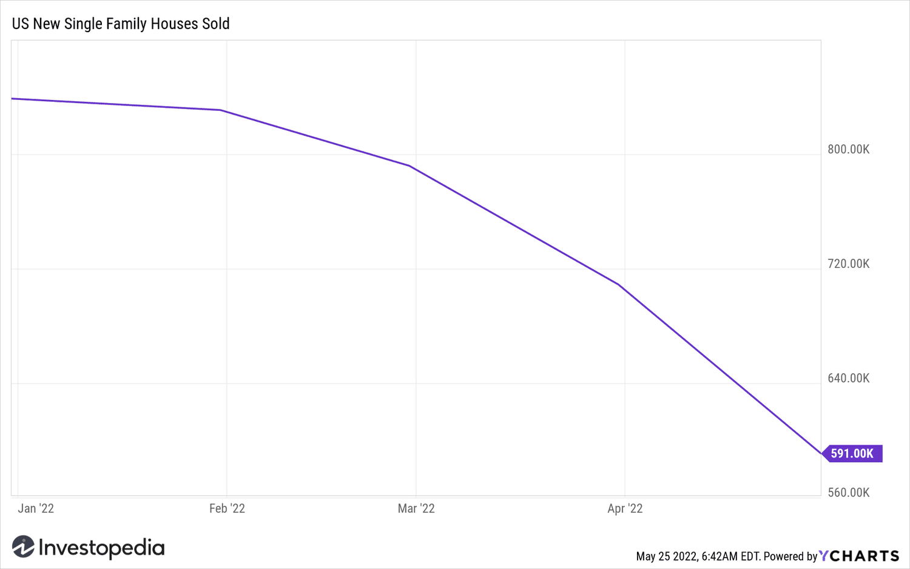

## Table of Contents

## What are new home sales?

New home sales refer to the number of newly constructed homes that are sold during a specific period, usually a month or a year. These sales are an important indicator of the health of the housing market and the overall economy. When more new homes are sold, it often means that people feel confident about their financial situation and the economy is doing well.

Tracking new home sales helps builders, real estate agents, and policymakers understand how many new homes people want to buy. If sales are high, builders might decide to construct more homes. If sales are low, they might slow down building. This information can also affect decisions about interest rates and other economic policies.

## How do new home sales differ from resale home sales?

New home sales are about houses that have just been built and are being sold for the first time. They show how many new houses people are buying. This is important because it tells us if people feel good about buying a brand new home and if the economy is doing well. When more new homes are sold, it means more people are willing to buy new houses, which can lead to more construction.

Resale home sales, on the other hand, are about houses that have been lived in before and are being sold again. These sales show how many people are moving or upgrading to a different house. Resale homes are usually cheaper than new homes because they are not brand new. The number of resale homes sold can tell us about the demand for existing homes and how easy it is for people to move or change homes.

Both new home sales and resale home sales are important to understand the housing market. New home sales focus on new construction and can influence how many new houses get built. Resale home sales focus on existing homes and can show how active the real estate market is for people looking to move or buy a used home.

## What is the process of buying a new home?

When you want to buy a new home, the first step is to find a home you like. You can look at homes that builders are selling in new neighborhoods. Once you find a home you want, you talk to the builder or their sales agent. They will show you the home and tell you about the price and any special features. If you like it, you can make an offer to buy it. Sometimes, you might be able to change some things in the home, like the color of the walls or the type of flooring, before it's finished.

After you make an offer and the builder accepts it, you need to get a mortgage if you're not paying all in cash. A mortgage is a loan from a bank to help you buy the home. You'll work with a bank or a mortgage broker to apply for the loan. They will check your credit and see if you can afford the payments. Once you get the mortgage, you'll sign a lot of papers to make the purchase official. This is called closing. After closing, you get the keys to your new home and can start moving in. It's a big step, but exciting too!

## What are the key players involved in new home sales?

The key players in new home sales are the homebuyers, the builders, and the real estate agents. Homebuyers are the people who want to buy a new home. They look at different homes and decide which one they want to buy based on their needs and budget. Builders are the companies that build the new homes. They decide where to build, what kind of homes to build, and how much to sell them for. Real estate agents help connect homebuyers with builders. They show homebuyers the homes that are for sale and help them make offers.

Another important player is the mortgage lender. Mortgage lenders, like banks or mortgage brokers, give homebuyers the money they need to buy the home. They check the homebuyer's credit and income to make sure they can pay back the loan. The mortgage lender works with the homebuyer and the builder to make sure everything goes smoothly until the home is paid for and the homebuyer gets the keys. Together, all these players work to make new home sales happen.

## How are new homes typically priced?

New homes are typically priced based on several factors. Builders look at the cost of the land where the home is built, the cost of materials like wood and bricks, and the cost of labor to build the home. They also think about the features in the home, like the number of bedrooms and bathrooms, and special things like a big kitchen or a fancy backyard. All these costs add up to set the base price of the home.

Builders also consider what other homes in the area are selling for. They want to make sure their new homes are priced competitively so people will want to buy them. If homes in the neighborhood are selling for a lot of money, the builder might price their new homes higher. If homes are selling for less, they might need to lower their prices to attract buyers. This helps them decide on a final price that makes sense for the market.

Sometimes, builders offer special deals or discounts to help sell the homes faster. They might lower the price a bit or offer to pay for some of the closing costs. These deals can change the final price that homebuyers pay. It's all about finding the right balance to make the home affordable for buyers while still making a profit for the builder.

## What financing options are available for new home buyers?

When you want to buy a new home, there are different ways to pay for it. The most common way is to get a mortgage from a bank or a mortgage lender. A mortgage is a big loan that you use to buy the home, and you pay it back over many years with interest. There are different kinds of mortgages, like fixed-rate mortgages where the interest stays the same, or adjustable-rate mortgages where the interest can change. You can also get government-backed loans like FHA loans, which are easier to qualify for if you don't have a lot of money saved up for a down payment.

Another option is to get help from the builder. Some builders offer special financing deals to make it easier for you to buy their homes. They might have their own mortgage company or work with certain lenders to give you a better interest rate or lower closing costs. Sometimes, builders offer incentives like paying for part of your down payment or giving you a discount on the home's price if you use their financing. It's good to ask the builder about any special deals they might have.

There are also other ways to finance a new home, like using money you've saved up or getting help from family. Some people use their savings to pay for the home all at once, which means they don't need a mortgage. Others might get a gift or loan from family members to help with the down payment or closing costs. It's important to look at all your options and figure out what works best for your situation.

## What are the advantages of buying a new home over an existing one?

One big advantage of buying a new home is that everything is new and modern. You get to move into a house that no one has lived in before. This means you have new appliances, new floors, and new everything. You can also pick out some of the finishes, like the color of the walls or the type of flooring, before the home is finished. This makes the home feel more like yours from the start. Plus, new homes often have the latest energy-efficient features, which can save you money on your bills.

Another advantage is that new homes usually come with a warranty. This means if something goes wrong with the house, like a problem with the roof or the heating system, the builder might fix it for free. This can give you peace of mind because you know you won't have to pay for big repairs right away. Also, new homes are often built in new neighborhoods, which can be exciting. You might get to meet new neighbors and be part of a growing community.

## What are the potential challenges or risks associated with new home sales?

One challenge with buying a new home is that you might have to wait before you can move in. New homes take time to build, so you might need to find a place to live while you wait. This can be hard if you need to move quickly or if you're renting and your lease is ending soon. Another risk is that the price of the home could change while it's being built. Sometimes, builders might increase the price because of higher costs for materials or labor. This can be a problem if you're on a tight budget and the new price is more than you can afford.

Another thing to think about is that new homes can have construction problems. Even though new homes come with warranties, you might still find issues after you move in. It can be frustrating to deal with repairs or delays, especially if the builder is slow to fix things. Also, new neighborhoods might not have all the amenities you want right away, like parks or shops. You might need to wait for these to be built, which can take time. So, while buying a new home has many benefits, it's important to be aware of these challenges too.

## How do builders market and sell new homes?

Builders use different ways to let people know about their new homes. They might put up big signs in the new neighborhood so people driving by can see them. They also use the internet a lot, with websites that show pictures and details about the homes. Builders often work with real estate agents who can show the homes to people looking to buy. Sometimes, they have special events called open houses where anyone can come and look at the homes. Builders might also advertise on TV, radio, or in newspapers to reach more people.

When someone is interested in buying a new home, the builder's sales team helps them. They show the home and answer any questions the buyer might have. The sales team can help the buyer pick out things like the color of the walls or the type of flooring. They also work with the buyer to make an offer and go through the buying process. Builders might offer special deals or discounts to make the home more affordable. They might pay for some of the closing costs or give a lower interest rate if the buyer uses their financing. This helps the builder sell the homes faster and makes it easier for the buyer to afford the new home.

## What role do real estate agents play in new home sales?

Real estate agents help connect people who want to buy new homes with builders who are selling them. When someone is looking for a new home, the agent shows them different homes that are for sale. They know a lot about the homes and can tell the buyer about the price, the features, and what the neighborhood is like. The agent helps the buyer make an offer and works with the builder to make sure everything goes smoothly until the home is bought.

Agents also help builders sell their homes faster. They bring buyers to see the homes and can talk about the good things about living in a new home. Sometimes, agents help with special deals that the builder is offering, like discounts or help with closing costs. This makes it easier for buyers to afford the home and helps the builder sell more homes.

## How do economic factors influence new home sales?

Economic factors can have a big impact on new home sales. When the economy is doing well, people feel more confident about their jobs and money. This means they are more likely to buy a new home. Interest rates are also important. If interest rates are low, it's cheaper to borrow money for a mortgage, so more people can afford to buy a new home. But if interest rates go up, borrowing money becomes more expensive, and fewer people might want to buy a new home. The cost of building materials and labor can also affect new home sales. If these costs go up, builders might have to raise the price of the homes, which can make them harder to sell.

Another big factor is the overall health of the housing market. If there are a lot of new homes being built and not many people buying them, builders might have to lower their prices to sell the homes. On the other hand, if there aren't enough new homes to meet the demand, builders can charge more because people really want to buy them. Jobs and income levels also play a role. If a lot of people are working and making good money, more of them can afford to buy new homes. But if there are a lot of people out of work or not making much money, fewer of them will be able to buy a new home. All these economic factors together can make new home sales go up or down.

## What are the latest trends and technologies impacting new home sales?

One big trend in new home sales is the use of virtual tours and online platforms. Builders are using technology to let people see homes without having to go there in person. With virtual tours, you can walk through a home on your computer or phone and see every room. This is really helpful if you live far away or can't visit the home right away. Online platforms also let you customize the home, picking out things like the color of the walls or the type of flooring, all from your computer. This makes it easier and more fun to buy a new home.

Another trend is the focus on smart homes and energy efficiency. New homes are often built with technology that makes life easier, like smart thermostats that control the temperature or lights you can turn on with your phone. These smart features can make the home more appealing to buyers. Also, new homes are being built to use less energy, with things like solar panels or better insulation. This can save money on bills and is good for the environment. Builders are using these trends to make their homes more attractive and sell them faster.

## What is Algorithmic Trading in Real Estate?

Algorithmic trading, a methodology initially synonymous with financial markets, is increasingly finding relevance in real estate investments. The fundamental premise of [algorithmic trading](/wiki/algorithmic-trading) is the use of advanced algorithms, powered by data analytics, to systematically execute trades based on market patterns and trends. This method is becoming indispensable in real estate due to its ability to process vast amounts of information more efficiently than manual analysis.

Algorithms in real estate analyze a plethora of data points, from historical property prices to macroeconomic indicators. By leveraging [machine learning](/wiki/machine-learning) and data analytics, these algorithms can detect patterns that may indicate future market movements. A fundamental aspect of this is regression analysis, where the relationship between real estate prices and variables such as interest rates, unemployment levels, and construction activity is quantified. Such analytic frameworks enable investors to foresee potential changes in property values, providing a competitive edge.

A simple linear regression model used for predicting housing prices can be formulated as follows:

$$

\text{Price} = \beta_0 + \beta_1 \times \text{Interest Rate} + \beta_2 \times \text{Unemployment Rate} + \cdots + \epsilon 
$$

where $\beta_0$ is the intercept, $\beta_1, \beta_2, \ldots$ are the coefficients for each predictor, and $\epsilon$ is the error term.

Advantages of algorithmic trading in the housing market include increased efficiency and objectivity in investment strategies. Algorithms can process data far faster than humans, enabling near-instantaneous reactions to market changes. They also eliminate emotional biases that can cloud human judgment, ensuring that trading decisions are based on quantitative analysis rather than subjective interpretation.

Nonetheless, algorithmic trading is not without limitations. One significant challenge is the model risk, where the algorithm may not accurately predict market dynamics due to erroneous assumptions or changes in market conditions. Additionally, real estate markets often lack the [liquidity](/wiki/liquidity-risk-premium) seen in stock markets, possibly leading to issues in executing the algorithmic strategies promptly. The reliance on historical data also poses risks, as past trends may not always predict future outcomes, especially in volatile economic environments.

Despite these challenges, the integration of algorithmic trading into real estate investment strategies presents a forward-looking approach, standing to benefit investors willing to navigate its complexities while leveraging its substantial analytical power.

## References & Further Reading

[1]: Bergstra, J., Bardenet, R., Bengio, Y., & Kégl, B. (2011). ["Algorithms for Hyper-Parameter Optimization."](https://dl.acm.org/doi/10.5555/2986459.2986743) Advances in Neural Information Processing Systems 24.

[2]: ["Advances in Financial Machine Learning"](https://www.amazon.com/Advances-Financial-Machine-Learning-Marcos/dp/1119482089) by Marcos Lopez de Prado

[3]: ["Evidence-Based Technical Analysis: Applying the Scientific Method and Statistical Inference to Trading Signals"](https://www.amazon.com/Evidence-Based-Technical-Analysis-Scientific-Statistical/dp/0470008741) by David Aronson

[4]: ["Machine Learning for Algorithmic Trading"](https://github.com/stefan-jansen/machine-learning-for-trading) by Stefan Jansen

[5]: ["Quantitative Trading: How to Build Your Own Algorithmic Trading Business"](https://www.amazon.com/Quantitative-Trading-Build-Algorithmic-Business/dp/1119800064) by Ernest P. Chan