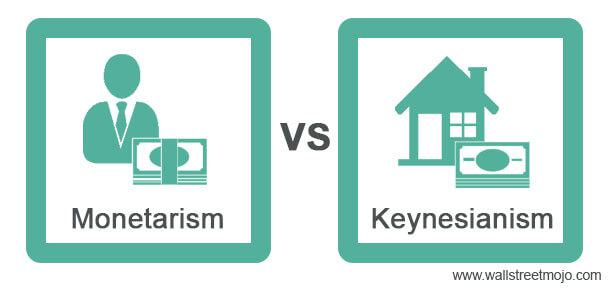

## Table of Contents

## What is Keynesian economics?

Keynesian economics is a theory about how economies work, named after John Maynard Keynes, who wrote about it during the Great Depression in the 1930s. The main idea is that the government should step in to help the economy when it's not doing well. Keynes believed that during tough times, people and businesses might not spend enough money, which can make the economy worse. So, he thought the government should spend more money, even if it means borrowing, to get things moving again.

One key part of Keynesian economics is the idea of "aggregate demand," which is the total amount of goods and services that people want to buy. If aggregate demand is too low, it can lead to high unemployment and slow economic growth. Keynes suggested that the government could increase aggregate demand by spending on things like building roads or schools, or by cutting taxes so people have more money to spend. This way, the economy could recover faster and more people could find jobs.

## What is New Keynesian economics?

New Keynesian economics is a modern version of the ideas that John Maynard Keynes had about how economies work. It builds on his original thoughts but adds new ideas to explain why prices and wages don't change quickly. New Keynesians believe that because prices and wages are "sticky," meaning they don't adjust right away, the economy can get stuck with high unemployment or low growth for a while. They think the government can help by using policies like adjusting interest rates or spending more money to get the economy moving again.

One big difference between New Keynesian economics and the original Keynesian ideas is that New Keynesians use more math and models to understand the economy. They focus a lot on how people make decisions and how those decisions affect the whole economy. New Keynesians also believe that the central bank, like the Federal Reserve in the U.S., plays a big role in keeping the economy stable by controlling interest rates. They think that if the central bank does its job well, it can help prevent big economic problems and keep things running smoothly.

## How do Keynesian and New Keynesian economics differ in their basic assumptions?

Keynesian economics and New Keynesian economics share a lot of the same basic ideas about how the government can help the economy. Both believe that the government should step in when the economy is not doing well, like during a recession. They both think that increasing government spending or cutting taxes can help boost demand and get the economy moving again. But, Keynesian economics focuses more on the big picture and practical solutions, while New Keynesian economics digs deeper into the details.

New Keynesian economics adds new ideas to the original Keynesian thoughts, especially about why prices and wages don't change quickly. They use a lot of math and models to understand how people make decisions and how those decisions affect the economy. New Keynesians also think that the central bank is really important for keeping the economy stable by controlling interest rates. So, while both Keynesian and New Keynesian economics believe in government help, New Keynesian economics goes into more detail about how and why things happen in the economy.

## What are the key components of the Keynesian economic model?

The Keynesian economic model focuses on the idea that total demand, or what people and businesses want to buy, is really important for the health of the economy. Keynes thought that if people and businesses don't spend enough money, it can lead to high unemployment and slow growth. This is why he believed the government should step in and spend more money, even if it means borrowing, to get things moving again. The government can do this by building things like roads or schools, or by cutting taxes so people have more money to spend. This way, more people can find jobs and the economy can start to recover.

Another key part of the Keynesian model is the idea of the "multiplier effect." This means that when the government spends money, it doesn't just help the people who get the money directly. Those people then spend the money on other things, which helps more people, and so on. This creates a ripple effect that can make the economy grow even more than the initial amount of spending. Keynes also thought that the economy could sometimes get stuck in a bad spot, called a "[liquidity](/wiki/liquidity-risk-premium) trap," where people just want to save their money instead of spending it. In these situations, he believed the government needed to do even more to get people spending again.

## What are the main features of the New Keynesian economic model?

New Keynesian economics builds on the ideas of John Maynard Keynes but adds new details to explain why prices and wages don't change quickly. They call this "price and wage stickiness." New Keynesians believe that because prices and wages don't adjust right away, the economy can get stuck with high unemployment or slow growth for a while. They think the government can help by using policies like adjusting interest rates or spending more money to get the economy moving again. They also focus a lot on how people make decisions and how those decisions affect the whole economy.

One big difference between New Keynesian economics and the original Keynesian ideas is that New Keynesians use a lot of math and models to understand the economy. They believe that the central bank, like the Federal Reserve in the U.S., plays a big role in keeping the economy stable by controlling interest rates. If the central bank does its job well, it can help prevent big economic problems and keep things running smoothly. So, while both Keynesian and New Keynesian economics believe in government help, New Keynesian economics goes into more detail about how and why things happen in the economy.

## How do Keynesian and New Keynesian theories explain economic cycles?

Keynesian economics explains economic cycles by focusing on total demand in the economy. Keynes believed that when people and businesses don't spend enough money, it can lead to a recession. During these times, there's less demand for goods and services, which means businesses make less money and have to lay off workers. This can make the problem even worse because now those workers have less money to spend. Keynes thought the government could help by spending more money, even if it means borrowing, to boost demand. This could help the economy recover faster by creating jobs and getting people to spend more.

New Keynesian economics adds more details to this idea. They believe that prices and wages don't change quickly, which they call "price and wage stickiness." Because of this, the economy can get stuck in a bad spot for a while. New Keynesians also use a lot of math and models to understand how people make decisions and how those decisions affect the whole economy. They think the central bank is important for keeping the economy stable by controlling interest rates. If the central bank does its job well, it can help smooth out the ups and downs of economic cycles. Both Keynesian and New Keynesian theories agree that government action can help manage economic cycles, but New Keynesians go into more detail about how and why things happen.

## What role do prices and wages play in Keynesian versus New Keynesian economics?

In Keynesian economics, prices and wages are important but they don't change as quickly as they should. Keynes thought that when the economy is not doing well, businesses might not lower their prices or wages fast enough to match the lower demand. This can make the economy stay stuck in a bad spot for a while. Keynes believed that the government should step in and spend more money to help boost demand and get the economy moving again. By doing this, the government can help businesses sell more and hire more workers, which can help prices and wages start to move again.

New Keynesian economics goes into more detail about why prices and wages don't change quickly. They call this "price and wage stickiness." New Keynesians think that because prices and wages don't adjust right away, the economy can get stuck with high unemployment or slow growth for a longer time. They use a lot of math and models to understand how people make decisions and how those decisions affect the whole economy. New Keynesians also believe that the central bank, like the Federal Reserve in the U.S., can help by controlling interest rates. By doing this, the central bank can help make prices and wages more flexible and keep the economy stable.

## How do the two schools of thought approach the issue of monetary policy?

Keynesian economics believes that the government should use monetary policy to help the economy when it's not doing well. They think that the central bank can lower interest rates to make it cheaper for people and businesses to borrow money. This can encourage them to spend more, which can help boost the economy. Keynesians believe that when the economy is in a bad spot, the central bank should be ready to take action and use monetary policy to help things get better.

New Keynesian economics agrees with the idea that the central bank should use monetary policy to help the economy. But they go into more detail about how and why it works. New Keynesians use a lot of math and models to understand how people make decisions and how those decisions affect the whole economy. They think that the central bank can control interest rates to make prices and wages more flexible. By doing this, the central bank can help keep the economy stable and prevent big problems. Both Keynesian and New Keynesian economics believe that the central bank plays an important role in managing the economy, but New Keynesians focus more on the details of how it works.

## What are the implications of Keynesian and New Keynesian theories for fiscal policy?

Keynesian economics says that when the economy is not doing well, the government should spend more money to help it get better. They think that if people and businesses are not spending enough, the government can step in and boost demand by building things like roads or schools, or by cutting taxes so people have more money to spend. This can help create jobs and get the economy moving again. Keynesians believe that even if the government has to borrow money to do this, it's worth it because it can help the economy recover faster.

New Keynesian economics agrees with the idea that the government should use fiscal policy to help the economy, but they go into more detail about how and why it works. They think that because prices and wages don't change quickly, the economy can get stuck in a bad spot for a while. New Keynesians use a lot of math and models to understand how people make decisions and how those decisions affect the whole economy. They believe that the government can help by spending more money or cutting taxes to boost demand, just like Keynesians do. But they also focus on how this can make prices and wages more flexible and help the economy get back on track.

## How have empirical studies supported or challenged the views of Keynesian and New Keynesian economics?

Empirical studies have generally supported the idea from Keynesian economics that government spending can help boost the economy when it's not doing well. During tough times like the Great Depression or the 2008 financial crisis, studies have shown that when the government spent more money on things like building roads or helping people who lost their jobs, it helped the economy recover faster. These studies back up the Keynesian idea that increasing demand through government spending can help get things moving again. However, some studies have also pointed out that too much government spending can lead to higher debt, which might cause problems later on.

New Keynesian economics has also been supported by empirical studies, especially when it comes to the idea that prices and wages don't change quickly. Researchers have found that businesses often don't change their prices right away, even when the economy changes. This "price and wage stickiness" can make the economy stay stuck in a bad spot for a while, just like New Keynesians say. Studies have also shown that when central banks adjust interest rates, it can help make prices and wages more flexible and keep the economy stable. But, some critics argue that the math and models used by New Keynesians can be too complicated and might not always match what happens in the real world.

## What criticisms have been leveled against Keynesian and New Keynesian economics, and how have proponents responded?

Critics of Keynesian economics often say that it leads to too much government spending and borrowing, which can cause big debts and inflation. They think that if the government keeps spending more money, it might make prices go up too fast, and that can be bad for the economy. Some critics also believe that the government shouldn't try to control the economy so much because it might make things worse. They argue that the market should fix itself without the government stepping in. In response, supporters of Keynesian economics say that government spending can help a lot during tough times, like a recession. They believe that the benefits of helping the economy recover quickly are worth the risk of more debt. They also point out that many times, government action has helped the economy get better faster.

New Keynesian economics has been criticized for being too complicated with its math and models. Some people think that these models don't always match what happens in the real world, and they can be hard to understand. Critics also say that the idea of "price and wage stickiness" might not always be true and that the economy can fix itself without the central bank changing interest rates. On the other hand, supporters of New Keynesian economics argue that their detailed models help us understand the economy better. They say that these models can help predict what might happen and guide the central bank in making good decisions. They also believe that the central bank can play a big role in keeping the economy stable, and the idea of price and wage stickiness has been backed up by a lot of research.

## How have recent economic crises influenced the debate between Keynesian and New Keynesian economics?

Recent economic crises, like the 2008 financial crisis and the economic downturn caused by the COVID-19 pandemic, have brought Keynesian and New Keynesian ideas back into the spotlight. Many governments and central banks turned to Keynesian policies, like spending more money and cutting interest rates, to help their economies recover. These actions were seen as a way to boost demand and get people spending again, which is a key idea in Keynesian economics. The success of these policies in helping the economy bounce back has given more support to Keynesian ideas, showing that government action can make a big difference during tough times.

New Keynesian economics also played a big role in how policymakers responded to these crises. Central banks used detailed models and math, which are important in New Keynesian theory, to figure out the best way to adjust interest rates and keep the economy stable. The idea of "price and wage stickiness" helped explain why the economy stayed stuck in a bad spot for a while, and why central banks needed to step in. Both Keynesian and New Keynesian ideas were used together to help manage the crises, showing that both schools of thought can be useful in different ways.

## References & Further Reading

[1]: ["The General Theory of Employment, Interest, and Money"](http://keynes-general-theory.com/generaltheory.pdf) by John Maynard Keynes

[2]: Mankiw, N. G., & Romer, D. (Eds.). (1991). ["New Keynesian Economics: Imperfect Competition and Sticky Prices."](https://archive.org/details/newkeynesianecon0001unse) MIT Press.

[3]: Clarida, R., Galí, J., & Gertler, M. (1999). ["The Science of Monetary Policy: A New Keynesian Perspective."](https://www.nber.org/papers/w7147) Journal of Economic Literature, 37(4), 1661-1707.

[4]: Woodford, M. (2003). ["Interest and Prices: Foundations of a Theory of Monetary Policy."](https://www.jstor.org/stable/j.ctv30pnvmf) Princeton University Press.

[5]: ["Monetary Theory and Policy"](https://mitpress.mit.edu/9780262035811/monetary-theory-and-policy/) by Carl E. Walsh