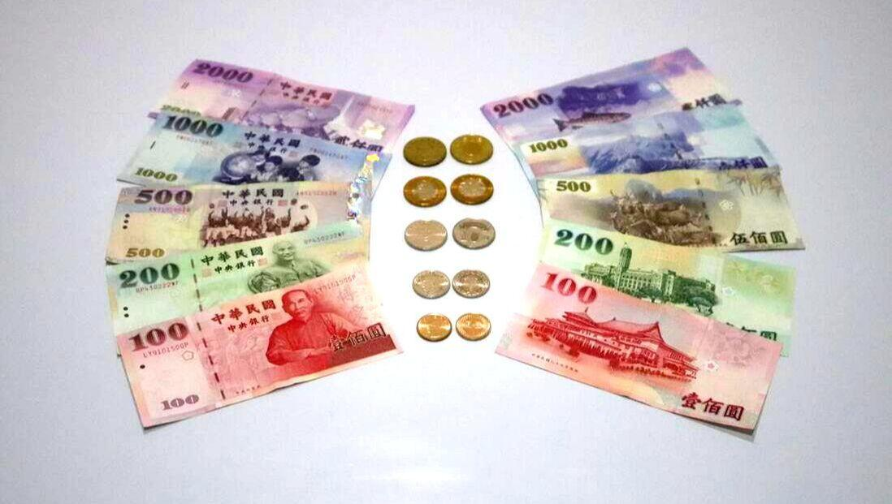

## Table of Contents

## What is the New Taiwan Dollar?

The New Taiwan Dollar, often shortened to TWD or NT$, is the official money used in Taiwan. It started being used in 1949, replacing the old Taiwan Dollar. People use it every day to buy things like food, clothes, and other stuff they need. The Central Bank of the Republic of China manages the New Taiwan Dollar and makes sure it stays stable and works well for everyone in Taiwan.

Coins and banknotes make up the New Taiwan Dollar. The coins come in different amounts like 1, 5, 10, and 50 NT$. The banknotes are available in larger amounts like 100, 200, 500, 1000, and 2000 NT$. Each coin and banknote has special designs that show important parts of Taiwan's culture and history. This makes the money not just useful but also interesting to look at.

## When was the New Taiwan Dollar introduced?

The New Taiwan Dollar was introduced in 1949. Before that, people in Taiwan used the old Taiwan Dollar. The new money was brought in to help make things more stable and to make buying and selling easier.

The Central Bank of the Republic of China is in charge of the New Taiwan Dollar. They make sure it works well for everyone in Taiwan. The money comes in coins and banknotes, with different amounts to help people buy what they need.

## What is the symbol and currency code for the New Taiwan Dollar?

The symbol for the New Taiwan Dollar is NT$. This symbol is used on coins and banknotes to show that it is the money used in Taiwan.

The currency code for the New Taiwan Dollar is TWD. This code is used around the world to talk about and trade the New Taiwan Dollar. It helps people know exactly which money they are using or talking about.

## How is the New Taiwan Dollar abbreviated?

The New Taiwan Dollar is abbreviated as NT$. This symbol is used on coins and banknotes to show that it is the money used in Taiwan. It helps people know what kind of money they are using when they see it.

The currency code for the New Taiwan Dollar is TWD. This code is used around the world to talk about and trade the New Taiwan Dollar. It makes it easier for people to understand which money they are dealing with, especially in places like banks or when buying things from other countries.

## What are the denominations of the New Taiwan Dollar in circulation?

The New Taiwan Dollar comes in different amounts for coins and banknotes. The coins you can use are 1 NT$, 5 NT$, 10 NT$, and 50 NT$. These coins are handy for buying small things or when you need to give exact change.

The banknotes come in bigger amounts like 100 NT$, 200 NT$, 500 NT$, 1000 NT$, and 2000 NT$. These are useful for bigger purchases. Each coin and banknote has special designs that show important parts of Taiwan's culture and history, making the money not just useful but also interesting to look at.

## What is the history of the New Taiwan Dollar?

The New Taiwan Dollar, or NT$, was introduced in 1949. Before that, people in Taiwan used the old Taiwan Dollar. The new money was brought in to help make things more stable and to make buying and selling easier. The Central Bank of the Republic of China is in charge of the New Taiwan Dollar. They make sure it works well for everyone in Taiwan.

When the New Taiwan Dollar was first introduced, it replaced the old Taiwan Dollar at a rate of 1 new dollar for 40,000 old dollars. This big change was needed because the old money had lost a lot of its value. Over the years, the New Taiwan Dollar has become a strong and stable money that people use every day. It comes in coins and banknotes, with different amounts to help people buy what they need.

## How has the value of the New Taiwan Dollar changed over time?

Since it was introduced in 1949, the New Taiwan Dollar has gone through many changes in its value. At first, it was a big help because the old Taiwan Dollar had lost a lot of its value. The new money was meant to make things more stable. Over the years, the New Taiwan Dollar has become a strong and stable money that people use every day. It's managed by the Central Bank of the Republic of China, which works to keep it stable.

The value of the New Taiwan Dollar compared to other countries' money has changed over time. In the 1980s and 1990s, Taiwan's economy grew a lot, and the New Taiwan Dollar became stronger compared to other money like the US Dollar. But sometimes, it goes up and down depending on what's happening in the world and in Taiwan's economy. The Central Bank works hard to keep the New Taiwan Dollar stable, which helps people and businesses in Taiwan.

## What factors influence the exchange rate of the New Taiwan Dollar?

The exchange rate of the New Taiwan Dollar (NTD) is influenced by many things. One big thing is Taiwan's economy. When Taiwan's economy is doing well, the NTD can become stronger compared to other countries' money. This can happen because more people want to buy things from Taiwan, so they need NTD. Another thing that can change the exchange rate is what's happening in the world. For example, if there are big problems or changes in other countries, it can make the NTD go up or down.

The Central Bank of the Republic of China also plays a big role. They can decide to buy or sell NTD to help keep it stable. If the NTD is getting too weak, the Central Bank might buy more NTD to make it stronger. If it's getting too strong, they might sell some to keep it from going up too much. Interest rates are another factor. If interest rates in Taiwan go up, more people might want to invest in Taiwan, which can make the NTD stronger. All these things together help decide how much the NTD is worth compared to other money.

## How does the New Taiwan Dollar compare to other major currencies?

The New Taiwan Dollar (NTD) is often compared to other big currencies like the US Dollar, the Euro, and the Japanese Yen. Compared to the US Dollar, the NTD is usually weaker. For example, it might take around 30 NTD to get 1 US Dollar. This can change a bit depending on what's happening in the world and in Taiwan's economy. The NTD is also weaker than the Euro, often needing more NTD to get 1 Euro. Against the Japanese Yen, the NTD is sometimes stronger and sometimes weaker, depending on the day.

The value of the NTD compared to other big currencies can go up and down because of many things. Taiwan's economy is a big factor. When Taiwan's economy is doing well, the NTD can become stronger. World events can also make the NTD go up or down. The Central Bank of the Republic of China tries to keep the NTD stable by buying or selling it when needed. Interest rates in Taiwan can also affect the NTD. If interest rates go up, more people might want to invest in Taiwan, which can make the NTD stronger. All these things together help decide how the NTD compares to other big currencies.

## What are the monetary policies that affect the New Taiwan Dollar?

The Central Bank of the Republic of China uses different ways to manage the New Taiwan Dollar. One big way is by changing interest rates. If they make interest rates higher, it can make people and businesses want to save more money in Taiwan's banks. This can help make the New Taiwan Dollar stronger because more people want to use it. The Central Bank can also buy or sell the New Taiwan Dollar to keep its value steady. If the New Taiwan Dollar is getting too weak, the Central Bank might buy more of it to make it stronger. If it's getting too strong, they might sell some to keep it from going up too much.

Another way the Central Bank affects the New Taiwan Dollar is by controlling how much money is in the economy. If they think there's too much money, they might take some out by selling government bonds. This can help stop prices from going up too fast. If they think there's not enough money, they might add more by buying government bonds. This can help keep the economy growing. All these ways help the Central Bank keep the New Taiwan Dollar stable and good for everyone in Taiwan.

## What role does the Central Bank of the Republic of China (Taiwan) play in managing the New Taiwan Dollar?

The Central Bank of the Republic of China, which is in Taiwan, is very important for taking care of the New Taiwan Dollar. They do this by setting interest rates. If they make interest rates higher, it can make people and businesses want to save more money in Taiwan's banks. This can help make the New Taiwan Dollar stronger because more people want to use it. The Central Bank can also buy or sell the New Taiwan Dollar to keep its value steady. If the New Taiwan Dollar is getting too weak, the Central Bank might buy more of it to make it stronger. If it's getting too strong, they might sell some to keep it from going up too much.

Another way the Central Bank affects the New Taiwan Dollar is by controlling how much money is in the economy. If they think there's too much money, they might take some out by selling government bonds. This can help stop prices from going up too fast. If they think there's not enough money, they might add more by buying government bonds. This can help keep the economy growing. All these ways help the Central Bank keep the New Taiwan Dollar stable and good for everyone in Taiwan.

## What are the future prospects for the New Taiwan Dollar in the global economy?

The future of the New Taiwan Dollar in the global economy looks good because Taiwan has a strong economy. Taiwan makes a lot of high-tech stuff like computer chips, and many countries want to buy these products. This can make the New Taiwan Dollar stronger because more people need to use it to buy things from Taiwan. Also, Taiwan's government and the Central Bank work hard to keep the money stable, which helps people trust the New Taiwan Dollar more.

However, there are also some things that could make the New Taiwan Dollar weaker. Big changes in the world, like problems with other countries or big economic changes, can affect the New Taiwan Dollar. If there are big problems, it might make the money go down in value. But the Central Bank is always watching and trying to keep the New Taiwan Dollar steady. So, even with these challenges, the New Taiwan Dollar should still be a good and stable money to use in the future.

## What is the relationship between TWD and the Forex Market?

The New Taiwan Dollar (TWD) is an integral part of the Forex market, offering both [liquidity](/wiki/liquidity-risk-premium) and the level of [volatility](/wiki/volatility-trading-strategies) that traders require to implement diversified investment strategies. The active trading of TWD is facilitated by its pairing with other major currencies such as the United States Dollar (USD), Canadian Dollar (CAD), Euro (EUR), and a range of other Asian currencies. This diversity of currency pairs allows traders to engage with various market dynamics, providing opportunities for hedging and speculation.

The TWD is a focal point for traders aiming to exploit [interest rate](/wiki/interest-rate-trading-strategies) differentials, known as the [carry](/wiki/carry-trading) trade strategy. In this strategy, traders borrow funds in a currency with a relatively low interest rate and invest in a currency that offers a higher return rate. The returns in this strategy are influenced by the interest rate differential and can be significantly affected by the leverage employed and exchange rate fluctuations. For example, the interest rate differential can be expressed as:

$$
\Delta i = i_{\text{TWD}} - i_{\text{foreign}}
$$

where $i_{\text{TWD}}$ is the interest rate of the New Taiwan Dollar and $i_{\text{foreign}}$ is the interest rate of the foreign currency involved in the trade. A positive $\Delta i$ indicates a potential gain from the carry trade, assuming steady exchange rates.

Moreover, the unique economic backdrop of Taiwan, including its strategic economic policies and focus on open investment and trade, provides a relatively stable environment for the currency. However, this does not completely shield it from the volatilities inherent within the global Forex landscape. Economic news such as interest rate changes, trade balances, and macroeconomic indicators from Taiwan and other major economies can significantly impact the TWD’s value against these main currency pairs.

In addition, macroeconomic dynamics such as economic growth rates, inflation, and geopolitical events in Asia can influence the TWD exchange rates, presenting both challenges and opportunities for traders. The integration of economic data with sophisticated trading models is essential for Forex traders who seek to capitalize on such fluctuations.

Here is an example in Python that demonstrates how a simple trading strategy might be simulated using historical exchange rate data:

```python
import pandas as pd
import numpy as np

# Sample data loading
data = pd.read_csv('twd_forex_data.csv')
data['Date'] = pd.to_datetime(data['Date'])
data.set_index('Date', inplace=True)

# Simple moving average strategy
data['SMA_20'] = data['TWD/USD'].rolling(window=20).mean()
data['SMA_50'] = data['TWD/USD'].rolling(window=50).mean()

data['Signal'] = 0
data['Signal'][20:] = np.where(data['SMA_20'][20:] > data['SMA_50'][20:], 1, 0)

# Generate trading signals
data['Position'] = data['Signal'].diff()

# Backtesting example
initial_capital = 10000.0
positions = pd.DataFrame(index=data.index).fillna(0.0)
positions['TWD/USD'] = data['Signal']

# Portfolio value calculation
portfolio = positions.multiply(data['TWD/USD'], axis=0)
pos_diff = positions.diff()
portfolio['cash'] = initial_capital - (pos_diff.multiply(data['TWD/USD'], axis=0)).cumsum()

# Calculate total portfolio value
portfolio['total'] = portfolio['cash'] + portfolio['TWD/USD']

# Output results
portfolio.plot(title='Portfolio value over time')
```

This example demonstrates a simplistic [algorithmic trading](/wiki/algorithmic-trading) approach based on moving averages to make buy/sell decisions on the TWD/USD currency pair. Real-world Forex trading strategies are likely to involve more complex algorithms and risk management procedures. Nonetheless, understanding the fundamental role that TWD plays in Forex trading is key for investors and analysts navigating the financial markets in Asia.

## References & Further Reading

[1]: ["Monetary Policy Framework of Taiwan"](https://monetaryframeworks.org/taiwan/) by the Central Bank of the Republic of China (Taiwan)

[2]: ["Algorithmic Trading and DMA: An introduction to direct access trading strategies"](https://www.amazon.com/Algorithmic-Trading-DMA-introduction-strategies/dp/0956399207) by Barry Johnson

[3]: ["The Real-time TWI and the Conversion of the New Taiwan Dollar"](https://wise.com/us/currency-converter/twd-to-usd-rate) by N. Y. Huang in Asian Economic Journal.

[4]: ["Understanding Taiwan's Economic Growth"](https://en.wikipedia.org/wiki/Economy_of_Taiwan) by Timothy W. Martin and Chien-Hui Lai 

[5]: ["Foreign Exchange Rate Dilemma: Taiwan Dollar and Policy Dilemma"](https://link.springer.com/chapter/10.1007/978-3-030-50298-0_5) by Taiwan Institute of Economic Research