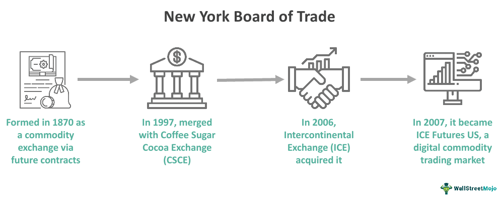

The New York Board of Trade (NYBOT) is among the oldest commodity futures exchanges in the United States, boasting a remarkable establishment history that dates back to 1870. Operating today under the aegis of the Intercontinental Exchange (ICE), NYBOT has played an instrumental role in shaping the landscape of commodity trading, particularly within New York. This article navigates the intricate integration of algorithmic trading within the NYBOT framework and examines its consequential impact on the world of commodity trading. A significant transformation emerged as trading methods evolved from the bustling traditional floors to an all-electronic trading system, reflecting broader technological advancements and a push towards efficiency in financial markets. These changes have not only streamlined trading processes but have also introduced new dimensions of speed and precision that were previously impossible. The ensuing discussions will highlight how these strategies have reshaped trading practices and what this means for the future of commodity trading in New York.

## Table of Contents



## History of the New York Board of Trade (NYBOT)

The New York Board of Trade (NYBOT) has its origins in the late 19th century, initially established as the New York Cotton Exchange in 1870. This institution emerged as a pivotal commodity futures exchange in the United States, facilitating the trading of cotton futures to manage price risk and speculation, which was essential for producers and traders during an era characterized by significant economic changes.

Throughout its history, NYBOT expanded its scope, both in terms of commodities traded and operational scale. A notable development occurred in 1997 when NYBOT acquired the Coffee, Sugar, and Cocoa Exchange (CSCE). This acquisition not only increased the range of commodities available for trading but also solidified NYBOT's position as a leading marketplace for these essential goods. The integration of the CSCE heralded a new chapter for the NYBOT, enabling it to cater to a broader spectrum of market participants seeking to engage in futures contracts for commodities beyond cotton.

In 2006, a transformative change took place when NYBOT became a part of the Intercontinental Exchange (ICE), a global network of exchanges and clearinghouses. This acquisition was a crucial step in modernizing NYBOT's operations, facilitating the transition from traditional physical trading floors to advanced electronic trading systems. The incorporation into ICE marked a shift towards leveraging technology to improve efficiency and accessibility in the trading process. Electronic trading platforms enhanced market participation by allowing more flexibility, reducing transaction times, and offering real-time data analytics, ultimately reshaping how commodities futures were traded at NYBOT.

The historical evolution of NYBOT is not merely a tale of acquisitions and technological advancements but also a reflection of the broader economic and technological trends that have influenced global financial markets.

## Commodities Traded on NYBOT

The New York Board of Trade (NYBOT) is renowned for its diverse portfolio of traded commodities, which includes cocoa, coffee, cotton, frozen concentrated orange juice, wood pulp, and sugar. Each of these commodities has its own unique market dynamics and risk factors, making futures contracts essential for traders. Futures contracts are derivative financial instruments that obligate the buyer to purchase, and the seller to sell, a specific quantity of a commodity at a predetermined price at a future date. This mechanism provides a vital function in commodity markets, allowing producers and consumers to hedge against potential adverse price movements and ensuring price stability and predictability.

Cocoa, one of the primary commodities traded on NYBOT, is subject to price fluctuations due to climatic conditions affecting its production mainly in West Africa, which supplies approximately 70% of the world’s cocoa beans. Similarly, coffee futures are significant on NYBOT, with market prices influenced by factors such as weather patterns, geopolitical events in major coffee-producing countries, and shifts in consumer demand.

Cotton is another key commodity traded, with its prices dependent on agricultural yield predictions, global demand from textile industries, and international trade policies. Trading in frozen concentrated orange juice (FCOJ) is particularly sensitive to weather conditions, especially in Florida, a major producer, where hurricanes can severely impact crop yields.

Wood pulp markets are influenced by the demand for paper products globally, while sugar trading reflects agricultural outputs and changing trade tariffs, especially in major sugar-producing and consuming countries. The futures contracts for these commodities enable participants to lock in prices, providing them with the opportunity to manage price risks effectively.

NYBOT's approach in offering a range of commodities has helped sustain its importance in both historical and contemporary settings. This diversity not only caters to a broad spectrum of market participants but also enhances market resilience, ensuring continued investor interest and market [liquidity](/wiki/liquidity-risk-premium). As a result, NYBOT remains a crucial player in the commodities sector, offering a blend of traditional trading with modern, efficient risk management tools.

## Transition to Algorithmic Trading

The shift from physical trading pits to electronic systems marked a pivotal transformation for the New York Board of Trade (NYBOT), enabling advanced [algorithmic trading](/wiki/algorithmic-trading) strategies to revolutionize the commodities market. Algorithmic trading relies on computer algorithms to automate trade processes, executing orders at speeds and frequencies beyond human capabilities. By utilizing real-time data and complex mathematical models, these algorithms can analyze market trends, determine optimal trade opportunities, and execute orders with precision.

This technological evolution significantly optimized trading efficiency, reducing the time and cost associated with manual trade execution. High-frequency trading, a subset of algorithmic trading, leverages minimal discrepancies in market prices to conduct trades in fractions of a second. This approach enhances market liquidity by ensuring a constant presence of buy and sell orders, thus facilitating smoother and more stable market operations.

Furthermore, algorithmic trading enhances price discovery mechanisms by reflecting real-time supply and demand dynamics with improved accuracy. The continuous analysis of vast datasets allows these algorithms to identify patterns and predict potential market movements, thereby providing traders with a strategic advantage.

By automating the trade process, algorithmic trading mitigates the risk of human error and decision-making biases, leading to more consistent and reliable trade outcomes. As NYBOT integrates these advanced systems, it continues to adapt to the demands of modern financial markets, maintaining its relevance in an increasingly digital trading environment.

## Impact of Algorithmic Trading on Market Dynamics

Algorithmic trading has brought transformative changes to market dynamics, particularly by reducing trading costs and enhancing the precision of transactions. By automating trade execution, algorithms minimize human errors and enable traders to capture fleeting market opportunities, which is essential for effective price discovery and [arbitrage](/wiki/arbitrage). This automation leads to tighter bid-ask spreads and lower transaction costs, benefiting both institutional and retail investors.

One of the most significant impacts of algorithmic trading is the increase in trading volumes. Automated systems can execute a vast number of trades in a fraction of a second, significantly boosting market activity. This heightened activity contributes to improved market liquidity, allowing traders to enter and [exit](/wiki/exit-strategy) positions with relative ease and limited impact on market prices. Consequently, this liquidity provision reduces market [volatility](/wiki/volatility-trading-strategies) on a broader scale. Continuous liquidity stabilizes prices and reduces the probability of extreme price swings, thus fostering a more stable trading environment.

However, algorithmic trading is not without challenges. The intricate nature of algorithms necessitates sophisticated risk management systems to mitigate potential risks such as flash crashes—sudden and drastic price drops triggered by automated trading mechanisms. These events highlight the need for robust trading algorithms capable of responding adaptively to unpredictable market conditions.

Developing effective risk management strategies is crucial in algorithmic trading. This often involves employing [machine learning](/wiki/machine-learning) techniques to predict market movements and adjust trading strategies accordingly. Consider the following example of a simple machine learning model using Python:

```python
from sklearn.ensemble import RandomForestClassifier
import numpy as np

# Example features: previous price changes, trading volume
X_train = np.array([[0.01, 100], [-0.01, 150], [0.02, 200], [0.0, 180]])
y_train = np.array([1, 0, 1, 0])  # Buy or sell decisions

# Initialize and train the model
model = RandomForestClassifier()
model.fit(X_train, y_train)

# Predict the next action based on new market data
X_new = np.array([[0.005, 120]])
prediction = model.predict(X_new)

action = "Buy" if prediction[0] == 1 else "Sell"
print(f"Algorithm's Action: {action}")
```

While algorithmic trading introduces the potential for more stable and efficient markets, it also necessitates a careful balance. Regulators, traders, and exchanges like NYBOT must continue to adapt to rapidly evolving technology to ensure market stability and integrity. Robust frameworks and adaptive algorithms remain critical for navigating the sophisticated landscape shaped by algorithmic trading.

## Challenges and Criticisms of Algorithmic Trading

Algorithmic trading, while integral to modern financial markets, has sparked several criticisms centered on its influence on market dynamics and fairness. One significant concern is the potential for algorithmic trading to create unfair market advantages, particularly through high-frequency trading ([HFT](/wiki/high-frequency-trading-strategies)) practices. High-frequency trading employs sophisticated algorithms to execute large volumes of orders at extremely high speeds. This capability allows certain market participants to capitalize on price discrepancies far quicker than traditional traders, potentially distorting market equality.

A critical aspect of this concern is the impact of HFT on market volatility. During periods of market stress, high-frequency trading algorithms can intensify price movements, exacerbating volatility rather than mitigating it. The rapid execution of trades in response to minor market fluctuations can lead to flash crashes—swift, deep drops in market prices followed by a quick rebound. A notable example is the flash crash of May 6, 2010, when U.S. stock markets plummeted and rebounded within minutes, a phenomenon partly attributed to high-frequency trading activities.

These developments have fueled discussions about the necessity of regulatory interventions to manage the potential negative impacts of algorithmic trading. Proposals have included implementing speed bumps in trading to slow down order executions or establishing minimum order resting times to reduce the advantages of speed. Additionally, circuit breakers and tighter scrutiny of trading algorithms are considered to prevent excessive market disruptions.

Moreover, the opacity of algorithmic trading systems poses risks, as the complexity of these systems can make it challenging to understand when and why errors occur, potentially leading to erroneous trades with significant financial consequences. This opacity necessitates advanced risk management systems that can anticipate and mitigate unintended actions.

The debate over algorithmic trading regulations underscores a need for a balanced approach that preserves the benefits of speed and efficiency while safeguarding against systemic risks. Continuous dialogues among regulators, market participants, and technologists are essential to developing frameworks that ensure fair and stable markets.

## The Future of NYBOT and Algorithmic Trading

As technology evolves, the New York Board of Trade (NYBOT), operating under the Intercontinental Exchange (ICE), is set to further integrate sophisticated trading algorithms. The primary aim is to harness the benefits of speed and efficiency that algorithmic trading offers, while ensuring market stability is maintained.

The ongoing development of algorithmic trading systems means that more advanced algorithms can be employed to make swift trading decisions. These systems are capable of processing vast amounts of market data in real-time, allowing trade execution at lightning speed. As algorithms grow more sophisticated, they offer enhanced predictive capabilities and better decision-making frameworks, thereby optimizing trading strategies.

A pivotal point for NYBOT will be balancing these advancements with the need to maintain market stability, which is essential to ensure fairness and prevent market abuse. This involves implementing robust risk management tools to monitor and control trading activities. These tools help prevent excessive volatility that could arise from high-frequency trading and safeguard against market disruptions.

In addition to optimizing trading strategies, future advancements in algorithmic trading could also improve market accessibility. By lowering barriers to entry, these technologies can democratize trading, enabling a broader range of participants to engage with commodity markets. This inclusivity may lead to a more vibrant and liquid market, potentially benefiting all stakeholders.

The integration of [artificial intelligence](/wiki/ai-artificial-intelligence) and machine learning into algorithmic trading systems holds particular promise. These technologies can enhance the adaptability of trading algorithms, making them more responsive to market changes. They enable the development of self-learning algorithms that improve over time, potentially leading to more efficient market operations.

As NYBOT continues to innovate in the field of algorithmic trading, it is well positioned to leverage these technologies to drive growth and remain a leader in the commodity trading sector. The focus will remain on balancing technological advancements with the imperative of maintaining fair and stable markets, ensuring that NYBOT continues to meet the needs of its participants while embracing the future of trading.

## Conclusion

The New York Board of Trade (NYBOT) has undergone significant transformation, echoing the broader shift towards digital and automated solutions within financial markets. This evolution highlights NYBOT's commitment to maintaining its influential role in commodity trading. By integrating algorithmic trading, NYBOT has modernized its operations, offering increased efficiency and liquidity to market participants.

Algorithmic trading leverages computer algorithms for executing trades at speeds and volumes beyond human capability, and its adoption by NYBOT signifies a critical adaptation to contemporary financial practices. This transition not only enhances the precision and cost-effectiveness of trading but also aligns with global trends towards automation in financial markets.

Looking ahead, the changing landscape of commodity trading will likely spur further innovations within NYBOT. As technology progresses, the development of more sophisticated trading algorithms is anticipated. NYBOT's future focus will be to harness these advancements while ensuring market stability and broadening market access. These ongoing innovations will be instrumental in defining the next chapter of NYBOT and its continued relevance in global commodity trading.

## References & Further Reading

[1]: Lynch, Scott. (2006). ["Electronic Trading Systems: A Guide to Understanding Why and How We Moved from Physical Trading Floors to an Electronic System"](https://www.msn.com/en-us/entertainment/news/the-10-best-nascar-movies-including-talladega-nights-cars/ar-AA1v3ynH). Wiley.

[2]: Aldridge, Irene. (2013). ["High-Frequency Trading: A Practical Guide to Algorithmic Strategies and Trading Systems"](https://www.ahmetbeyefendi.com/wp-content/uploads/2020/07/High-Frequency-Trading-Irene-Aldridge.pdf). Wiley.

[3]: Gomber, Peter, et al. (2011). ["High-Frequency Trading"](https://papers.ssrn.com/sol3/papers.cfm?abstract_id=1858626). New Palgrave Dictionary of Economics.

[4]: Austin, James, et al. (2016). ["Algo Bots and the Law: Technology, Automation, and the Regulation of Futures and Other Financial Markets"](https://en.wikipedia.org/wiki/Liam_Payne). CRC Press.

[5]: Mackenzie, Donald. (2005). ["An Engine, Not a Camera: How Financial Models Shape Markets"](https://academic.oup.com/mit-press-scholarship-online/book/20588). MIT Press.