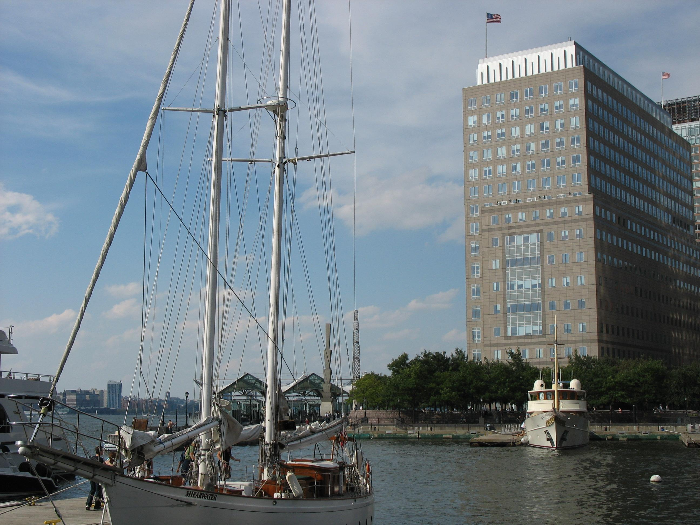

## Table of Contents

## What is the New York Board of Trade?

The New York Board of Trade, often called NYBOT, is a place where people trade things like coffee, sugar, and cotton. It started a long time ago in 1870. People come here to buy and sell these products, and they agree on prices for the future. This helps farmers and businesses know what they might earn or spend later.

NYBOT is important because it helps keep the market stable. When people trade here, they can plan better because they know what prices might be in the future. This helps everyone from farmers to big companies. In 2007, NYBOT joined with another big trading group called the Intercontinental Exchange, or ICE, to become even stronger.

## When was the New York Board of Trade founded?

The New York Board of Trade, or NYBOT, was founded in 1870. It's a place where people trade things like coffee, sugar, and cotton. People come here to buy and sell these products and agree on prices for the future.

This helps farmers and businesses plan better because they know what prices might be later. NYBOT is important because it helps keep the market stable. In 2007, NYBOT joined with another big trading group called the Intercontinental Exchange, or ICE, to become even stronger.

## What types of commodities are traded on the New York Board of Trade?

The New York Board of Trade, or NYBOT, is a place where people trade different kinds of things called commodities. Some of the main things they trade are coffee, sugar, and cotton. These are important because people use them every day, and farmers grow them.

Trading these commodities helps farmers and businesses plan better. When they trade at NYBOT, they can agree on prices for the future. This means farmers know how much money they might get for their crops, and businesses know how much they will have to spend. This makes the market more stable and helps everyone involved.

## How does the New York Board of Trade function as a futures exchange?

The New York Board of Trade, or NYBOT, works as a futures exchange by letting people buy and sell things like coffee, sugar, and cotton for a future date. When someone wants to trade, they agree on a price today for something they will get or give later. This is called a futures contract. Farmers might use these contracts to know how much money they will get for their crops in the future. Companies that need these products can also use them to know how much they will have to pay.

This system helps keep the market stable. When people trade futures at NYBOT, it helps everyone plan better. Farmers can decide what to grow based on what prices might be in the future. Companies can plan their budgets knowing what they will have to spend. This makes the market more predictable and helps everyone involved. In 2007, NYBOT joined with the Intercontinental Exchange, or ICE, to become even stronger and continue helping the market stay stable.

## What are the main indices or contracts offered by the New York Board of Trade?

The New York Board of Trade, or NYBOT, offers several main indices and contracts that people can trade. Some of the most important ones are for coffee, sugar, and cotton. These are called futures contracts, which means people agree on a price today for something they will buy or sell later. For example, the Coffee "C" futures contract is used a lot. It helps coffee growers and buyers know what prices might be in the future. The Sugar No. 11 futures contract is another big one, used for trading raw sugar. And the Cotton No. 2 futures contract is important for cotton trading.

These contracts are really helpful for farmers and businesses. Farmers can use them to plan what to grow because they know what prices might be in the future. This helps them decide if it's worth growing more coffee, sugar, or cotton. Companies that need these products can also plan better. They know how much they will have to pay, so they can set their budgets. This makes the market more stable and helps everyone involved. In 2007, NYBOT joined with the Intercontinental Exchange, or ICE, to become even stronger and keep helping the market stay stable.

## How has the New York Board of Trade evolved historically?

The New York Board of Trade, or NYBOT, started a long time ago in 1870. At first, it was a place where people traded things like coffee, sugar, and cotton. They would come to NYBOT to buy and sell these products and agree on prices for the future. This helped farmers and businesses plan better because they knew what prices might be later. Over the years, NYBOT grew and became more important in the world of trading. It helped keep the market stable by letting people trade futures contracts, which are agreements to buy or sell something at a future date.

In 2007, NYBOT joined with another big trading group called the Intercontinental Exchange, or ICE. This made NYBOT even stronger. Now, it's part of a bigger network that helps people trade all over the world. Even though NYBOT is now part of ICE, it still focuses on trading the same important things like coffee, sugar, and cotton. This merger helped NYBOT keep up with changes in the market and continue to help farmers and businesses plan for the future.

## What role does the New York Board of Trade play in the global economy?

The New York Board of Trade, or NYBOT, plays a big role in the global economy by helping people trade things like coffee, sugar, and cotton. It's a place where people from all over the world can come to buy and sell these products. They agree on prices for the future, which helps farmers and businesses plan better. When farmers know what prices might be later, they can decide what to grow. Companies that need these products can also plan their budgets because they know how much they will have to pay. This makes the market more stable and helps everyone involved.

Since NYBOT joined with the Intercontinental Exchange, or ICE, in 2007, it has become even more important in the global economy. Now, it's part of a bigger network that helps people trade all over the world. This merger made NYBOT stronger and helped it keep up with changes in the market. By focusing on important commodities like coffee, sugar, and cotton, NYBOT continues to help farmers and businesses plan for the future. This stability is good for the global economy because it helps everyone know what to expect and plan accordingly.

## Who are the major participants in the New York Board of Trade?

The major participants in the New York Board of Trade, or NYBOT, are farmers, traders, and big companies. Farmers come to NYBOT to sell their crops like coffee, sugar, and cotton. They use futures contracts to know what prices might be in the future. This helps them decide what to grow and how much they might earn. Traders are people who buy and sell these contracts. They might not grow or use the products themselves, but they make money by trading the contracts.

Big companies also play a big role at NYBOT. These companies need products like coffee, sugar, and cotton to make things like food and clothes. They use futures contracts to know how much they will have to pay for these products in the future. This helps them plan their budgets and make sure they can keep making their products. All these participants help keep the market stable by agreeing on prices for the future.

## How does one become a member of the New York Board of Trade?

To become a member of the New York Board of Trade, or NYBOT, you need to go through a process that involves meeting certain requirements. First, you have to apply for membership. This usually means filling out an application form and providing information about yourself or your company. You might also need to show that you have enough money or assets to trade on the exchange. Sometimes, you need to be sponsored by a current member, which means someone who is already part of NYBOT has to support your application.

Once your application is accepted, you will need to pay membership fees. These fees can be different depending on what kind of membership you want. There are different types of memberships, like full members who can trade all products, or associate members who might have limited trading rights. After paying the fees, you will be officially a member of NYBOT. As a member, you can start trading futures contracts for things like coffee, sugar, and cotton, and take part in the activities of the exchange.

## What are the regulatory bodies overseeing the New York Board of Trade?

The New York Board of Trade, or NYBOT, is watched over by a few important groups to make sure everything is fair and follows the rules. The main group is the Commodity Futures Trading Commission, or CFTC. This is a part of the U.S. government that looks after all futures trading in the country. They make sure that people trading on NYBOT are doing things the right way and not cheating.

Another group that helps keep an eye on NYBOT is the Intercontinental Exchange, or ICE, which NYBOT joined in 2007. ICE has its own rules and teams that check to make sure everyone is following them. Together, the CFTC and ICE help make sure that trading on NYBOT is safe and fair for everyone involved.

## How have technological advancements impacted trading at the New York Board of Trade?

Technological advancements have changed the way people trade at the New York Board of Trade, or NYBOT, a lot. Before, people had to go to the trading floor and shout out their trades. Now, with computers and the internet, people can trade from anywhere in the world. They use special software to buy and sell things like coffee, sugar, and cotton. This makes trading faster and easier because people don't have to be in the same place to trade.

These changes have also made trading more accurate and safe. Computers can keep track of all the trades and make sure everything is done correctly. They can also help people see what prices are like all over the world, so they can make better choices about when to buy or sell. Because of technology, NYBOT can work with the Intercontinental Exchange, or ICE, to help people trade even more easily and safely. This has made the market more stable and helped farmers and businesses plan better for the future.

## What are some significant events or crises that have affected the New York Board of Trade?

The New York Board of Trade, or NYBOT, has faced several big events and crises over the years. One big event was the merger with the Intercontinental Exchange, or ICE, in 2007. This change helped NYBOT become part of a bigger network and made trading easier and safer. But it also meant that NYBOT had to change how it worked to fit into the new group. Another big event was the 2008 financial crisis. This crisis made prices go up and down a lot, which made it hard for people trading on NYBOT to know what prices would be in the future. Farmers and businesses had a tough time planning because everything was so uncertain.

Another big crisis that affected NYBOT was the coffee crisis in the late 1990s and early 2000s. During this time, coffee prices dropped a lot because there was too much coffee being grown. This hurt coffee farmers a lot because they were not making enough money. It also made trading on NYBOT more difficult because people were not sure if they should buy or sell coffee. These events show how big changes and crises can affect trading at NYBOT and how everyone involved has to work together to keep things stable.

## References & Further Reading

[1]: Lynch, Scott. (2006). ["Electronic Trading Systems: A Guide to Understanding Why and How We Moved from Physical Trading Floors to an Electronic System"](https://www.msn.com/en-us/entertainment/news/the-10-best-nascar-movies-including-talladega-nights-cars/ar-AA1v3ynH). Wiley.

[2]: Aldridge, Irene. (2013). ["High-Frequency Trading: A Practical Guide to Algorithmic Strategies and Trading Systems"](https://www.ahmetbeyefendi.com/wp-content/uploads/2020/07/High-Frequency-Trading-Irene-Aldridge.pdf). Wiley.

[3]: Gomber, Peter, et al. (2011). ["High-Frequency Trading"](https://papers.ssrn.com/sol3/papers.cfm?abstract_id=1858626). New Palgrave Dictionary of Economics.

[4]: Austin, James, et al. (2016). ["Algo Bots and the Law: Technology, Automation, and the Regulation of Futures and Other Financial Markets"](https://en.wikipedia.org/wiki/Liam_Payne). CRC Press.

[5]: Mackenzie, Donald. (2005). ["An Engine, Not a Camera: How Financial Models Shape Markets"](https://academic.oup.com/mit-press-scholarship-online/book/20588). MIT Press.