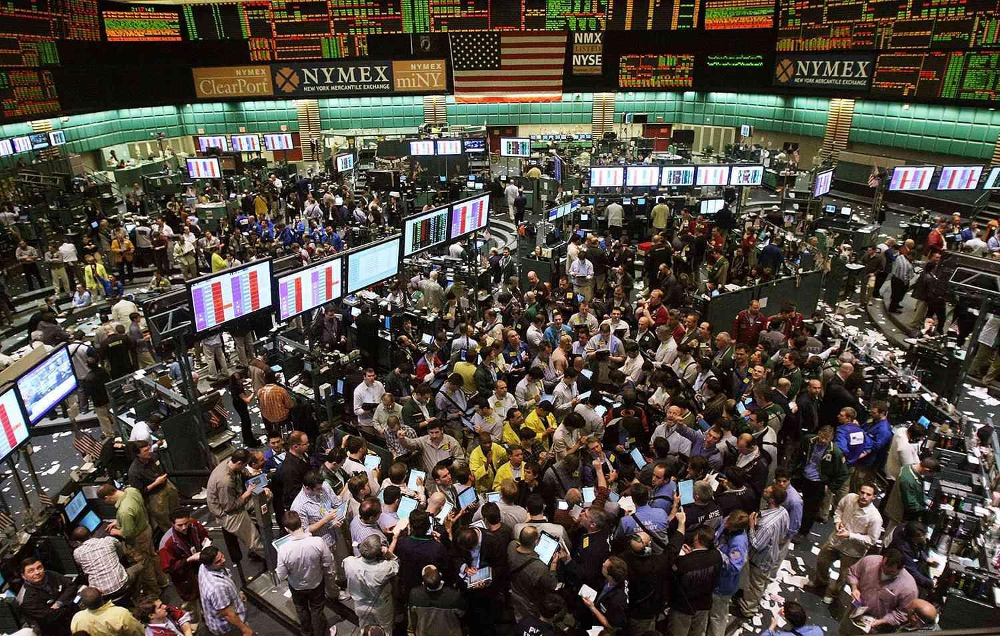

## Table of Contents

## What is the New York Futures Exchange?

The New York Futures Exchange, often called NYFE, is a place where people can buy and sell futures contracts. Futures contracts are agreements to buy or sell something at a future date for a price agreed upon today. This exchange is important for businesses and investors because it helps them manage risks related to price changes in things like oil, gold, or even financial products.

NYFE is located in New York City and is part of a bigger group called the New York Board of Trade. It's been around for a long time and has helped many people and companies plan for the future. By trading futures, people can protect themselves from big price swings that might hurt their businesses or investments.

## When was the New York Futures Exchange founded?

The New York Futures Exchange was founded in 1870. It started as a way for people to trade futures contracts, which are agreements to buy or sell something at a future date for a price agreed upon today. This was really helpful for farmers and businesses that needed to plan ahead and protect themselves from big changes in prices.

Over the years, the New York Futures Exchange grew and became part of the New York Board of Trade. It's located in New York City and has been important for many people and companies. By trading futures, they can manage risks and feel more secure about their future plans.

## What types of commodities are traded on the New York Futures Exchange?

The New York Futures Exchange trades many different types of commodities. These include things like agricultural products, such as corn, wheat, and soybeans. These are important because farmers and food companies use futures contracts to plan for the future and protect themselves from big changes in prices.

Besides agricultural products, the exchange also trades energy commodities like oil and natural gas. These are crucial for energy companies and businesses that use a lot of energy. By trading futures, they can manage the risk of price changes and make better plans for the future.

In addition to agricultural and energy commodities, the New York Futures Exchange also deals with metals like gold, silver, and copper. These are important for industries that use metals in their products. Trading futures for these commodities helps companies and investors protect themselves from price swings and plan their business strategies more effectively.

## How does trading work on the New York Futures Exchange?

Trading on the New York Futures Exchange works by people buying and selling futures contracts. A futures contract is like a promise to buy or sell something at a certain price on a certain date in the future. For example, a farmer might sell a futures contract for corn to make sure they get a good price even if the market goes down later. On the other hand, a food company might buy that contract to make sure they can get corn at a good price even if the market goes up.

When people trade on the exchange, they use a special system to make their trades. This system matches buyers and sellers so that the trades can happen quickly and fairly. Traders can be in the same room, shouting and using hand signals, or they can trade from their computers at home or in an office. The exchange keeps track of all the trades and makes sure everything is done correctly. This helps everyone feel confident that their trades are safe and that they can plan for the future.

## What are the trading hours of the New York Futures Exchange?

The New York Futures Exchange has set times when people can trade. It's open from Monday to Friday, and the trading hours are usually from 9:30 AM to 4:00 PM Eastern Time. These hours help make sure that everyone knows when they can buy and sell futures contracts.

Sometimes, the exchange might have special hours for certain commodities. For example, some energy products might have different trading times. It's a good idea to check the specific hours for the commodity you're interested in because they can change.

## Who regulates the New York Futures Exchange?

The New York Futures Exchange is regulated by the Commodity Futures Trading Commission, which is often called the CFTC. The CFTC is a part of the United States government that makes sure trading in futures markets is fair and honest. They watch over the exchange to make sure everyone follows the rules and that no one is cheating.

Besides the CFTC, the exchange also follows rules set by the National Futures Association, or NFA. The NFA is like a club for people and businesses that trade futures. They help make sure that everyone in the futures market is doing things the right way. Both the CFTC and the NFA work together to keep the New York Futures Exchange safe and trustworthy for everyone who uses it.

## What are the major indices associated with the New York Futures Exchange?

The New York Futures Exchange is home to several major indices that people use to understand the market and make trading decisions. One of the most well-known is the New York Stock Exchange Composite Index, which tracks the performance of all common stocks listed on the NYSE. This index gives a broad view of how the market is doing overall.

Another important index is the Dow Jones Industrial Average, which is often just called the Dow. It's made up of 30 big companies that represent different parts of the economy. People watch the Dow to see how these big companies are doing, which can give them an idea of how the whole economy is performing. Both of these indices are useful tools for traders and investors who use the New York Futures Exchange.

## How has the New York Futures Exchange evolved historically?

The New York Futures Exchange started back in 1870. At first, it was all about helping farmers and businesses plan for the future by trading futures contracts. These contracts let people agree on a price for things like corn or wheat today, even though they wouldn't buy or sell them until later. This was really helpful because it protected them from big price changes. Over time, the exchange grew and became part of the New York Board of Trade. It stayed in New York City and became a big place for trading all sorts of commodities.

As time went on, the New York Futures Exchange changed a lot. It started trading more than just farm products. They added things like oil, natural gas, and metals like gold and silver. This made the exchange even more important for different kinds of businesses and investors. The way people traded also changed. At first, traders were in the same room, shouting and using hand signals. But then, they started using computers to trade from anywhere. This made trading faster and easier. Today, the exchange is still a key place for people to manage risks and plan for the future.

## What are the key differences between the New York Futures Exchange and other major futures exchanges?

The New York Futures Exchange (NYFE) is different from other major futures exchanges in a few key ways. First, NYFE focuses a lot on commodities like agricultural products, energy, and metals. This makes it really important for businesses in these industries. Other exchanges, like the Chicago Mercantile Exchange (CME), might focus more on financial products like interest rates and stock indices. So, if you're a farmer or an oil company, you might go to NYFE, but if you're trading financial products, you might go to the CME.

Another big difference is where they are located and how they operate. NYFE is in New York City and is part of the New York Board of Trade. It's been around since 1870, so it has a long history. Other exchanges, like the Intercontinental Exchange (ICE) in Atlanta, might be newer or in different cities. Also, NYFE has changed over time to include electronic trading, but it started with people trading in the same room. Other exchanges might have started with electronic trading or have different ways of doing things.

## What technological advancements have impacted trading on the New York Futures Exchange?

Technological advancements have made a big difference in how people trade on the New York Futures Exchange. Before, traders had to be in the same room, shouting and using hand signals to buy and sell futures contracts. But now, they can use computers to trade from anywhere. This is called electronic trading, and it makes things faster and easier. People can see prices and make trades in seconds, which helps them make better decisions and react quickly to changes in the market.

Another important technology is the use of algorithms and automated trading systems. These are like special computer programs that can make trades without people having to do it themselves. They can look at a lot of data really fast and make trades based on what they see. This helps traders manage risks better and can even find good opportunities that people might miss. Overall, these technologies have made the New York Futures Exchange more efficient and accessible to more people.

## How do global economic events influence trading on the New York Futures Exchange?

Global economic events can have a big impact on trading at the New York Futures Exchange. When something big happens in the world, like a change in oil prices or a new law about trade, it can make the prices of commodities go up or down. For example, if there's a problem with oil supplies because of a war, the price of oil futures might go up a lot. Traders at the exchange watch these events closely because they need to decide whether to buy or sell based on what's happening around the world.

These events can also affect how much people want to buy or sell certain things. If there's a big economic crisis, people might be more careful with their money and not want to take as many risks. This can make trading slower and prices less stable. On the other hand, good news, like a new trade deal, can make people feel more confident and trade more. So, traders at the New York Futures Exchange always need to keep an eye on what's happening globally to make the best decisions.

## What are some strategies used by traders on the New York Futures Exchange to manage risk?

Traders on the New York Futures Exchange use different strategies to manage risk. One common strategy is called hedging. This means they buy or sell futures contracts to protect themselves from big price changes. For example, a farmer might sell futures contracts for their crops to make sure they get a good price, even if the market goes down later. This helps them feel more secure about their future earnings.

Another strategy is diversification. Traders spread their money across different types of commodities, like oil, gold, and corn. This way, if the price of one commodity goes down, they might still make money from the others. It's like not putting all your eggs in one basket. By doing this, traders can reduce the risk of losing a lot of money if one thing doesn't go as planned.

## What is Understanding Futures Trading?

Futures contracts represent essential financial instruments that place an obligation on the buyer or seller to transact an asset at a specified price on a predetermined future date. These contracts serve as a critical component in the financial ecosystem, providing mechanisms for hedging and speculative strategies across various asset classes, including commodities, indices, and currencies.

Hedging with futures involves mitigating the risk of price fluctuations in the underlying asset. For instance, an agricultural producer, such as a wheat farmer, can lock in a selling price for their product by entering into a futures contract. This contract allows the farmer to stabilize revenue regardless of market volatility, absorbing adverse price movements while still maintaining operational certainty.

Conversely, speculation involves taking calculated bets on the future direction of market prices. Traders and investors can speculate on futures by buying contracts if they predict a price increase or selling contracts if they anticipate a decline. This practice can potentially yield significant profits, although it carries inherent risks due to market [volatility](/wiki/volatility-trading-strategies).

The futures market is influenced by a multitude of factors, encompassing economic indicators like inflation rates, employment [statistics](/wiki/bayesian-statistics), and GDP growth. Market events such as geopolitical developments, government policy changes, and natural disasters can also sway futures prices. Furthermore, investor sentiment, which reflects the overall attitude and outlook of market participants, plays a pivotal role in shaping market dynamics. Sentiment indicators, such as the CBOE Volatility Index (VIX), capture the level of market fear or complacency, impacting trading decisions.

The mathematical foundation of futures pricing can be expressed by the cost-of-[carry](/wiki/carry-trading) model, which considers variables such as the spot price of the underlying asset, the risk-free [interest rate](/wiki/interest-rate-trading-strategies), and storage costs. The futures price (F) can be represented as:

$$
F = S \times (1 + r)^T + C
$$

where:
- $S$ is the spot price,
- $r$ is the risk-free interest rate,
- $T$ is the time to maturity,
- $C$ denotes carrying costs.

In computational finance, Python libraries like NumPy and Pandas are often employed to model and simulate futures pricing, allowing traders to analyze historical data and forecast future market scenarios.

Futures trading thus plays a significant role in the financial markets, enabling comprehensive risk management and informed speculative activities amidst variable economic and market conditions.

## References & Further Reading

[1]: Danthine, J.P. (1978). ["Information, Futures Prices, and Stabilizing Speculation."](https://www.sciencedirect.com/science/article/pii/0022053178901242) Journal of Economic Theory, 18(1), 17-27.

[2]: Hull, J. C. (2006). ["Options, Futures, and Other Derivatives."](https://www.semanticscholar.org/paper/Options%2C-Futures%2C-and-Other-Derivatives-Hull/89bdee500c8623864fc9eb7a471546aa713acc44) Prentice Hall.

[3]: Aldridge, I. (2013). ["High-Frequency Trading: A Practical Guide to Algorithmic Strategies and Trading Systems."](https://onlinelibrary.wiley.com/doi/pdf/10.1002/9781119203803.fmatter) Wiley.

[4]: Narang, R.K. (2013). ["Inside the Black Box: A Simple Guide to Quantitative and High Frequency Trading."](https://onlinelibrary.wiley.com/doi/book/10.1002/9781118662717) Wiley.

[5]: Katz, J.O., & McCormick, D.L. (2000). ["The Encyclopedia of Trading Strategies."](https://www.amazon.com/Encyclopedia-Trading-Strategies-Jeffrey-Ph-D/dp/0070580995) McGraw-Hill Education.