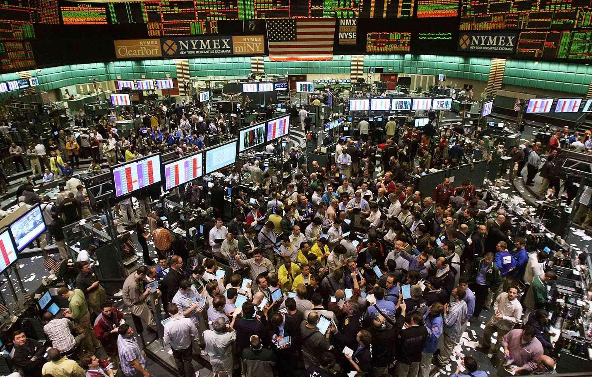

The New York Mercantile Exchange (NYMEX) stands as a pivotal entity in global commodities trading, influencing markets with its comprehensive frameworks for trading energy and other commodities. Within this significant market ecosystem, algorithmic trading has emerged as an essential tool for modern investors and financial professionals. Algorithmic trading employs advanced mathematical models and sophisticated software to execute trading decisions, transforming how participants interact with financial markets.

At NYMEX, where price discovery and risk management serve as core functions, algorithmic trading strategies are meticulously designed to exploit these functions for optimized trading outcomes. The blending of technology with traditional market platforms has facilitated enhanced efficiency and precision in trading activities. In examining the interactions between NYMEX and algorithmic trading, it becomes clear that technological advancements have significantly influenced trading strategies and operations within this preeminent exchange.

Given the unceasing advancement of technology and the dynamism of global markets, understanding the current dynamics is imperative for those engaged in trading. This article endeavors to illuminate the multifaceted relationship between NYMEX and algorithmic trading, underscoring the critical impact of these interactions on market participants and trading efficiencies. As financial markets continue to evolve, a comprehensive understanding of these dynamics will be more crucial than ever for leveraging opportunities and mitigating potential risks.

## Table of Contents

## Understanding NYMEX: A Brief Overview

The New York Mercantile Exchange (NYMEX), established in 1872, stands as one of the world's largest commodity futures exchanges. It serves as a regulated platform for trading a broad array of energy commodities, metals, and other essential goods. NYMEX is instrumental in price discovery and establishing benchmark prices for diverse commodities—factors that exert considerable influence on global economic dynamics.

The functionality of NYMEX as an exchange is central to providing [liquidity](/wiki/liquidity-risk-premium) and risk management solutions for various market participants, including producers, traders, and investors. This role is critical, as it enables efficient trade execution and fosters market stability.

In recent years, electronic trading has become increasingly prevalent at NYMEX, mirroring a broader trend of technological integration within the financial industry. This shift toward digital platforms enhances trading efficiency, allowing for faster execution of trades and improved access to market information. The electronic systems provide traders with sophisticated tools to optimize their strategies, aligning with the overarching movement towards automation and digitalization in global markets.

## How Algorithmic Trading Works on NYMEX

Algorithmic trading leverages sophisticated algorithms to execute transactions at high speed and precision. This approach enables traders to capitalize on market inefficiencies, especially appealing in the fast-paced environment of the New York Mercantile Exchange (NYMEX), where time and accuracy are crucial. At NYMEX, such trading strategies are particularly prevalent in energy commodities and precious metals markets due to their inherent complexities and [volatility](/wiki/volatility-trading-strategies).

In the commodity markets of NYMEX, algorithms are designed to navigate these complexities by parsing large volumes of market data to identify trading opportunities. An example is the identification of price discrepancies or inefficiencies that can be exploited through [arbitrage](/wiki/arbitrage). Arbitrage strategies involve the simultaneous purchase and sale of equivalent commodities in different markets to take advantage of price differences, thus ensuring profitable transactions with minimal risk.

Moreover, algorithmic strategies are employed for hedging purposes, allowing traders to mitigate risks associated with price movements in the commodities market. This involves creating positions that counterbalance potential losses in the market, thereby stabilizing potential revenue streams.

Access to real-time data feeds is crucial for the successful implementation of [algorithmic trading](/wiki/algorithmic-trading) on NYMEX. These data feeds provide continuous updates on market activity, enabling algorithms to respond instantaneously to changes and execute trades with optimal timing. Sophisticated trading platforms like CME Globex offer a suite of tools that enhance the efficiency of algorithmic trading. These platforms support high-frequency trading and provide the technological infrastructure needed for the rapid execution of trades, promoting both liquidity and tighter spreads in the market.

The tools available through these electronic platforms equip traders with the capabilities to fine-tune their strategies with precision and speed, essential for maintaining a competitive edge in the commodities market. By integrating live data analytics and automated decision-making, algorithmic trading optimizes trade execution, thus maximizing profitability and minimizing the latency associated with traditional trading methods.

## Impact of Algorithmic Trading on Commodity Markets

Algorithmic trading has revolutionized commodity markets, primarily by significantly enhancing liquidity, which is crucial for efficient market operations. Liquidity refers to the ease with which assets can be bought or sold in the market without affecting their price. The implementation of algorithmic trading provides the capability to process large volumes of trading data at unprecedented speeds, allowing for quicker and more efficient price discovery. This efficiency is particularly advantageous for identifying and responding to minute market fluctuations.

One of the key outcomes of algorithmic trading is the facilitation of high-frequency trading ([HFT](/wiki/high-frequency-trading-strategies)). HFT strategies rely on executing a large number of trades at extremely high speeds, typically aiming for small profit margins that, when aggregated, can yield substantial returns. This speed and efficiency lead to tighter bid-ask spreads, which represent the difference between the highest price a buyer is willing to pay and the lowest price a seller is prepared to accept. Tighter spreads reduce transaction costs and provide more advantageous prices for all market participants.

However, the efficiency gains from algorithmic trading come with the potential downside of increased market volatility. During periods of market stress, the rapid execution of trades based on algorithmic models can exacerbate price swings, leading to more pronounced volatility. This phenomenon occurs because algorithms might react simultaneously to market signals or events, amplifying price movements.

Traditional market players, who may not rely on algorithmic strategies, face the challenge of adapting to a trading environment that has become faster and more complex. The speed at which trades are executed can outpace the decision-making processes of traders who do not use automated systems, potentially putting them at a competitive disadvantage.

As algorithmic trading practices evolve, regulatory frameworks continue to adapt in response to the unique challenges they present. Regulatory bodies worldwide are working to create comprehensive policies that ensure market integrity and protect participants from the potential risks associated with high-speed trading. These frameworks consider aspects such as market transparency, risk management, and the prevention of market abuse potentially facilitated by algorithmic trading systems.

In summary, while algorithmic trading enhances market liquidity and efficiency, it also introduces complexities that market participants and regulators must navigate. As commodity markets continue to evolve, the impact of algorithmic trading will remain a focal point for traders, investors, and policymakers.

## Strategies Employed in Algorithmic Trading on NYMEX

In algorithmic trading on NYMEX, several well-established strategies are employed to optimize trading outcomes. These strategies rely heavily on mathematical models, data analysis, and computational power to make real-time trading decisions.

1. **Trend Following**: This strategy focuses on identifying and capitalizing on sustained movements in commodity prices over a period. By using historical price data, trend-following algorithms attempt to predict and exploit long-term upward or downward trends. The core idea is that commodities will continue moving in a set direction long enough for traders to profit. Traders use indicators such as moving averages and the Relative Strength Index (RSI) to help confirm trends. The algorithm might execute trades based on a simple rule like: 
$$
   \text{if } P_t > MA(P_{t-n}, \dots, P_{t-1}), \text{ then buy}

$$

   where $P_t$ is the current price, and $MA$ represents the moving average of past $n$ prices.

2. **Statistical Arbitrage**: This involves exploiting short-term pricing inefficiencies between related commodities. Statistical arbitrage models often utilize mean reversion principles, where it is assumed that prices will return to a historical equilibrium. Pairs trading is a common method—a trader identifies two correlated commodities and takes advantage of deviations from their usual price relationship. For instance, if the price gap widens beyond its historical average, the algorithm might short the relatively overvalued commodity and long the undervalued one. The key is to employ statistical tests to determine periods of divergence.

3. **Market Making**: Market-making strategies aim to profit from the bid-ask spread by providing liquidity through continuous buy and sell quotes. Algorithms use sophisticated models to assess the fair value of a commodity and adjust the bid and ask prices accordingly. This approach requires rapid execution and constant market observation to adjust quotes based on the real-time flow of orders. The typical objective is to capture small, consistent profits on each trade while minimizing risk exposure.

4. **Combining Strategies**: Successful algo traders often integrate multiple strategies to balance risk and enhance profitability. For instance, combining trend following with market making can allow for capturing larger trends while also profiting from daily price fluctuations. Quantitative analysis and backtesting of historical market data are crucial to refining these integrated approaches, ensuring strategies remain robust under varying market conditions.

5. **Risk Management**: Integral to all strategies are risk management tools designed to protect capital. Algorithms are equipped with stop-loss orders, position size controls, and volatility filters to mitigate potential losses during unexpected market movements. Effective risk management ensures that losses are minimized when market conditions deviate from expected patterns.

In summary, algorithmic trading on NYMEX employs diverse strategies tailored to exploit both long-term and short-term opportunities in commodity markets. These strategies are underpinned by rigorous analysis and technology, providing traders with the ability to execute precise, efficient trades in a highly competitive environment.

## Challenges and Considerations in NYMEX Algo Trading

The complexity of developing and maintaining profitable algorithms for NYMEX trading requires significant expertise and resources. Developing effective algorithms involves understanding both the intricacies of the commodities being traded and the NYMEX market dynamics. This task often demands a multidisciplinary approach, integrating knowledge from mathematics, [statistics](/wiki/bayesian-statistics), computer science, and finance.

Market conditions can change rapidly, necessitating algorithms that are adaptable and responsive to new information. Commodities markets are influenced by various factors, including geopolitical events, seasonal changes, supply chain dynamics, and regulatory updates. As such, algorithms must be continually updated to reflect the latest market data and trends. This often involves implementing adaptive strategies or [machine learning](/wiki/machine-learning) models that can adjust their parameters as new data becomes available.

The reliance on technology introduces potential risks related to system failures and cybersecurity threats. As trading algorithms are software-driven, they are susceptible to technical glitches, which can lead to significant financial losses if not promptly addressed. Additionally, the cybersecurity aspect is crucial, as trading platforms are often targets for cyber-attacks that could compromise sensitive financial data or disrupt trading activities.

Traders must remain vigilant about regulatory changes that could impact algorithmic trading practices. Regulatory bodies frequently update rules to ensure fair trading practices and market stability. Therefore, algo traders need to stay informed about any regulatory changes that might affect their algorithms or trading strategies. Non-compliance with regulations can result in hefty fines or legal repercussions.

Continuous testing and refinement of algorithms are crucial to maintaining competitive advantages in a fast-paced trading environment. This process often involves [backtesting](/wiki/backtesting) strategies using historical data to assess their effectiveness and identify potential weaknesses. Traders also utilize simulation environments to test their algorithms under various market scenarios before deploying them in live trading. Effective use of these practices can aid traders in staying competitive and reducing the risk of unforeseen market impacts on their trading strategies.

In conclusion, while NYMEX algo trading offers opportunities for significant profit, it also presents various challenges that require careful consideration and strategic management. By paying attention to these challenges, traders can harness the power of algorithmic trading to optimize their market involvement.

## Conclusion

The integration of algorithmic trading into the NYMEX commodities market marks a significant transformation in trading practices. This evolution is characterized by the use of sophisticated algorithms to enhance decision-making efficiency, streamline transactions, and optimize trading outcomes. For traders and investors, mastering the intricate details of algorithmic strategies, alongside a deep understanding of NYMEX market dynamics, is crucial for navigating these changes successfully.

As technological advancements continue to reshape financial markets, the role of algorithmic trading is set to expand. It is poised to bring about even greater levels of efficiency and precision in commodity trading. Consequently, staying informed about the latest developments in this domain becomes vital for traders aiming to leverage new opportunities and mitigate associated risks effectively.

The interplay between NYMEX and algorithmic trading underscores the ever-changing landscape of global commodity markets. This dynamic environment demands constant adaptation from market participants, highlighting the importance of agility and technological proficiency in achieving sustainable success in modern trading arenas.

## References & Further Reading

[1]: Aldridge, I. (2013). ["High-Frequency Trading: A Practical Guide to Algorithmic Strategies and Trading Systems"](https://www.amazon.com/High-Frequency-Trading-Practical-Algorithmic-Strategies/dp/1118343506). John Wiley & Sons.

[2]: Gomber, P., Arndt, B., Lutat, M., & Uhle, T. (2011). ["High-Frequency Trading"](https://papers.ssrn.com/sol3/papers.cfm?abstract_id=1858626). Iosco World Bank Report.

[3]: Narang, R. K. (2013). ["Inside the Black Box: A Simple Guide to Quantitative and High-Frequency Trading"](https://onlinelibrary.wiley.com/doi/book/10.1002/9781118662717). John Wiley & Sons.

[4]: Kumar, A. S., & Bhavani, N. G. (2018). ["Algorithmic Trading"](https://www.researchgate.net/publication/378287610_Machine_learning_in_financial_markets_A_critical_review_of_algorithmic_trading_and_risk_management) IEEE Computational Intelligence Magazine.

[5]: Kissell, R. (2013). ["The Science of Algorithmic Trading and Portfolio Management"](https://www.sciencedirect.com/book/9780124016897/the-science-of-algorithmic-trading-and-portfolio-management). Academic Press.