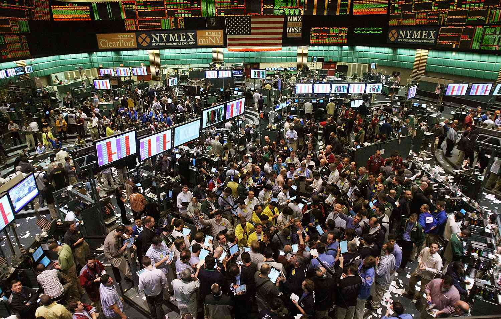

The evolution of commodities trading has been profound, largely driven by advancements in technology and the proliferation of sophisticated financial platforms. Central to this transformation is the New York Mercantile Exchange (NYMEX), established as a key player in the exchange of physical commodity futures. NYMEX facilitates the trading of various commodities, including energy products, metals, and more, contributing to efficient price discovery and risk management for market participants. 

In recent years, algorithmic trading has emerged as a pivotal development in commodities trading, utilizing complex algorithms and computational power to optimize trading strategies and execution. These algorithms process vast amounts of market data at unprecedented speeds, enabling traders to respond swiftly to market changes and capitalize on pricing inefficiencies. By automating trading processes, algorithmic trading reduces human error and allows for more precise and efficient market operations.



This article examines the synergy between commodity trading on NYMEX and the impact of algorithmic trading, emphasizing the importance of this intersection for modern traders. The insights offered here aim to provide a comprehensive understanding of how these elements interact, which is critical for participants navigating today's dynamic financial markets.

## Table of Contents

## Understanding NYMEX: A Brief Overview

The New York Mercantile Exchange (NYMEX), founded in 1872, remains a significant institution in the world of commodity futures trading. As the largest physical commodity futures exchange, NYMEX plays a crucial role in facilitating the trading of futures and options contracts related to energy, metals, and agricultural commodities. Now part of the CME Group, NYMEX aids in price discovery and risk management for a myriad of commodities, including crude oil, natural gas, gold, and various agricultural products. 

The exchange's journey from its inception to its current status reflects the broader evolution of financial markets. Initially, NYMEX operated as an open-outcry market, where traders would physically gather on the trading floor to execute buy and sell orders. This traditional method was characterized by colorful jackets, hand signals, and vocal trades, which allowed for a vibrant but sometimes chaotic environment. As technology advanced, NYMEX transitioned to predominantly electronic trading platforms. This shift has significantly enhanced market efficiency, facilitating faster trade execution and greater accessibility for global participants. Electronic trading reduces the geographical barriers, allowing a diverse range of traders to participate from anywhere in the world, thus increasing overall market liquidity and efficiency.

This electronic evolution has not diminished the importance of understanding the core functions of NYMEX. For traders in the commodities market, a comprehensive grasp of how NYMEX operates is essential. It serves as a benchmark for pricing various commodities, influencing global economic indicators and providing critical data for decision-making in related industries. Additionally, the exchange offers tools that are vital for managing financial risk. Through futures contracts, traders and businesses can hedge against potential price fluctuations, mitigating potential losses from adverse market movements.

Moreover, NYMEX's integration into the CME Group further amplifies its impact, providing a broader spectrum of financial instruments and enhancing its technological infrastructure. The synergies derived from this integration allow for innovative financial products and services that cater to a wide array of trading strategies and risk management needs.

In summary, NYMEX's development from a bustling open-outcry market to a sophisticated electronic trading platform underscores its importance in commodities trading. Understanding its functionality and evolution is essential for traders seeking to navigate commodity markets effectively.

## How Algorithmic Trading Works on NYMEX

Algorithmic trading on the New York Mercantile Exchange (NYMEX) involves the use of sophisticated mathematical models and computer software to facilitate the rapid and accurate execution of trades. This method is especially prevalent in the trading of energy commodities such as [crude oil](/wiki/crude-oil) and natural gas, as well as precious metals like gold and silver, due to the inherently fast-paced and volatile nature of these markets.

The core mechanism of [algorithmic trading](/wiki/algorithmic-trading) on NYMEX lies in the exploitation of real-time data feeds integrated with advanced trading platforms like CME Globex. These platforms process vast amounts of market data in milliseconds, allowing traders to make informed decisions based on current market conditions. Algorithms analyze this data to detect patterns, trends, and pricing disparities, enabling traders to enter and [exit](/wiki/exit-strategy) positions at the most opportune times. 

For instance, an algorithm might monitor the futures prices of crude oil and identify a potential upward trend through analysis of historical price movements combined with current market indicators. The algorithm can thus execute buy orders automatically at specified trigger points, optimizing entry points and minimizing human reaction time.

Moreover, algorithmic trading strategically targets inefficiencies within the market. By swiftly capitalizing on temporary mispricing or anomalies, such as discrepancies between spot prices and futures contracts, algorithms maximize potential returns. This not only enhances individual trading results but also contributes to overall market efficiency by ensuring that prices remain accurate and reflective of real-time supply and demand dynamics.

In summary, the utilization of algorithmic trading on NYMEX is a critical tool for traders looking to leverage technology for improved trade execution. By harnessing real-time data and advanced platform capabilities, algorithms allow for greater precision and speed, ultimately improving market outcomes for participants.

## Impact of Algorithmic Trading on Commodity Markets

Algorithmic trading has profoundly reshaped the landscape of commodity markets, notably enhancing market [liquidity](/wiki/liquidity-risk-premium). By employing algorithmic models, traders can execute orders with precision and speed, facilitating efficient price discovery and minimizing transaction costs. This improvement is primarily due to the ability of algorithms to scrutinize and respond to vast datasets in real-time, optimizing trade outcomes.

High-frequency trading ([HFT](/wiki/high-frequency-trading-strategies)), a subset of algorithmic trading, has emerged as a powerful tool in the commodities domain. HFT strategies are designed to capitalize on minimal price discrepancies over very short periods, contributing to tighter bid-ask spreads. These strategies enable market participants to engage in efficient pricing, ensuring commodities are traded closer to their true market value. By fostering competitive markets, HFT mitigates instances of extreme price divergence, thus stabilizing the trading environment.

Nonetheless, the advantages provided by algorithmic trading are not without challenges. During periods of market stress, such as geopolitical events or significant economic announcements, the same algorithms that enhance market efficiency can exacerbate [volatility](/wiki/volatility-trading-strategies). Rapid, automated selling or buying can lead to dramatic price swings, raising concerns about systemic risks. Therefore, regulatory frameworks must evolve to manage these risks, ensuring that the benefits of speed and efficiency do not come at the expense of market stability.

Despite these potential disadvantages, the positive impact of algorithmic trading on commodity markets is substantial. The automation and refinement of trading processes not only elevate operational efficiency but also support a more integrated and responsive market infrastructure. This evolution enables traders and investors to adapt to market trends with greater agility, enhancing their capacity to manage risks and seize opportunities in a highly dynamic trading environment.

## Strategies Employed in Algorithmic Trading on NYMEX

In algorithmic trading on the New York Mercantile Exchange (NYMEX), several strategies are utilized to optimize trading outcomes and manage risks. These strategies are critical for traders looking to gain a competitive edge in the highly dynamic commodity markets.

### Trend Following

Trend following is a widely used strategy that leverages historical price data to identify persistent trends in commodity prices. This approach is based on the belief that prices follow a trajectory that, once established, is likely to continue. Traders employing trend-following algorithms analyze historical data using statistical methods to predict future price movements. These algorithms often incorporate technical indicators such as moving averages and [momentum](/wiki/momentum) oscillators to generate trading signals. An example of a simplified Python implementation of a moving average crossover strategy might look like:

```python
import pandas as pd

def moving_average(df, short_window, long_window):
    short_mavg = df['price'].rolling(window=short_window, min_periods=1).mean()
    long_mavg = df['price'].rolling(window=long_window, min_periods=1).mean()
    df['signal'] = 0
    df['signal'][short_window:] = np.where(short_mavg[short_window:] > long_mavg[short_window:], 1, 0)
    df['positions'] = df['signal'].diff()
    return df
```

### Statistical Arbitrage

Statistical [arbitrage](/wiki/arbitrage) exploits short-term price inefficiencies between correlated commodities. This strategy relies on sophisticated mathematical models to detect and act on pricing discrepancies while assuming that prices will eventually revert to their historical norms. Pairs trading, a common [statistical arbitrage](/wiki/statistical-arbitrage) method, involves taking opposing positions in two correlated commodities, aiming to profit from their divergence and convergence. The key challenge is ensuring that the statistical relationship between the commodities is strong and consistent over time.

### Market Making

Market making is a strategy where traders provide liquidity to the market by continuously quoting buy and sell prices. Profit is derived from the bid-ask spread — the difference between the highest price a buyer is willing to pay and the lowest price a seller is willing to accept. Market makers employ algorithms to dynamically adjust their quotes based on market conditions, often using models that predict short-term price movements to manage inventory risk.

### Combining Strategies

Integrating various algorithms can enhance trading performance by balancing risk and return. For instance, combining [trend following](/wiki/trend-following) with statistical arbitrage might allow traders to capitalize on both longer-term trends and short-term mispricings. Strategy diversification can help mitigate the risks associated with relying on a single approach and improve overall portfolio robustness.

### Risk Management

Effective risk management is crucial in algorithmic trading, especially given the fast-paced and unpredictable nature of commodity markets. Algorithms often include risk management tools such as stop-loss orders, which automatically close positions at predefined loss thresholds to prevent significant losses. Additionally, position sizing and portfolio diversification are fundamental techniques to control exposure and manage volatility.

In conclusion, the use of algorithmic strategies like trend following, statistical arbitrage, and [market making](/wiki/market-making) has become integral for successfully navigating trading on the NYMEX. By combining different strategies and implementing rigorous risk management protocols, traders can optimize their performance and mitigate potential losses in volatile markets.

## Challenges and Considerations in NYMEX Algo Trading

Creating effective trading algorithms on the New York Mercantile Exchange (NYMEX) presents several challenges and considerations that market participants must address for successful outcomes. A foundational requirement is a profound understanding of commodities and market dynamics, which is essential for developing algorithms that accurately anticipate market movements and make informed trading decisions.

Market conditions are inherently volatile, with rapid fluctuations influenced by geopolitical events, economic data releases, and changes in supply and demand dynamics. As such, algorithms must be highly adaptable, equipped to respond to sudden changes in the trading environment. This adaptability often involves implementing [machine learning](/wiki/machine-learning) techniques that allow algorithms to learn from historical data and update their strategies accordingly.

For example, the use of predictive models such as autoregressive integrated moving average (ARIMA) or machine learning algorithms like random forests or neural networks can help in forecasting commodity prices and volatility. Here's a basic Python example using ARIMA for time series forecasting:

```python
import pandas as pd
from statsmodels.tsa.arima.model import ARIMA

# Load historical data
data = pd.read_csv('commodity_prices.csv')
prices = data['price']

# Fit ARIMA model
model = ARIMA(prices, order=(5, 1, 0))
model_fit = model.fit()

# Make a prediction
forecast = model_fit.forecast(steps=1)
print(f'Predicted price: {forecast[0]}')
```

The reliance on technology in algorithmic trading introduces risks associated with system failures and cybersecurity threats. Ensuring robustness and security of trading systems is imperative to protect against such vulnerabilities. This involves implementing comprehensive cybersecurity measures, such as employing encryption techniques, multi-[factor](/wiki/factor-investing) authentication, and active system monitoring to detect and respond to potential threats immediately.

Furthermore, compliance with regulatory requirements is critical in algorithmic trading. The financial industry is subject to stringent regulations, with ongoing updates that traders must adhere to for legality and ethical considerations. Violations can result in significant penalties and damage to reputation. Therefore, continuous monitoring of regulatory developments and incorporating compliance checks within trading algorithms is vital. Using automated compliance software can help streamline this process.

In summary, the complexities of algorithmic trading on NYMEX stem from the need for sophisticated algorithm design, technological reliability, and strict regulatory adherence. Addressing these challenges is crucial for leveraging the full potential of algorithmic trading while managing associated risks effectively.

## Conclusion

Algorithmic trading has significantly transformed how commodities are traded on the New York Mercantile Exchange (NYMEX), providing increased efficiency and precision in executing trades. The integration of advanced algorithms into trading practices enables market participants to execute transactions at speeds and scales previously unattainable through manual methods. These technological advancements result in more accurate pricing and improved liquidity, which are critical factors in efficiently functioning markets.

For traders aiming to succeed in this environment, a deep understanding of algorithmic strategies, paired with insights into the dynamics of the NYMEX market, is crucial. Algorithmic strategies such as trend following, statistical arbitrage, and market making are not just theoretical concepts; they are practical tools that have the power to exploit market inefficiencies and generate profits. Effective implementation of these strategies demands a comprehensive grasp of both technical indicators and fundamental market drivers.

As technology continues to advance, the role of algorithmic trading is expected to expand further, creating new opportunities and challenges within the commodities markets. The rapid evolution of technology continually introduces tools that can enhance trading strategies, making it imperative for traders and investors to stay updated on the latest technological developments. This vigilance enables market participants to capitalize on emerging opportunities while also managing the associated risks.

In conclusion, algorithmic trading represents a dynamic force in NYMEX commodity trading. By leveraging cutting-edge technology and maintaining a firm grasp of market trends and innovations, traders can effectively navigate the complexities of modern financial markets. Continued education and adaptation are key to leveraging these opportunities and mitigating risks, ensuring sustained success in the fast-paced world of commodities trading.

## References & Further Reading

1. **Books:**
   - *Algorithmic Trading: Winning Strategies and Their Rationale* by Ernest P. Chan. This book provides a comprehensive look at designing and implementing algorithmic trading strategies, covering aspects of risk management and trade execution.
   - *Trading Commodities and Financial Futures: A Step-by-Step Guide to Mastering the Markets* by George Kleinman. This book offers insights into commodities trading, including futures contracts, trading tools, and strategy development.

2. **Research Papers:**
   - Hasbrouck, J., & Saar, G. (2013). *Low-latency trading*. Journal of Financial Markets. This paper examines the implications of low-latency trading on market efficiency and investor strategies.
   - Aldridge, I. (2013). *High-Frequency Trading: A Practical Guide to Algorithmic Strategies and Trading Systems*. This paper investigates into the technical and quantitative aspects of designing high-frequency trading strategies.

3. **Articles from Financial Publications:**
   - "The Impact of Algorithmic Trading on the Commodity Markets," published by the Financial Times. This article provides an overview of how technological advancements have reshaped trading practices.
   - "Harnessing the Benefits of Algorithmic Trading While Mitigating Risks," Wall Street Journal. Here, the focus is on the risk management practices essential for successful algorithmic trading.

4. **Reports and Publications from Market Institutions:**
   - CME Group's publication on "Futures & Options Trading on NYMEX." It provides a detailed guide on the trading mechanisms and market structure of NYMEX.
   - Reports from the U.S. Commodity Futures Trading Commission (CFTC) on the regulation of algorithmic trading practices, offering insights into compliance and regulatory challenges.

