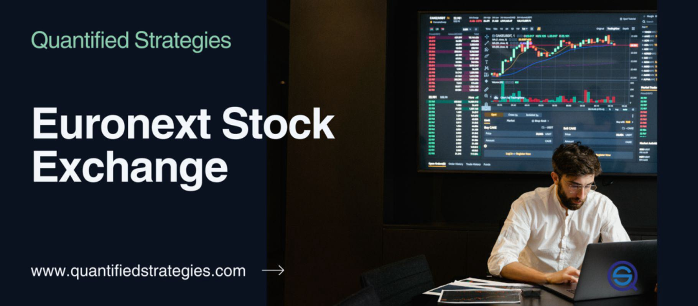

The financial markets have witnessed substantial transformations over recent years, largely driven by the advancement of technology and the integration of algorithmic trading mechanisms. Platforms such as NYSE Euronext have embraced these technological evolutions, cementing algorithmic trading's pivotal role within their operations. This article aims to offer an insightful overview of the NYSE Euronext stock exchange and examine the profound impact that algorithmic trading has on such platforms.

As we trace the evolution of the NYSE Euronext, from its historical roots to its present-day activities, we observe its significant influence in global financial market structures. Traditionally, stock exchanges operated through manual processes and face-to-face trading; however, the advent of algorithms has revolutionized these markets by enhancing the efficiency and scope of trading activities. Algorithmic trading employs complex mathematical models and high-performance computer programs to execute trades at speeds and volumes previously unattainable by human traders.



The evolution of algorithmic trading at NYSE Euronext not only exemplifies a technological shift but also highlights its significance in shaping contemporary trading practices. By employing sophisticated algorithms, traders can optimize strategies that leverage real-time data and execute trades with precision and speed. This advancement not only fosters improved market liquidity but also introduces increased accuracy and reduced transaction costs, presenting a more robust trading environment.

In this article, we will explore the intricate mechanisms and strategic importance of algorithmic trading within the NYSE Euronext platform. We will dissect the financial and operational implications of integrating such technologies into market structures. Through this exploration, we aim to shed light on how advanced technologies are redefining financial markets, offering both opportunities and challenges to market participants.

## Table of Contents

## History of NYSE Euronext

NYSE Euronext emerged as a pivotal entity in global financial markets with its establishment in 2007, marking a significant transatlantic partnership. This merger united the New York Stock Exchange (NYSE), a long-standing pillar of American finance, with Euronext, a leading European stock exchange. The consolidation of these two exchanges created the world's first global equity market, combining their distinct yet complementary strengths to offer a seamless trading experience across both continents.

The formation of NYSE Euronext was part of a broader trend of globalization and consolidation in financial markets, aimed at enhancing market efficiency and providing more diverse services to investors. The merger capitalized on the robust market infrastructure of both exchanges, facilitating cross-border investments and broadening the scope of financial products available to traders and investors.

In 2013, another significant development occurred when the Intercontinental Exchange (ICE), an American company specializing in commodity and financial market exchanges, announced its acquisition of NYSE Euronext. The acquisition, valued at approximately $11 billion, underscored ICE's strategy to diversify its offerings beyond its core energy commodities market and enter the equities and derivatives sectors more robustly. This move highlighted the strategic importance of NYSE Euronext as a bridge between different markets and its role as a major player in global finance.

Subsequent to ICE's acquisition, Euronext was detached in 2014 and became an independent entity through an initial public offering (IPO). This spin-off was initiated to streamline operations and allow each exchange to pursue strategic growth independently. Euronext returned to its roots as a European-focused exchange, further developing its presence in key European markets, including Amsterdam, Brussels, Dublin, Lisbon, Milan, Oslo, and Paris.

Throughout its history, NYSE Euronext has reached several critical milestones that have shaped its trajectory. The integration of advanced trading technologies, increased emphasis on algorithmic and high-frequency trading, and the expansion of its global footprint are notable achievements. Innovations such as the NYSE Arca and NYSE Arca Europe platforms provided traders with efficient electronic trading solutions, enhancing trade execution speed and market [liquidity](/wiki/liquidity-risk-premium).

NYSE Euronext's development reflects its strategic importance in global finance, where it has consistently adapted to changing market dynamics and technological advancements. Its legacy includes not only the creation of the first transatlantic equity market but also its continued influence on the evolution of stock exchanges worldwide.

## Overview of Algorithmic Trading

Algorithmic trading involves the use of complex computer algorithms to automate the execution of trading strategies, relying heavily on mathematical models and computational power. This type of trading significantly enhances market dynamics by improving speed, accuracy, and efficiency, thus allowing participants to maximize their trading outcomes.

Algorithmic trading has transformed market dynamics primarily by enhancing trading speed. Traditional human-mediated trading cannot compete with the rapid execution speeds possible through automated systems. Algorithms are capable of processing vast amounts of market data in milliseconds, enabling traders to seize opportunities more quickly than ever before. The reduction in transaction time also contributes to decreased costs, as quicker executions generally benefit from more favorable pricing.

Accuracy and efficiency in trading have improved as algorithms can minimize human error. They follow pre-programmed rules and structures, reducing the likelihood of mistakes that might occur due to fatigue or emotional bias. This automation allows for precision in executing complex trading strategies that involve highly detailed calculations over extensive datasets, which would be impossible to perform manually with the same level of precision and speed.

On platforms like NYSE Euronext, [algorithmic trading](/wiki/algorithmic-trading) has seen a marked increase, partly due to its ability to manage large order volumes quickly and effectively. This platform, like others, benefits from the liquidity and stability provided by algorithmic trading as it ensures smoother transactions and continuity in market activities.

Various types of algorithmic trading strategies are in use today. Some of the notable ones include:

1. **Trend Following Strategies**: These strategies capitalize on market trends without predicting future prices, relying on technical indicators like moving averages.

2. **Arbitrage Opportunities**: Algorithms identify and exploit price discrepancies across different markets or instruments to secure risk-free profits.

3. **Statistical Arbitrage**: This involves complex statistical models that identify trading opportunities based on the statistical mispricing of securities.

4. **Market Making**: These strategies involve quoting both a buy and a sell price to profit from the bid-ask spread.

5. **Mean Reversion**: Algorithms assume that prices will revert to a long-term mean, based on historical data, and place trades when securities deviate significantly from this mean.

Technological advancements have been critical in fostering sophisticated algorithms. Enhanced computational power and the advent of [machine learning](/wiki/machine-learning) and [artificial intelligence](/wiki/ai-artificial-intelligence) enable the development of algorithms capable of processing even larger sets of data, recognizing complex patterns, and making autonomous decisions. Machine learning models can refine and improve their performance by learning from past data, which potentially increases profitability over time.

Programming such algorithms typically involves languages like Python, C++, and Java, which are suitable for handling big data operations and implementing machine learning models. Here is a simple illustration in Python for calculating moving averages, often used in trend-following algorithms:

```python
import numpy as np

# Sample data of stock prices
prices = np.array([105, 102, 100, 98, 95])

# Function to compute simple moving average
def simple_moving_average(prices, window_size):
    weights = np.ones(window_size) / window_size
    return np.convolve(prices, weights, mode='valid')

# Compute 3-day moving average
sma = simple_moving_average(prices, 3)
print(sma)
```

This script calculates a simple moving average over a window of three days, demonstrating one way data can be structured and analyzed to create a trading strategy. As algorithmic trading continues to evolve, it is expected to play an increasingly pivotal role in market operations, fundamentally altering how financial securities are traded on a global scale.

## The Role of Algorithmic Trading in NYSE Euronext

Algorithmic trading is a significant component of NYSE Euronext's operations, offering enhanced efficiency and effectiveness in market transactions. By automating trading strategies through preprogrammed instructions, it has allowed for rapid execution of trades, which is crucial in today’s fast-paced financial markets.

### Integration and Utilization

Algorithmic trading is deeply embedded within NYSE Euronext’s systems, facilitating a seamless trading process. This integration ensures that trades are executed at optimal prices by analyzing vast datasets in milliseconds. Such capabilities are essential for institutional investors who need to handle large volumes of trade with precision and speed.

### Partnerships and Technological Enhancements

Partnerships play a vital role in augmenting NYSE Euronext's algorithmic trading capabilities. A notable collaboration is with Pragma Financial Systems, which provides advanced trading algorithms that optimize trading strategies for NYSE Euronext participants. Pragma's solutions are designed to enhance liquidity and reduce transaction costs, offering a competitive edge to traders on the NYSE Euronext platform.

### Benefits for Floor Brokers

Algorithmic trading brings several advantages to floor brokers at NYSE Euronext. By utilizing algorithms, brokers can automate order execution, manage risk more effectively, and focus on strategic decision-making rather than routine tasks. This leads to greater efficiency and allows floor brokers to process more trades in less time, which is crucial for maintaining NYSE Euronext’s market position.

### Market Impacts

The efficiencies achieved through algorithmic trading translate into broader market benefits. Enhanced liquidity is one such impact, as algorithms can transact in and out of stocks rapidly, providing constant price discovery and tighter spreads. This activity not only stabilizes market prices but also attracts more participants, thereby increasing trading volumes and market depth.

### Regulatory and Compliance Measures

With the rise of algorithmic trading, NYSE Euronext maintains robust regulatory and compliance frameworks to mitigate potential risks. These measures include stringent monitoring of algorithmic activities and ensuring adherence to market regulations to prevent fraudulent and destabilizing practices. Following incidents like the 'Flash Crash' of 2010, regulatory bodies have implemented more rigorous checks and measures to safeguard against market anomalies, ensuring a stable and fair trading environment.

In summary, algorithmic trading is not just a transformative force at NYSE Euronext but also a critical facilitator of its continued success. Through strategic partnerships and technological integration, along with careful regulatory oversight, NYSE Euronext leverages algorithmic trading to enhance market liquidity and trading efficiency, while ensuring robust compliance with market standards.

## Impact and Challenges

Algorithmic trading has significantly reshaped the landscape of financial markets, particularly in how it affects liquidity, [volatility](/wiki/volatility-trading-strategies), and market fairness. By leveraging advanced algorithms, trading systems can process and execute orders at phenomenal speeds, enhancing market liquidity. This improved liquidity facilitates tighter bid-ask spreads, enabling smoother and more efficient market transactions. Moreover, algorithmic trading contributes to reduced price volatility by balancing supply and demand efficiently, thereby stabilizing the markets.

However, algorithmic trading does pose significant challenges, most notably the risk of 'flash crashes'. These are rapid, deep, and volatile market price declines, which can occur within a very short period. A notable instance was the 'Flash Crash' on May 6, 2010, when the U.S. stock market plunged and rebounded in minutes, erasing nearly $1 trillion from the Dow Jones Industrial Average. The instability from flash crashes can undermine market confidence and lead to substantial financial losses.

To mitigate such risks, stringent regulation is essential. High-frequency trading, a subset of algorithmic trading, is particularly scrutinized due to its potential to cause systemic disruptions. Regulative frameworks aim to ensure that trading practices adhere to stability standards and that algorithms are rigorously tested to prevent malfunctions. Implementations such as circuit breakers and order cancellation rules are mechanisms designed to curb extreme volatility and maintain market integrity.

The response of exchanges like NYSE Euronext to incidents such as the 2010 Flash Crash includes the introduction of mechanisms to pause trading under extreme conditions, allowing markets time to stabilize. These measures help prevent disorderly markets and protect investors from abrupt price swings.

Technological advancements continue to play a crucial role in overcoming these challenges, providing solutions that enhance the robustness and resilience of trading systems. Innovations in monitoring and analyzing trading patterns help detect and mitigate potential disruptions before they escalate. For instance, employing machine learning techniques can lead to more accurate predictions of market behavior, thereby reducing the likelihood of flash crashes.

Python, with libraries such as NumPy and Pandas, is frequently used to simulate and analyze trading algorithms for their efficiency and performance under various market conditions. Here is a simple Python snippet to demonstrate how one could model and assess such an algorithm's stability:

```python
import numpy as np
import pandas as pd

# Simulated market data
market_data = pd.DataFrame({
    'price': np.random.normal(loc=100, scale=1, size=1000),
    'volume': np.random.randint(100, 1000, size=1000)
})

# Simple algorithmic trading strategy
def trading_strategy(data):
    decisions = []
    for i in range(1, len(data)):
        if data['price'][i] > data['price'][i-1]:
            decisions.append('buy')
        else:
            decisions.append('sell')
    return decisions

# Analyze the strategy's impact on volatility
decisions = trading_strategy(market_data)
market_data['decisions'] = ['hold'] + decisions
print(market_data.head())

# Analyze volatility
volatility = market_data['price'].pct_change().std()
print(f"Market Volatility: {volatility:.4f}")
```

In conclusion, while algorithmic trading enhances liquidity and optimizes market operations, it also introduces significant challenges that must be carefully managed. By adopting robust regulations and evolving technology, markets like NYSE Euronext can ensure stable and fair trading environments.

## Future Trends in Algorithmic Trading and NYSE Euronext

As financial markets continue to embrace technological advancements, algorithmic trading at NYSE Euronext stands at the forefront of innovation, especially with the integration of Artificial Intelligence (AI) and machine learning. These technologies are poised to significantly enhance trading strategies by leveraging complex data analysis, pattern recognition, and predictive analytics.

AI and Machine Learning Integration at NYSE Euronext
The application of AI and machine learning in algorithmic trading allows for the development of models that can process vast amounts of market data with greater accuracy and speed than traditional methods. These models can identify trading opportunities by analyzing price trends, market volatility, and trader behaviors. For example, supervised learning algorithms can be trained on historical market data to predict future price movements, while unsupervised learning can uncover hidden patterns or irregularities in trading activity.

Implications of Technological Innovations on Market Operations
Technological innovations bring forth efficiency, transparency, and reduced transaction costs in market operations. Automated systems equipped with AI are able to execute trades at lightning speed, minimizing human error and taking advantage of market inefficiencies. This increased automation also enhances market liquidity, as trades can be made rapidly in response to real-time data. 

The technology also facilitates better risk management. Machine learning models can be designed to monitor trading positions continuously and adjust strategies to mitigate potential losses, thereby maintaining market stability even under volatile conditions.

NYSE Euronext's Competitive Strategy in a Tech-Driven Landscape
To maintain its competitive edge, NYSE Euronext is likely to continue investing in cutting-edge technologies and infrastructure improvements. This includes expanding data centers and improving network capabilities to support high-frequency trading. The exchange may also focus on enhancing its algorithmic trading platforms to accommodate more complex trading strategies enabled by AI.

Potential Future Partnerships and Developments
The future of algorithmic trading at NYSE Euronext may involve strategic partnerships with technology firms specializing in AI and big data. Collaborations with these companies can lead to the development of proprietary trading algorithms that offer competitive advantages. Additionally, NYSE Euronext might explore partnerships with academic institutions to conduct research and development in emerging trading technologies.

Strategic Initiatives Shaping the Future of Financial Markets
NYSE Euronext's strategic initiatives are likely aimed at fostering innovation while ensuring regulatory compliance and market integrity. By embracing AI and machine learning, the exchange not only enhances its own trading capabilities but also actively contributes to the evolution of global financial markets. These technologies promise not only to optimize trading processes but also to unlock new market opportunities, setting a precedent for other major exchanges worldwide.

In conclusion, algorithmic trading at NYSE Euronext, driven by AI and machine learning, is on the cusp of significant advancements. These developments promise increased efficiencies, improved market liquidity, and more robust risk management strategies, all of which are critical to thriving in the modern financial landscape. As NYSE Euronext looks ahead, its continued investment in technology and strategic partnerships solidifies its position as a leader in the dynamic world of global finance.

## Conclusion

Algorithmic trading has profoundly reshaped the landscape of NYSE Euronext and the broader financial markets, offering unprecedented speed and efficiency. This technological advancement has morphed NYSE Euronext into a dynamic, globally interconnected marketplace, elevating trading volumes and enhancing liquidity. Historically, NYSE Euronext represented a significant collaboration between American and European markets; today, it stands as a beacon of innovation and a central player in the evolution of trading methodologies.

The journey of NYSE Euronext has been characterized by strategic mergers and forward-thinking initiatives that position it at the forefront of financial market developments. Through integrating cutting-edge algorithmic trading technologies and adhering to robust regulatory frameworks, NYSE Euronext safeguards market integrity while optimizing operational efficiencies. This strategic fusion ensures its continued influence and adaptability amid the rapidly shifting dynamics of global finance.

The intersection of technology and finance offers boundless opportunities for enhancement and innovation. NYSE Euronext serves as a crucial laboratory where emerging trading strategies powered by algorithms, artificial intelligence, and machine learning are tested and refined. These advancements hold the promise of not only amplifying trading effectiveness but also maintaining equitable and transparent market conditions conducive to investor confidence.

Investors and stakeholders are urged to stay informed and adaptable, given the swift pace of change in the financial landscape. As NYSE Euronext continues to implement strategic initiatives, the importance of embracing technological innovation and regulatory oversight cannot be overstated. This will ensure resilience and competitiveness in an ever-evolving industry. By staying engaged, participants can navigate these transformations effectively and capitalize on the opportunities presented by modern trading technologies.

## References & Further Reading

[1]: Eurex. (2023). ["Algorithmic Trading and High-Frequency Trading."](https://academic.oup.com/book/55158/chapter/424085051)

[2]: Gomber, P., Arndt, B., Lutat, M., & Uhle, T. (2011). ["High-Frequency Trading."](https://papers.ssrn.com/sol3/papers.cfm?abstract_id=1858626) Working Papers on Information Systems.

[3]: Narang, R. K. (2013). ["Inside the Black Box: A Simple Guide to Quantitative and High-Frequency Trading."](https://onlinelibrary.wiley.com/doi/book/10.1002/9781118662717) Wiley.

[4]: Johnson, B., & Leledakis, G. (2021). ["The Fintech Revolution: Machine Learning, Artificial Intelligence, and Big Data."](https://onlinelibrary.wiley.com/doi/10.1111/eufm.12365) Cambridge University Press.

[5]: U.S. Commodity Futures Trading Commission and Securities & Exchange Commission. (2010). ["Findings Regarding the Market Events of May 6, 2010."](https://www.sec.gov/news/studies/2010/marketevents-report.pdf)