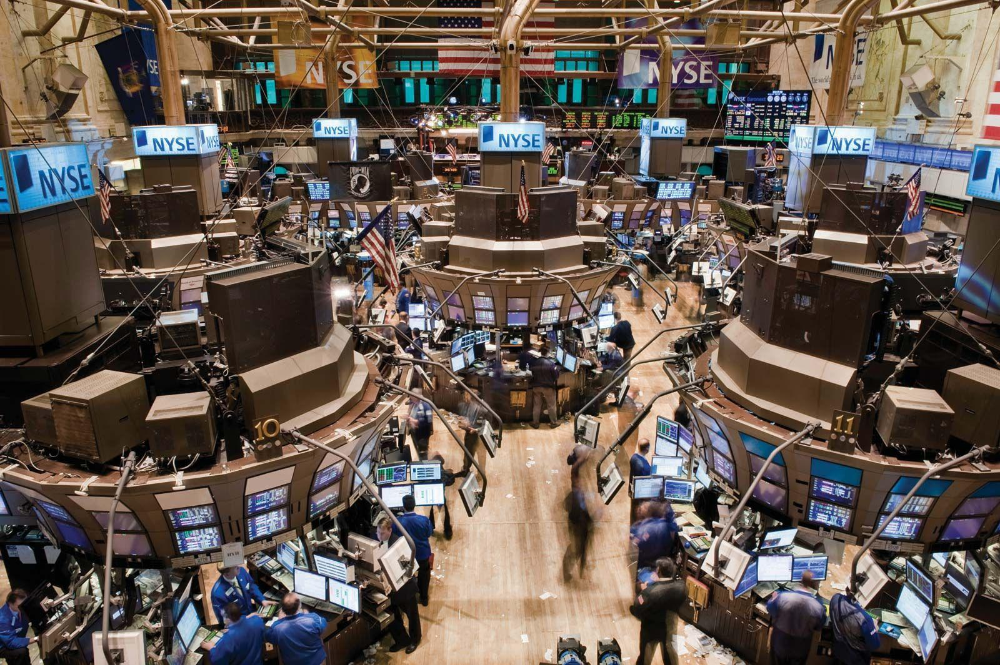

The fast-paced environment of today's financial markets underscores the significance of algorithmic trading (algo trading) on major platforms like the New York Stock Exchange (NYSE). Algo trading utilizes sophisticated algorithms and high-speed data processing to execute trades with remarkable speed and efficiency, fundamentally transforming traditional trading practices that heavily relied on human judgment and slower execution times.

This article will explore the critical elements of algo trading as it pertains to the NYSE, shedding light on the integration of these computational methods with stock market operations and the advanced technologies involved. Additionally, it will cover the operational facets of the NYSE as a financial exchange, including the stringent listing criteria required for companies to gain a foothold in this prestigious marketplace. Understanding how algorithmic trading influences and interacts with market dynamics is crucial for comprehending the overall impact on both transaction execution and market stability.

Readers will gain insights into the benefits of algo trading, such as enhanced execution speed and improved efficiency, as well as the challenges it poses, including market volatility and regulatory concerns. This comprehensive overview will equip readers with the knowledge to navigate the complex landscape of algorithmic trading effectively, helping them stay informed about its evolving role in the financial market ecosystem.

## Table of Contents

## Understanding the NYSE as a Financial Exchange

The New York Stock Exchange (NYSE) stands as a pillar in the global financial market, renowned for its vast market capitalization which ranks it among the world's largest stock exchanges. It is part of the NYSE Group, which was acquired by InterContinental Exchange (ICE) in 2013. The acquisition facilitated further integration and modernization of the exchange, enhancing its operational capabilities and infrastructural framework.

The NYSE operates through a dual structure that combines traditional floor trading with advanced electronic platforms. These platforms include NYSE Arca and NYSE MKT, accommodating a diverse range of financial instruments such as equities, options, and bonds. The hybrid arrangement offers the resilience of electronic trading and the strategic advantages of human judgment, ensuring a dynamic and versatile trading environment.

Critical to the functioning of the NYSE is its stringent listing criteria. These criteria are devised to guarantee that only credible and financially sound companies join the exchange. They encompass a company's financial health, governance standards, and liquidity measures. For a company to qualify, it must adhere to rigorous requirements regarding revenue thresholds, company capitalization, and shareholder equity, among other financial metrics. Additionally, companies must demonstrate adherence to governance standards, which include maintaining a board of directors composed of independent members and meeting transparency obligations.

To foster market credibility and integrity, the NYSE adopts robust technological systems. One prominent example is the Pillar trading platform. This integrated trading technology epitomizes the NYSE’s commitment to cutting-edge infrastructure. Pillar modernizes and unifies the trading systems for equities and options, allowing for streamlined operation and enhanced efficiency. It supports seamless order entry, real-time market data feeds, and a more intuitive interface for traders and investors. This integration improves the speed, scalability, and reliability of trading activities conducted on the NYSE.

The adoption of such advanced technology underscores the NYSE’s response to the evolving demands of global financial markets and positions it as a leader in market innovation. Through continuous infrastructure upgrades and rigorous operational standards, the NYSE remains a formidable and trusted exchange for investors and companies worldwide.

## The Rise of Algorithmic Trading

Algorithmic trading, or algo trading, utilizes pre-defined computational models for automating the buying and selling of securities on platforms such as the New York Stock Exchange (NYSE). The core advantage of this approach lies in its ability to execute trades with high speed and precision, significantly reducing the emotional biases that can affect human traders. By relying on real-time data, these algorithms are equipped to make quick decisions, providing a seamless trading experience.

A variety of trading techniques are encompassed within algo trading. High-Frequency Trading ([HFT](/wiki/high-frequency-trading-strategies)) stands out as one of the most prominent techniques, characterized by executing a large number of orders at extremely rapid speeds. This method exploits very short-term market inefficiencies, capitalizing on price discrepancies that exist for mere fractions of a second.

In addition to HFT, more complex strategies such as statistical [arbitrage](/wiki/arbitrage) and trend-following are utilized. Statistical arbitrage involves using mathematical models to identify price patterns and correlations across different securities, aiming to exploit any mispricing. Algorithms built for this strategy will continuously analyze large sets of historical and real-time data to detect statistically significant deviations from expected price relationships, executing trades based on inferred probabilities.

Trend-following strategies, on the other hand, are predicated on the assumption that current market trends will continue, whether they are upward or downward. These algorithms generate signals based on historical market data to identify the beginning and end of price trends, thus facilitating the execution of orders in alignment with these trends.

Despite its numerous advantages, [algorithmic trading](/wiki/algorithmic-trading) introduces several challenges. One major concern is the potential for increased market [volatility](/wiki/volatility-trading-strategies). The rapid execution of a large [volume](/wiki/volume-trading-strategy) of trades can lead to sudden price swings, especially when algorithms collectively react to the same market signals. This has occasionally resulted in market destabilization events, such as the infamous "Flash Crash" of 2010, where the Dow Jones Industrial Average plummeted nearly 1,000 points within minutes before quickly recovering.

Regulatory concerns also come into play due to the disruptive efficiency of algo trading. The speed and volume of trades render traditional oversight methods less effective, necessitating new regulatory frameworks to monitor and manage the risks associated with automated trading. Regulators are tasked with ensuring that algo trading does not undermine market integrity or lead to manipulative practices. 

In conclusion, while algorithmic trading presents opportunities for enhanced market operations through its speed, precision, and capacity to process vast amounts of data, it also necessitates careful consideration of the consequential risks and regulatory needs.

## Key Benefits and Challenges

Algorithmic trading offers numerous benefits, chiefly its ability to execute trades at unparalleled speeds. By leveraging sophisticated algorithms, algo trading systems can rapidly assess and respond to market conditions, identifying and exploiting fleeting inefficiencies in the marketplace. This speed advantage is coupled with the capacity to process vast arrays of market data in real-time, far surpassing human capabilities. Algorithms can simultaneously analyze multiple variables across various datasets, identifying potential opportunities in fractional seconds. This capacity for high-speed processing ensures that traders can capitalize on profitable trades before these opportunities dissipate.

A significant challenge in deploying algorithmic trading is the need for a robust technical infrastructure. The systems must be capable of handling complex computations at high speeds, which requires significant investment in technology. This infrastructure encompasses high-performance computing systems, low-latency networks, and advanced data analytics platforms, all of which must function seamlessly to maintain trading efficiency and accuracy. Failure in any component can result in substantial financial losses and market disruptions.

Market impact and regulatory scrutiny represent additional challenges associated with algorithmic trading. The high efficiency and speed of algo trading can inadvertently contribute to market volatility, primarily when a large volume of trades is executed simultaneously. This potential for increased volatility has prompted regulators to scrutinize algorithmic trading practices closely. Regulatory bodies are tasked with ensuring that such trading does not lead to market manipulation or destabilization. To address these concerns, algorithmic trading firms must develop strategies that mitigate the risk of manipulative practices while maintaining market integrity. 

Ensuring compliance with regulatory standards requires ongoing adjustments to trading algorithms and practices, necessitating collaboration between technologists, traders, and legal experts to develop compliant trading systems that safeguard market stability.

## Influence on Stock Market Dynamics

Algorithmic trading plays a vital role in shaping stock market dynamics on platforms like the New York Stock Exchange (NYSE). By enhancing market [liquidity](/wiki/liquidity-risk-premium), algo trading improves pricing efficiency and narrows bid-ask spreads, thus fostering a more competitive trading environment. Liquidity is essential for the smooth functioning of financial markets, as it ensures that investors can buy or sell securities without significant price changes. Algorithms facilitate this by continuously analyzing market conditions and executing trades that inject liquidity into the system.

One of the key advantages of algorithmic trading is its capacity to reduce human errors in trading decisions. Traditional trading can be influenced by emotional biases and psychological factors, which may lead to suboptimal decision-making. Algorithms, however, are not swayed by emotions and rely on data to ensure rational and accurate trading decisions. This shift towards data-driven trading encourages an environment where trades are executed based on quantitative analysis rather than subjective judgments.

Despite the benefits, algorithmic trading—particularly high-frequency trading (HFT)—can lead to increased market volatility. HFT involves rapidly buying and selling securities to exploit small price movements, which can amplify volatility, especially during market stress. To mitigate such risks, exchanges like the NYSE have implemented circuit breakers. These mechanisms temporarily halt trading if a stock price moves too quickly in a short period, allowing time for information dissemination and market participant reaction.

The influence of algorithmic trading necessitates a balanced regulatory framework to ensure market integrity. Regulations must be designed to allow technological advancements while preventing manipulative practices that could undermine market stability. This involves setting guidelines for algorithm development, execution, and monitoring, as well as implementing robust risk management systems. As the technology powering algorithmic trading advances, regulatory bodies must continuously adapt to maintain a fair and efficient trading environment.

In summary, the integration of algorithmic trading into stock market operations significantly impacts liquidity, pricing efficiency, and error reduction. While it offers substantial advantages, the potential for increased volatility underscores the need for effective regulatory oversight to maintain the integrity and stability of financial markets.

## Conclusion

Algorithmic trading on the New York Stock Exchange (NYSE) has brought significant changes to market operations by increasing efficiency, enhancing liquidity, and minimizing human intervention in trading strategies. This advanced trading method utilizes complex algorithms to make trading decisions at a pace and accuracy beyond human capability. As a result, it has become a crucial component in modern financial markets.

For the successful adoption of algorithmic trading, a comprehensive understanding of technological, operational, and regulatory frameworks is essential. The technology behind algorithmic trading involves sophisticated software and hardware infrastructure capable of processing large volumes of data and executing trades in microseconds. This requires continuous investment in cutting-edge technology to remain competitive.

Operationally, market participants must ensure their algorithms are rigorously tested and monitored to avoid malfunctions that could lead to significant financial losses or market disruptions. Compliance with regulatory requirements is equally important. Regulatory bodies continually adapt policies to address the challenges posed by algo trading, focusing on preventing manipulative practices and ensuring market stability.

Companies aspiring to list on the NYSE and investors participating in algorithmic trading must meet stringent requirements to maintain market integrity and investor confidence. This involves adhering to rigorous financial standards, governance criteria, and employing robust trading systems.

Keeping abreast of technological advancements and regulatory developments is critical for all market stakeholders. As technology evolves and market dynamics shift, staying informed and adaptable will enable businesses and investors to leverage the benefits of algorithmic trading while navigating its complexities effectively. This approach will ensure continued success and growth in the fast-evolving field of stock market trading.

## References & Further Reading

1. NYSE. (n.d.). 'Listing Requirements.' Retrieved from [https://www.nyse.com/listings-process](https://www.nyse.com/listings-process).

2. Nasdaq. (n.d.). 'Initial Listing Guide.' Retrieved from Nasdaq website.

3. Bergstra, J., Bardenet, R., Bengio, Y., & Kégl, B. (2011). 'Algorithms for Hyper-Parameter Optimization.' Advances in Neural Information Processing Systems 24. This paper explores advanced optimization techniques that can be applied to enhancing algorithmic trading strategies, particularly in fine-tuning model parameters for peak performance.

4. Lopez de Prado, M. 'Advances in Financial Machine Learning.' Lopez de Prado discusses state-of-the-art machine learning techniques and their application to financial markets, offering valuable insights into developing sophisticated trading algorithms. His work is considered a cornerstone for those incorporating machine learning in trading.

5. Aronson, D. 'Evidence-Based Technical Analysis: Applying the Scientific Method and Statistical Inference to Trading Signals.' Aronson's book emphasizes the importance of empirical validation in trading systems, advocating for a scientific approach to trading decision-making, which is crucial when developing algorithmic strategies.

6. Jansen, S. 'Machine Learning for Algorithmic Trading.' This book serves as a comprehensive guide on using machine learning techniques to enhance trading algorithms, covering a range of methods from basic models to more complex deep learning architectures.

7. Chan, E. P. 'Quantitative Trading: How to Build Your Own Algorithmic Trading Business.' Chan provides a practical perspective on establishing an algorithmic trading firm, detailing aspects such as strategy formulation, risk management, and the technological framework required to succeed in the trading industry.

