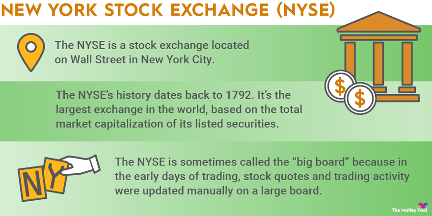

## Table of Contents

## What is the New York Stock Exchange (NYSE)?

The New York Stock Exchange, often called NYSE, is a place where people buy and sell pieces of companies, called stocks. It's located in New York City and is one of the biggest stock markets in the world. When people buy stocks, they are buying a small part of a company and can make money if the company does well.

The NYSE started a long time ago, in 1792, and has grown a lot since then. Today, it uses computers and technology to help people trade stocks quickly and easily. Many big companies from around the world are listed on the NYSE, and it's an important part of the global economy.

## How was the NYSE founded and what is its history?

The New York Stock Exchange, or NYSE, was founded on May 17, 1792, when a group of 24 brokers and merchants signed the Buttonwood Agreement under a buttonwood tree on Wall Street in New York City. This agreement set the rules for trading securities, which are like stocks and bonds. They wanted to make trading fair and organized. This was the start of what would become the NYSE.

Over the years, the NYSE grew a lot. It moved to bigger buildings as more people wanted to trade. In 1863, it got a new home at 10-12 Broad Street, and in 1903, it moved to its current location at 11 Wall Street. The NYSE has seen many big events, like the Great Depression in the 1930s and the stock market crash of 1987. Today, it uses computers and technology to help people trade stocks quickly and easily. It's still one of the biggest and most important stock markets in the world.

## What types of securities are traded on the NYSE?

The New York Stock Exchange, or NYSE, is a place where different types of securities are traded. The most common type of security traded on the NYSE is stocks. Stocks are pieces of a company that people can buy and sell. When someone buys a stock, they own a small part of that company. Companies listed on the NYSE can be from the United States or from other countries around the world.

Another type of security traded on the NYSE is exchange-traded funds, or ETFs. ETFs are like baskets that hold a mix of different investments, like stocks, bonds, or commodities. People can buy and sell these baskets just like they do with stocks. ETFs make it easier for people to invest in a variety of things without having to buy each one separately.

The NYSE also trades bonds, which are loans that investors make to companies or governments. When someone buys a bond, they are lending money and will get it back with interest over time. While stocks and ETFs are more common, bonds are another important type of security that can be traded on the NYSE.

## How does trading work on the NYSE?

Trading on the NYSE happens when people buy and sell securities like stocks and ETFs. It used to happen in person on the trading floor, where people would shout and use hand signals to make trades. Now, most trading is done using computers and happens very quickly. When someone wants to buy a stock, they place an order through a broker, who sends it to the NYSE. If someone else wants to sell the same stock at the price the buyer is willing to pay, the trade happens. The price of the stock can go up or down depending on how many people want to buy or sell it.

The NYSE uses something called the "auction market" system. This means that the price of a stock is decided by the highest price a buyer is willing to pay and the lowest price a seller is willing to accept. When these two prices meet, a trade happens. The NYSE also has "designated market makers" (DMMs) who help make sure trading goes smoothly. DMMs keep an eye on the market and can step in to buy or sell stocks if needed to keep the market stable. This system helps make sure that trading on the NYSE is fair and efficient.

## What are the operating hours of the NYSE?

The New York Stock Exchange, or NYSE, is open for trading from Monday to Friday. The regular trading hours start at 9:30 AM Eastern Time and end at 4:00 PM Eastern Time. These are the times when most people can buy and sell stocks.

There are also special times called "pre-market" and "after-hours" trading. Pre-market trading happens before the regular trading hours, from about 4:00 AM to 9:30 AM Eastern Time. After-hours trading happens after the regular trading hours, from 4:00 PM to 8:00 PM Eastern Time. During these times, fewer people trade, but it can still be important for some investors.

## Who are the major players on the NYSE?

The major players on the NYSE are the companies that are listed there, the investors who buy and sell their stocks, and the brokers who help make these trades happen. Some of the biggest companies in the world, like Apple, ExxonMobil, and Walmart, are listed on the NYSE. These companies are from different industries like technology, energy, and retail. When people want to buy or sell stocks from these companies, they are the ones who make the NYSE busy and important.

Another major player is the investors. They can be everyday people saving for the future, big investment firms managing lots of money, or even other companies investing their profits. Investors decide which stocks to buy or sell based on what they think will happen to the companies and the economy. Their decisions can make stock prices go up or down. Brokers, like those from big firms such as Goldman Sachs or smaller ones, help investors make these trades. They use technology and their knowledge to buy and sell stocks quickly and efficiently on the NYSE.

## What is the difference between the NYSE and NASDAQ?

The New York Stock Exchange (NYSE) and the NASDAQ are both big places where people buy and sell stocks, but they are different in some ways. The NYSE is older and started in 1792. It's known for having big, well-known companies like Apple and ExxonMobil listed on it. The NYSE uses an auction market system, where the price of a stock is decided by the highest price a buyer is willing to pay and the lowest price a seller is willing to accept. It also has a physical trading floor where people used to shout and use hand signals to trade, though now most trading is done by computers.

The NASDAQ, on the other hand, started in 1971 and is known for having a lot of technology and internet companies like Amazon and Google. It uses a dealer market system, where dealers buy and sell stocks from their own inventory. Unlike the NYSE, the NASDAQ has always been fully electronic, with no physical trading floor. This means all trading happens through computers, which can make it faster and more efficient. Both the NYSE and NASDAQ are important parts of the stock market, but they have different styles and types of companies listed on them.

## How does the NYSE impact the global economy?

The New York Stock Exchange, or NYSE, is a big part of the global economy. It is where people from all over the world come to buy and sell stocks of big companies. When people buy and sell these stocks, it can change how much money those companies have and how they grow. If the NYSE is doing well, it can make people feel good about the economy and want to invest more money. This can help the whole world's economy grow because more money is moving around.

On the other hand, if the NYSE is not doing well, it can make people worried. They might not want to spend or invest as much money, which can slow down the economy. The NYSE is watched by people all over the world because what happens there can affect jobs, prices, and how much money countries have. Because so many big companies from different countries are listed on the NYSE, what happens there can have a big impact on the global economy.

## What are some key performance indicators used to assess the NYSE?

The NYSE's performance is often measured by looking at the stock market indexes like the Dow Jones Industrial Average and the S&P 500. These indexes show how a group of big companies are doing on the NYSE. If the indexes go up, it means the companies are doing well and people feel good about the economy. If the indexes go down, it can mean that people are worried and might not want to invest as much.

Another key performance indicator is the trading volume, which is the number of stocks bought and sold each day. High trading volume can mean that people are very interested in the market and are actively buying and selling stocks. Low trading volume might mean that people are not as interested, or they are waiting to see what happens next. Both the stock market indexes and trading volume help people understand how the NYSE is doing and how it might affect the economy.

## What are the listing requirements for companies on the NYSE?

To list on the NYSE, a company needs to meet some important rules. First, they need to have a lot of shares that people can buy and sell. The NYSE says the company must have at least 1.1 million shares that the public can own. Also, the total value of these shares, called the market value, needs to be at least $40 million. The company also needs to have enough shareholders, with at least 400 shareholders owning at least 100 shares each.

Another big rule is about how much money the company makes. The NYSE wants to see that the company is doing well financially. They look at the company's earnings, which is the money the company makes after paying all its bills. The company needs to have made at least $10 million over the last three years, with at least $2 million in the last year. If a company can meet all these rules, it can list its stocks on the NYSE and let people buy and sell them there.

## How has technology transformed trading on the NYSE?

Technology has changed the way trading happens on the NYSE a lot. Before, people had to go to the trading floor and shout to buy and sell stocks. Now, most trading is done using computers. This makes it much faster and easier for people to trade from anywhere in the world. They can use their computers or phones to buy and sell stocks without having to be in New York. This has made the market more efficient and has let more people join in.

The use of technology has also made trading more fair and safe. Computers can keep track of all the trades and make sure they follow the rules. They can also help stop mistakes and cheating. The NYSE uses special programs to watch the market and make sure everything is going smoothly. This has helped make the NYSE a trusted place for people to trade stocks.

## What are the future trends and challenges facing the NYSE?

The future of the NYSE will see more use of technology. More trading will happen using computers and smart programs called algorithms. These programs can make trades very quickly and can help find the best prices for stocks. The NYSE will also need to keep up with new kinds of investments like cryptocurrencies and other digital assets. This means they will have to learn how to trade these new things safely and fairly.

There are also some challenges that the NYSE will face. One big challenge is keeping the market safe from hackers and fraud. With more trading happening online, it's important to make sure that the systems are secure. Another challenge is dealing with big changes in the economy, like recessions or big events that can shake the market. The NYSE will need to be ready to help keep the market stable during these tough times.

## What are Algorithmic Trading Strategies?

Algorithmic trading strategies have gained prominence due to their ability to automate decision-making processes in fraction of a second, influencing how trades are executed on exchanges like the New York Stock Exchange (NYSE). Among these strategies, trend-following, mean reversion, and [arbitrage](/wiki/arbitrage) are widely utilized by traders.

Trend-following strategies are designed to capitalize on market [momentum](/wiki/momentum). These strategies operate under the assumption that if an asset is moving in a given direction, it will continue to do so until a reversal is evident. This approach often employs indicators such as moving averages to identify and confirm trends. For instance, the crossover of a short-term moving average over a long-term moving average might signal a buy condition. Trend-following is typically employed in markets exhibiting strong directional movements and can be implemented using basic Python libraries such as NumPy and pandas:

```python
import pandas as pd
import numpy as np

# Calculate moving averages
def calculate_moving_averages(prices, short_window, long_window):
    short_mavg = prices.rolling(window=short_window, min_periods=1).mean()
    long_mavg = prices.rolling(window=long_window, min_periods=1).mean()
    return short_mavg, long_mavg

# Example usage
prices = pd.Series([105, 110, 108, 115, 118, 120])
short_mavg, long_mavg = calculate_moving_averages(prices, short_window=2, long_window=3)
signals = (short_mavg > long_mavg).astype(int)  # Buy signal when short_mavg crosses above long_mavg
```

Mean reversion strategies assume that asset prices fluctuate around a historical average or mean. When a price moves significantly away from this average, it is expected to revert back. These strategies are common in assets known for oscillating around a stable mean, such as certain equity pairs or fixed income securities. The strategy can be represented mathematically as:

$$
\text{Entry Signal} = \text{Price} - \text{Mean} > \text{Threshold}
$$

When the condition is met, trades are triggered to buy undervalued assets or sell overvalued ones, anticipating a return to the average.

Arbitrage strategies exploit price discrepancies of the same asset in different markets or forms. There are several types of arbitrage strategies, including spatial arbitrage and [statistical arbitrage](/wiki/statistical-arbitrage). For example, if a stock is traded at different prices on two exchanges, traders can buy at the lower price and sell at the higher one, capturing the spread as profit. This requires highly efficient algorithms capable of executing trades rapidly to minimize the impact of market adjustments. Below is a conceptual example using Python:

```python
# Simulate price discrepancy
price_exchange1 = 100
price_exchange2 = 102

# Check for arbitrage opportunity
if price_exchange1 < price_exchange2:
    profit = price_exchange2 - price_exchange1
    print(f"Arbitrage opportunity detected. Potential profit: ${profit}")
```

These strategies collectively create a dynamic environment on the NYSE, contributing to improved liquidity and market efficiency. However, they must be executed with a clear understanding of the underlying market conditions to mitigate risks associated with rapid market changes and execution errors.

## References & Further Reading

[1]: Bergstra, J., Bardenet, R., Bengio, Y., & Kégl, B. (2011). ["Algorithms for Hyper-Parameter Optimization."](https://dl.acm.org/doi/10.5555/2986459.2986743) Advances in Neural Information Processing Systems 24. 

[2]: ["Advances in Financial Machine Learning"](https://www.amazon.com/Advances-Financial-Machine-Learning-Marcos/dp/1119482089) by Marcos Lopez de Prado

[3]: Hendershott, T., Jones, C. M., & Menkveld, A. J. (2011). ["Does Algorithmic Trading Improve Liquidity?"](https://onlinelibrary.wiley.com/doi/full/10.1111/j.1540-6261.2010.01624.x) Journal of Finance.

[4]: ["Quantitative Trading: How to Build Your Own Algorithmic Trading Business"](https://www.amazon.com/Quantitative-Trading-Build-Algorithmic-Business/dp/1119800064) by Ernest P. Chan

[5]: Aldridge, I. (2013). ["High-Frequency Trading: A Practical Guide to Algorithmic Strategies and Trading Systems"](https://onlinelibrary.wiley.com/doi/pdf/10.1002/9781119203803.fmatter) Wiley.

[6]: ["Machine Learning for Algorithmic Trading"](https://github.com/stefan-jansen/machine-learning-for-trading) by Stefan Jansen

[7]: Kirilenko, A. A., Kyle, A. S., Samadi, M., & Tuzun, T. (2017). ["The Flash Crash: The Impact of High-Frequency Trading on an Electronic Market"](https://www.repository.cam.ac.uk/bitstream/handle/1810/304244/KirilenkoFlashCrash.pdf?sequence=1) The Quarterly Journal of Economics.