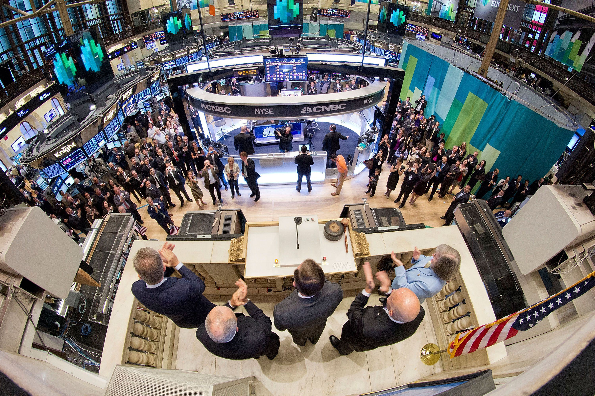

Algorithmic trading has fundamentally transformed trading operations on the New York Stock Exchange (NYSE), a premier platform for large financial institutions. The NYSE operates under the Intercontinental Exchange Group and enables extensive trading activities for over 2,300 companies, boasting a combined market capitalization of $28.8 trillion. This transformation underscores the exchange's shift from traditional manual trading practices to a more advanced, technology-focused approach.

Algorithmic trading utilizes computer algorithms to execute trades at speeds and frequencies beyond human capability. This evolution marks a significant milestone in the NYSE's history, reflecting broader technological advancements across global financial markets. This has not only increased the efficiency of trading executions but also improved liquidity and market dynamics.



By integrating algorithmic trading, the NYSE has enhanced its operational efficiencies, making it more adept at handling vast volumes of transactions while maintaining market stability. The application of these advanced algorithms allows for better price discovery and narrower bid-ask spreads, which benefits both institutional and individual investors by ensuring fairer trading conditions.

This article explores the role of algorithmic trading within the NYSE, examining how these innovative practices have influenced market dynamics and discussing prospective developments. As we continue to see advancements in technology, the future holds potential for further evolution in trading strategies, promising increased efficiency and speed, albeit with new challenges in risk management.

## Table of Contents

## The Emergence of Algorithmic Trading

Algorithmic trading marked a significant shift in financial markets throughout the 1980s, evolving from rudimentary electronic trading systems to advanced, highly sophisticated tools that are integral to contemporary trading operations. The primary function of algorithmic trading is to automate and optimize trading decisions by leveraging powerful computing capabilities that execute trades based on complex mathematical models and algorithms. This technology enables financial institutions and traders to [carry](/wiki/carry-trading) out trades in a fraction of a second, a speed unattainable through manual processing.

The inception of algorithmic trading coincided closely with notable technological advancements, including the increasing power and availability of computing technology. These developments facilitated a dramatic boost in trading volumes and enhanced operational efficiencies, particularly on platforms with the magnitude and scale of the New York Stock Exchange (NYSE). Electronic communication networks (ECNs) and the introduction of direct market access (DMA) allowed traders to bypass traditional broker-driven methods, favoring real-time trade executions and liquidity improvements.

The evolution of [algorithmic trading](/wiki/algorithmic-trading) reflects the broader digital transformation within financial markets. Algorithms are programmed to identify pricing inefficiencies and market trends that present profitable opportunities. By processing vast amounts of data and executing trades in milliseconds, these systems capitalize on minuscule price differences across multiple markets effectively.

These advancements not only contribute to increased trading efficacy but also to the democratization of trading, as both institutional and retail investors benefit from the enhanced [liquidity](/wiki/liquidity-risk-premium) and reduced costs associated with algorithmic strategies. Despite these advantages, the emergence of algorithmic trading also introduced complexities regarding market dynamics and necessitated the implementation of robust risk management frameworks to address potential issues such as market [volatility](/wiki/volatility-trading-strategies) and sudden price swings, often referred to as flash crashes.

In conclusion, the emergence of algorithmic trading was a pivotal development in the financial markets, closely tied to technological innovations that enlarged trading capabilities and operational efficiencies. This evolution laid the groundwork for the highly automated, fast-paced trading environment that defines the NYSE and other major global exchanges today.

## Role of the New York Stock Exchange (NYSE)

The New York Stock Exchange (NYSE), often referred to as the Big Board, plays a crucial role in the global financial markets by offering a dynamic platform for the trading of securities. As one of the oldest exchanges in the world, it combines a longstanding history with continuous technological advancements to maintain its status as a leader in the financial sector. The NYSE is a central hub for traders, investors, and financial institutions, hosting over 2,300 listed companies and accounting for a significant portion of global trading volumes.

The historical significance of the NYSE extends back to its founding in 1792 under the Buttonwood Agreement, a landmark moment that laid the foundation for modern stock trading practices. Over the centuries, the exchange has adapted to technological innovations, most recently integrating algorithmic trading systems to streamline operations and improve liquidity. Algorithmic trading, which utilizes programmed instructions and complex mathematical models to execute trades with speed and precision, has become a cornerstone of its market operations. This integration has enhanced market efficiency by allowing for the rapid processing of vast amounts of data, reducing transaction costs, and ensuring more competitive pricing.

In addition to technological innovation, the NYSE employs a Designated Market Maker (DMM) model, formerly known as the specialist system. DMMs are responsible for maintaining orderly market functioning by committing to buy and sell securities to prevent significant price fluctuations and provide stability. This system is crucial in an environment that increasingly relies on automated trading algorithms, which can inadvertently cause volatility. DMMs help bridge human-trader expertise with algorithmic precision, ensuring that the market remains robust and fair.

By combining historical trading methods with cutting-edge technology, the NYSE demonstrates its adaptability and commitment to market integrity. Both algorithmic and traditional trading systems coexist on the exchange, creating a unique ecosystem that emphasizes liquidity and fairness. As these technologies evolve and continue to shape market landscapes, the NYSE's role in promoting efficient market operations and fair pricing remains more vital than ever.

## Impact of Algorithmic Trading on the NYSE

Algorithmic trading has distinctly transformed the operational dynamics of the New York Stock Exchange (NYSE) by increasing market liquidity and reducing bid-ask spreads. With the automation provided by algorithms, trades are executed with enhanced precision and speed, leading to a more efficient matching of buyers and sellers. As a result, bid-ask spreads—the difference between the highest price a buyer is willing to pay for an asset and the lowest price a seller is willing to accept—have tightened. This compression signifies reduced transaction costs and improvements in asset pricing, encouraging greater participation from a diverse array of market players.

Moreover, algorithmic trading strengthens the process of price discovery, an essential function of any stock exchange. By processing vast amounts of market data in real time, algorithms are adept at identifying discrepancies and opportunities that might not be readily visible to human traders. This capability allows for a more accurate assessment of an asset's value, thereby assisting both institutional and retail investors in making well-informed trading decisions. Enhanced price discovery is particularly beneficial during periods of volatility, as it helps stabilize market fluctuations by swiftly integrating new information into asset prices.

However, the integration of algorithmic trading is not without challenges. One significant concern is the potential for increased market volatility. Algorithms, particularly those employed in high-frequency trading ([HFT](/wiki/high-frequency-trading-strategies)), can rapidly alter market dynamics, leading to situations where prices swing sharply within short periods. This volatility was notably observed during events such as the "Flash Crash" of May 6, 2010, when the Dow Jones Industrial Average dropped approximately 1,000 points and then quickly rebounded within minutes. While the exact causes of such events can be multifaceted, the rapid-fire execution of trades by algorithms is often scrutinized.

To mitigate these risks, robust risk management systems are essential. These systems must be designed to quickly detect and respond to irregular market conditions, preventing cascading failures that can arise from algorithm-driven trading. Regulatory frameworks and circuit breakers—mechanisms that temporarily halt trading on an exchange to curb panic-selling—play a crucial role in maintaining market stability. It is imperative for traders and exchanges alike to continually refine these safeguards, ensuring that the benefits of algorithmic trading do not come at the expense of market integrity.

## Algorithmic Trading Strategies

Algorithmic trading strategies have gained prominence due to their ability to automate decision-making processes in fraction of a second, influencing how trades are executed on exchanges like the New York Stock Exchange (NYSE). Among these strategies, trend-following, mean reversion, and [arbitrage](/wiki/arbitrage) are widely utilized by traders.

Trend-following strategies are designed to capitalize on market [momentum](/wiki/momentum). These strategies operate under the assumption that if an asset is moving in a given direction, it will continue to do so until a reversal is evident. This approach often employs indicators such as moving averages to identify and confirm trends. For instance, the crossover of a short-term moving average over a long-term moving average might signal a buy condition. Trend-following is typically employed in markets exhibiting strong directional movements and can be implemented using basic Python libraries such as NumPy and pandas:

```python
import pandas as pd
import numpy as np

# Calculate moving averages
def calculate_moving_averages(prices, short_window, long_window):
    short_mavg = prices.rolling(window=short_window, min_periods=1).mean()
    long_mavg = prices.rolling(window=long_window, min_periods=1).mean()
    return short_mavg, long_mavg

# Example usage
prices = pd.Series([105, 110, 108, 115, 118, 120])
short_mavg, long_mavg = calculate_moving_averages(prices, short_window=2, long_window=3)
signals = (short_mavg > long_mavg).astype(int)  # Buy signal when short_mavg crosses above long_mavg
```

Mean reversion strategies assume that asset prices fluctuate around a historical average or mean. When a price moves significantly away from this average, it is expected to revert back. These strategies are common in assets known for oscillating around a stable mean, such as certain equity pairs or fixed income securities. The strategy can be represented mathematically as:

$$
\text{Entry Signal} = \text{Price} - \text{Mean} > \text{Threshold}
$$

When the condition is met, trades are triggered to buy undervalued assets or sell overvalued ones, anticipating a return to the average.

Arbitrage strategies exploit price discrepancies of the same asset in different markets or forms. There are several types of arbitrage strategies, including spatial arbitrage and [statistical arbitrage](/wiki/statistical-arbitrage). For example, if a stock is traded at different prices on two exchanges, traders can buy at the lower price and sell at the higher one, capturing the spread as profit. This requires highly efficient algorithms capable of executing trades rapidly to minimize the impact of market adjustments. Below is a conceptual example using Python:

```python
# Simulate price discrepancy
price_exchange1 = 100
price_exchange2 = 102

# Check for arbitrage opportunity
if price_exchange1 < price_exchange2:
    profit = price_exchange2 - price_exchange1
    print(f"Arbitrage opportunity detected. Potential profit: ${profit}")
```

These strategies collectively create a dynamic environment on the NYSE, contributing to improved liquidity and market efficiency. However, they must be executed with a clear understanding of the underlying market conditions to mitigate risks associated with rapid market changes and execution errors.

## Risks and Challenges

Algorithmic trading, despite its myriad benefits, poses several risks and challenges. A prominent issue is the susceptibility to technical glitches, which can disrupt the trading process and lead to significant financial losses. These glitches can arise from programming errors, unforeseen market conditions, or hardware failures, highlighting the critical need for robust system testing and maintenance.

Cybersecurity threats also pose significant risks. Algorithmic trading systems, often interconnected via global networks, are vulnerable to cyberattacks, which can result in unauthorized access to sensitive financial data or even malicious trading activity. Consequently, firms must implement advanced cybersecurity measures, including firewalls and encryption, to safeguard their trading infrastructure.

High-frequency trading (HFT), a subset of algorithmic trading, can dramatically alter market structure, potentially increasing volatility. HFT strategies operate at ultra-fast speeds, executing thousands of trades per second. This rapid activity can exacerbate market fluctuations and magnify price swings, impacting market stability. There is a need for traders and institutions to develop comprehensive risk management systems to manage these volatility-induced risks effectively.

Regulatory compliance is a crucial component in managing the risks associated with algorithmic trading. Regulatory bodies such as the Securities and Exchange Commission (SEC) play a vital role in ensuring that algorithmic trading activities conform to fair and ethical market practices. This involves setting detailed guidelines around market behavior, including the timing and nature of trades, to prevent market manipulation and ensure transparency.

Ensuring compliance can be challenging, given the complex nature of algorithmic strategies and the rapid pace at which trades are executed. Firms must therefore stay abreast of regulatory changes, investing in monitoring and reporting systems designed to ensure ongoing adherence to relevant legislation.

In summary, while algorithmic trading advances market efficiency and liquidity, it requires careful risk management to mitigate technical, cybersecurity, and regulatory challenges. Developing a structured approach to these issues is essential for maintaining stable and fair trading environments.

## The Future of Algorithmic Trading on Wall Street

Advancements in [artificial intelligence](/wiki/ai-artificial-intelligence) (AI) and [machine learning](/wiki/machine-learning) are poised to significantly enhance the capabilities of algorithmic trading on Wall Street. These technologies offer mechanisms to create more intuitive trading algorithms that are highly adaptive to fluctuating market conditions. AI and machine learning enable the analysis of vast data sets, uncovering patterns and trends that are not immediately apparent to human traders. Machine learning models can dynamically adjust trading strategies in real-time in response to market shifts, improving prediction accuracy and execution efficiency.

Python, for instance, is a popular language among quants and algorithmic traders for implementing machine learning models due to its rich ecosystem of libraries like TensorFlow, scikit-learn, and PyTorch. A simple example of employing machine learning in trading could involve using historical price data to train a machine learning model to predict future price movements. Below is a Python snippet illustrating the use of a basic linear regression model to predict prices:

```python
import numpy as np
from sklearn.model_selection import train_test_split
from sklearn.linear_model import LinearRegression

# Sample historical price data
prices = np.array([1, 2, 3, 4, 5, 6]).reshape(-1, 1)  # Features
future_prices = np.array([2, 3, 4, 5, 6, 7])          # Targets

# Train-test split
X_train, X_test, y_train, y_test = train_test_split(prices, future_prices, test_size=0.2, random_state=42)

# Linear regression model
model = LinearRegression()
model.fit(X_train, y_train)

# Predict future prices
predictions = model.predict(X_test)
print("Predicted Prices: ", predictions)
```

Quantum computing represents another frontier with the potential to revolutionize data processing speeds, thereby enhancing the efficacy of algorithmic trading strategies. Quantum algorithms can process complex calculations at unprecedented speeds, which could optimize portfolio management, pricing, and risk assessment in real-time. The technology is still in its nascent stages but promises to reshape the landscape of algorithmic trading by making it feasible to solve problems considered intractable by classical computing means.

Additionally, the growing importance of environmental, social, and governance ([ESG](/wiki/esg-investing)) factors in investment decision-making has prompted the integration of these criteria into trading algorithms. By incorporating ESG data into algorithmic models, traders and funds can align their strategies with global sustainability goals, addressing the demand for responsible investing. Algorithmic models in this context analyze ESG scores, assess their impacts on financial performance, and execute trades that reflect sustainable and ethical considerations.

In conclusion, the future of algorithmic trading on Wall Street will likely be characterized by these technological advancements. As AI, machine learning, and quantum computing mature, and as ESG considerations gain prominence, the intersection of technology and sustainability will drive the evolution of trading practices toward more efficient, intelligent, and responsible models.

## Conclusion

Algorithmic trading on the NYSE represents a transformative shift in the landscape of stock market operations. By leveraging automated systems, trading efficiency and execution speed have been markedly enhanced. This has allowed market participants to capitalize on opportunities with unprecedented precision and rapidity. However, despite these advantages, the inherent complexities and risks associated with algorithmic strategies demand a cautious and strategic approach.

As technology continues to evolve, the role of automation in trading on Wall Street is expected to expand further. Developments in artificial intelligence and machine learning promise to make these processes more adaptive and capable of responding in real-time to dynamic market conditions. Such advancements require traders and financial institutions to continually adapt and upgrade their technical frameworks to remain competitive and effective.

In this technologically advanced trading environment, market participants must maintain a delicate balance between embracing innovative strategies and implementing robust risk management practices. The volatility introduced by automated trading systems, along with technical glitches and cybersecurity threats, underscores the importance of vigilance. Understanding and mitigating these risks are crucial to sustaining market stability and ensuring fair trading practices.

Moreover, regulatory considerations continue to play a vital role. With the evolving landscape of algorithmic trading, regulatory bodies, including the Securities and Exchange Commission (SEC), ensure that the market operates under fair and transparent conditions. Compliance with these regulations is essential for maintaining investor confidence and safeguarding the integrity of the financial markets.

In conclusion, while algorithmic trading offers significant benefits in terms of efficiency and market participation, it also necessitates careful navigation of the associated risks. As the financial industry becomes increasingly intertwined with automated trading systems, ongoing innovation, coupled with strategic risk management, will be key to thriving in this dynamic market environment.

## References & Further Reading

[1]: Bergstra, J., Bardenet, R., Bengio, Y., & Kégl, B. (2011). ["Algorithms for Hyper-Parameter Optimization."](https://dl.acm.org/doi/10.5555/2986459.2986743) Advances in Neural Information Processing Systems 24. 

[2]: ["Advances in Financial Machine Learning"](https://www.amazon.com/Advances-Financial-Machine-Learning-Marcos/dp/1119482089) by Marcos Lopez de Prado

[3]: Hendershott, T., Jones, C. M., & Menkveld, A. J. (2011). ["Does Algorithmic Trading Improve Liquidity?"](https://onlinelibrary.wiley.com/doi/full/10.1111/j.1540-6261.2010.01624.x) Journal of Finance.

[4]: ["Quantitative Trading: How to Build Your Own Algorithmic Trading Business"](https://www.amazon.com/Quantitative-Trading-Build-Algorithmic-Business/dp/1119800064) by Ernest P. Chan

[5]: Aldridge, I. (2013). ["High-Frequency Trading: A Practical Guide to Algorithmic Strategies and Trading Systems"](https://onlinelibrary.wiley.com/doi/pdf/10.1002/9781119203803.fmatter) Wiley.

[6]: ["Machine Learning for Algorithmic Trading"](https://github.com/stefan-jansen/machine-learning-for-trading) by Stefan Jansen

[7]: Kirilenko, A. A., Kyle, A. S., Samadi, M., & Tuzun, T. (2017). ["The Flash Crash: The Impact of High-Frequency Trading on an Electronic Market"](https://www.repository.cam.ac.uk/bitstream/handle/1810/304244/KirilenkoFlashCrash.pdf?sequence=1) The Quarterly Journal of Economics.