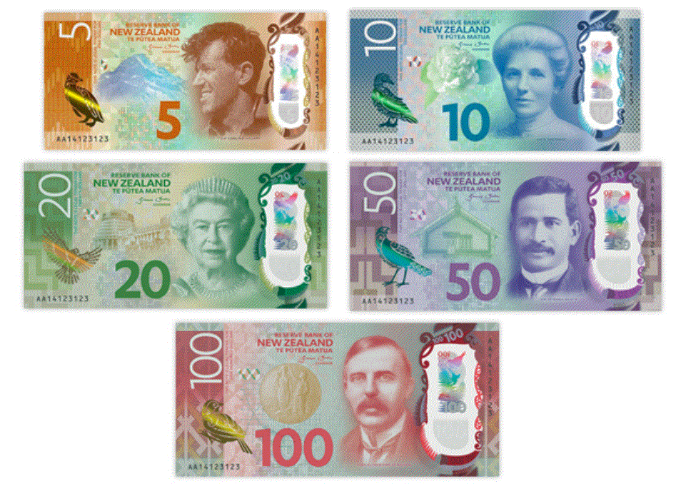

## Table of Contents

## What is the New Zealand Dollar?

The New Zealand Dollar, often called the Kiwi, is the official money used in New Zealand. It is also used in some other places like the Cook Islands and Niue. The symbol for the New Zealand Dollar is $ or NZ$ to show it is different from other dollars. It started being used in 1967 when New Zealand changed from using the British pound to its own money.

The New Zealand Dollar is important for the country's economy. It helps people buy things and trade with other countries. The value of the New Zealand Dollar can go up or down compared to other money, like the US Dollar or the Euro. This can affect how much things cost in New Zealand and how much New Zealand can sell to other countries. The Reserve Bank of New Zealand is in charge of the New Zealand Dollar and tries to keep its value stable.

## How is the New Zealand Dollar abbreviated and symbolized?

The New Zealand Dollar is often shortened to NZD. This is how it is written in financial markets and news. People also call it the Kiwi because of New Zealand's famous bird.

The symbol for the New Zealand Dollar is $. To show it is different from other dollars, like the US Dollar, it can also be written as NZ$. This helps people know which dollar is being talked about.

## What is the history of the New Zealand Dollar?

The New Zealand Dollar, or NZD, became the official money of New Zealand on July 10, 1967. Before that, New Zealand used the New Zealand pound, which was linked to the British pound. The switch to the NZD was part of a bigger change in the country's money system. The new system used dollars and cents instead of pounds, shillings, and pence. This made things simpler and easier to understand. The first coins and banknotes of the NZD were made to show New Zealand's culture and nature, like the kiwi bird and the Maori people.

Over the years, the New Zealand Dollar has changed a lot. In the beginning, it was worth about the same as the US Dollar. But its value has gone up and down over time. The Reserve Bank of New Zealand, which started in 1934, is in charge of the NZD. They try to keep its value stable and help the economy grow. The NZD is now used not just in New Zealand but also in places like the Cook Islands and Niue. It is an important part of New Zealand's trade with other countries, and its value can affect how much things cost and how much New Zealand can sell to other places.

## What are the denominations of New Zealand Dollar banknotes and coins?

New Zealand Dollar banknotes come in different amounts. You can find them in $5, $10, $20, $50, and $100. Each note has a different color and shows pictures of important people or places in New Zealand. For example, the $5 note is purple and has Sir Edmund Hillary and Aoraki/Mount Cook on it. The $100 note is red and shows Lord Rutherford and the Nobel Prize medal.

New Zealand Dollar coins also come in different sizes. There are coins for 10 cents, 20 cents, 50 cents, $1, and $2. The 10 cent coin is the smallest and the $2 coin is the biggest. Each coin has a picture on one side and the Queen's head on the other. The $1 and $2 coins are made of two different metals, which makes them look special.

## How does the Reserve Bank of New Zealand influence the New Zealand Dollar?

The Reserve Bank of New Zealand (RBNZ) is in charge of the New Zealand Dollar and works to keep it stable. One of the main ways the RBNZ influences the NZD is by setting interest rates. When the RBNZ raises interest rates, it can make the NZD stronger because more people and businesses want to invest in New Zealand to get higher returns. On the other hand, if the RBNZ lowers interest rates, the NZD might become weaker because it's less attractive for investors.

The RBNZ also uses other tools to affect the NZD. For example, they can buy or sell NZD in the foreign exchange market to change its value. If they want to make the NZD stronger, they might sell other currencies and buy NZD. If they want to make it weaker, they might do the opposite. These actions help the RBNZ manage the economy and keep prices stable, which is important for everyone in New Zealand.

## What factors affect the value of the New Zealand Dollar?

The value of the New Zealand Dollar (NZD) can change because of many things. One big thing is the interest rates set by the Reserve Bank of New Zealand. If they make interest rates higher, the NZD might get stronger because more people want to invest in New Zealand to get more money back. But if they make interest rates lower, the NZD might get weaker because it's not as good for investors. Another thing that can change the NZD's value is how much other countries want to buy things from New Zealand. If they want to buy a lot, the NZD might get stronger because they need to use more NZD to buy those things.

Other things that can affect the NZD are what's happening in the world and how other countries' money is doing. If there's a lot of worry or trouble in the world, people might want to keep their money in safer places, and the NZD might get weaker. Also, if other countries' money, like the US Dollar or the Euro, gets stronger or weaker, it can change how much the NZD is worth compared to them. The NZD can also be affected by things like how much milk and meat New Zealand sells, because these are big parts of what New Zealand makes and sells to other countries.

## How does the New Zealand Dollar compare to other major currencies?

The New Zealand Dollar (NZD) is often compared to other big currencies like the US Dollar (USD), the Euro (EUR), and the Australian Dollar (AUD). The NZD is usually seen as a smaller currency, but it can still change a lot compared to these bigger ones. For example, if the US economy is doing well, the USD might get stronger, and the NZD might get weaker compared to it. But if New Zealand's economy is doing better than the US, the NZD might get stronger. The same thing can happen with the Euro and the Australian Dollar. The value of the NZD can go up and down a lot because New Zealand is a small country and its economy can be affected easily by what's happening in the world.

Another thing that can change how the NZD compares to other currencies is what people think about the future. If people think New Zealand's economy will do well, they might want to buy more NZD, and it can get stronger. But if they think New Zealand's economy will have problems, they might not want to buy NZD, and it can get weaker. Also, things like how much milk and meat New Zealand sells can affect the NZD because these are big parts of what New Zealand makes and sells to other countries. So, the NZD's value compared to other currencies can change a lot because of many different things.

## What are the key economic indicators that impact the New Zealand Dollar?

The New Zealand Dollar (NZD) is affected by many things in the economy. One important thing is the interest rates set by the Reserve Bank of New Zealand. If they make interest rates higher, the NZD might get stronger because more people want to invest in New Zealand to get more money back. But if they make interest rates lower, the NZD might get weaker because it's not as good for investors. Another thing is how much other countries want to buy things from New Zealand. If they want to buy a lot, the NZD might get stronger because they need to use more NZD to buy those things.

Other things that can affect the NZD are things like how much milk and meat New Zealand sells, because these are big parts of what New Zealand makes and sells to other countries. If New Zealand sells more of these things, the NZD might get stronger. Also, what's happening in the world and how other countries' money is doing can change the NZD's value. If there's a lot of worry or trouble in the world, people might want to keep their money in safer places, and the NZD might get weaker. If other countries' money, like the US Dollar or the Euro, gets stronger or weaker, it can change how much the NZD is worth compared to them.

## How is the New Zealand Dollar used in international trade?

The New Zealand Dollar is used a lot in buying and selling things with other countries. New Zealand sells things like milk, meat, and fruits to other places. When other countries want to buy these things, they need to use New Zealand Dollars. This can make the New Zealand Dollar more important and can change how much it is worth compared to other money.

The value of the New Zealand Dollar can affect how much New Zealand can sell to other countries. If the New Zealand Dollar is strong, it might be harder for other countries to buy New Zealand's things because they need to use more of their own money. But if the New Zealand Dollar is weak, other countries might buy more because it's cheaper for them. This is why the New Zealand Dollar is very important for New Zealand's trade with the world.

## What are the common exchange rate regimes involving the New Zealand Dollar?

The New Zealand Dollar mostly uses a floating exchange rate. This means its value can change every day based on what people think and what's happening in the economy. The Reserve Bank of New Zealand doesn't set a fixed value for the NZD but can still affect it by changing interest rates or buying and selling NZD in the foreign exchange market. This kind of system lets the NZD go up or down freely, which can be good for the economy because it can adjust to changes in the world.

Sometimes, the New Zealand Dollar can be part of other exchange rate systems when other countries use it as a reference. For example, some small Pacific countries might link their money to the NZD to keep their own money stable. This means they try to keep their money's value the same as the NZD. But for New Zealand itself, the floating exchange rate is the main way the NZD works, and it helps New Zealand trade with other countries by letting the NZD's value change as needed.

## How do geopolitical events influence the New Zealand Dollar?

Geopolitical events can change the value of the New Zealand Dollar (NZD) a lot. If there's trouble or worry in the world, people might want to keep their money in safer places. This can make the NZD weaker because New Zealand is seen as a smaller and riskier place to invest in. For example, if there's a big problem between big countries like the US and China, people might not want to buy NZD because they're worried about what might happen next.

On the other hand, if things are calm and stable in the world, the NZD might get stronger. When people feel safe, they might want to invest in smaller countries like New Zealand. Also, if New Zealand is doing well in trade with other countries and there are no big problems, the NZD can stay strong. So, what's happening in the world can make a big difference to how much the NZD is worth.

## What are the advanced trading strategies involving the New Zealand Dollar?

Advanced trading strategies involving the New Zealand Dollar often focus on using technical analysis and understanding economic indicators. Traders might use charts and patterns to guess where the NZD is going next. They look at things like moving averages, support and resistance levels, and other tools to make their guesses. They also pay attention to big news and reports about New Zealand's economy, like how much milk and meat the country is selling, or what the Reserve Bank of New Zealand is doing with interest rates. By putting all this information together, traders can try to buy the NZD when they think it will go up and sell it when they think it will go down.

Another strategy is called [carry](/wiki/carry-trading) trading. This is when traders borrow money in a country with low interest rates and use that money to buy NZD, which might have higher interest rates. They hope to make money from the difference in interest rates. But this can be risky because if the NZD gets weaker, they might lose more money than they make from the interest. Traders also use something called hedging to protect themselves. They might buy or sell other currencies at the same time as the NZD to make sure they don't lose too much if the NZD's value changes a lot. These strategies need a lot of knowledge and can be hard to do right, but they can help traders make money if they understand how the NZD works.

## References & Further Reading

[1]: ["Monetary Policy."](https://www.investopedia.com/terms/m/monetarypolicy.asp) Reserve Bank of New Zealand.

[2]: ["Economic and Fiscal Updates."](https://www.bnnbloomberg.ca/business/economics/2024/12/16/fall-fiscal-update-to-grapple-with-trump-presidency-expected-to-show-larger-deficit/) The New Zealand Treasury.

[3]: Kierkegaard, S., & Singleton, A. (2020). "Algorithmic Trading: Putting Avatars to Work." European Business Review.

[4]: Lopez de Prado, M. (2018). ["Advances in Financial Machine Learning."](https://www.amazon.com/Advances-Financial-Machine-Learning-Marcos/dp/1119482089) John Wiley & Sons.

[5]: Chan, E. P. (2009). ["Quantitative Trading: How to Build Your Own Algorithmic Trading Business."](https://github.com/ftvision/quant_trading_echan_book) John Wiley & Sons.