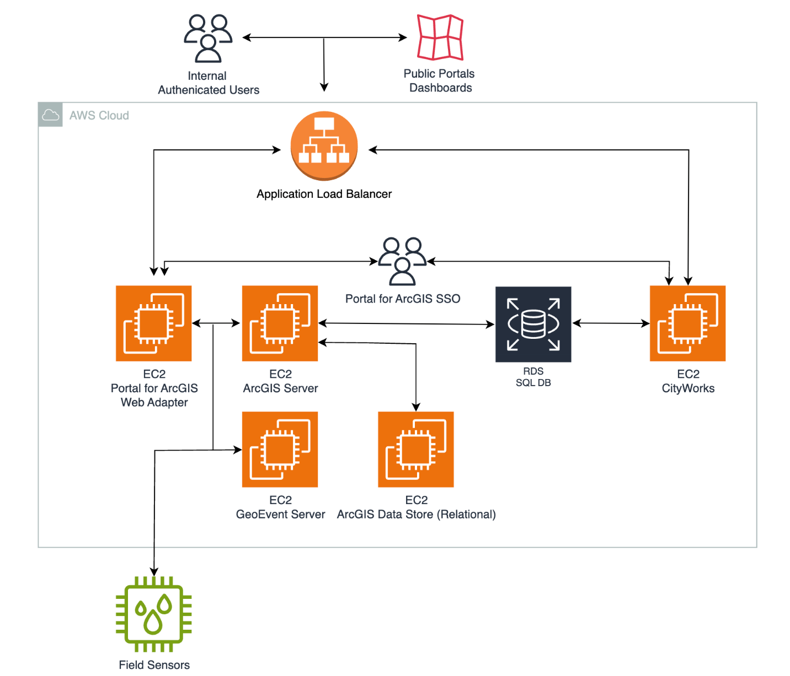

Newedge Group, now operating under the name Société Générale Prime Services, plays a significant role in the financial services industry, particularly impacting the areas of algorithmic trading and brokerage services. Throughout its evolution, Newedge has maintained a robust presence as a prominent financial brokerage firm. This article examines the company's offerings, tracing its journey from inception to becoming a vital part of Société Générale's suite of services. It will analyze the unique attributes and strategic advantages that position Newedge in a competitive marketplace.

The history of Newedge is a story of strategic partnerships and business acumen. Founded as a joint venture between Société Générale and Crédit Agricole, it became a comprehensive multi-asset brokerage platform. The firm excelled at leveraging technological advancements to deliver cutting-edge solutions to its institutional clientele, which included some of the largest banks and financial institutions worldwide. Newedge’s integration of advanced trading technologies demonstrates its capacity to adapt and thrive in the rapidly evolving financial markets.



Newedge’s product range is vast and multifaceted, catering to the diverse needs of its institutional clients. The firm’s emphasis on modern trading technologies ensures seamless execution of trades, making it a preferred choice for algorithmic trading purposes. Newedge's integration with contemporary trading platforms allows it to deliver superior services that meet the demands of global trading participants.

In conclusion, this article will explore how Newedge has carved out a distinct position in the landscape of algorithmic trading, leveraging its expertise and global network to serve institutional clients effectively. As the financial services landscape continues to evolve, Newedge remains poised to address the challenges and opportunities presented by modern trading technologies.

## Table of Contents

## History and Background of Newedge

Newedge was established in January 2008 as a joint venture between two prominent financial institutions, Société Générale and Crédit Agricole. This collaboration marked the inception of Newedge Group, positioned as one of the leading global multi-asset brokerage platforms. Initially, the firm was crafted to leverage the combined heritage and expertise of its parent organizations.

The foundation of Newedge was built upon the strengths of two well-established entities: Fimat and Calyon Financial. Fimat, a subsidiary of Société Générale, was known for its comprehensive range of brokerage services, particularly in the derivatives market. Calyon Financial, under the umbrella of Crédit Agricole CIB, had a robust presence in futures and options brokerage services. Their unification as Newedge allowed the firm to offer enhanced financial services with a broader market reach.

In 2014, a significant transition occurred when Société Générale acquired full ownership of Newedge, integrating it into its array of prime services. This acquisition enabled Société Générale to broaden its financial service offerings and consolidate its position in the international brokerage landscape. The integration also signified the strategic alignment of Newedge’s services with Société Générale’s global objectives, enhancing operational efficiencies and client service capabilities.

Newedge’s formation and eventual integration into Société Générale Prime Services exemplify strategic developments aimed at strengthened market positioning. By combining the expertise of Fimat and Calyon Financial, Newedge was able to expand its reach and deepen its expertise across various financial markets.

## Core Financial Services Offered by Newedge

Newedge, a key entity in financial brokerage, was well-regarded for its extensive multi-asset execution and clearing services, a vital component of its core financial offerings. Specializing in listed derivatives, Newedge offered crucial services including futures commission merchant (FCM) operations, prime brokerage, and cross-margining solutions. These services were designed to support institutional clients in managing diverse trading needs efficiently.

The firm prided itself on its expansive market access, providing entry to over 85 global exchanges, which in turn facilitated seamless trading operations for its clients. This reach enabled institutional traders to engage in markets worldwide, thereby optimizing their trading strategies and broadening investment opportunities.

In addition to these capabilities, Newedge offered comprehensive asset finance solutions. These solutions were tailored to address the specific needs of institutional clients, focusing on maximizing asset [liquidity](/wiki/liquidity-risk-premium) and supporting efficient capital utilization. Furthermore, Newedge provided dedicated client portfolio reporting, an essential service that ensured clients could access detailed and accurate information on their portfolio performance. This reporting was structured to aid clients in making informed decisions, aligning their trading activities with broader financial goals.

Overall, Newedge's suite of services was curated to deliver robust, efficient, and comprehensive trading support to some of the most demanding institutional clients in the global financial markets.

## Algorithmic Trading at Newedge

Newedge Institutional Trading Services created a robust electronic trading infrastructure, accommodating various asset classes. The adoption of [algorithmic trading](/wiki/algorithmic-trading) technologies enabled Newedge to execute trades at optimal prices, ensuring both cost efficiency and speed. Their technology infrastructure was designed to support sophisticated trading strategies across multiple sectors, including equities, fixed income, and mutual funds.

Newedge's approach to algorithmic trading revolved around leveraging advanced computational models and high-speed data analytics. By employing [machine learning](/wiki/machine-learning) algorithms and proprietary trading software, Newedge facilitated the determination of optimal trade entry and [exit](/wiki/exit-strategy) points, minimizing market impact and reducing transaction costs. These algorithms were designed to automatically execute trades based on predefined strategies, which could be adjusted in real-time based on market conditions.

The firm's infrastructure supported a seamless transition from basic order handling to complex algorithmic executions. This was achieved through the implementation of high-frequency trading systems, providing rapid price discovery and execution, a crucial [factor](/wiki/factor-investing) in highly competitive markets. Technologies such as co-location services placed their servers in proximity to exchange servers, thus reducing latency and enhancing execution speeds.

In terms of software, Newedge harnessed the power of both traditional programming languages like C++ for system performance and newer languages such as Python for data analysis and algorithm development. Here is an example of a simple Python algorithm that could be adapted for trading purposes:

```python
import numpy as np
import pandas as pd

# Example function to generate trading signals based on moving average crossover strategy
def generate_signals(prices, short_window=40, long_window=100):
    signals = pd.DataFrame(index=prices.index)
    signals['signal'] = 0.0

    # Create short simple moving average
    signals['short_ma'] = prices.rolling(window=short_window, min_periods=1).mean()

    # Create long simple moving average
    signals['long_ma'] = prices.rolling(window=long_window, min_periods=1).mean()

    # Generate buy signals (1) when short_ma crosses above long_ma
    # Generate sell signals (-1) otherwise
    signals['signal'][short_window:] = np.where(signals['short_ma'][short_window:] > signals['long_ma'][short_window:], 1.0, -1.0)

    return signals
```

This example demonstrates a simple moving average crossover strategy, which can be integrated with more sophisticated logic to suit specific trading models. Such tools and techniques empowered Newedge to handle trades ranging from simple market orders to highly complex algorithmic executions efficiently. This combination of cutting-edge technology and strategic implementation established Newedge as a significant player in the algorithmic trading sector.

## Global Presence and Market Reach

Operating from 19 locations across 14 countries, Newedge has established a substantial international presence in the financial services sector. This geographic footprint ensures that Newedge can cater effectively to a diverse clientele by bridging global financial markets. The platform provides a unified solution tailored to the complex demands of institutional clients, allowing seamless transactions and operations across different time zones and regulatory environments. This single point of contact strategy simplifies trading for clients, reducing the complexity that often accompanies international financial dealings.

The strategic integration with Société Générale in 2014 significantly enhanced Newedge's operational capabilities and market reach. This merger has allowed Newedge to leverage Société Générale’s extensive resources and network, expanding its service offerings and increasing its competitive advantage. As a result, Newedge can provide enhanced liquidity, risk management, and execution services on a more global scale, supporting the sophisticated needs of large institutional clients.

Newedge serves an elite clientele that includes some of the world's most significant banks, hedge funds, and financial institutions. These clients rely on Newedge for its expertise, comprehensive services, and cutting-edge trading technology to execute high-[volume](/wiki/volume-trading-strategy) transactions efficiently. The firm’s robust global infrastructure supports this elite clientele by providing the necessary tools and services required for competitive trading in today's fast-paced financial environment.

Moreover, the worldwide locations of Newedge ensure compliance with local regulations while maintaining efficiency across its operations. This enables Newedge to navigate the complexities of various financial markets, providing clients both consistency in service and the flexibility to adapt to market changes. With this strategic presence, Newedge remains a formidable player in the global financial markets, effectively linking institutions with opportunities across continents.

## Why Choose Newedge for Algorithmic Trading?

Newedge distinguishes itself in the competitive landscape of algorithmic trading through its steadfast commitment to providing personalized and high-quality trade execution services. With its technology-driven approach, Newedge ensures optimal trade execution, a crucial factor for success in algorithmic trading. This technological focus enables the firm to deliver precise and efficient trading processes, thereby enhancing the overall trading experience for its clients.

The firm's neutral stance and absence of proprietary trading activities guarantee unbiased, best price execution for clients. This neutrality is significant, as it alleviates potential conflicts of interest that may arise when financial service providers engage in proprietary trading. Newedge's focus on client interests reinforces its dedication to transparency and fairness in trade executions.

Furthermore, Newedge's strong adherence to regulatory compliance and banking standards solidifies its reputation as a trusted partner for financial institutions. The firm meticulously follows regulatory frameworks, ensuring that all trading activities align with global financial regulations and industry best practices. This commitment to upholding high regulatory standards not only safeguards the integrity of trading operations but also protects the interests of institutional clients who rely on Newedge for reliable and secure trading solutions.

In conclusion, Newedge’s blend of advanced technology, impartial trade execution, and robust regulatory compliance creates a trustworthy environment for institutional clients engaged in algorithmic trading. By prioritizing these elements, Newedge effectively addresses the diverse needs of its clients, making it a preferred choice for those seeking dependable and efficient trading solutions.

## Conclusion

Newedge's transition from a joint venture to becoming part of Société Générale highlights its remarkable growth and flexibility in adapting to the shifting demands of financial markets. This strategic evolution underscores the firm’s ability to integrate cutting-edge technology with a comprehensive suite of financial services, solidifying its status in the sphere of algorithmic trading. The firm’s focus on technological advancement delivers significant value to institutional clients by ensuring reliable and efficient trading solutions. 

As the financial services industry undergoes continuous transformation, Newedge remains a steadfast leader by leveraging its extensive expertise and global infrastructure. The integration into Société Générale’s prime services has not only expanded its market reach but also fortified its capacity to address the diverse requirements of a global client base. This positions Newedge as a preferred partner for institutional investors, offering a robust platform adept at managing complex trading demands.

With a commitment to innovation and exceptional client service, Newedge is well-equipped to navigate and thrive amidst the evolving landscape of financial markets. Its dedication to maintaining high standards of financial integrity and performance will continue to set it apart as a trailblazer in algorithmic trading and brokerage services.

## References and Additional Reading

Société Générale Prime Services: [Société Générale Prime Services](https://www.newedge.com) provides a comprehensive overview of the services and products offered by the company. This website serves as a primary resource for understanding the scope of Société Générale's capabilities.

For insights into current algorithmic trading trends, consider exploring market analysis articles that review the latest developments in trading strategies and technology. Websites such as Investopedia and Trading Technologies often feature articles that address trends impacting algorithmic trading.

To gain further understanding of global trading platforms and their benefits for institutional trading, detailed reports from financial consultancies and research firms are invaluable. Publications such as the "Global Algorithmic Trading Market Report" from MarketsandMarkets or "Trends in Global Derivatives Trading" from the World Federation of Exchanges provide well-researched data on market dynamics.

For those interested in the technical underpinnings of algorithmic trading, academic journals like the "Journal of Financial Markets" and "Algorithmic Finance" publish peer-reviewed research that examines the mathematical and computational foundations of trading algorithms. These resources offer rigorous analyses that can enhance one's understanding of algorithmic trading.

## References & Further Reading

[1]: Bergstra, J., Bardenet, R., Bengio, Y., & Kégl, B. (2011). ["Algorithms for Hyper-Parameter Optimization."](https://dl.acm.org/doi/10.5555/2986459.2986743) Advances in Neural Information Processing Systems 24.

[2]: ["Advances in Financial Machine Learning"](https://www.amazon.com/Advances-Financial-Machine-Learning-Marcos/dp/1119482089) by Marcos Lopez de Prado

[3]: ["Evidence-Based Technical Analysis: Applying the Scientific Method and Statistical Inference to Trading Signals"](https://www.amazon.com/Evidence-Based-Technical-Analysis-Scientific-Statistical/dp/0470008741) by David Aronson

[4]: ["Machine Learning for Algorithmic Trading"](https://github.com/stefan-jansen/machine-learning-for-trading) by Stefan Jansen

[5]: ["Quantitative Trading: How to Build Your Own Algorithmic Trading Business"](https://www.amazon.com/Quantitative-Trading-Build-Algorithmic-Business/dp/1119800064) by Ernest P. Chan