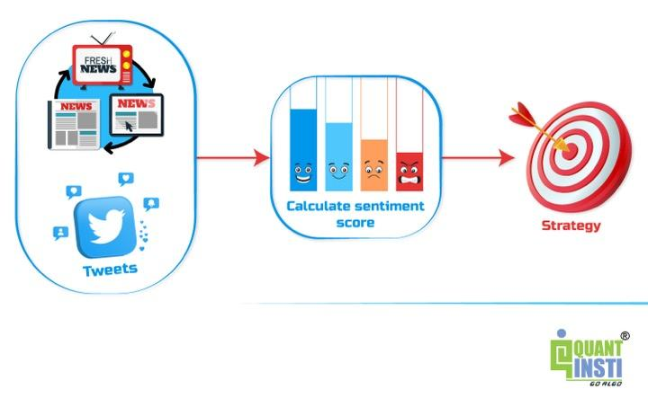

## Table of Contents

## What is news-based trading?

News-based trading is when people buy and sell stocks based on news they hear. This can be news about a company, like a new product or a change in leadership, or news about the economy, like interest rate changes or employment reports. Traders use this news to guess if a stock's price will go up or down and make their trading decisions based on these guesses.

This type of trading can be risky because news can be unpredictable and sometimes the market reacts differently than expected. For example, good news might not always make a stock's price go up right away. Traders need to be quick and well-informed to make the best decisions. They often use tools and resources to get news as soon as it happens so they can act fast.

## How does news affect financial markets?

News can have a big impact on financial markets. When important news comes out, it can make people want to buy or sell stocks, bonds, or other investments. For example, if a company announces it made more money than expected, people might think the company is doing well and buy its stock, which can make the stock price go up. On the other hand, if there's bad news, like a company losing a big lawsuit, people might sell the stock, causing the price to go down.

News about the economy can also affect markets. If the government reports that more people are working, it might make investors feel good about the economy and they might buy more stocks. But if the news says the economy is slowing down, investors might worry and sell their investments. This shows how news can change how people feel about the market, which in turn can move prices up or down.

## What are the basic principles of news-based trading strategies?

News-based trading strategies rely on quickly understanding and acting on new information. Traders watch for news that can affect stock prices, like company earnings reports, product launches, or changes in leadership. When good news comes out, traders might buy the stock hoping the price will go up. If the news is bad, they might sell the stock to avoid losing money. The key is to be fast because the market can react quickly to news, and prices can change in a short time.

Another important part of news-based trading is knowing how the market might react to different types of news. Sometimes, even good news can make a stock's price go down if investors were expecting even better results. Traders need to understand what the market expects and how news might change those expectations. This means they need to stay informed and use tools to get news as soon as it happens. By doing this, they can make better guesses about how prices will move and make smarter trading decisions.

## What types of news are most relevant for trading?

The types of news that matter most for trading are usually about companies and the economy. For companies, news like earnings reports, new product announcements, mergers and acquisitions, or changes in leadership can really move stock prices. If a company says it made more money than people thought, its stock might go up. But if it says it lost money, the stock might go down. Traders watch these news closely to decide if they should buy or sell.

News about the economy is also important. Things like employment reports, [interest rate](/wiki/interest-rate-trading-strategies) changes, or inflation numbers can affect the whole market. If the news says more people are working, it might make investors feel good about the economy and they might buy more stocks. But if the news says the economy is slowing down, investors might worry and sell their investments. Traders need to know how these big economic news stories can change how people feel about the market and move prices.

Sometimes, news from around the world can also affect trading. For example, if there's a big political change in another country, it might affect companies that do business there. Or if there's a natural disaster, it might hurt companies in that area. Traders need to keep an eye on global news too because it can have a big impact on their trading decisions.

## How can beginners start implementing news-based trading strategies?

Beginners can start implementing news-based trading strategies by first learning about the types of news that affect stock prices. They should focus on company news like earnings reports, product announcements, and changes in leadership, as well as economic news like employment reports and interest rate changes. It's important for beginners to understand how these news events can make stock prices go up or down. They can start by reading financial news websites, watching business news channels, and using apps that send alerts about important news.

Once they have a good understanding of the news, beginners should practice making quick decisions based on this news. They can start with a small amount of money or even use a trading simulator to practice without risking real money. It's helpful to set up a routine to check the news at certain times of the day and to use tools that help them get news as soon as it happens. By doing this, beginners can learn how to react to news and make better trading decisions over time.

## What tools and resources are essential for news-based trading?

For news-based trading, having the right tools and resources is important. A good starting point is using financial news websites like Bloomberg, Reuters, or CNBC. These sites give you up-to-date news about companies and the economy. You can also use apps on your phone that send you alerts when important news happens. This way, you can know about news as soon as it comes out and make quick trading decisions.

Another helpful tool is a trading platform that lets you see stock prices in real-time. Platforms like E*TRADE, TD Ameritrade, or Robinhood show you how stock prices are moving and let you buy or sell stocks quickly. Some platforms also have tools that help you analyze news and see how it might affect stock prices. It's also a good idea to use a trading simulator to practice without risking real money. This can help you get better at making decisions based on news before you start trading with real money.

Lastly, joining online communities or forums where traders talk about news and share their ideas can be very useful. Websites like Reddit or StockTwits have groups where people discuss what's happening in the market. Reading what other traders think can give you new ideas and help you understand how different news might affect stocks. By using these tools and resources, you can stay informed and make better trading decisions based on the news.

## How do you analyze the impact of news on specific assets?

To analyze the impact of news on specific assets, you first need to understand what kind of news matters for that asset. For example, if you're looking at a company's stock, news like earnings reports, new product announcements, or changes in leadership can have a big effect. If the news is good, like the company making more money than expected, the stock price might go up. If the news is bad, like the company losing a big lawsuit, the stock price might go down. You can use financial news websites or apps to get this news quickly and see how it might change the stock's price.

Next, you should look at how the market reacts to the news. Sometimes, the market might not react the way you expect. For instance, even good news might not make a stock's price go up right away if investors were expecting even better results. To understand this, you can use tools on trading platforms that show real-time stock prices and let you see how the price changes after the news comes out. It's also helpful to read what other traders are saying on forums or social media to get different views on how the news might affect the asset. By combining all this information, you can make better guesses about how news will impact specific assets.

## What are common pitfalls in news-based trading and how can they be avoided?

One common pitfall in news-based trading is acting too quickly without fully understanding the news. When big news comes out, it's easy to get excited and buy or sell stocks right away. But sometimes the market reacts differently than expected, and you might lose money if you don't wait to see how the news really affects the stock price. To avoid this, take a moment to think about the news and how it might change what people think about the company or the economy. It's also helpful to wait and see how the stock price moves after the news comes out before making a decision.

Another pitfall is not having a good plan for what to do after the news. Some traders might buy a stock because of good news, but then they don't know when to sell it. This can lead to holding onto a stock for too long and missing out on making a profit. To avoid this, have a clear plan for what you'll do after you buy or sell based on news. Decide ahead of time at what price you'll sell the stock to make a profit or cut your losses. Using a trading simulator to practice can help you get better at making these plans without risking real money.

## How can advanced traders use algorithmic trading to enhance news-based strategies?

Advanced traders can use [algorithmic trading](/wiki/algorithmic-trading) to enhance news-based strategies by automating the process of analyzing news and making trades. They can set up algorithms to quickly read news from different sources, understand what the news means, and decide if it's good or bad for a stock. This helps them make trading decisions faster than they could do by themselves. For example, if a company announces better-than-expected earnings, the algorithm can automatically buy the stock before the price goes up too much. This way, advanced traders can take advantage of news as soon as it happens without having to watch the news all the time.

Another way advanced traders use algorithms is to backtest their news-based strategies. They can use historical data to see how well their trading rules would have worked in the past. This helps them fine-tune their strategies to make them more effective. By running simulations, they can see how different types of news affect stock prices and adjust their algorithms to react better to future news. This combination of speed and testing makes algorithmic trading a powerful tool for advanced traders looking to improve their news-based trading strategies.

## What are the best practices for managing risk in news-based trading?

Managing risk in news-based trading is important to avoid losing too much money. One good practice is to set stop-loss orders. This means you decide ahead of time at what price you will sell a stock if it starts to go down. This can help you limit how much money you lose if the news doesn't make the stock price go up like you thought it would. Another practice is to not put all your money into one stock. Instead, spread your money across different stocks. This way, if one stock goes down because of bad news, you won't lose all your money.

It's also a good idea to keep learning about the market and the news. The more you know, the better you can guess how news will affect stock prices. Don't just react to the news right away. Take some time to think about what the news means and how other people might react to it. This can help you make smarter trading decisions and avoid big losses. By following these practices, you can manage risk better and trade more safely.

## How do you measure the effectiveness of a news-based trading strategy?

To measure the effectiveness of a news-based trading strategy, you need to look at how well it helps you make money over time. One way to do this is by checking your overall profit or loss. If your strategy is working, you should see more profits than losses. You can also look at the percentage of your trades that make money. If most of your trades are successful, it's a good sign that your strategy is effective. Another important thing to check is how much risk you're taking. A good strategy should give you good returns without making you too worried about losing a lot of money.

Another way to measure effectiveness is by using a trading journal. Write down every trade you make, the news that made you trade, and how much money you made or lost. Over time, you can look back at your journal to see if certain types of news work better for you than others. This can help you improve your strategy. You can also use a computer to run tests on your past trades, called [backtesting](/wiki/backtesting). This can show you how your strategy would have worked in the past, which can help you guess how well it might work in the future. By keeping track of these things, you can see if your news-based trading strategy is really working for you.

## What are the latest trends and innovations in news-based trading strategies?

The latest trends in news-based trading strategies include the use of [artificial intelligence](/wiki/ai-artificial-intelligence) (AI) and [machine learning](/wiki/machine-learning). These technologies help traders analyze huge amounts of news data quickly and accurately. AI can read news articles, social media posts, and even voice recordings to understand what people are saying about a company or the economy. This helps traders make better guesses about how news will affect stock prices. For example, AI can look at news about a company's earnings and decide if it's good or bad news, then suggest whether to buy or sell the stock.

Another trend is the use of sentiment analysis. This means using computers to figure out if people feel good or bad about a stock based on what they say online. By looking at social media, blogs, and news comments, traders can see if the general feeling about a stock is positive or negative. If people are excited about a company's new product, it might mean the stock price will go up. Sentiment analysis helps traders use this information to make smarter trading decisions. These innovations make news-based trading faster and more accurate, helping traders stay ahead in the market.

## References & Further Reading

[1]: Bergstra, J., Bardenet, R., Bengio, Y., & Kégl, B. (2011). ["Algorithms for Hyper-Parameter Optimization."](https://dl.acm.org/doi/10.5555/2986459.2986743) Advances in Neural Information Processing Systems 24.

[2]: ["Advances in Financial Machine Learning"](https://www.amazon.com/Advances-Financial-Machine-Learning-Marcos/dp/1119482089) by Marcos Lopez de Prado

[3]: ["Evidence-Based Technical Analysis: Applying the Scientific Method and Statistical Inference to Trading Signals"](https://www.amazon.com/Evidence-Based-Technical-Analysis-Scientific-Statistical/dp/0470008741) by David Aronson

[4]: ["Machine Learning for Algorithmic Trading"](https://github.com/stefan-jansen/machine-learning-for-trading) by Stefan Jansen

[5]: ["Quantitative Trading: How to Build Your Own Algorithmic Trading Business"](https://www.amazon.com/Quantitative-Trading-Build-Algorithmic-Business/dp/1119800064) by Ernest P. Chan