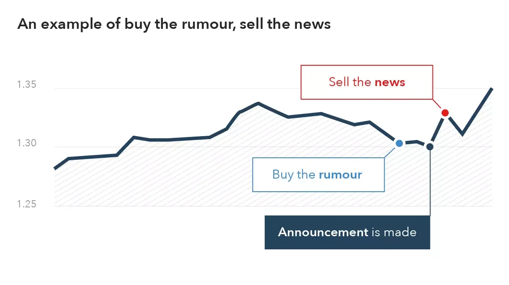

## Table of Contents

## What is a news trader?

A news trader is someone who buys and sells things like stocks or currencies based on news events. They look at news stories about things like company earnings, economic reports, or big world events. When they see news that they think will affect prices, they quickly make trades to try to make money from the changes in prices.

News traders need to be fast because prices can change a lot right after news comes out. They often use special tools and software to get news quickly and to help them decide what to buy or sell. It can be risky because if they guess wrong about how the news will affect prices, they might lose money. But if they guess right, they can make a lot of money in a short time.

## What does the phrase 'Buy the Rumor, Sell the News' mean?

The phrase 'Buy the Rumor, Sell the News' is a common saying in the world of trading. It means that traders often buy a stock or other asset when they hear rumors about good news coming. They hope the price will go up when the news is officially announced. So, they buy before the news comes out, expecting the price to rise because of the rumor.

Once the news is actually released, the price might already have gone up because of the rumor. At this point, traders who followed the rumor might sell their assets to make a profit. This is why they 'sell the news' - they sell after the news is out, hoping to cash in on the price increase that happened because of the rumor. It's a strategy that tries to take advantage of how people react to rumors and news.

## How does the 'Buy the Rumor, Sell the News' strategy work?

The 'Buy the Rumor, Sell the News' strategy works by traders buying a stock or asset when they hear rumors of good news coming. They think the price will go up when the news is officially announced, so they buy before everyone else knows for sure. This is based on the idea that rumors can start moving the price even before the news is out. Traders want to get in early to ride the wave of the price going up because of the rumor.

Once the news is actually released, the price might have already gone up because of the rumor. At this point, the traders who bought because of the rumor might sell their assets to make a profit. They sell after the news is out, hoping to cash in on the price increase that happened because of the rumor. This strategy tries to make money from how people react to rumors and news, but it can be risky because if the news isn't as good as rumored, the price might go down instead.

## What are the key components of a rumor that traders look for?

Traders look for rumors that seem like they could be true and might affect the price of a stock or other asset. They pay attention to where the rumor comes from. If it's from a reliable source, like a well-known journalist or someone inside the company, traders might take it more seriously. They also look at how much the rumor could change things. If the rumor is about something big, like a new product or a merger, it might have a bigger effect on the price.

Another thing traders think about is how fast the rumor is spreading. If a lot of people are talking about it, it might push the price up or down more quickly. Traders also try to guess how the market will react to the rumor. If they think other people will buy because of the rumor, they might buy too, hoping to sell later at a higher price. But they have to be careful because if the rumor turns out to be wrong, the price could drop instead.

## Can you provide an example of a successful 'Buy the Rumor, Sell the News' trade?

Imagine there's a rumor going around that a big tech company, let's call it TechCo, is about to announce a new, amazing smartphone. The rumor starts spreading from a reliable tech journalist who says they heard it from someone inside TechCo. Traders who hear this rumor think the stock price of TechCo will go up when the new phone is officially announced. So, they start buying TechCo's stock before the news comes out, hoping to make money from the price going up because of the rumor.

A few days later, TechCo officially announces the new smartphone, and it's even better than the rumor said. The stock price of TechCo jumps up right after the announcement because a lot of people want to buy the stock now that the news is out. The traders who bought because of the rumor quickly sell their TechCo stock at the higher price. They make a profit because they bought low before everyone knew about the new phone and sold high after the news came out. This is a successful 'Buy the Rumor, Sell the News' trade.

## What are the risks associated with the 'Buy the Rumor, Sell the News' strategy?

The 'Buy the Rumor, Sell the News' strategy can be risky. One big risk is that the rumor might not be true. If traders buy a stock because of a rumor and then the news turns out to be different or not as good as they thought, the stock price can go down instead of up. This means traders could lose money if they have to sell at a lower price than they bought.

Another risk is timing. It's hard to know the perfect time to buy and sell. If traders buy too early, they might have to wait a long time for the news to come out, and the price might not go up right away. If they sell too late, after everyone else has already sold, the price might drop before they can get out. This makes it tricky to make a profit and can lead to losses if the timing is off.

Also, the market can be unpredictable. Sometimes, even if the news is good, the stock price might not go up as much as expected, or it might go up and then quickly go back down. Traders need to be ready for these ups and downs and be careful not to get caught in a sudden drop in price. This strategy needs a lot of attention and quick decisions, which can be stressful and risky.

## How can a trader identify when a rumor is likely to impact the market?

Traders can figure out if a rumor might impact the market by looking at where the rumor comes from. If it's from someone trusted, like a well-known journalist or someone inside the company, traders are more likely to believe it. They also check how big the rumor is. If it's about something huge, like a new product or a big merger, it's more likely to move the market. Traders pay attention to how fast the rumor is spreading too. If a lot of people are talking about it, it might push the stock price up or down more quickly.

Another way traders tell if a rumor will impact the market is by looking at how the market has reacted to similar rumors in the past. If rumors about the same company or in the same industry have moved the market before, traders might think this new rumor will do the same. They also try to guess how other traders and investors will react to the rumor. If they think a lot of people will buy or sell because of the rumor, they might do the same, hoping to make money from the price change. But traders have to be careful because even if all these signs look good, the market can still do something unexpected.

## What are some common mistakes traders make when using this strategy?

One common mistake traders make when using the 'Buy the Rumor, Sell the News' strategy is acting on rumors that aren't true or reliable. They might hear a rumor from a source that isn't trustworthy and buy the stock, only to find out later that the news was different or not as good as they thought. This can lead to big losses if the stock price goes down instead of up. Traders need to check where the rumor comes from and how likely it is to be true before they make a move.

Another mistake is getting the timing wrong. Traders might buy too early and have to wait a long time for the news to come out, or they might sell too late after everyone else has already sold. This can mean they miss out on making a profit or even lose money if the price drops before they can sell. It's hard to know the perfect time to buy and sell, and getting it wrong can be costly.

Lastly, traders sometimes forget that the market can be unpredictable. Even if the news is good, the stock price might not go up as much as expected, or it might go up and then quickly go back down. Traders need to be ready for these ups and downs and not get caught in a sudden drop in price. This strategy needs a lot of attention and quick decisions, and making mistakes can be stressful and risky.

## How does market sentiment influence the effectiveness of the 'Buy the Rumor, Sell the News' strategy?

Market sentiment plays a big role in how well the 'Buy the Rumor, Sell the News' strategy works. If a lot of people feel good about the market or a specific stock, they might be more likely to believe and act on rumors. This positive sentiment can make the stock price go up even before the news comes out, helping traders who bought because of the rumor. But if the market sentiment is bad, people might not trust the rumors as much. They might not buy the stock, and the price might not go up even if the news is good. So, traders need to pay attention to how people feel about the market to guess if a rumor will work.

Sometimes, market sentiment can change quickly. If a rumor starts to spread and more people start feeling good about it, the stock price can go up fast. Traders who see this change in sentiment might jump in to buy the stock, hoping to sell it later at a higher price. But if the sentiment turns negative after the news comes out, maybe because the news wasn't as good as the rumor said, the stock price can drop. Traders need to be ready for these quick changes and be careful not to get caught if the sentiment turns against them.

## What technical indicators can complement the 'Buy the Rumor, Sell the News' approach?

Traders can use technical indicators to help them with the 'Buy the Rumor, Sell the News' strategy. One useful indicator is the Relative Strength Index (RSI). The RSI helps traders see if a stock is overbought or oversold. If the RSI shows a stock is overbought right before the news comes out, it might mean the price could go down after the news, so traders might want to sell quickly. If the RSI shows the stock is oversold, it might mean the price could go up after the news, so traders might want to hold onto the stock a bit longer.

Another helpful indicator is the Moving Average Convergence Divergence (MACD). The MACD can show traders when the stock's [momentum](/wiki/momentum) is changing. If the MACD line crosses above the signal line right before the news, it might mean the stock's price will keep going up, so traders might want to buy more or hold onto what they have. If the MACD line crosses below the signal line, it might mean the price will start to go down, so traders might want to sell their stock before it drops too much. Using these indicators can help traders make better decisions when they're trying to buy the rumor and sell the news.

## How can advanced traders adjust their strategies based on varying market conditions?

Advanced traders can change their strategies depending on what's happening in the market. If the market is going up a lot and everyone feels good about it, traders might decide to buy more stocks when they hear rumors. They think the good feelings will make the stock price go up even more when the news comes out. But if the market is going down and people are worried, traders might be more careful. They might not buy as much because they think the bad feelings could make the stock price go down even if the news is good. Traders need to watch the market and see how people feel to decide when to buy and sell.

Another way traders can adjust their strategies is by using different tools and indicators. For example, if the market is moving a lot, traders might use the Relative Strength Index (RSI) to see if a stock is overbought or oversold. This can help them decide if they should sell quickly after the news or hold onto the stock a bit longer. They might also use the Moving Average Convergence Divergence (MACD) to see if the stock's momentum is changing. If the market is calm, traders might not need these tools as much, but they can still help make better decisions. By using these tools and watching the market, traders can change their strategies to fit what's happening around them.

## What role does regulatory news play in the 'Buy the Rumor, Sell the News' strategy?

Regulatory news can be very important for the 'Buy the Rumor, Sell the News' strategy. This kind of news comes from government agencies and can affect how a company does business. If there's a rumor that a company might get a new rule or law that helps them, traders might buy the stock because they think the price will go up when the news is official. But if the rumor is about a new rule that could hurt the company, traders might sell the stock before the news comes out, thinking the price will go down.

Traders need to be careful with regulatory news because it can be hard to predict. Sometimes, the news might not be as good or bad as the rumor said, and the stock price might not move as expected. Traders should look at where the rumor comes from and how likely it is to be true. They also need to watch how the market reacts to regulatory news in general. If the market usually moves a lot because of this kind of news, traders might want to pay more attention to rumors about it.

## References & Further Reading

[1]: Farmer, J. D., & Skouras, S. (2013). ["Review of 'Advances in Financial Machine Learning' by Marcos Lopez de Prado."](https://www.inet.ox.ac.uk/publications/an-ecological-perspective-on-the-future-of-computer-trading) National Bureau of Economic Research Working Paper No. 10123.

[2]: Lopez de Prado, M. (2018). ["Advances in Financial Machine Learning."](https://www.amazon.com/Advances-Financial-Machine-Learning-Marcos/dp/1119482089) John Wiley & Sons.

[3]: Aronson, D. R. (2006). ["Evidence-Based Technical Analysis: Applying the Scientific Method and Statistical Inference to Trading Signals."](https://www.amazon.com/Evidence-Based-Technical-Analysis-Scientific-Statistical/dp/0470008741) John Wiley & Sons.

[4]: Jansen, S. (2020). ["Machine Learning for Algorithmic Trading: Predictive Models to Extract Signals from Market and Alternative Data for Systematic Trading Strategies with Python."](https://github.com/stefan-jansen/machine-learning-for-trading) Packt Publishing.

[5]: Chan, E. P. (2009). ["Quantitative Trading: How to Build Your Own Algorithmic Trading Business."](https://github.com/ftvision/quant_trading_echan_book) John Wiley & Sons.