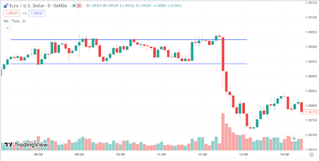

## Table of Contents

## What is news trading in the financial markets?

News trading in the financial markets is when traders buy or sell financial assets based on news events. This can include things like economic reports, company earnings announcements, or big world events. Traders try to predict how the news will affect the price of stocks, currencies, or other assets. If they think the price will go up, they buy. If they think it will go down, they sell.

The goal of news trading is to make money from the quick changes in prices that often happen right after news comes out. It can be exciting and profitable, but it's also risky. The markets can move very fast and in unexpected ways. Traders need to be quick and have a good understanding of how different news can impact the markets. They also need to manage their risks carefully to avoid big losses.

## Why is news trading considered important for traders?

News trading is important for traders because it helps them make money by reacting quickly to new information. When big news comes out, like a company's earnings report or a change in interest rates, it can cause the prices of stocks, currencies, and other assets to move a lot. Traders who can predict these moves and act fast can buy low and sell high, or sell high and buy back low, to make a profit. This can be a big part of how they earn money in the markets.

It's also important because it keeps traders informed about what's happening in the world and how it might affect their investments. By paying attention to news, traders can understand the bigger picture and make better decisions about what to buy or sell. This can help them avoid big losses and find new opportunities. Even though news trading can be risky, it's a key skill that many successful traders use to stay ahead in the fast-moving world of finance.

## What types of news events typically impact the financial markets?

News events that often impact the financial markets include economic reports like jobs numbers, inflation rates, and GDP growth. These reports give traders information about how well the economy is doing. If the reports are good, it can make people feel more confident about the future, and they might buy more stocks or other investments. If the reports are bad, it can make people worried, and they might sell their investments to avoid losing money.

Another type of news that affects the markets is company news, like earnings reports or announcements about new products. If a company does better than expected, its stock price might go up because people want to buy it. If a company does worse than expected, its stock price might go down because people want to sell it. Big events like mergers, acquisitions, or changes in leadership can also move stock prices a lot.

World events like political changes, natural disasters, or big international meetings can also impact the markets. For example, if there's a war or a big election, it can make the markets more uncertain and cause prices to move a lot. Traders need to pay attention to these events because they can change how people feel about investing and affect the prices of many different assets.

## How can a beginner start with news trading?

To start with news trading, a beginner should first learn about the types of news that move the markets. This includes economic reports like jobs numbers and inflation rates, as well as company news like earnings reports. It's helpful to follow financial news websites, watch videos, or read [books](/wiki/algo-trading-books) that explain these things in simple terms. Beginners should also practice reading and understanding these reports to see how they might affect stock or currency prices.

Once a beginner understands the news, they should start small. It's a good idea to use a practice account, also called a demo account, to trade without risking real money. This allows beginners to try out news trading strategies and see how the markets react to different news without losing money. As they get more comfortable, they can start trading with small amounts of real money, always being careful to manage their risks. This means setting limits on how much they can lose and not putting all their money into one trade.

## What are the key economic indicators to watch for news trading?

When you're starting with news trading, it's important to keep an eye on key economic indicators. These are reports that tell you how the economy is doing. Some of the most important ones are the unemployment rate, which shows how many people are out of work, and the inflation rate, which tells you how much prices are going up. Another big one is the Gross Domestic Product (GDP), which measures the total value of all goods and services produced in a country. These reports can make the markets move a lot because they give traders a good idea of how the economy is doing.

Another set of indicators to watch are the ones that come out every month, like the Non-Farm Payrolls (NFP) report, which tells you how many jobs were added or lost in the U.S. outside of farming. The Consumer Price Index (CPI) is also important because it measures the average change over time in the prices paid by urban consumers for a market basket of consumer goods and services. These reports can cause big swings in the markets because they give traders new information about the economy. By paying attention to these indicators, you can start to understand how they might affect the prices of stocks, currencies, and other investments.

## How does one analyze the impact of news on market volatility?

To analyze the impact of news on market [volatility](/wiki/volatility-trading-strategies), you need to look at how quickly and how much prices move after news comes out. When big news hits, like a company's earnings report or an economic update, the markets can get very jumpy. Traders might buy or sell a lot, causing the prices to go up and down fast. You can see this by watching the price charts and looking at something called the volatility index, which measures how much the market is moving around. If the index goes up after news, it means the market is more volatile.

To understand this better, you can also look at how different types of news affect different parts of the market. For example, news about interest rates might make bond prices move a lot, but not affect stocks as much. By keeping track of these patterns, you can start to predict how the market might react to new news. This can help you make better trading decisions and manage your risks. Remember, the more you watch and learn, the better you'll get at figuring out how news impacts market volatility.

## What tools and resources are essential for effective news trading?

To do news trading well, you need some important tools and resources. A good economic calendar is key. It tells you when big news like jobs reports or inflation numbers will come out. This helps you plan your trades. You also need a fast and reliable news feed. This way, you can get the news as soon as it happens and act quickly. A trading platform with real-time data is also important. It shows you the current prices of stocks, currencies, and other things you might want to trade. Lastly, a demo account can be very helpful. It lets you practice trading without risking real money, so you can learn how the markets move after news comes out.

Another useful resource is financial news websites and apps. They give you detailed information about what's happening in the economy and with companies. Watching videos or reading books about trading can also help you understand how news affects the markets. It's good to have a volatility index tool too. This shows you how much the market is moving around, which can help you see the impact of news. By using these tools and resources, you can make better decisions and manage your risks when you're trading based on news.

## What are common strategies used in news trading?

One common strategy in news trading is called "buy the rumor, sell the news." This means traders buy an asset before good news comes out, hoping the price will go up when the news is released. Once the news is out and the price has gone up, they sell the asset to make a profit. This strategy works because sometimes the market already expects good news, so the price starts to rise before the news is official. But it can be risky because if the news is not as good as expected, the price might go down instead.

Another strategy is "fade the news." This is when traders think the market's reaction to news is too strong and will not last. They might sell an asset if the price goes up a lot after good news, betting that the price will come back down soon. Or they might buy an asset if the price drops a lot after bad news, thinking it will go back up. This strategy can work if the market overreacts to news, but it's also risky because the market might keep moving in the same direction.

A third strategy is "straddle trading." This involves buying both a call option and a put option for the same asset at the same time, with the same expiration date. This way, no matter which way the price moves after the news, you can make money. If the price goes up, the call option becomes more valuable. If the price goes down, the put option becomes more valuable. This strategy can be useful when you expect big news to cause a lot of movement in the market, but you're not sure which way it will go.

## How can traders manage risk while engaging in news trading?

Managing risk in news trading is important because the markets can move a lot and fast when news comes out. One way to manage risk is by setting stop-loss orders. This means you tell your trading platform to sell your asset if the price drops to a certain level. This can help you limit how much money you lose if the market moves against you. Another way is to not put all your money into one trade. By spreading your money across different trades, you can reduce the risk of losing everything on one bad trade.

Another important part of managing risk is to always have a plan. Before the news comes out, decide what you will do if the price goes up or down. Stick to your plan and don't let your emotions make you do something different. It's also good to use a demo account to practice your strategies without risking real money. This way, you can see how the markets react to news and learn how to manage your risks better before you start trading with real money.

## What are the psychological challenges faced by news traders?

News trading can be really exciting, but it can also be tough on your mind. One big challenge is dealing with fear and greed. When the news comes out, the prices can move a lot and fast. This can make you feel scared that you might lose money, or greedy if you see prices going up and you want to make more money. These feelings can make you do things you didn't plan, like selling too soon or holding on too long. It's important to stick to your plan and not let your emotions take over.

Another challenge is dealing with uncertainty. News can be hard to predict, and the markets can react in ways you don't expect. This can make you feel unsure about what to do next. It's easy to second-guess yourself and feel stressed out. To handle this, you need to stay calm and focus on what you know. Keep learning and practicing, and don't let the ups and downs of the market shake your confidence.

## How does news trading differ across various financial instruments?

News trading can be different depending on what you're trading, like stocks, currencies, or commodities. When you trade stocks, you often look at news about specific companies, like their earnings reports or new products. This news can make the stock price go up or down a lot. For example, if a company does better than expected, its stock price might jump. But if it does worse, the price might drop. You also need to watch general economic news, like jobs reports, because they can affect the whole stock market.

When you trade currencies, you focus more on big economic news from different countries, like [interest rate](/wiki/interest-rate-trading-strategies) changes or inflation reports. These can make one currency stronger or weaker compared to another. For example, if a country's economy is doing well, its currency might go up in value. But if there's bad news, like a political problem, the currency might go down. Trading commodities, like gold or oil, is a bit different. You look at news that affects supply and demand, like weather reports for crops or political events in oil-producing countries. This news can make the price of commodities move a lot.

In all these cases, the key is to understand how different news affects the prices of what you're trading. Stocks might react to company-specific news, currencies to country-wide economic news, and commodities to supply and demand news. By knowing these differences, you can make better trading decisions and manage your risks more effectively.

## What advanced techniques can expert traders use to enhance their news trading performance?

Expert traders can use advanced techniques like [algorithmic trading](/wiki/algorithmic-trading) to improve their news trading. This means they use computer programs to buy and sell based on news. The programs can react to news much faster than a human can, which can help them make money from quick price changes. These programs can also look at a lot of data to find patterns and make better predictions about how the market will move after news comes out. By using these tools, expert traders can make more trades and manage their risks better.

Another technique experts use is called sentiment analysis. This is when they use special software to look at what people are saying on social media, news sites, and other places to see if the general feeling about a stock or market is good or bad. If most people are talking positively, it might mean the price will go up. If they're talking negatively, the price might go down. By understanding the mood of the market, expert traders can make better decisions about when to buy or sell. This can help them stay ahead of the market and make more money from news trading.

## References & Further Reading

[1] Aldridge, I. (2013). [High-frequency trading: a practical guide to algorithmic strategies and trading systems](https://www.amazon.com/High-Frequency-Trading-Practical-Algorithmic-Strategies/dp/1118343506). John Wiley & Sons.

[2] Han, J., Pei, J., & Kamber, M. (2011). [Data mining: concepts and techniques](https://www.sciencedirect.com/book/9780123814791/data-mining-concepts-and-techniques). Elsevier.

[3] Manning, C. D., & Schütze, H. (1999). [Foundations of statistical natural language processing](https://www.amazon.com/Foundations-Statistical-Natural-Language-Processing/dp/0262133601). MIT press.

[4] Goodfellow, I., Bengio, Y., Courville, A., & Bengio, Y. (2016). [Deep learning (Vol. 1)](https://www.deeplearningbook.org/). MIT press Cambridge.

[5] Chollet, F. (2017). [Deep learning with Python](https://www.manning.com/books/deep-learning-with-python). Manning Publications Co..

[6] Baker, S. R., Bloom, N., & Davis, S. J. (2016). [Measuring economic policy uncertainty](https://academic.oup.com/qje/article/131/4/1593/2468873). The quarterly journal of economics, 131(4), 1593-1636.

[7] Sincere, M. (2014). [Understanding Options 2E](https://www.amazon.fr/Understanding-Options-English-Michael-Sincere-ebook/dp/B00GWSXX8U). McGraw Hill Professional.

[8] Bouchaud, J-P., Farmer, J. D., & Lillo, F. (2009). [How markets slowly digest changes in supply and demand](https://arxiv.org/pdf/0809.0822.pdf). Handbook of Financial Markets: Dynamics and Evolution, 57-156.

[9] Elder, A. (2002). [Come Into My Trading Room: A Complete Guide to Trading](https://dl.abcbourse.ir/dl/Library/book/Elder_Alexander_Come_Into_My_Trading.pdf). John Wiley & Sons.

[10] Chan, E. P. (2013). [Algorithmic Trading: Winning Strategies and Their Rationale](https://www.amazon.com/Algorithmic-Trading-Winning-Strategies-Rationale/dp/1118460146). Wiley.

[11] Bollen, J., Mao, H., & Zeng, X. (2011). [Twitter mood predicts the stock market](https://www.sciencedirect.com/science/article/abs/pii/S187775031100007X). Journal of Computational Science, 2(1), 1-8.

[12] Preis, T., Moat, H. S., & Stanley, H. E. (2013). [Quantifying Trading Behavior in Financial Markets Using Google Trends](https://www.nature.com/articles/srep01684). Scientific Reports, 3, 1684.