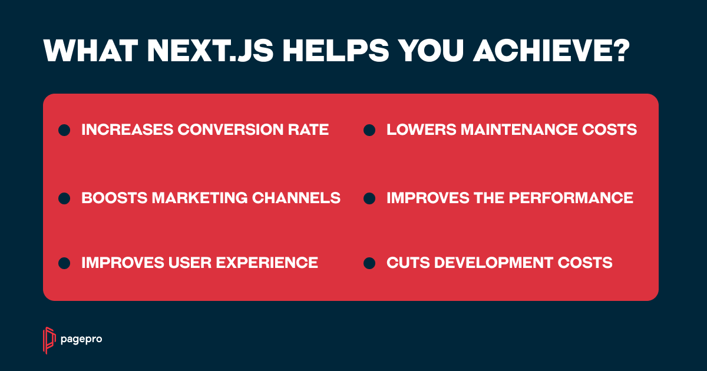

## Table of Contents

## What is NEX and what does it stand for?

NEX is a type of trading platform where people can buy and sell stocks and other investments. It stands for "National Stock Exchange." This exchange is important because it helps companies get money they need to grow by selling parts of their business to the public.

The NEX is different from bigger stock exchanges because it focuses on smaller companies. These companies might not be big enough to be on the main stock exchange yet. By being on the NEX, these smaller companies can still raise money and grow, which can be good for the economy.

## How does NEX function as a platform?

NEX works like a big online marketplace where people can trade stocks from smaller companies. When a company wants to raise money, it can list its stocks on NEX. People who want to invest can then buy these stocks. The price of the stocks goes up and down based on how many people want to buy or sell them. NEX makes sure that all these trades happen fairly and smoothly.

To use NEX, people need to have an account with a broker who is connected to the NEX platform. The broker helps them buy and sell stocks. NEX also has rules to make sure that the companies on its platform follow certain standards. This helps keep the platform safe and trustworthy for everyone who uses it.

## What are the primary uses of NEX?

The main use of NEX is to help smaller companies raise money. When a small company wants to grow, it can sell parts of its business, called stocks, on NEX. People who believe in the company can buy these stocks. This gives the company the money it needs to get bigger and do more things. Without NEX, it would be hard for these small companies to find people to invest in them.

NEX also helps people invest their money. If someone wants to put their money into a growing business, they can look at the companies listed on NEX. They can buy stocks from these companies, hoping that the company will do well and the value of their stocks will go up. This way, NEX gives people a chance to be part of a company's success and possibly make money from their investment.

## Who can benefit from using NEX?

Small companies can really benefit from using NEX. When they want to grow but don't have enough money, they can sell parts of their business on NEX. This helps them get the money they need to expand and do more. Without NEX, it would be tough for these small companies to find people willing to invest in them.

People who want to invest their money can also benefit from NEX. They can buy stocks from small companies listed on NEX. If these companies do well, the value of their stocks might go up. This gives people a chance to make money from their investments. NEX helps connect these investors with small companies that might have big potential.

## What are the basic features of NEX?

NEX is a platform where small companies can sell parts of their business, called stocks, to raise money. This helps them grow because people who believe in the company can buy these stocks. NEX makes sure all the trades happen fairly and smoothly. It has rules that companies must follow to keep the platform safe and trustworthy.

People who want to invest can use NEX to buy stocks from these small companies. They need to have an account with a broker connected to NEX. The broker helps them buy and sell stocks. If the company does well, the value of the stocks might go up, which could help the investor make money. This way, NEX connects small companies with people who want to invest in them.

## How does NEX compare to other similar platforms?

NEX is different from bigger stock exchanges because it focuses on smaller companies. Big stock exchanges like the New York Stock Exchange or NASDAQ usually have big, well-known companies. NEX gives a chance to small companies that are not big enough for these main exchanges. This means NEX is important for helping small businesses grow by letting them raise money from the public.

Other platforms like the TSX Venture Exchange in Canada also focus on smaller companies, but they might have different rules and requirements. NEX has its own set of rules to make sure the companies on its platform are safe to invest in. This can make NEX a good choice for people who want to invest in small companies but want to know they are following certain standards. Overall, NEX provides a specialized place for smaller companies to find investors and grow, which sets it apart from other platforms.

## What are the advantages of using NEX over traditional methods?

Using NEX has some big advantages over traditional ways of raising money for small companies. In the past, a small company might have to go to a bank for a loan, but banks can be strict and might say no. With NEX, a small company can sell parts of its business to many people at once. This means they don't have to depend on just one bank. It's easier for them to get the money they need to grow because more people can invest in them.

For people who want to invest, NEX is also better than traditional ways. Before, if someone wanted to invest in a small business, they might have to know the owner personally or go through a complicated process. NEX makes it simple. People can look at the companies on the platform, see their information, and decide to buy stocks. This gives them a chance to invest in small companies that might become big one day, without all the hassle of traditional investing.

## Can you explain the user interface of NEX and how to navigate it?

The user interface of NEX is designed to be easy to use. When you log in, you'll see a main page that shows different sections like 'Companies', 'Stocks', and 'News'. The 'Companies' section lists all the small companies you can invest in. You can click on a company to see more details about it, like what they do and how their stocks are doing. The 'Stocks' section shows the stocks you can buy or sell. You can search for a specific stock or look at the list of all available stocks.

To buy or sell stocks, you go to the 'Stocks' section and find the stock you're interested in. You'll see a button to buy or sell. When you click it, you'll need to enter how many stocks you want to buy or sell and at what price. After you enter this information, you submit your order. The platform will then try to match your order with someone else's, and if it works, your trade will happen. It's all done through a simple and clear interface, so even if you're new to investing, you can figure it out.

## What are some common challenges or disadvantages users might face with NEX?

One challenge users might face with NEX is that it focuses on smaller companies. These companies can be riskier to invest in because they might not have a long history of success. If a small company doesn't do well, the value of its stocks can go down a lot. This means people who invest in NEX might lose money more easily than if they invested in bigger, more stable companies on other exchanges.

Another disadvantage is that NEX might not be as well-known or easy to use as bigger stock exchanges. Some people might find it hard to understand how to use the platform or feel unsure about investing in smaller companies. Also, because NEX is for smaller companies, there might be fewer stocks to choose from compared to bigger exchanges. This can make it harder for people to find the right investment for them.

## How does NEX handle data security and privacy?

NEX takes data security and privacy very seriously. They use special technology to keep your information safe when you use their platform. This includes things like encryption, which is like putting your data in a secret code that only NEX can understand. They also have strict rules about who can see your information and make sure only the right people have access to it.

NEX also follows laws about privacy to make sure they handle your data the right way. They tell you what information they collect and why they need it. If you want to know what data NEX has about you, you can ask them, and they will let you see it. This helps make sure your privacy is protected while you use their platform to invest in small companies.

## What advanced features does NEX offer to expert users?

NEX offers some special tools for people who know a lot about investing. One of these tools is called real-time data. This means you can see what's happening with stocks right now, not just later. This can help you make quick decisions about buying or selling stocks. Another tool is advanced charting, which lets you look at stock prices in different ways. You can see how a stock has been doing over time and maybe guess where it might go next.

NEX also has something called order types. This lets you set up your trades in special ways. For example, you can set a limit order, which means you tell NEX to buy or sell a stock only if it reaches a certain price. This can help you get a better deal. There's also a feature called portfolio analysis, which helps you see how all your investments are doing together. This can help you decide if you need to change anything to make your investments better.

## Are there any case studies or success stories that highlight the effectiveness of NEX?

One success story that shows how NEX can help small companies is about a tech startup called GreenTech Innovations. They wanted to grow their business but needed money to do it. They decided to list their stocks on NEX. People who believed in their ideas bought the stocks, and GreenTech was able to raise enough money to expand. Now, they're doing well and their stocks are worth more than before. This shows how NEX can help small companies get the money they need to become bigger and more successful.

Another example is an investor named Sarah. She wanted to invest her money in small companies that could grow a lot. She used NEX to find and buy stocks in a small company called HealthWave. The company did really well, and the value of Sarah's stocks went up a lot. She made a good profit from her investment. This story shows how NEX can be a good place for people to find and invest in small companies that might become big one day.

## References & Further Reading

[1]: Bergstra, J., Bardenet, R., Bengio, Y., & Kégl, B. (2011). ["Algorithms for Hyper-Parameter Optimization."](https://papers.nips.cc/paper/4443-algorithms-for-hyper-parameter-optimization) Advances in Neural Information Processing Systems 24.

[2]: ["Advances in Financial Machine Learning"](https://www.amazon.com/Advances-Financial-Machine-Learning-Marcos/dp/1119482089) by Marcos Lopez de Prado

[3]: ["Evidence-Based Technical Analysis: Applying the Scientific Method and Statistical Inference to Trading Signals"](https://www.amazon.com/Evidence-Based-Technical-Analysis-Scientific-Statistical/dp/0470008741) by David Aronson

[4]: ["Machine Learning for Algorithmic Trading"](https://github.com/stefan-jansen/machine-learning-for-trading) by Stefan Jansen

[5]: ["Quantitative Trading: How to Build Your Own Algorithmic Trading Business"](https://www.amazon.com/Quantitative-Trading-Build-Algorithmic-Business/dp/1119800064) by Ernest P. Chan