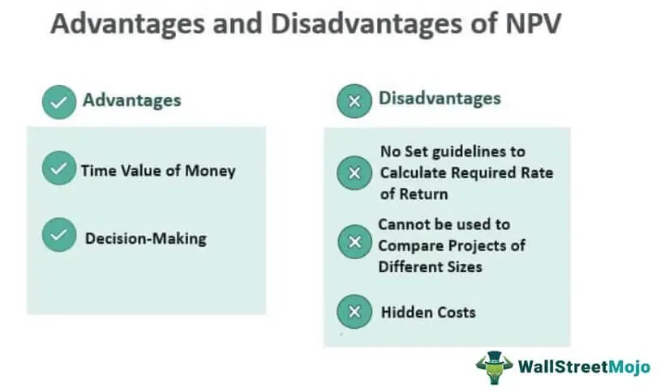

Algorithmic trading, often referred to as algo trading, has been at the forefront of transforming financial markets by offering unprecedented speed and accuracy in data-driven decision making. Harnessing the power of advanced algorithms and high-speed computing, this approach allows traders to execute orders that can capitalize on minute price discrepancies in a fraction of a second. Such capabilities have significantly enhanced the efficiency of financial markets and widened the accessibility for various types of investors.

Within this rapidly evolving financial landscape, the NEX exchange emerges as a crucial component. Positioned under the TSX Venture Exchange, the NEX caters to companies that no longer meet the main exchange’s ongoing listing standards. By offering a balance of liquidity and visibility, NEX serves as a platform for businesses with lower activity levels, making it an appealing option for those seeking to attract potential investors despite undergoing turbulent periods. The NEX platform's sophisticated technology supports these companies by simplifying regulatory requirements and reducing listing fees compared to the primary exchange, thus providing operational flexibility and a chance for recovery.

Algo trading on NEX platforms introduces unique opportunities and challenges. The integration of algorithmic techniques in trading ensures enhanced execution speed and liquidity, even for less active stocks. This intersection between NEX and algo trading not only broadens the scope for efficient trading but also sets the stage for innovative strategies that address both the advantages and the challenges inherent in these systems.

## Table of Contents

## What is the NEX?

The NEX is a specialized board within the TSX Venture Exchange, designed specifically for companies that no longer satisfy the ongoing listing requirements of the main exchange. This board plays a crucial role in maintaining market integrity by providing a structured platform for companies with diminished business activity, ensuring they continue to have access to public trading facilities. One of the significant advantages of the NEX is its ability to offer these companies continued liquidity and market presence, which can be essential for attracting potential investors despite their low activity levels.

Operating under the TSX Venture Exchange umbrella, the NEX provides a regulatory environment with reduced compliance and listing fees compared to the main exchange. This approach allows companies facing operational challenges to remain publicly listed, providing them an opportunity to stabilize and potentially recover without incurring the full costs associated with the TSX Venture Exchange. By offering simplified rules and a supportive framework, the NEX aims to retain companies within the public market ecosystem, thereby preserving investor interest and market diversity.

This specialized approach highlights the importance of the NEX in offering a safety net to struggling companies, allowing them the possibility of restructuring or rebranding efforts while maintaining public visibility. The NEX is pivotal in enabling such companies to undertake these initiatives with less financial pressure.

## Understanding NEX Functionality

NEX functions within the TSX Venture Exchange framework, specifically targeting companies that need greater regulatory flexibility. This sub-market is designed for businesses that no longer meet the stringent ongoing listing requirements of the main exchange but are not yet ready to be fully de-listed. The transition to NEX allows these companies to maintain their public trading status, albeit under a different set of regulations tailored to their unique situations.

Upon moving to NEX, companies are typically given a period of 90 days to resolve compliance issues that led to their transition. If compliance is not restored within this timeframe, companies must continue to operate under the NEX framework indefinitely. This setup offers a structural safety net, providing continued market exposure and [liquidity](/wiki/liquidity-risk-premium), crucial for companies undergoing operational or financial restructuring.

The core functionality of NEX involves facilitating the trade of shares for these underperforming companies, thereby providing them with a platform to regain compliance and potentially transition back to the main TSX Venture Exchange. This ensures that businesses still have access to the capital markets, which is vital for any initiatives aimed at reviving their operations or financial health.

Overall, the NEX functions as an intermediary market that enables fluid transitions for companies striving to improve their performance while maintaining visibility and liquidity in the public markets.

## Advantages of NEX

The NEX board, part of the TSX Venture Exchange, offers several key advantages for companies striving to maintain their status as publicly traded entities, especially when faced with declining performance or non-compliance with the more stringent requirements of the main exchange.

One of the primary benefits of the NEX is its lower cost structure. The board has simplified regulatory requirements, making it an attractive option for companies looking to reduce overheads associated with maintaining a public listing. These reduced fees can be particularly advantageous for businesses experiencing financial constraints, as they allow for continued market presence without the financial burden posed by traditional exchange listings.

The NEX serves as a safety net for companies, providing a platform where they can retain their public trading status. This benefit is crucial for entities needing time and resources for operational turnaround. Maintaining a public presence can be integral to revitalizing a business, as it allows continued access to capital markets and investor relations, key elements in implementing recovery strategies.

Continued liquidity and market visibility are important features of the NEX, especially during the restructuring phases. Liquidity ensures that there is a consistent market for shares, which can improve the appeal of the company to potential investors. Furthermore, market visibility enables these companies to remain on the radar of investors, analysts, and other stakeholders, which can assist in gaining support and resources necessary for corporate revitalization.

In summary, the NEX provides a cost-effective, regulated environment for companies seeking stabilization and growth opportunities. By offering a mechanism to maintain public trading status with reduced financial and regulatory pressures, the NEX is an important resource for businesses aiming to recover and capitalize on market opportunities.

## Disadvantages of NEX

Companies listed on the NEX face several notable challenges. One significant disadvantage is the stigma associated with being perceived as less active or underperforming. This perception can deter potential investors who might equate NEX-listed companies with financial instability or diminished growth prospects. Consequently, these companies may experience reduced investor interest and challenges in raising capital, which are crucial for revitalizing operations and fostering growth.

Despite the NEX’s lower listing costs and simplified regulatory requirements, companies are still required to adhere to certain Canadian regulatory standards. For struggling firms, maintaining compliance with these standards can be burdensome. The necessary resources to meet these regulations may not always be available to NEX-listed companies, which tend to operate with limited financial and organizational capacity. This obligation can divert attention and funds away from essential restructuring efforts needed to recover and thrive.

Another critical risk facing companies on the NEX is the heightened likelihood of de-listing if recovery efforts do not succeed. Companies transferred to the NEX typically have a 90-day window to align themselves with the listing criteria of the main exchange. Failure to achieve this compliance can result in their continued listing on the NEX or, in severe cases, complete removal from public trading platforms. This potential outcome can exacerbate financial instability and limit strategic options available to company management. Consequently, companies must navigate the delicate balance of ensuring compliance while simultaneously working to improve their business performance to avoid permanent consequences.

## Role of Algo Trading on NEX Platforms

Algorithmic trading, commonly known as algo trading, is an integral aspect of modern financial markets, allowing for quick, data-driven decision making through the use of automated, pre-defined strategies. On NEX platforms, these algorithms efficiently enhance the trading landscape by implementing high-frequency trading ([HFT](/wiki/high-frequency-trading-strategies)) mechanisms. This becomes particularly valuable for stocks with low trading volumes, often characteristic of companies listed on NEX.

NEX platforms employ advanced technological infrastructure to bolster such automated trading. The use of sophisticated algorithms ensures that trades are executed at optimal prices, by scanning multiple markets and exchanges instantaneously. This capability is vital for more underutilized stocks, as it facilitates continuous market activity and price discovery, even when interest from human traders might be limited.

By harnessing algos, NEX platforms can increase liquidity, which is a crucial [factor](/wiki/factor-investing) for market participants. Liquidity, in this context, refers to the ability of assets to be bought and sold quickly without causing a dramatic change in the asset's price. On platforms where stocks may not attract significant investor interest, algo trading can provide the necessary market dynamics to ensure that transactions occur efficiently.

Moreover, execution speed is significantly enhanced through [algorithmic trading](/wiki/algorithmic-trading). Algo systems operate on millisecond or even microsecond scales, far surpassing the ability of even the fastest human traders. This speed is especially critical in volatile market conditions, where delay in execution can lead to substantial differences in trade outcomes.

Integrating algorithmic strategies with NEX platforms not only supports these underperforming companies but also attracts a broader range of investors, including institutional investors who rely on high-speed execution to achieve their trading objectives. As such, algo trading not only heightens the operational capability of NEX platforms but also bridges the gap between reduced trading activity and the market's liquidity demands.

## Advantages of Algo Trading

Algorithmic trading, also known as algo trading, offers numerous advantages over traditional trading methods, significantly enhancing the precision and efficiency of trading activities. One of the primary benefits of algo trading is the minimization of human error and emotional decision-making. By automating trading processes based on predefined criteria, algorithms execute trades without the emotional impulses that often lead to poor decision-making in human traders. This increased trading precision translates into more consistent and reliable trading outcomes.

The speed and accuracy of algo trading are perhaps its most celebrated advantages. Algorithms can process and execute trades at speeds far beyond human capabilities. This rapid execution allows traders to capitalize on transient market opportunities that would be missed in manual trading. The efficiency gained through automation also leads to decreased trading costs, as algorithms can optimally time entry and [exit](/wiki/exit-strategy) points, reducing slippage and transactional expenses.

Another significant advantage of algo trading is its ability to backtest strategies using historical market data. Backtesting involves simulating a trading strategy on past data to evaluate its performance. This process provides traders with the opportunity to refine and optimize their strategies before deploying them in live markets, thereby enhancing their reliability and potential profitability. The ability to test strategies in various market conditions ensures that they are robust and adaptable.

In summary, the key advantages of algorithmic trading include reduced human error, enhanced decision-making accuracy, rapid execution speeds, cost efficiencies, and the ability to rigorously test strategies. These benefits collectively lead to improved trading outcomes, making algo trading a preferred choice for many traders in accessing financial markets.

## Disadvantages of Algo Trading

Algorithmic trading, while providing numerous benefits, also encounters various challenges and drawbacks. A primary issue is the significant reliance on technology. Since algo trading is technology-driven, it is susceptible to technical failures that may disrupt trade execution. This includes hardware malfunctions, software bugs, and network connectivity issues. If these problems occur during crucial trading periods, they can lead to substantial financial losses.

Another challenge associated with algo trading is over-optimization. Over-optimization involves fine-tuning a trading algorithm excessively based on historical data, leading to a model that performs well in [backtesting](/wiki/backtesting) but poorly in live markets. This is often due to fitting the model too closely to past data, which does not necessarily reflect future market conditions. As a result, strategies that seem profitable during testing may fail when actual market conditions deviate from historical patterns.

Algo trading also necessitates constant monitoring, as algorithms require regular adjustments to remain effective. Financial markets are dynamically changing environments, and what works at one point may become obsolete as market conditions shift. This continuous oversight mandates technical expertise to ensure the trading strategy remains relevant and efficient.

Furthermore, algorithmic trading is subject to stringent regulatory guidelines. Various jurisdictions have established rules to govern high-frequency trading and the use of algorithms, designed to prevent market manipulation and ensure fair trading practices. Compliance with these regulations necessitates a thorough understanding of the legal landscape and the implementation of robust risk management practices, which can be burdensome for traders and developers.

Given these challenges, participants in algorithmic trading must be prepared to invest in reliable technological infrastructure, maintain a vigilant watch over trading activities, and navigate complex regulatory requirements. Despite the potential disadvantages, with careful management and strategic deployment, algorithmic trading can still offer substantial rewards in the financial markets.

## Conclusion

NEX and algorithmic trading both hold significant roles within the modern financial landscape, providing distinct advantages and facing unique challenges. NEX serves as a crucial platform for companies needing regulatory flexibility, offering reduced listing costs and continued market presence. Algo trading, meanwhile, utilizes automated strategies to enhance trading precision, speed, and cost efficiency. The integration of algo trading on NEX platforms provides improved liquidity and execution speed, especially important for stocks with lower activity.

The synergy between NEX and algorithmic trading creates an environment conducive to innovative trading strategies and liquidity solutions. Although they offer many benefits, both face potential drawbacks. Companies on NEX may encounter a stigma of underperformance, while algo trading is heavily dependent on technological reliability and requires continuous monitoring.

For traders and companies to fully exploit these systems, they must carefully navigate the complex technological and regulatory landscapes. By doing so, they can better harness the prospects offered by NEX and algorithmic trading, potentially achieving improved market performance and operational turnaround.

## FAQs

### What are the primary differences between NEX and TSX Venture?

The NEX is a separate trading board under the Toronto Stock Exchange (TSX) Venture Exchange, specifically designed for companies that no longer meet the continuous listing requirements of the main TSX Venture board. Unlike the TSX Venture Exchange, where companies are typically in an active growth phase and working to meet higher listing standards, the NEX serves as a platform for inactive or underperforming companies. The NEX has lower listing fees and simplified regulatory requirements, which can serve as a temporary relief for companies aiming to regain compliance or during periods of restructuring. While both exchanges operate under the TSX umbrella, their primary distinction lies in the level of regulatory scrutiny and activity requirements imposed on listed companies.

### How does algo trading improve market efficiencies on NEX platforms?

Algorithmic trading, or algo trading, enhances market efficiencies on NEX platforms by leveraging automated strategies to execute trades quickly and accurately. These algorithms are designed to analyze market data, identify trading opportunities, and execute orders at optimal prices with minimal latency. This high-frequency capability is particularly useful for NEX platforms, where stocks might be less liquid. Algo trading helps narrow bid-ask spreads, thereby increasing liquidity and reducing the cost of trading for investors. Moreover, the use of sophisticated algorithms minimizes the impact of human error and emotional decision-making, leading to more precise and consistent trade executions.

### What risks are associated with relying heavily on algorithmic trading?

Relying heavily on algorithmic trading carries several risks, primarily due to the dependence on complex technology. System failures or bugs can lead to unexpected trade executions or missed opportunities, impacting financial outcomes. Over-optimization of trading algorithms could result in ineffective strategies when market conditions vary outside the anticipated scenarios. Additionally, algorithmic trading requires continuous monitoring and technical expertise, as well as compliance with stringent regulatory guidelines. Regulatory bodies may impose restrictions to mitigate systemic risks, potentially impacting the flexibility and profitability of algorithmic strategies. As such, traders must ensure they have robust risk management practices in place to handle these challenges.

## References & Further Reading

[1]: Bergstra, J., Bardenet, R., Bengio, Y., & Kégl, B. (2011). ["Algorithms for Hyper-Parameter Optimization."](https://papers.nips.cc/paper/4443-algorithms-for-hyper-parameter-optimization) Advances in Neural Information Processing Systems 24.

[2]: ["Advances in Financial Machine Learning"](https://www.amazon.com/Advances-Financial-Machine-Learning-Marcos/dp/1119482089) by Marcos Lopez de Prado

[3]: ["Evidence-Based Technical Analysis: Applying the Scientific Method and Statistical Inference to Trading Signals"](https://www.amazon.com/Evidence-Based-Technical-Analysis-Scientific-Statistical/dp/0470008741) by David Aronson

[4]: ["Machine Learning for Algorithmic Trading"](https://github.com/stefan-jansen/machine-learning-for-trading) by Stefan Jansen

[5]: ["Quantitative Trading: How to Build Your Own Algorithmic Trading Business"](https://www.amazon.com/Quantitative-Trading-Build-Algorithmic-Business/dp/1119800064) by Ernest P. Chan