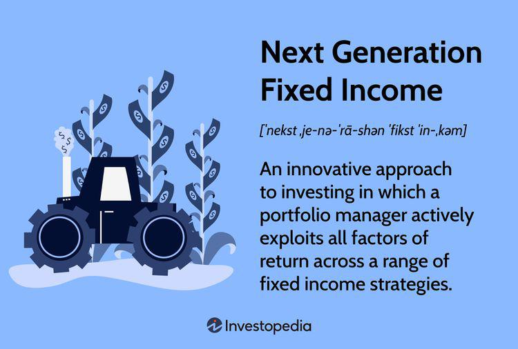

The financial landscape is witnessing rapid transformation due to new technologies and innovative methods, with significant changes observed in fixed income trading. The integration of algorithmic trading and advanced financial instruments is crucial in this evolution, reshaping the industry by enabling more efficient and strategic investment processes. These enhancements allow for improved analysis and execution by leveraging vast datasets and complex models, thus facilitating better decision-making. 

This article examines the crucial intersection of financial instruments, fixed income, next-generation finance, and algorithmic trading. The interaction between these components is driving progress in the financial ecosystem by offering new avenues for portfolio diversification and risk management while optimizing returns. As traditional investment paradigms are challenged by market volatility and low yield environments, the fusion of innovative technologies and investment strategies is essential for navigating these complexities.

In exploring these relationships, we aim to highlight the dynamic nature of modern finance and its implications on fixed income markets. By understanding how these components contribute to the changing landscape, market participants can better position themselves to capitalize on emerging opportunities and foster sustainable growth. This ongoing evolution underscores the importance of continuous adaptation and technological advancement in the pursuit of maximizing financial outcomes.

## Table of Contents

## Understanding Fixed Income

Fixed income investments play a crucial role in the financial portfolios of both individuals and institutions, primarily due to their capacity to yield stable returns. These investments encompass a variety of instruments, including bonds, Treasury notes, and other debt securities, which collectively form the backbone of conservative investment strategies.

**Characteristics and Benefits**

Fixed income instruments are attractive to investors because they offer predictable income streams through regular interest payments, known as coupon payments, and the return of principal upon maturity. For example, a standard government bond might pay a fixed interest rate semi-annually, which reassures investors of a consistent cash flow. This predictability is particularly valuable in comparison to equities, which may exhibit significant volatility and unpredictable dividend payments.

Beyond providing stable income, fixed income securities often serve as a hedge against market [volatility](/wiki/volatility-trading-strategies). Since these instruments typically have lower correlation with stock market fluctuations, they can mitigate portfolio risk, offering investors a more diversified asset base. Furthermore, certain fixed income securities, like U.S. Treasury bonds, are considered low-risk because they are backed by the government, which enhances capital protection.

**Market Trends and Challenges**

Despite their traditional appeal, the fixed income market is subject to emerging trends and challenges that require a more dynamic approach to investment management. One of the primary challenges stems from the global [interest rate](/wiki/interest-rate-trading-strategies) environment. With interest rates at historical lows in various developed economies, yields on traditional fixed income instruments have declined, prompting investors to seek alternative strategies to achieve desired income levels.

Additionally, inflationary pressures pose a risk to fixed income investments. As inflation rises, the real value of the fixed coupon payments received decreases, eroding purchasing power. This can be particularly problematic for long-duration bonds, where future cash flows are discounted more heavily with rising rates. To address this challenge, investors may turn to inflation-linked bonds or incorporate securities from emerging markets, which can offer higher yields to compensate for additional risk.

**Dynamic Approaches**

In response to these challenges, the fixed income landscape is evolving, with investment strategies becoming increasingly sophisticated. Multi-sector bond funds, for example, allow investors to diversify across different types of fixed income assets, such as corporate bonds, mortgage-backed securities, and international bonds, thereby capturing opportunities across various segments of the market.

Moreover, unconstrained bond strategies provide managers with the flexibility to adjust duration and credit exposure actively, depending on market conditions, rather than adhering to a fixed benchmark. By leveraging such dynamic approaches, investors can potentially enhance their returns while simultaneously managing risks.

Overall, fixed income investments remain a cornerstone of financial portfolios, offering benefits of stability and income. However, navigating the current market environment necessitates a balance between traditional fixed income products and innovative strategies designed to optimize returns amidst changing economic conditions.

## The Rise of Algorithmic Trading

Algorithmic trading utilizes automated and pre-programmed strategies to execute trades with remarkable speed and efficiency. In the context of fixed income markets, the role of algorithms has become increasingly critical. These algorithms can process vast datasets and extract actionable insights, thereby enhancing decision-making processes. The ability of algorithmic systems to operate without human intervention not only improves the accuracy of trades but also significantly reduces transaction costs.

Algorithmic trading mechanisms in fixed income markets involve several essential components. One of the primary techniques is quantitative analysis, where trading strategies are formulated using mathematical models. These models often incorporate various financial theories and historical data to predict asset price movements. For example, moving averages or [momentum](/wiki/momentum) indicators may be used to identify potential buy or sell signals.

The benefits of [algorithmic trading](/wiki/algorithmic-trading) in fixed income markets are numerous. Efficiency is one of the core advantages, as algorithms can execute trades exponentially faster than human traders. This speed results in narrower bid-ask spreads and improved market [liquidity](/wiki/liquidity-risk-premium). Moreover, by reducing the emotional influences on trade executions, algorithms can maintain consistency in trading strategies, which is essential for managing large portfolios.

Risk management is another area where algorithmic trading stands out. Algorithms can incorporate risk parameters and compliance checks to ensure that trade executions align with predefined risk appetites and regulatory frameworks. This ability to adhere to strict guidelines minimizes the risk of large-scale losses.

Despite these benefits, algorithmic trading in fixed income is not without risks. One of the primary concerns is the reliance on complex models which, if poorly designed, may lead to erroneous executions and market disruptions. Furthermore, the dependence on technology exposes trading systems to cybersecurity threats. Ensuring robust security protocols and regular audits is crucial to mitigate such vulnerabilities.

In conclusion, while algorithmic trading offers substantial benefits, including high efficiency, cost reduction, and improved risk management, it also requires careful implementation and monitoring. As technology continues to evolve, so will the algorithms that drive fixed income trading, promising even greater innovations and efficiencies in the future.

## Innovations in Financial Instruments for Fixed Income

Next-generation finance represents a pivotal shift in fixed income investments through innovative financial instruments that significantly enhance portfolio flexibility and potential returns. As traditional bond markets evolve, an array of sophisticated products and strategies have emerged to address the challenges of interest rate volatility and dynamic market conditions. Key among these innovations are multisector bond investments, unconstrained strategies, and absolute return vehicles.

Multisector bond investments provide diversification by allocating assets across various bond sectors, including government, corporate, and emerging markets. This approach allows investors to capitalize on varying credit qualities and interest rate environments, potentially leading to enhanced risk-adjusted returns. By spreading investments across multiple sectors, these instruments aim to mitigate sector-specific risks while capturing opportunities in outperforming segments.

Unconstrained strategies represent another advancement in fixed income, freeing investors from traditional benchmarks and allowing for greater adaptability to market shifts. These strategies enable portfolio managers to pursue a broader set of opportunities, such as leveraging derivatives, currencies, and non-traditional asset classes. The flexibility afforded by unconstrained strategies helps manage duration and credit risks by actively adjusting to anticipated market changes rather than adhering to static indices.

Absolute return vehicles focus on achieving positive returns regardless of market direction. Often employing a wide range of tactical approaches, these instruments aim to generate gains through strategic positioning in different market environments. Techniques like short selling, leverage, and hedging are commonly used to exploit market inefficiencies and minimize loss potential. Absolute return strategies prioritize consistent performance over the pursuit of index-style returns, providing an alternative pathway for income generation.

These advanced financial instruments are engineered to exploit diverse market factors, allowing investors to navigate complex and volatile interest rate landscapes. By integrating such innovations, fixed income portfolios can better withstand fluctuations and adapt to evolving market dynamics, ultimately driving superior investment outcomes and satisfying the modern investor's demand for flexibility and resilience.

## Next Generation Fixed Income (NGFI)

Next Generation Fixed Income (NGFI) represents an evolution in fixed income investment strategies, particularly relevant in today’s unpredictable interest rate climate. NGFI focuses on global diversification, offering increased resistance to localized economic fluctuations. This approach addresses the limitations of traditional fixed income models by incorporating a wider array of investment instruments and strategic flexibility.

The necessity for alternative strategies arises from the quest for improved investment performance amidst persistent market volatility. Traditional fixed income portfolios, which rely heavily on domestic government bonds or investment-grade corporate bonds, often face challenges in maintaining desired yield levels when interest rates are erratic or when inflation pressures rise. NGFI strategies mitigate such risks by exploring global bond opportunities, including emerging markets, and utilizing currency-hedged positions to manage foreign exchange risks.

NGFI managers employ a blend of conventional and modern methodologies to architect resilient portfolios. They utilize analytical tools and data-driven frameworks to evaluate various market dynamics. By incorporating macroeconomic insights and quantitative analysis, NGFI strategies aim to enhance yield without proportionately increasing risk. These strategies may utilize instruments such as multisector bond investments, unconstrained strategies, and absolute return vehicles, which are adaptable to fluctuating rate environments and diverse economic landscapes.

For instance, unconstrained strategies lift the limitations found in traditional bond funds, which often adhere to a fixed asset allocation or benchmark-driven approach. By removing these constraints, NGFI managers can dynamically adjust asset allocations to optimize returns, responding agilely to market changes. Moreover, absolute return vehicles aim to achieve positive returns regardless of market conditions, adding another layer of robustness to the NGFI framework.

In summary, NGFI is characterized by its forward-looking approach, integrating diverse investment avenues with strategic adaptability to meet the evolving demands of fixed income investors. As the financial landscape continues to change, NGFI provides a blueprint for sustainable income generation and enhanced portfolio resilience.

## Integration of AI and Machine Learning in Trading

Artificial Intelligence (AI) and [machine learning](/wiki/machine-learning) (ML) are increasingly transforming trading platforms by providing enhanced predictive analytics and sophisticated data processing capabilities. In fixed income trading, these technologies enable more efficient market analysis and strategic improvements, reshaping the way investments are managed and optimized.

One of the primary advantages of AI and ML in trading is their ability to process vast amounts of data in real-time, identifying patterns and trends that would be otherwise imperceptible to human traders. By leveraging machine learning algorithms, trading systems can predict future market movements based on historical data, thereby facilitating informed decision-making and improving the precision of trade executions. For instance, AI systems can analyze credit spreads, interest rate movements, and other relevant market indicators to optimize trading strategies for bonds and debt securities.

AI also contributes significantly to risk management. Algorithms can continuously evaluate risk exposure and make adjustments to trading strategies accordingly. This dynamic risk assessment is particularly crucial in fixed income markets, where interest rate fluctuations and credit risks are constant concerns. By utilizing machine learning models, traders can simulate various market scenarios and assess the potential impact on fixed income portfolios, enabling proactive risk mitigation.

Moreover, AI-driven platforms enhance trade optimization by automating routine tasks, thereby reducing operational costs. With AI, trading systems can execute transactions at optimal times and prices, minimizing slippage and transaction costs. This automation not only increases trading efficiency but also allows human traders to focus on more strategic and complex decision-making tasks.

The integration of AI and machine learning also supports the development of personalized investment strategies. These technologies can analyze investor behavior and preferences, thereby tailoring fixed income investment portfolios to meet individual risk and return objectives. For example, AI can help construct a bond portfolio that aligns with an investor's specific goals, such as income generation or capital preservation, by considering various factors such as duration, credit quality, and market conditions.

Despite these benefits, there are challenges associated with AI and ML integration in fixed income trading, including data quality, model complexity, and the black-box nature of some algorithms. Traders and financial institutions must ensure that their AI systems are transparent and adhere to regulatory standards while effectively managing the cybersecurity risks associated with advanced technologies.

In conclusion, AI and machine learning offer transformative potential for fixed income trading by enhancing data processing, risk management, and trade optimization. As these technologies continue to evolve, they will likely play an increasingly pivotal role in shaping modern trading strategies and investment management practices.

## Challenges and Considerations

The integration of algorithmic and AI-driven trading into fixed income markets, while beneficial, comes with its own set of challenges. One primary concern is regulatory compliance. Financial markets are heavily regulated to ensure fairness, transparency, and stability. Algorithmic trading systems must adhere to a range of regulations that vary across jurisdictions. This includes compliance with trading rules, order handling, and market manipulation laws. For instance, the Markets in Financial Instruments Directive (MiFID II) in the European Union imposes stringent requirements on algorithmic trading and transparency [1].

Moreover, cybersecurity poses a significant risk in the implementation of these advanced trading technologies. The reliance on digital platforms and the vast amount of data processed make trading systems vulnerable to cyber threats. Cybersecurity breaches can lead to substantial financial losses and damage to reputation. Therefore, robust cybersecurity measures are essential to protect digital infrastructure from malicious attacks.

To mitigate these risks, traders and financial institutions must navigate these complexities diligently. Ensuring that adequate compliance systems are in place is crucial. This involves regular audits, real-time monitoring of trading activities, and stringent protocols for data protection. Additionally, institutions must implement comprehensive cybersecurity strategies, including intrusion detection systems, encryption technologies, and employee training programs on cyber hygiene.

An important consideration is the balance between innovation and control. While leveraging technological advancements like algorithmic and AI-driven trading can lead to significant efficiency gains, over-reliance on these systems without adequate human oversight can be risky. Anomalies and unexpected market conditions may not be adequately handled by purely automated systems, necessitating human intervention to make nuanced decisions.

Furthermore, there is a need for continuous adaptation and updating of trading algorithms to meet changing market conditions and regulatory environments. This can involve incorporating machine learning techniques to continually refine and optimize trading strategies. However, machine learning models require large datasets and computational resources, highlighting the importance of a solid technological infrastructure.

In summary, while the integration of algorithmic and AI trading technologies in fixed income markets offers numerous advantages, it also demands careful attention to regulatory and cybersecurity challenges. By implementing responsible practices and maintaining a strategic balance between automation and human oversight, financial institutions can effectively harness these technologies for improved trading performance.

References:
[1] European Commission, "MiFID II (Markets in Financial Instruments Directive)," Available: https://ec.europa.eu/info/law/markets-financial-instruments-mifid-ii-directive-2014-65-eu_en

## Conclusion

The financial industry is at a pivotal moment, experiencing transformative shifts brought about by technological advancements and new investment strategies in fixed income markets. As the landscape evolves, opportunities for innovation emerge, driven by the integration of algorithmic trading, [artificial intelligence](/wiki/ai-artificial-intelligence), and next-generation financial instruments.

Algorithmic trading and AI technologies offer precise tools for analyzing vast datasets and making informed decisions. These technologies allow market participants to execute trades with high speed and accuracy while reducing transaction costs and minimizing human error. By embracing these advances, investors can strategically navigate market complexities and optimize their portfolios for enhanced returns and risk management.

Incorporating next-generation financial instruments into fixed income portfolios can lead to more agile and resilient investment strategies. These instruments, characterized by flexibility and adaptability, help investors manage interest rate volatility and explore diverse market opportunities. As investment strategies evolve, a global perspective and innovative approach become critical for maintaining competitive advantage and achieving sustainable returns.

Future advancements will continue to shape fixed income trading and investment, requiring continuous adaptation and strategic foresight. Market participants must remain vigilant in leveraging emerging technologies responsibly, addressing regulatory and cybersecurity challenges, and refining their approaches to capture potential benefits. By integrating these components, the financial ecosystem can advance towards a more efficient, reliable, and responsive framework, positioning itself for long-term success amidst an ever-changing global economy.

## References & Further Reading

[1]: Bergstra, J., Bardenet, R., Bengio, Y., & Kégl, B. (2011). ["Algorithms for Hyper-Parameter Optimization."](https://dl.acm.org/doi/10.5555/2986459.2986743) Advances in Neural Information Processing Systems 24.

[2]: ["Advances in Financial Machine Learning"](https://www.amazon.com/Advances-Financial-Machine-Learning-Marcos/dp/1119482089) by Marcos Lopez de Prado

[3]: ["Evidence-Based Technical Analysis: Applying the Scientific Method and Statistical Inference to Trading Signals"](https://www.amazon.com/Evidence-Based-Technical-Analysis-Scientific-Statistical/dp/0470008741) by David Aronson

[4]: ["Machine Learning for Algorithmic Trading"](https://github.com/stefan-jansen/machine-learning-for-trading) by Stefan Jansen

[5]: ["Quantitative Trading: How to Build Your Own Algorithmic Trading Business"](https://www.amazon.com/Quantitative-Trading-Build-Algorithmic-Business/dp/1119800064) by Ernest P. Chan

[6]: European Commission, "MiFID II (Markets in Financial Instruments Directive)," Available: https://ec.europa.eu/info/law/markets-financial-instruments-mifid-ii-directive-2014-65-eu_en