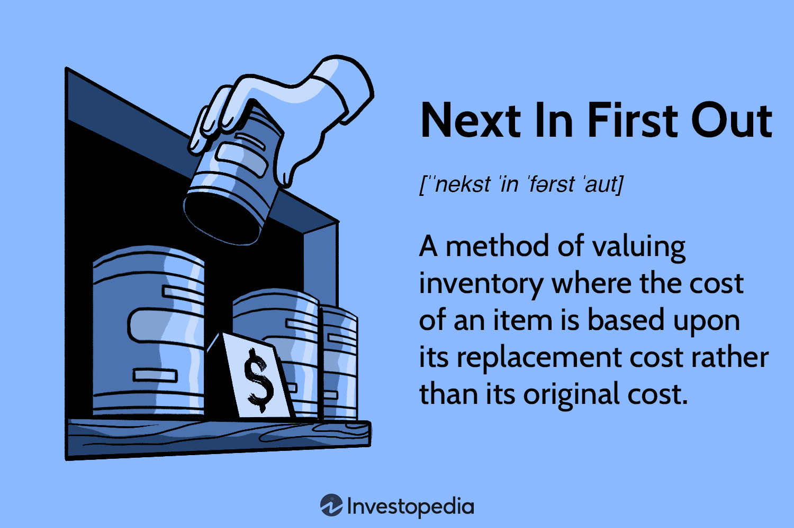

In today's fast-paced financial markets, efficient inventory management and accurate accounting methods are crucial for businesses to maintain competitiveness and profitability. Companies must navigate complex financial landscapes where inventory valuation methods play a significant role in financial reporting and tax calculations. Among these, the Next In, First Out (NIFO) inventory management strategy can provide a unique perspective, particularly when integrated with advanced trading strategies such as algorithmic trading.

Understanding various inventory valuation methods, including NIFO, is essential as they offer businesses the tools to assess inventory costs accurately and adapt to market changes. Inventory valuation methods like First In, First Out (FIFO) and Last In, First Out (LIFO) are more commonly accepted and compliant with Generally Accepted Accounting Principles (GAAP), but alternative methods like NIFO can provide additional strategic insights. NIFO, though not GAAP-compliant, focuses on valuing inventory based on the replacement cost of items rather than their original purchase cost. This approach is particularly useful in periods of high inflation, as it reflects the current market conditions more accurately than traditional methods.



Algorithmic trading, a strategy widely adopted in today's finance sector, executes pre-programmed trading instructions based on real-time data at high speeds and volumes. This modern trading method demands precise inventory valuations as they influence decision-making and trading performance. Integrating NIFO with algorithmic trading systems can provide strategic advantages by aligning inventory management with the demand for real-time data and dynamic market conditions.

This article seeks to explore the implications of these inventory valuation methods, particularly NIFO, in conjunction with algorithmic trading. It will examine the advantages, limitations, and practical applicability of these methods in today's dynamic business environment. As businesses strive to optimize performance and gain a competitive edge, understanding and implementing effective inventory management strategies are paramount, especially in sectors where rapid decision-making and data accuracy are critical.

## Table of Contents

## Understanding Inventory Management and Accounting Methods

Inventory management is a crucial component of business operations, encompassing the monitoring and administration of goods, work-in-process items, and finished products. Effective inventory management ensures that companies maintain optimal inventory levels to meet customer demand while minimizing costs. 

Different inventory accounting methods provide varying approaches to valuing inventory, each with its implications for financial reporting and tax obligations. The most common methods include:

1. **First In, First Out (FIFO)**: This method assumes that the oldest inventory items are sold first. In times of rising prices, FIFO results in a lower cost of goods sold and higher ending inventory values, which can lead to higher reported profits.

2. **Last In, First Out (LIFO)**: Conversely, LIFO assumes the most recently acquired inventory items are sold first. This approach can be beneficial in periods of inflation, as it matches current sales with current costs, potentially lowering tax liabilities due to a higher cost of goods sold and reduced taxable income.

3. **Weighted Average Cost**: This method calculates the cost of ending inventory and the cost of goods sold based on the average cost of all units available for sale during the period. This approach provides a middle ground, smoothing out price fluctuations over time.

Among these, the **Next In, First Out (NIFO)** method, though not compliant with Generally Accepted Accounting Principles (GAAP), offers a unique perspective. It values inventory based on the replacement cost of items rather than the original purchase cost. This can be particularly useful in periods of high inflation, as it aligns inventory valuation with current market conditions better than traditional methods. Although NIFO is primarily used for internal management purposes due to its lack of external reporting compliance, it can provide a realistic assessment of inventory's future replacement cost, aiding businesses in strategic decision-making and operational planning. 

In practice, companies often employ NIFO to gain insights into future resource costs and develop strategies that reflect current economic conditions, thereby optimizing their operations and maintaining competitiveness in dynamic markets.

## Exploring the NIFO Method

The Next In, First Out (NIFO) method is an inventory valuation strategy that prioritizes the current replacement cost over historical acquisition costs. This approach is particularly advantageous during periods of high inflation, as it aligns inventory valuation with contemporary market conditions, offering a more accurate financial depiction than traditional methods. By focusing on the replacement cost, NIFO enables firms to consider the cost required to replenish their inventories at present-day prices, thus providing a practical insight into potential future expenditures.

Despite its lack of recognition under Generally Accepted Accounting Principles (GAAP), NIFO serves a unique purpose within internal company assessments. Many firms incorporate NIFO to evaluate inventory value, using it as a yardstick for understanding the current economic environment and forecasting near-term cost fluctuations. This internal application underscores NIFO's utility in strategic planning, particularly when navigating volatile or inflationary markets.

The principal advantage of NIFO is its potential to offer a realistic and dynamic overview of resource costs. By consistently reflecting the latest market prices, businesses can adjust operational strategies in real time to manage costs effectively. This approach is beneficial for optimizing purchasing and production decisions, especially when rapid cost changes impact profit margins. In summary, while NIFO is not a substitute for GAAP-compliant methods in external financial reporting, its practical applications make it an indispensable tool for pragmatic inventory management and strategic business planning.

## Algorithmic Trading and its Implications for Inventory Management

Algorithmic trading employs computer algorithms to execute trading strategies at high speeds and volumes based on real-time market data. This approach leverages computational efficiency to manage large datasets and make rapid decisions, relying heavily on data processing technologies. An essential component of these trading systems is efficient inventory management, which is critical to optimizing risk and return.

Inventory management in [algorithmic trading](/wiki/algorithmic-trading) involves the precise tracking and valuing of assets to enable informed decision-making. Accurate inventory valuations are vital as they directly impact trading strategies, influencing the performance and efficiency of trades. For instance, algorithms might use live market data to adjust asset holdings dynamically, thereby optimizing portfolios in response to fluctuating market conditions.

Furthermore, integrating real-time data processing technologies significantly enhances the efficiency of algorithmic trading systems. These technologies enable the continuous analysis of vast quantities of market data, ensuring that inventory assessments are as current as possible. This integration allows for rapid adjustments in trading strategies, aligning them with the latest market trends and improving strategic outcomes.

Overall, the applicability of algorithmic trading extends beyond mere execution of trades. It plays a crucial role in maintaining accurate and efficient inventory management, which is foundational to achieving the optimal balance of risk and return. By combining real-time data analysis with strategic inventory management, companies can significantly enhance the performance of their algorithmic trading systems.

## Integration of NIFO with Algorithmic Trading

The integration of the Next In, First Out (NIFO) inventory management method with algorithmic trading offers strategic advantages, particularly in enhancing real-time decision-making. While NIFO is not accepted under Generally Accepted Accounting Principles (GAAP), its focus on current replacement costs instead of historical costs aligns well with the real-time data needs of algorithmic trading systems.

Algorithmic trading relies on executing pre-programmed instructions at high speeds, often informed by live market data. The dynamic nature of these systems demands an accurate and immediate understanding of asset values. NIFO's emphasis on replacement cost provides a practical advantage by offering a realistic assessment of inventory value, closely matching current market conditions. This synchronization ensures trading algorithms can make more informed decisions, potentially optimizing returns.

One of the primary challenges in integrating NIFO with algorithmic trading is real-time data accuracy. Unlike traditional inventory valuation methods, NIFO requires constant updates to reflect the latest cost of acquiring or producing an asset. This necessitates robust data processing capabilities and real-time analytics to adjust valuations accurately within trading algorithms.

To overcome these challenges, companies can leverage advanced technologies, such as [machine learning](/wiki/machine-learning) and cloud computing, to process large datasets efficiently. Real-time analytics platforms can dynamically update inventory valuations, while machine learning algorithms can predict future market trends, allowing companies to maintain an edge in rapidly changing financial markets.

For example, a simplified Python function to update inventory values using NIFO could look like this:

```python
def update_inventory_value(replacement_costs, quantities):
    """
    Calculate the current inventory value using NIFO.

    Parameters:
    replacement_costs (list of float): The current replacement costs for inventory items.
    quantities (list of int): The quantities of each inventory item.

    Returns:
    float: The total inventory value.
    """
    total_value = sum(cost * quantity for cost, quantity in zip(replacement_costs, quantities))
    return total_value

# Example usage
replacement_costs = [100.0, 150.0, 200.0] # Example replacement costs
quantities = [10, 5, 20] # Example quantities
total_inventory_value = update_inventory_value(replacement_costs, quantities)
print("Total Inventory Value: ", total_inventory_value)
```

By incorporating NIFO's real-time inventory valuations, algorithmic trading systems can better reflect current market valuations, enhancing both the efficiency and profitability of trading operations. This approach not only enhances strategic operations but also positions businesses to effectively respond to market fluctuations.

## Tax Implications and Compliance Considerations

Using non-GAAP-compliant methods like Next In, First Out (NIFO) can present significant tax and compliance challenges for businesses. These challenges arise primarily due to the discrepancy between NIFO's replacement cost focus and the historical cost principles upheld by Generally Accepted Accounting Principles (GAAP). As a result, businesses employing NIFO must exercise caution and consult with tax professionals to navigate potential discrepancies and ensure compliance with legal and fiscal obligations.

One of the primary concerns when using NIFO for inventory valuation is its impact on the reported earnings. Since NIFO values inventory based on the replacement cost, it could result in different profit figures than those calculated using GAAP-compliant methods, such as FIFO or LIFO. These differences might affect tax liabilities, as taxable income derived from NIFO may not align with the requirements of tax authorities that typically rely on GAAP methods for consistency and comparability.

Moreover, regional regulations and tax legislation differ significantly, adding complexity to compliance. For example, the Internal Revenue Service (IRS) in the United States mandates adherence to specific inventory accounting methods. Deviating from these standards could lead to discrepancies in tax filings, potentially triggering audits, penalties, or even legal disputes. Therefore, engaging tax professionals who understand regional regulations is essential to guide businesses through the complexities of non-GAAP-compliant methods such as NIFO.

Despite these challenges, NIFO can offer strategic advantages if implemented correctly. By reflecting current market conditions through replacement cost valuation, NIFO provides accurate operational insights that might be more aligned with economic realities, particularly during periods of high inflation. Companies using NIFO can optimize their decision-making processes by better predicting future resource costs, thus enhancing their strategic operations.

However, applying NIFO demands thorough understanding and careful integration into existing accounting systems. Companies must ensure the validity and accuracy of the replacement costs used in NIFO calculations to prevent erroneous financial reporting. Leveraging modern technology and advanced analytics can assist in maintaining data accuracy, thereby minimizing the risk of non-compliance and bolstering strategic advantages.

In conclusion, while NIFO poses notable tax and compliance challenges, its potential benefits in offering realistic scenarios for inventory replacement costs can significantly influence business strategies. Adequate consultation with tax professionals and careful application of technology are key to successfully navigating the complexities associated with NIFO.

## Conclusion

The integration of innovative inventory management methods, such as NIFO, with advanced trading strategies like algorithmic trading, presents considerable possibilities for businesses aiming to optimize their financial and operational performance. Despite regulatory challenges posed by the non-GAAP nature of the NIFO method, the approach offers significant practical benefits, particularly during periods of inflation. By reflecting current market costs more accurately, businesses can make more informed and strategic decisions, enhancing their adaptability in volatile economic climates.

Understanding and applying the right combination of technologies and methodological approaches is crucial for leveraging these benefits. Algorithmic trading, with its reliance on real-time data processing, complements the dynamic valuation provided by NIFO, offering a cohesive framework for optimizing trading and manufacturing operations. This alignment not only boosts efficiency but also fosters a competitive edge in the business landscape.

As technology continues to advance, the methodologies surrounding inventory management and trading strategies are expected to evolve. The integration of machine learning, big data analytics, and other technological innovations could further refine these approaches, leading to enhanced decision-making processes and more resilient business strategies. Companies that stay abreast of these developments will likely enjoy sustainable growth and improved market positioning, seizing the opportunities presented by emerging trends in the financial and operational domains.

## References & Further Reading

[1]: ["Advances in Financial Machine Learning"](https://www.amazon.com/Advances-Financial-Machine-Learning-Marcos/dp/1119482089) by Marcos Lopez de Prado

[2]: ["Evidence-Based Technical Analysis: Applying the Scientific Method and Statistical Inference to Trading Signals"](https://www.amazon.com/Evidence-Based-Technical-Analysis-Scientific-Statistical/dp/0470008741) by David Aronson

[3]: ["Machine Learning for Algorithmic Trading"](https://github.com/stefan-jansen/machine-learning-for-trading) by Stefan Jansen

[4]: ["Quantitative Trading: How to Build Your Own Algorithmic Trading Business"](https://www.amazon.com/Quantitative-Trading-Build-Algorithmic-Business/dp/1119800064) by Ernest P. Chan