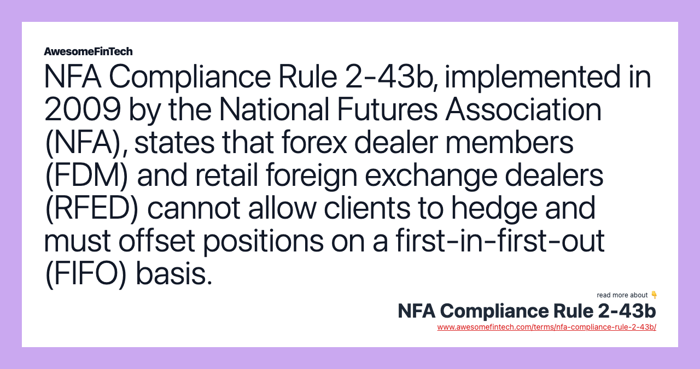

## Table of Contents

## What is NFA Compliance Rule 2-43b?

NFA Compliance Rule 2-43b is a rule set by the National Futures Association (NFA) that focuses on the protection of customer funds. It requires members to have written policies and procedures in place to ensure that customer funds are properly segregated and accounted for. This means that the money customers deposit for trading futures or forex should be kept separate from the firm's own money, ensuring that it is safe and available for customers to withdraw at any time.

The rule also mandates regular audits and checks to make sure these policies are being followed correctly. This helps to prevent misuse of customer funds and increases transparency and trust in the financial markets. By enforcing these standards, the NFA aims to protect investors and maintain the integrity of the futures and forex markets.

## Who does NFA Compliance Rule 2-43b apply to?

NFA Compliance Rule 2-43b applies to all members of the National Futures Association (NFA). This includes futures commission merchants (FCMs), introducing brokers (IBs), commodity pool operators (CPOs), commodity trading advisors (CTAs), and retail foreign exchange dealers (RFEDs). These members are required to follow the rule to make sure customer money is safe and separate from the company's own money.

The rule is important because it helps protect people who invest in futures and [forex](/wiki/forex-system) markets. By having clear rules about how to handle customer funds, the NFA makes sure that these funds are not mixed up with the company's money. This helps keep the markets fair and trustworthy for everyone involved.

## What is the purpose of NFA Compliance Rule 2-43b?

NFA Compliance Rule 2-43b is all about keeping customer money safe in the futures and forex markets. The rule says that companies must have clear rules and steps to make sure the money customers put in for trading is kept separate from the company's own money. This is important because it helps make sure that if something goes wrong with the company, the customers' money is still safe and they can get it back.

The rule also makes companies check their money handling regularly. This means they have to do audits and other checks to make sure they are following the rules correctly. By doing this, the NFA helps keep the markets honest and fair, so people can trust that their money is being looked after properly when they invest in futures and forex.

## How does NFA Compliance Rule 2-43b affect trading practices?

NFA Compliance Rule 2-43b makes sure that companies handling customer money in the futures and forex markets do it the right way. It says that the money people put in for trading must be kept separate from the company's own money. This means that when someone trades, they know their money is safe and not mixed up with the company's money. This rule helps traders feel more secure because they know their money is protected and can be taken out if they need it.

The rule also changes how companies do their work. They have to make clear rules and check them often to make sure they are following the law. This means more work for the companies, but it's good for traders because it keeps things honest and fair. By making sure customer money is safe, the rule helps keep the trading markets trustworthy, so people are more likely to trade and feel good about it.

## What are the key requirements of NFA Compliance Rule 2-43b?

NFA Compliance Rule 2-43b says that companies in the futures and forex markets need to have clear written rules about how they handle customer money. This means they must keep the money customers put in for trading separate from the company's own money. This is important because it makes sure that if something bad happens to the company, the customers' money is still safe and they can get it back.

The rule also says that companies have to check their money handling regularly. They need to do audits and other checks to make sure they are following the rules correctly. By doing this, the NFA helps keep the markets honest and fair, so people can trust that their money is being looked after properly when they invest in futures and forex.

## Can you explain the functionality of NFA Compliance Rule 2-43b in monitoring trades?

NFA Compliance Rule 2-43b helps keep an eye on how companies handle customer money in the futures and forex markets. The rule says that companies must have clear written rules about how they keep customer money separate from their own money. This means that when someone trades, their money is kept safe and not mixed up with the company's money. By doing this, the rule makes sure that if something goes wrong with the company, the customers' money is still safe and they can get it back.

The rule also makes companies check their money handling regularly. They have to do audits and other checks to make sure they are following the rules correctly. This helps keep the markets honest and fair, so people can trust that their money is being looked after properly when they invest in futures and forex. By making sure customer money is safe, the rule helps keep the trading markets trustworthy, so people are more likely to trade and feel good about it.

## What are the penalties for non-compliance with NFA Compliance Rule 2-43b?

If a company does not follow NFA Compliance Rule 2-43b, they can face serious penalties. The National Futures Association (NFA) can fine the company, which means they have to pay money as a punishment. The fines can be big, depending on how bad the mistake was and if it happened before. The NFA might also make the company fix the problem and follow the rule properly in the future.

Besides fines, the NFA can also stop the company from doing business for a while. This is called a suspension, and it can hurt the company a lot because they can't make money during that time. In really bad cases, the NFA might take away the company's right to be a member, which means they can't work in the futures and forex markets anymore. These penalties are there to make sure companies take the rule seriously and keep customer money safe.

## How can firms ensure they are compliant with NFA Compliance Rule 2-43b?

To make sure they follow NFA Compliance Rule 2-43b, firms need to have clear written rules about how they handle customer money. This means they must keep the money people put in for trading separate from the company's own money. They should also train their staff well so everyone knows how to follow these rules. It's important to have a good system in place to keep track of all the money and make sure it's all accounted for correctly.

Firms also need to check their money handling regularly. This means doing audits and other checks to make sure they are following the rules correctly. They should keep good records of these checks and fix any problems they find right away. By doing all this, firms can make sure they are following the rule and keeping customer money safe, which helps keep the markets honest and fair.

## What technologies or tools can assist in adhering to NFA Compliance Rule 2-43b?

To help follow NFA Compliance Rule 2-43b, firms can use special software that keeps track of customer money and makes sure it stays separate from the company's own money. This software can automatically keep records of all the money coming in and going out, so it's easier to see if everything is being done right. It can also send alerts if something looks wrong, which helps catch mistakes early.

Another useful tool is audit software that helps firms check their money handling regularly. This kind of software can make audits easier by organizing all the financial data and showing where any problems might be. By using these tools, firms can make sure they are following the rule and keeping customer money safe, which helps keep the markets honest and fair.

## How does NFA Compliance Rule 2-43b interact with other regulatory requirements?

NFA Compliance Rule 2-43b works together with other rules to make sure customer money is safe in the futures and forex markets. For example, it fits well with the Commodity Futures Trading Commission (CFTC) rules, which also say that customer money must be kept separate from the company's money. By following both NFA and CFTC rules, firms make sure they are doing everything they can to protect customer funds and follow the law.

The rule also connects with other NFA rules, like those about record-keeping and audits. These rules help make sure that firms are always checking their money handling and keeping good records. By working together, all these rules help keep the markets honest and fair, so people can trust that their money is being looked after properly when they invest in futures and forex.

## What are some common challenges firms face in implementing NFA Compliance Rule 2-43b?

One big challenge firms face when trying to follow NFA Compliance Rule 2-43b is keeping customer money separate from their own money. This can be hard because they need to have very good systems in place to make sure the money is always kept apart. They also need to train their staff well so everyone knows how to do this correctly. If the systems are not good or if people make mistakes, it can be easy to mix up the money by accident.

Another challenge is doing regular checks and audits to make sure they are following the rule. This takes a lot of time and work because they have to keep good records and look at them often. Sometimes, firms might not have enough people or the right tools to do these checks properly. If they miss something during an audit, it could mean they are not following the rule and could get in trouble. By making sure they have good systems and do regular checks, firms can overcome these challenges and keep customer money safe.

## How has NFA Compliance Rule 2-43b evolved since its inception and what future changes might be expected?

Since it started, NFA Compliance Rule 2-43b has changed a bit to make sure it keeps up with new ways of doing things in the futures and forex markets. At first, the rule was all about making sure customer money was kept safe and separate from the company's money. Over time, the rule got more detailed, asking firms to have better written rules and to do more regular checks to make sure they were following the rule correctly. This was because the NFA wanted to make sure the markets stayed fair and honest, even as they got more complicated.

In the future, we might see NFA Compliance Rule 2-43b change even more to keep up with new technology and ways of trading. The NFA might ask firms to use even better tools to keep track of customer money and do more checks to make sure everything is being done right. They might also want to make the rules clearer and easier to follow, so firms can make sure they are keeping customer money safe without too much trouble. By doing this, the NFA can help keep the markets trustworthy and protect people who invest in futures and forex.

## References & Further Reading

[1]: National Futures Association. (2009). ["Interpretive Notice to NFA Compliance Rule 2-43b."](https://www.nfa.futures.org/rulebooksql/rules.aspx?RuleID=RULE%202-43&Section=4) National Futures Association.

[2]: Cumming, D., Johan, S., & Li, D. (2011). ["Exchange trading rules and stock market liquidity."](https://papers.ssrn.com/sol3/papers.cfm?abstract_id=1328553) Journal of Financial Economics, 99(3), 651-671.

[3]: Hull, J. C. (2017). ["Options, Futures, and Other Derivatives."](https://www.semanticscholar.org/paper/Options%2C-Futures%2C-and-Other-Derivatives-Hull/89bdee500c8623864fc9eb7a471546aa713acc44) Pearson Education.

[4]: Lopez de Prado, M. (2018). ["Advances in Financial Machine Learning."](https://www.amazon.com/Advances-Financial-Machine-Learning-Marcos/dp/1119482089) Wiley.

[5]: Harris, L. (2003). ["Trading and Exchanges: Market Microstructure for Practitioners."](https://www.amazon.com/Trading-Exchanges-Market-Microstructure-Practitioners/dp/0195144708) Oxford University Press.