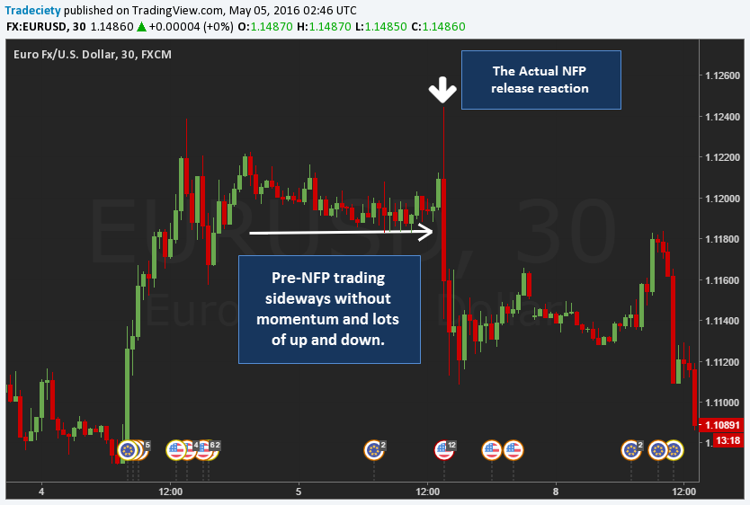

## Table of Contents

## What is NFP and why is it important for trading?

NFP stands for Non-Farm Payroll, which is a report that comes out in the United States once a month. It tells us how many jobs were added or lost in industries outside of farming. This report is important because it gives us a good idea about how well the economy is doing. If more jobs are added, it usually means the economy is growing. If jobs are lost, it might mean the economy is slowing down.

Traders pay close attention to the NFP report because it can affect the prices of things they trade, like stocks, currencies, and commodities. When the NFP numbers are better than expected, it can make stock prices go up because people feel more confident about the economy. On the other hand, if the numbers are worse than expected, it can cause prices to drop because people might worry about the economy. This is why traders often make big moves right after the NFP report comes out, trying to take advantage of the changes in the market.

## How does the NFP report affect currency markets?

The NFP report can have a big impact on currency markets because it gives information about how strong the U.S. economy is. If the report shows more jobs were added than expected, it usually means the U.S. dollar gets stronger. This happens because a strong job market can make people think the economy is doing well, so they want to invest in the U.S. and buy U.S. dollars. On the other hand, if the report shows fewer jobs were added than expected, the U.S. dollar might get weaker because people might worry about the economy and not want to invest in the U.S.

Traders watch the NFP report closely because it can cause big changes in currency values. When the numbers are better than expected, traders might buy more U.S. dollars, pushing its value up. If the numbers are worse than expected, traders might sell U.S. dollars, which can make its value go down. This quick reaction to the NFP report can lead to a lot of trading activity and big swings in currency markets right after the report is released.

## What are the key components of the NFP report that traders should focus on?

The main thing traders should look at in the NFP report is the number of jobs added or lost. This number tells us if the economy is getting stronger or weaker. If more jobs are added than what people thought would happen, it's usually good news for the economy and can make the U.S. dollar stronger. If fewer jobs are added than expected, it might mean the economy is not doing as well, and the U.S. dollar could get weaker.

Another important part of the NFP report is the unemployment rate. This tells us what percentage of people who want to work can't find a job. If the unemployment rate goes down, it's a sign that more people are finding jobs, which is good for the economy. If it goes up, it can mean fewer people are working, which might worry traders. The average hourly earnings is also something to watch because it shows if workers are getting paid more. If wages go up a lot, it might mean inflation is coming, which can affect how traders see the economy.

These three parts of the NFP report - the job numbers, the unemployment rate, and the average hourly earnings - are what traders focus on the most. They help traders guess what might happen next in the economy and the currency markets. By looking at these numbers, traders can decide if they should buy or sell U.S. dollars and other investments.

## What is an NFP trading strategy and how can it be implemented?

An NFP trading strategy involves making trades based on the results of the Non-Farm Payroll report. Traders look at the job numbers, unemployment rate, and average hourly earnings to decide if they should buy or sell currencies, especially the U.S. dollar. The idea is to take advantage of the big moves in the market that happen right after the report comes out. Traders might buy the U.S. dollar if the report is better than expected, or sell it if the report is worse than expected. They need to be quick because the market can change a lot in a short time.

To implement an NFP trading strategy, traders first need to know when the report will be released, which is usually the first Friday of every month at 8:30 AM Eastern Time. They should prepare by setting up their trading platform and having a clear plan on what they will do depending on the numbers. If the numbers are good, they might buy the U.S. dollar against other currencies. If the numbers are bad, they might sell the U.S. dollar. It's important to set stop-loss orders to limit losses if the market moves against them. Traders also need to be ready for big price swings and be careful not to make too many trades because the market can be very unpredictable right after the report comes out.

## What are the best practices for trading before the NFP release?

Before the NFP report comes out, it's a good idea for traders to be ready and have a plan. They should know exactly when the report will be released and set up their trading platform ahead of time. Traders need to decide what they will do if the numbers are better or worse than expected. They might want to have a clear strategy, like buying the U.S. dollar if the numbers are good, or selling it if the numbers are bad. It's also important to set stop-loss orders to limit any losses if the market moves in the wrong direction.

Traders should be careful and not make too many trades right before the NFP report. The market can be very unpredictable, and prices can change a lot. It's better to wait until the report is out and then make trades based on the new information. By being prepared and having a clear plan, traders can be ready to take advantage of the big moves in the market that happen after the NFP report is released.

## How should a trader prepare for trading during the NFP announcement?

To get ready for trading during the NFP announcement, a trader should first find out when the report will come out, which is usually the first Friday of every month at 8:30 AM Eastern Time. They need to set up their trading platform ahead of time and make sure it's working well. Traders should also have a clear plan on what they will do if the numbers in the report are good or bad. For example, if the numbers are better than expected, they might want to buy the U.S. dollar. If the numbers are worse than expected, they might want to sell the U.S. dollar. It's important to set stop-loss orders to limit any losses if the market doesn't go the way they thought it would.

During the NFP announcement, traders need to be ready for big price swings in the market. The market can be very unpredictable right after the report comes out, so it's a good idea to be careful and not make too many trades. Traders should wait until they see the numbers and then make their moves based on the new information. By being prepared and having a clear plan, traders can take advantage of the big moves in the market that happen after the NFP report is released.

## What are common pitfalls to avoid when trading the NFP?

One common pitfall when trading the NFP is jumping into trades too quickly without waiting to see how the market reacts to the numbers. The market can be very unpredictable right after the report comes out, and prices can change a lot in a short time. Traders might see the numbers and think they know what will happen next, but the market might move in a different way. It's better to wait a bit and see how the market settles down before making trades.

Another pitfall is not using stop-loss orders. When trading the NFP, the market can move a lot, and if it goes against what a trader thought would happen, they could lose a lot of money. By setting stop-loss orders, traders can limit their losses if the market moves in the wrong direction. Not using stop-loss orders can lead to big losses that could have been avoided.

Lastly, traders should avoid overtrading during the NFP announcement. It's easy to get excited and start making a lot of trades, but this can lead to mistakes. The market is very volatile during this time, and making too many trades can increase the chances of losing money. It's better to stick to a clear plan and only make trades that fit with that plan, rather than trying to catch every little move in the market.

## Can you explain the impact of NFP data surprises on market volatility?

When the NFP report comes out with numbers that are a lot different from what people were expecting, it can make the market very jumpy. This is called a "surprise" in the data. If the report shows that a lot more jobs were added than people thought, or a lot fewer jobs were added than expected, traders might start buying or selling quickly. This quick buying and selling can make the prices of things like the U.S. dollar, stocks, and other investments go up and down a lot. Traders might see the surprise and think the economy is doing better or worse than they thought, so they want to change their investments right away.

Because of these surprises, the market can be very unpredictable right after the NFP report comes out. Traders need to be careful because the prices can change a lot in a short time. If they aren't ready for these big swings, they could lose money. That's why it's important for traders to have a plan and use tools like stop-loss orders to help manage the risk. By understanding that surprises in the NFP data can cause the market to be more volatile, traders can be better prepared for what might happen.

## What technical analysis tools are most effective during NFP trading?

During NFP trading, one of the most effective technical analysis tools is the moving average. Traders often use moving averages to see the general direction of the market and to spot trends. For example, if the price of the U.S. dollar is above a moving average, it might mean the market is going up. If it's below, it might mean the market is going down. This can help traders decide if they should buy or sell during the big moves that happen after the NFP report comes out.

Another useful tool is the Relative Strength Index (RSI). The RSI helps traders see if a currency or stock is being bought or sold too much. If the RSI is over 70, it might mean the market is being bought too much and could go down soon. If it's under 30, it might mean the market is being sold too much and could go up soon. During the NFP announcement, when the market can be very jumpy, the RSI can help traders find good times to buy or sell based on how much the market has moved already.

Lastly, support and resistance levels are important during NFP trading. These are price levels where the market often stops going up or down. If the price hits a support level and starts going up, it might be a good time to buy. If it hits a resistance level and starts going down, it might be a good time to sell. By watching these levels, traders can make better decisions about when to enter or [exit](/wiki/exit-strategy) trades during the big swings that happen after the NFP report is released.

## How do different trading styles (e.g., scalping, swing trading) adapt to NFP events?

Scalpers, who make many quick trades to catch small price changes, need to be very fast during NFP events. They watch the market closely and make trades right after the report comes out. Because the market can move a lot in a short time, scalpers look for quick wins. They might use tools like moving averages to see which way the market is going and jump in and out of trades quickly. It's important for scalpers to have a good plan and use stop-loss orders to limit their losses if the market goes the wrong way.

Swing traders, who hold onto trades for a few days or weeks, take a different approach to NFP events. They might not trade right away when the report comes out because they are looking for bigger moves over time. Instead, swing traders might wait to see how the market settles down after the initial big swings. They use tools like support and resistance levels to find good times to buy or sell. By waiting for the market to calm down, swing traders can make trades based on the longer-term trends that start after the NFP report is released.

## What are advanced strategies for trading NFP data, including hedging techniques?

One advanced strategy for trading NFP data is to use straddles. A straddle involves buying both a call option and a put option on the same currency pair with the same expiration date and strike price. This strategy works well during NFP events because it allows traders to profit from big price swings in either direction. If the NFP report causes the market to move a lot, the trader can make money no matter if the price goes up or down. The key is to make sure the price moves enough to cover the cost of both options. Traders need to be careful with this strategy because if the market doesn't move much, they could lose the money they spent on the options.

Another advanced strategy is to use hedging techniques. Hedging means taking a position that can help protect against losses from another position. For example, if a trader is holding a long position in the U.S. dollar and expects the NFP report to be bad, they might also take a short position in another currency that tends to move in the opposite direction of the U.S. dollar. This way, if the NFP report is worse than expected and the U.S. dollar goes down, the gains from the short position can help offset the losses from the long position. Hedging can be a good way to manage risk during the unpredictable times around the NFP report, but it can also limit potential profits if the market moves in the expected direction.

## How can traders use historical NFP data to improve their trading strategy?

Traders can use historical NFP data to see how the market reacted to past reports. By looking at old NFP numbers and the market moves that followed, traders can find patterns. For example, they might see that when the NFP numbers were a lot better than expected, the U.S. dollar usually went up a lot. Or, they might notice that when the numbers were worse than expected, the U.S. dollar often dropped. By understanding these patterns, traders can make better guesses about what might happen after the next NFP report comes out.

Another way to use historical NFP data is to test trading strategies. Traders can use old data to see how well their plans would have worked in the past. They can pretend to make trades based on past NFP numbers and see if they would have made money or lost money. This can help them find out if their strategy needs to be changed or if it's good enough to use for real. By learning from the past, traders can be more ready for the big moves that happen after the NFP report is released.

## What is Risk Management in NFP Algo Trading?

Risk management plays a pivotal role in [algorithmic trading](/wiki/algorithmic-trading), especially during high-impact economic releases like the Non-Farm Payroll (NFP) report. The inherent [volatility](/wiki/volatility-trading-strategies) associated with such events can lead to significant price fluctuations, necessitating robust risk management strategies to safeguard trading capital.

One effective technique for risk mitigation is the use of stop-loss orders. Stop-loss orders allow traders to set predetermined price levels at which a position will automatically be sold or bought to prevent further losses. For example, if a trader enters a long position on a currency pair anticipating a favorable NFP outcome, a stop-loss order placed below the entry price can limit downside risk if the market moves unfavorably. The stop-loss level can be calculated based on several factors, including volatility measures and historical price levels. 

Position sizing is another critical aspect of risk management. This involves determining the appropriate amount of capital to allocate to a single trade, ensuring that no single loss can excessively damage the trading account. The formula for calculating the position size might involve the trader’s risk tolerance and the distance to the stop-loss level, as shown in this basic model:

$$
\text{Position Size} = \frac{\text{Account Risk}}{\text{Stop-Loss Distance}}
$$

where Account Risk is the maximum amount the trader is willing to lose on a trade, and Stop-Loss Distance is the difference between the entry price and the stop-loss level.

Advanced algorithms can further enhance risk management by dynamically adjusting risk parameters as market conditions evolve during NFP events. For instance, an algorithm can be programmed to analyze real-time market data and modify stop-loss levels or position sizes based on volatility increases or [liquidity](/wiki/liquidity-risk-premium) changes. Python, with its robust data processing libraries, can be used for such dynamic adjustments:

```python
def adjust_risk_parameters(market_data, base_position_size, base_stop_loss):
    # Example market analysis logic
    volatility = calculate_volatility(market_data)

    # Adjust position size proportional to inverse of volatility
    adjusted_position_size = base_position_size * (1 / volatility)

    # Make stop-loss more flexible based on real-time volatility
    adjusted_stop_loss = base_stop_loss * volatility

    return adjusted_position_size, adjusted_stop_loss

# Assuming market_data is obtained and base values are defined
base_position_size = 1000  # Example base position size
base_stop_loss = 50  # Example base stop-loss value
real_time_market_data = get_real_time_data()

adjusted_size, adjusted_stop_loss = adjust_risk_parameters(real_time_market_data, base_position_size, base_stop_loss)
```

This example outlines how an algorithm can use real-time data to adjust the risk profile dynamically, providing a more resilient trading strategy in the face of NFP-induced market movements. Effective risk management via such techniques is essential for maintaining the integrity of trading strategies and achieving long-term success in algorithmic trading.

## References & Further Reading

[1]: Bergstra, J., Bardenet, R., Bengio, Y., & Kégl, B. (2011). ["Algorithms for Hyper-Parameter Optimization."](https://proceedings.neurips.cc/paper/2011/file/86e8f7ab32cfd12577bc2619bc635690-Paper.pdf) Advances in Neural Information Processing Systems 24.

[2]: ["Advances in Financial Machine Learning"](https://www.amazon.com/Advances-Financial-Machine-Learning-Marcos/dp/1119482089) by Marcos Lopez de Prado

[3]: ["Evidence-Based Technical Analysis: Applying the Scientific Method and Statistical Inference to Trading Signals"](https://www.amazon.com/Evidence-Based-Technical-Analysis-Scientific-Statistical/dp/0470008741) by David Aronson

[4]: ["Machine Learning for Algorithmic Trading"](https://github.com/stefan-jansen/machine-learning-for-trading) by Stefan Jansen

[5]: ["Quantitative Trading: How to Build Your Own Algorithmic Trading Business"](https://books.google.com/books/about/Quantitative_Trading.html?id=j70yEAAAQBAJ) by Ernest P. Chan