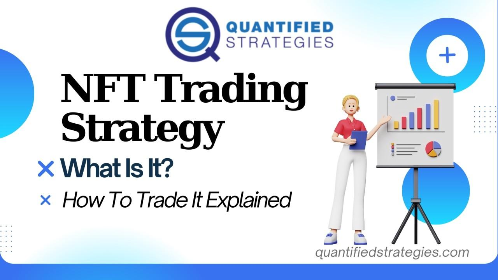

## Table of Contents

## What is an NFT and how does it relate to trading?

An NFT, or Non-Fungible Token, is a special kind of digital item that you can own on the internet. Unlike regular money or cryptocurrencies like Bitcoin, which are all the same and can be swapped easily, each NFT is unique and cannot be swapped like-for-like with another. NFTs can represent things like art, music, or even tweets, and they are stored on a blockchain, which is a secure way to keep track of who owns what.

NFTs relate to trading because people can buy and sell them on special websites called NFT marketplaces. Just like you might trade baseball cards or stamps, people trade NFTs, hoping their value will go up over time. The price of an NFT can change based on how much people want it, how rare it is, or who created it. Trading NFTs can be exciting, but it's also important to be careful because the value can go down as well as up.

## What are the basic principles of NFT trading?

NFT trading involves buying and selling unique digital items on special websites called NFT marketplaces. The basic idea is to find NFTs that you think are valuable or might become more valuable in the future. You can look at things like who made the NFT, how rare it is, and what other people are saying about it. When you find an NFT you like, you can buy it using cryptocurrency, usually Ethereum. After you own it, you can keep it as part of your collection or sell it to someone else if its value goes up.

It's important to understand that the value of NFTs can go up and down a lot. Sometimes, an NFT might become very popular and its price can increase a lot in a short time. Other times, the price might drop, and you could lose money if you sell it for less than you paid. That's why it's a good idea to do your research and only spend money on NFTs that you can afford to lose. Also, be careful of scams and always use trusted marketplaces to trade your NFTs.

## How can beginners start trading NFTs safely?

To start trading NFTs safely, beginners should first learn about what NFTs are and how they work. It's a good idea to read up on different types of NFTs, like art, music, or collectibles, and understand that each one is unique and can't be swapped like regular money. You'll need to set up a digital wallet that can hold cryptocurrencies like Ethereum, which is often used to buy NFTs. Make sure to choose a wallet that is secure and easy to use. Once you have your wallet, you can connect it to an NFT marketplace, like OpenSea or Rarible, where you can browse and buy NFTs.

When you're ready to start trading, it's important to do your research. Look at the history of the NFT you're interested in, who created it, and what other people are saying about it. Be careful not to spend more than you can afford to lose, because the value of NFTs can go up and down a lot. Always use trusted marketplaces and be wary of scams. If something seems too good to be true, it probably is. By taking these steps, you can start trading NFTs safely and enjoy the exciting world of digital collectibles.

## What are the most common platforms for NFT trading?

The most common platforms for NFT trading are OpenSea, Rarible, and Foundation. OpenSea is like a big online store where you can find all sorts of NFTs, from art to music to virtual land. It's easy to use and has a lot of different NFTs to choose from. Rarible is another popular platform where you can buy, sell, and even create your own NFTs. It's known for being user-friendly and for letting artists and creators have more control over their work. Foundation is a bit different because it focuses more on digital art and has a special way of selling NFTs through auctions, which can make it exciting for buyers and sellers.

These platforms are where most people go to trade NFTs because they are trusted and have a lot of users. When you use these platforms, you can connect your digital wallet, like MetaMask, to buy and sell NFTs using [cryptocurrency](/wiki/cryptocurrency), usually Ethereum. It's important to be careful and do your research before you start trading on these platforms, because the value of NFTs can change a lot and there can be scams. By using these common platforms, you can safely explore the world of NFTs and maybe even find some cool digital items to add to your collection.

## What factors should be considered when choosing an NFT to trade?

When choosing an NFT to trade, it's important to think about who made it. Some artists or creators are more popular than others, and their NFTs might be worth more because of that. You should also look at how rare the NFT is. If there are only a few of them, it might be more valuable. Another thing to consider is what other people are saying about the NFT. If a lot of people are talking about it and saying good things, it might be a good choice. Finally, think about the history of the NFT. Has its value gone up or down in the past? This can give you a clue about what might happen in the future.

It's also a good idea to think about why you want to buy the NFT. Are you buying it because you like it and want to keep it, or are you hoping to sell it later for more money? If you're looking to make a profit, you need to be careful and do a lot of research. The value of NFTs can change a lot, so it's important to only spend money you can afford to lose. Also, make sure you're using a trusted platform to buy and sell your NFTs, and be careful of scams. By considering all these factors, you can make a smarter choice about which NFTs to trade.

## How do market trends affect NFT trading strategies?

Market trends can have a big impact on how you trade NFTs. If a certain type of NFT, like digital art or music, is becoming more popular, its value might go up. This means you might want to buy those NFTs when they're still affordable and sell them later when their value is higher. On the other hand, if people are starting to lose interest in a certain kind of NFT, its value might go down. In that case, it might be a good idea to sell those NFTs before their value drops too much. Keeping an eye on what's happening in the market can help you make better decisions about when to buy and sell.

Another thing to think about is how the overall market for cryptocurrencies is doing. Since most NFTs are bought and sold using cryptocurrencies like Ethereum, if the value of those cryptocurrencies goes up or down, it can affect the value of NFTs too. For example, if Ethereum's value goes up, the NFTs you own might be worth more in terms of regular money. But if Ethereum's value goes down, your NFTs might be worth less. By paying attention to these trends, you can adjust your trading strategy to try and make the most money or avoid losing too much.

## What are the risks associated with NFT trading and how can they be mitigated?

Trading NFTs can be risky because their value can go up and down a lot. Sometimes, an NFT might become very popular and its price can increase a lot in a short time. But other times, the price might drop, and you could lose money if you sell it for less than you paid. There are also scams to watch out for. Some people might try to trick you into buying fake NFTs or paying for something that you never get. It's important to be careful and do your research before you start trading.

To reduce these risks, you should only spend money on NFTs that you can afford to lose. This way, if the value of your NFTs goes down, you won't be in big trouble. It's also a good idea to use trusted platforms like OpenSea or Rarible to buy and sell your NFTs. These platforms have rules to help keep things safe. Always check the history of the NFT you're interested in and see what other people are saying about it. By being careful and doing your homework, you can enjoy trading NFTs while keeping the risks under control.

## What advanced strategies can be used to maximize profits in NFT trading?

To maximize profits in NFT trading, you can use a strategy called "flipping." This means buying NFTs that you think will become more popular and valuable soon, then selling them quickly for a profit. To do this well, you need to keep an eye on what's happening in the NFT world. Look for new artists or projects that are starting to get a lot of attention. If you can buy their NFTs before everyone else does, you might be able to sell them later for a lot more money. But remember, this strategy can be risky because the value of NFTs can change a lot, so you need to be ready to act fast and be okay with the chance of losing money.

Another advanced strategy is called "diversification." This means spreading your money across different kinds of NFTs instead of putting it all into one type. For example, you might buy some art NFTs, some music NFTs, and some virtual land NFTs. This way, if one type of NFT loses value, you might still make money from the others. It's like not putting all your eggs in one basket. Diversification can help you manage risk and might lead to more consistent profits over time. Just remember to always do your research and only spend money you can afford to lose, because even with these strategies, there's no guarantee of making money in NFT trading.

## How does liquidity impact NFT trading, and what strategies can be employed to manage it?

Liquidity is how easy it is to buy or sell something without changing its price too much. In NFT trading, [liquidity](/wiki/liquidity-risk-premium) can be a big deal because some NFTs are easier to sell than others. If an NFT is popular and a lot of people want it, it's more liquid. This means you can sell it quickly and for a good price. But if an NFT is rare or not many people want it, it might be hard to find someone to buy it. This can make it harder to sell and might mean you have to lower the price to get someone interested.

To manage liquidity in NFT trading, you can look for NFTs that are more popular and have a lot of buyers and sellers. These NFTs are usually easier to trade and can help you make money faster. Another strategy is to use NFT marketplaces that have a lot of users, like OpenSea or Rarible. These platforms have more people looking to buy and sell, which can make it easier to find someone interested in your NFT. Also, setting a fair price can help. If you price your NFT too high, it might be hard to sell, but if you set a reasonable price, you might find a buyer more quickly. By thinking about liquidity and using these strategies, you can make your NFT trading smoother and more profitable.

## What role does blockchain technology play in NFT trading strategies?

Blockchain technology is super important for NFT trading because it keeps everything safe and clear. It's like a big, secure notebook that records who owns which NFT. When you buy or sell an NFT, the blockchain makes sure that everyone can see the change in ownership. This helps stop people from cheating or making fake NFTs. Because the blockchain is so secure, you can trust that the NFT you're buying is real and that you really own it.

Using blockchain also helps you make smart choices when trading NFTs. You can look at the history of an NFT on the blockchain to see how much it's been sold for in the past and who has owned it. This information can help you decide if an NFT is a good buy or if you should sell it. Plus, some blockchains let you do special things with your NFTs, like lending them to others or using them in games. By understanding how blockchain works, you can come up with better strategies for trading NFTs and maybe even make more money.

## How can traders use data analytics to improve their NFT trading decisions?

Traders can use data analytics to make better choices when trading NFTs by looking at lots of information about the NFTs they're interested in. This includes checking the past prices of an NFT to see how much it has gone up or down. They can also look at how many people are buying and selling the NFT, which shows how popular it is. By using tools that analyze this data, traders can spot trends and patterns that help them decide when to buy or sell. For example, if the data shows that an NFT's price goes up a lot every time a certain artist releases new work, a trader might buy that NFT before the next release to make a profit.

Another way data analytics helps is by giving traders information about the overall market. They can see which types of NFTs are getting more popular and which ones are losing interest. This can help them choose which NFTs to invest in. For instance, if data shows that music NFTs are becoming more popular, a trader might decide to focus on buying and selling those. By using data analytics, traders can make smarter decisions and maybe even make more money from trading NFTs.

## What are the future trends in NFT trading that experts should be aware of?

In the future, experts think that NFT trading might become more popular than ever. More and more people are getting interested in NFTs, and this could mean that the market keeps growing. One big trend to watch out for is how NFTs might start being used in more ways. For example, they could be used in video games where you can buy and sell special items, or even in real life, like using NFTs to prove you own a piece of art or a ticket to a concert. As more people use NFTs for different things, the market could get bigger and more exciting.

Another trend is that technology might make NFT trading easier and safer. Right now, buying and selling NFTs can be tricky because you need to understand how to use cryptocurrencies and digital wallets. But in the future, new tools and platforms might make it simpler for everyone to trade NFTs. Also, as the technology gets better, it could help stop scams and make sure that the NFTs you're buying are real. By keeping an eye on these trends, experts can be ready for the changes coming to the world of NFT trading.

## References & Further Reading

[1]: Bergstra, J., Bardenet, R., Bengio, Y., & Kégl, B. (2011). ["Algorithms for Hyper-Parameter Optimization."](https://papers.nips.cc/paper/4443-algorithms-for-hyper-parameter-optimization) Advances in Neural Information Processing Systems 24.

[2]: ["Advances in Financial Machine Learning"](https://www.amazon.com/Advances-Financial-Machine-Learning-Marcos/dp/1119482089) by Marcos Lopez de Prado

[3]: ["Evidence-Based Technical Analysis: Applying the Scientific Method and Statistical Inference to Trading Signals"](https://www.amazon.com/Evidence-Based-Technical-Analysis-Scientific-Statistical/dp/0470008741) by David Aronson

[4]: ["Machine Learning for Algorithmic Trading"](https://github.com/stefan-jansen/machine-learning-for-trading) by Stefan Jansen

[5]: ["Quantitative Trading: How to Build Your Own Algorithmic Trading Business"](https://books.google.com/books/about/Quantitative_Trading.html?id=j70yEAAAQBAJ) by Ernest P. Chan