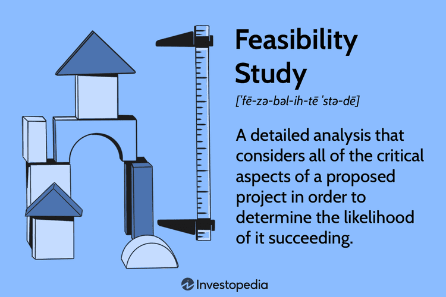

In recent years, non-fungible tokens (NFTs) have emerged as a significant trend within the cryptocurrency market. As unique digital assets, NFTs have captured widespread attention across various sectors, including art, gaming, and decentralized finance (DeFi), thanks to their ability to provide verifiable ownership and provenance of digital items via blockchain technology. This distinctiveness and versatility have led to a surge in NFT-related activities and investments, marking NFTs as a noteworthy phenomenon in the realm of digital assets.

The fascination with NFTs extends beyond their novel applications and into investment strategies, particularly algorithmic trading, where the allure of NFTs lies in their potential for substantial returns and unique risk profile. As these digital assets are inherently different from fungible cryptocurrencies like Bitcoin or Ethereum, they present new opportunities and challenges for investors. NFTs are not interchangeable and carry specific characteristics that influence their market behavior, prompting comparisons with traditional investment avenues such as initial public offerings (IPOs).



This article seeks to conduct a preliminary risk and return analysis of NFTs within algorithmic trading. By doing so, it will shed light on how NFTs compare to traditional investments, particularly IPOs, and highlight their distinctive attributes in the context of automated trading environments. Through this analysis, we aim to provide insights into how investors and traders can perceive and potentially leverage NFTs in their portfolios, while also understanding the inherent risks associated with these innovative digital assets.

## Table of Contents

## Understanding NFTs in the Crypto Ecosystem

Non-fungible tokens (NFTs) are a type of digital asset that harness blockchain technology to authenticate the ownership and provenance of unique items. Unlike cryptocurrencies such as Bitcoin or Ethereum, which are fungible and can be exchanged on a one-to-one basis, NFTs are distinct in that each token is unique or part of a very limited series. This distinction is achieved through the use of unique identifying information embedded within the NFT's smart contract on a blockchain, often leveraging the Ethereum network.

NFTs can represent a wide array of digital artifacts. Among the most prominent are digital art pieces, which have revolutionized the traditional art market by allowing artists to monetize their work directly through platforms like OpenSea and Rarible. Music, virtual real estate, and rare collectibles are also frequently tokenized as NFTs, further expanding their applicability beyond conventional digital or physical goods.

The NFT sector has seen impressive growth, highlighted by significant increases in both the [volume](/wiki/volume-trading-strategy) of sales and the value of the assets exchanged. Reports from nonfungible.com, a leading source of NFT market data, showed that NFT sales surged to unprecedented levels during 2021, capturing the interest of both individual investors and institutional participants. This burgeoning market is partly driven by the unique characteristics of NFTs, including their potential for establishing new forms of value attribution and digital scarcity in a manner not possible with traditional assets.

As NFTs continue to garner interest, their potential to influence sectors such as art and gaming remains significant, suggesting that NFTs could become integral to the digital economy. However, the market is marked by pronounced [volatility](/wiki/volatility-trading-strategies), impacting their value and the confidence of potential investors.

## Risk Assessment of NFTs in Algo Trading

Non-fungible tokens (NFTs) have gained traction in the [cryptocurrency](/wiki/cryptocurrency) market, yet they are characterized by high volatility. This volatility is primarily due to the significant fluctuations in their value, driven by speculative trading, limited supply, and the novelty of the assets themselves. In [algorithmic trading](/wiki/algorithmic-trading), this volatility presents both opportunities and challenges, akin to the trading patterns seen in Initial Public Offerings (IPOs).

NFTs often experience initial trading volumes and returns similar to IPOs, where assets are traded heavily post-launch. High volumes and interest can lead to rapid price increases, making them attractive targets for algorithmic traders who employ strategies designed to capitalize on such movements. However, unlike IPOs, NFTs tend to maintain positive long-term returns despite initial volatile phases. This distinction suggests that while IPOs might stabilize or decline over time, NFTs can appreciate due to factors such as increased adoption, cultural significance, and rarity.

Despite these potentially lucrative returns, NFTs [carry](/wiki/carry-trading) inherent risks, mainly due to the nascent nature of the market. The lack of historical data is a significant concern, as it impedes the ability to model future performance accurately. Traditional financial models are often less effective at predicting NFT market behavior due to this paucity of data. Moreover, the unpredictability of the market is heightened by its speculative nature and the influence of external factors, such as social media trends and celebrity endorsements.

For algorithmic traders, these aspects necessitate careful strategy design. Strategies must accommodate the high variance in NFT prices and be resilient to extreme market outliers and events. Risk management techniques, such as stop-loss orders and diversification, become particularly crucial in mitigating potential downsides. Additionally, algorithms may integrate [machine learning](/wiki/machine-learning) models to dynamically adapt to new patterns as more data becomes available, gradually refining their predictions and strategies.

In summary, while NFTs present substantial trading opportunities due to their high volatility and growth potential, understanding their risks is crucial. The parallels with IPO trading patterns provide some insight, but the unique aspects of NFTs call for innovative and cautious approaches to algorithmic trading.

## Return Characteristics of NFTs

Non-fungible tokens (NFTs) have demonstrated the capability to generate substantial short-term returns, with instances of long-term growth exceeding 4000%. This dramatic increase can be attributed to several factors intrinsic to the NFT market, including their speculative nature, the uniqueness of the underlying assets, and the burgeoning popularity among investors and creators alike.

NFTs have shown a positive Capital Asset Pricing Model (CAPM) alpha, which underscores their potential to deliver higher returns than expected given their risk profile. The CAPM alpha is an indicator of an asset's performance above a benchmark index. For NFTs, a positive alpha suggests that they can yield returns surpassing their expected risk-adjusted forecasts, a feature that captures the interest of investors seeking outsized gains.

Moreover, despite their inherent high volatility, certain NFTs have outperformed well-known traditional cryptographic assets like Bitcoin, particularly following market corrections. This can be attributed to the unique value propositions of NFTs, which include exclusive ownership rights to digital art, collectibles, and other assets that hold both intrinsic and speculative appeal. The differential market behavior post-corrections enhances their attractiveness, especially for investors with a higher risk tolerance willing to navigate the NFT market's ebbs and flows.

For investors seeking high-return opportunities, these characteristics present both a lure and a challenge. The potential for significant gains must be weighed against the backdrop of volatility and market unpredictability. NFTs offer portfolio diversification possibilities but necessitate a deep understanding of art, culture, and technology trends that drive their valuation. Investors must consider market [liquidity](/wiki/liquidity-risk-premium), the potential for regulatory changes, and the rapid evolution of the NFT ecosystem when formulating their investment strategies. The NFT landscape is constantly evolving, promising growth and transformation but requiring strategic and informed participation.

## Comparing NFTs and Traditional Assets

Non-fungible tokens (NFTs) present a unique risk-return profile often likened to that of emerging tech stocks and initial public offerings (IPOs). This comparison arises from their mutual characteristics of high risk and potential high reward. NFTs, however, diverge from traditional financial assets in notable ways, particularly due to their inherent novelty and complexity, which challenge established asset pricing models.

The traditional financial instruments, such as stocks or bonds, derive their value through established economic fundamentals and market sentiment. Their pricing is often explained using models like the Capital Asset Pricing Model (CAPM) or Dividend Discount Model (DDM). However, NFTs defy these conventions by virtue of their distinct nature. They are digital certificates of ownership for unique assets recorded on a blockchain, and their valuation is significantly influenced by factors such as rarity, provenance, market demand, and cultural significance. Consequently, traditional models often fall short in capturing the true dynamics of NFT pricing, necessitating the development of novel approaches that account for these non-traditional factors.

NFT-driven markets can exert substantial influence on broader cryptocurrency trends and, by extension, financial markets. This influence is twofold: First, due to the heightened attention NFTs receive during peak market activities, they can contribute to increased trading volumes and liquidity within the cryptocurrency market at large. Second, the speculative and often exponential gains observed in NFTs can attract new participants to the crypto ecosystem, thereby influencing market sentiment and capital flows.

The incorporation of NFTs into diversified portfolios also brings about significant implications. Given their varied risk-return characteristics compared to traditional assets, NFTs can offer diversification benefits. In statistical terms, adding assets with low or negative correlation to a portfolio can enhance its efficiency, as defined by Modern Portfolio Theory (MPT). If NFTs display a low correlation with traditional assets, their inclusion in a portfolio could potentially reduce overall portfolio risk while maintaining or enhancing expected returns.

In summary, while NFTs share a high-risk, high-return profile with emerging tech stocks and IPOs, their unique attributes necessitate a departure from traditional financial models. Their growing influence underscores their potential role in diversified portfolios, emphasizing the necessity for investors and strategists to adjust their frameworks to accommodate the complexity and novelty of NFTs.

## Implications for Algorithmic Trading Strategies

Incorporating non-fungible tokens (NFTs) into algorithmic trading strategies presents unique opportunities and challenges due to the distinct characteristics and high volatility associated with these digital assets. Algorithmic traders are leveraging the potential for significant returns by developing strategies that accommodate the unpredictable nature of NFTs. The hallmark of successful NFT trading algorithms is their ability to adapt to drastic price swings and capitalize on short-term market inefficiencies.

To effectively integrate NFTs, traders should primarily focus on constructing algorithms that recognize and respond to the extreme market outliers often associated with NFT trading. Due to the nascent stage of the NFT market, price distribution is characterized by high kurtosis and skewness, indicating frequent and significant deviations from the mean. This necessitates algorithms that incorporate robust risk management techniques, allowing them to adjust dynamically to sudden price movements. For instance, statistical methods such as the Value at Risk (VaR) or the Conditional Value at Risk (CVaR) can be employed to estimate potential losses and manage risk exposure effectively.

$$
\text{VaR} = \text{Quantile}(X, \alpha)
$$

$$
\text{CVaR} = E[X | X < \text{VaR}]
$$

These mathematical models aid in anticipating probable losses within a given confidence interval, thus helping traders curb potential adverse impacts arising from NFT market volatility.

Additionally, NFTs' non-fungible nature and diverse categories necessitate specialized analytical tools and machine learning techniques to predict price trends and determine entry and [exit](/wiki/exit-strategy) points. Algorithm developers may employ supervised learning methods or recurrent neural networks (RNNs) to analyze historical price data and predict future price movements. Using Python and machine learning libraries such as TensorFlow or PyTorch, traders can build and train models that identify patterns indicative of profitable opportunities. An example of a simple RNN model for price prediction might involve:

```python
import numpy as np
from tensorflow.keras.models import Sequential
from tensorflow.keras.layers import Dense, SimpleRNN

# Example data
X = np.array([...])  # Input features (historical price data)
y = np.array([...])  # Target variable (future price movements)

# Define the RNN model
model = Sequential()
model.add(SimpleRNN(units=50, activation='relu', input_shape=(X.shape[1], X.shape[2])))
model.add(Dense(units=1))

model.compile(optimizer='adam', loss='mean_squared_error')
model.fit(X, y, epochs=100, batch_size=32)

# Predict future price movements
predictions = model.predict(X)
```

As traders develop strategies around NFTs, they must also consider the unique behaviors influenced by market speculation and sentiment. Understanding these dynamics can bolster trading algorithms, enabling them to handle the peculiar characteristics of NFTs and optimize returns. Nonetheless, algorithmic trading in the NFT sphere demands continuous refinement of strategies to address changes in market conditions and regulatory developments, helping ensure they remain effective and compliant over time.

## Conclusion and Future Outlook

Non-fungible tokens (NFTs) represent a transformative development in the digital investment landscape, yet they come with significant risks that necessitate careful evaluation and strategic planning. As unique digital assets verified through blockchain technology, NFTs offer promising high-return opportunities, capturing interest across diverse sectors like art, gaming, and decentralized finance.

The dynamic nature of NFTs, characterized by high volatility and potential for substantial returns, underscores the necessity for strategic risk analysis. Investors and traders must recognize that while NFTs have demonstrated impressive growth, there is considerable unpredictability given the nascent stage of the market. Price fluctuations can be extreme, and the limited historical data available compels a cautious investment approach.

Moreover, the evolving NFT ecosystem signals potential for expansion, with increasing interest in leveraging NFTs for various applications beyond their current uses. The unique attributes of NFTs, including their ability to represent ownership of digital or physical assets, suggest numerous unexplored avenues for growth. As sectors continue to harness NFT technology, market maturation could facilitate more robust pricing mechanisms and investor confidence.

Importantly, as NFTs gain traction, regulatory considerations will play a crucial role in shaping the future landscape. Currently, the regulatory environment for NFTs is underdeveloped, posing legal uncertainties that could influence market dynamics and investment viability. Investors and traders must stay informed about regulatory changes to effectively navigate potential legal challenges and capitalize on emerging opportunities.

In summary, NFTs embody both potential rewards and inherent risks. They provide innovative investment opportunities, but require vigilance, especially in terms of regulatory scrutiny and market analysis. As the NFT market evolves, diversification, strategic risk management, and awareness of regulatory developments will be essential for capitalizing on their transformative potential in investment portfolios.

## References & Further Reading

[1]: Christie's. (2021). ["Beeple's 'The First 5000 Days'"](https://www.christies.com/presscenter/pdf/9966/REL_BEEPLE_9966_1.pdf) Sold at Auction by Christie's for $69 Million. 

[2]: Wang, Q., Li, R., Wang, Q., & Chen, S. (2021). ["Non-fungible Token (NFT): Overview, Evaluation, Opportunities and Challenges."](https://arxiv.org/abs/2105.07447) arXiv preprint.

[3]: Nadini, M., Alessandretti, L., Di Giacinto, F., Martino, M., Aiello, L. M., & Baronchelli, A. (2021). ["Mapping the NFT Revolution: Market Trends, Trade Networks, and Visual Features."](https://arxiv.org/abs/2106.00647) arXiv preprint.

[4]: Conley, J. P., & Burge, J. (2021). ["The Promise of Bitcoin and the Blockchain."](https://www.jpmorgan.com/insights/global-research/technology/bitcoin-blockchain-digital-finance) Journal of Regulatory Science. 

[5]: Collins, S. (2021). ["Crypto Art: A Decentralized View."](https://direct.mit.edu/leon/article/54/4/402/97295/Crypto-Art-A-Decentralized-View) Decentralized Journal. 

[6]: Schatz, N. (2021). ["NFTs and the Market for Flights of Fancy."](https://www.sciencedirect.com/science/article/pii/S1544612321004840) The Economist.