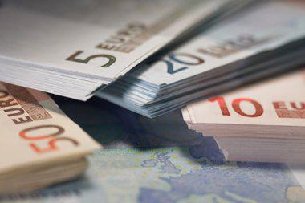

## Table of Contents

## What is the Nicaraguan Córdoba?

The Nicaraguan Córdoba is the official currency of Nicaragua. It is named after Francisco Hernández de Córdoba, who founded the city of León in Nicaragua. The Córdoba was first introduced in 1912, replacing the peso. It is abbreviated with the symbol "C$" and is divided into 100 centavos.

People in Nicaragua use the Córdoba to buy things like food, clothes, and other goods. The value of the Córdoba can change compared to other currencies, like the US dollar. Sometimes, the government changes the design of the Córdoba to make it harder to copy and to show important people or places from Nicaragua's history.

## How is the Nicaraguan Córdoba abbreviated?

The Nicaraguan Córdoba is shortened to "C$". This makes it easy to recognize and use when writing down prices or amounts of money.

People in Nicaragua use this symbol every day when they buy things or talk about money. It helps them know quickly that they are dealing with their country's currency.

## What is the history of the Nicaraguan Córdoba?

The Nicaraguan Córdoba started being used in 1912. Before that, people in Nicaragua used the peso. The new currency was named after Francisco Hernández de Córdoba, who was an important person because he founded the city of León. When the Córdoba was first made, it was worth the same as a US dollar. This helped make things easier for people in Nicaragua when they were buying and selling things.

Over time, the Córdoba changed a lot. In 1988, the government made a new version called the "Córdoba Oro" because the old Córdoba was losing value quickly. The Córdoba Oro was meant to be stronger and more stable. In 1990, they changed it again and called it the "Córdoba." Today, the Córdoba is still used in Nicaragua, and its value can go up and down compared to other currencies like the US dollar.

## What are the different denominations of the Nicaraguan Córdoba?

The Nicaraguan Córdoba comes in different amounts of money, called denominations. For coins, you can find 5, 10, 25, and 50 centavos, and 1, 5, and 10 córdobas. These coins help people buy smaller things or give exact change. The 50 centavos coin is the biggest coin you can find, and the 10 córdobas coin is the most valuable.

For paper money, there are bills of 10, 20, 50, 100, 200, 500, and 1,000 córdobas. These bills are used for bigger purchases or when people need to [carry](/wiki/carry-trading) more money. The 1,000 córdobas bill is the highest value you can get, and it's useful for big expenses. All these different amounts make it easy for people in Nicaragua to use the right amount of money for what they need to buy.

## How does the Nicaraguan Córdoba compare to other currencies in Central America?

The Nicaraguan Córdoba is the currency used in Nicaragua, and it is different from the currencies used in other Central American countries. For example, in Costa Rica, they use the Costa Rican Colón, and in Guatemala, they use the Guatemalan Quetzal. Each country has its own money, and the value of the Córdoba can change compared to these other currencies. Sometimes, the Córdoba might be worth more or less than the Colón or the Quetzal, depending on how the economy is doing in each country.

The exchange rates between the Córdoba and other Central American currencies can affect how much it costs to buy things when traveling or doing business across borders. For instance, if the Córdoba is weaker than the Colón, it might be more expensive for someone from Nicaragua to buy things in Costa Rica. On the other hand, if the Córdoba is stronger, it could be cheaper. People and businesses need to keep an eye on these exchange rates to make smart decisions about money.

## What are the exchange rates of the Nicaraguan Córdoba against major world currencies?

The exchange rate of the Nicaraguan Córdoba changes every day against major world currencies like the US dollar, the Euro, and the British pound. For example, if you want to change your córdobas into US dollars, you might get around 36 córdobas for one US dollar. This means that if you have 360 córdobas, you can get about 10 US dollars. These rates can go up or down, so it's a good idea to check the latest rates before you exchange your money.

Against the Euro, the rate might be around 39 córdobas for one Euro. So, if you have 390 córdobas, you could get about 10 Euros. For the British pound, the rate might be around 46 córdobas for one pound. This means that 460 córdobas could get you about 10 British pounds. These numbers are just examples and can change, so it's always smart to look up the most current rates before making any exchanges.

## What factors influence the value of the Nicaraguan Córdoba?

The value of the Nicaraguan Córdoba is influenced by many things. One big [factor](/wiki/factor-investing) is the economy of Nicaragua. If the economy is doing well, with more people working and businesses making money, the Córdoba can become stronger. On the other hand, if the economy is struggling, with fewer jobs and less money being made, the Córdoba might lose value. Another factor is inflation, which is when prices for things like food and clothes go up. If inflation is high, the Córdoba can lose value because people need more money to buy the same things.

Another thing that affects the Córdoba's value is the exchange rate with other countries' money, like the US dollar. If the US dollar becomes stronger, the Córdoba might get weaker. This can happen because many things in Nicaragua are bought and sold in dollars, so if the dollar is worth more, people need more córdobas to buy those things. Also, the government's decisions about money can impact the Córdoba's value. For example, if the government prints too much money, it can lead to inflation, making the Córdoba worth less.

## How is the Nicaraguan Córdoba managed by the Central Bank of Nicaragua?

The Central Bank of Nicaragua is in charge of the Nicaraguan Córdoba. They make sure the money is stable and works well for people in Nicaragua. One way they do this is by controlling how much money is in the country. If there's too much money, it can make prices go up, so the Central Bank tries to keep the right amount. They also set the interest rates, which is how much it costs to borrow money. If the interest rates are high, people might borrow less, and if they're low, people might borrow more. This helps the Central Bank keep the economy balanced.

Another thing the Central Bank does is watch the exchange rate of the Córdoba with other currencies, like the US dollar. They might buy or sell dollars to keep the Córdoba's value steady. This is important because many things in Nicaragua are bought and sold in dollars. The Central Bank also makes new money and takes old money out of use. They design the bills and coins to make them hard to copy and to show important parts of Nicaragua's history and culture. By doing all these things, the Central Bank helps make sure the Córdoba works well for everyone in Nicaragua.

## What are the economic policies affecting the Nicaraguan Córdoba?

The Nicaraguan Córdoba is affected by many economic policies set by the government and the Central Bank of Nicaragua. One important policy is how the government controls the amount of money in the country. If they print too much money, it can lead to inflation, which means prices go up and the Córdoba loses value. The government also sets interest rates, which is how much it costs to borrow money. If interest rates are high, people might borrow less, which can slow down the economy. If they're low, people might borrow more, which can help the economy grow but might also lead to inflation.

Another policy that affects the Córdoba is how the government manages the exchange rate with other currencies, like the US dollar. Many things in Nicaragua are bought and sold in dollars, so the government might buy or sell dollars to keep the Córdoba's value stable. This helps make sure that the Córdoba doesn't lose too much value compared to the dollar. The government also has policies about taxes and spending, which can affect how much money people have and how much they spend. If the government spends a lot, it can help the economy grow, but it might also lead to inflation if they spend too much.

## How has inflation impacted the Nicaraguan Córdoba over the years?

Inflation has had a big effect on the Nicaraguan Córdoba over the years. Inflation means that prices for things like food and clothes go up. When there's a lot of inflation, the Córdoba loses value. This happened a lot in the 1980s when Nicaragua had very high inflation. The government had to change the currency from the old Córdoba to the Córdoba Oro in 1988 because the old money was losing value too quickly. People needed more and more córdobas to buy the same things, which made life harder for them.

Since then, the government and the Central Bank have tried to keep inflation under control to make the Córdoba more stable. They do this by controlling how much money is in the country and setting interest rates. If they can keep inflation low, the Córdoba stays stronger. But sometimes, inflation still goes up, and the Córdoba loses some value. This can make it harder for people to buy things they need. The government keeps working to manage inflation so that the Córdoba can be a good and stable currency for everyone in Nicaragua.

## What are the future projections for the Nicaraguan Córdoba?

The future of the Nicaraguan Córdoba depends on many things, like how well the economy does and what the government does. If the economy grows and more people have jobs, the Córdoba might get stronger. The government and the Central Bank will keep trying to control inflation so that prices don't go up too fast. If they can do this, the Córdoba will stay stable and people will be able to buy things more easily. But if the economy has problems or if inflation goes up a lot, the Córdoba might lose value.

In the long run, the government might make new rules or change how they manage the money to help the Córdoba. They might also work with other countries to make the economy stronger. If they can do these things well, the Córdoba could become more stable and even grow in value. But it's hard to know for sure because many things can change. People in Nicaragua will keep watching to see how the Córdoba does and how it affects their lives.

## What are some notable economic events that have affected the Nicaraguan Córdoba?

One big event that affected the Nicaraguan Córdoba was the high inflation in the 1980s. During this time, prices for things like food and clothes went up very fast. This made the old Córdoba lose a lot of value. People needed more and more córdobas to buy the same things, which made life hard for them. In 1988, the government had to change the currency to the Córdoba Oro to try and fix the problem. This new currency was meant to be stronger and more stable.

Another important event was the economic reforms in the 1990s. After the high inflation, the government and the Central Bank started to make new rules to control how much money was in the country and to keep inflation low. They also worked on making the economy grow by helping businesses and creating more jobs. These changes helped the Córdoba become more stable over time. But the value of the Córdoba can still go up and down because of things like the economy and what the government does.

## References & Further Reading

[1]: Bergstra, J., Bardenet, R., Bengio, Y., & Kégl, B. (2011). ["Algorithms for Hyper-Parameter Optimization."](https://dl.acm.org/doi/10.5555/2986459.2986743) Advances in Neural Information Processing Systems 24.

[2]: ["Advances in Financial Machine Learning"](https://www.amazon.com/Advances-Financial-Machine-Learning-Marcos/dp/1119482089) by Marcos Lopez de Prado

[3]: ["Evidence-Based Technical Analysis: Applying the Scientific Method and Statistical Inference to Trading Signals"](https://www.amazon.com/Evidence-Based-Technical-Analysis-Scientific-Statistical/dp/0470008741) by David Aronson

[4]: ["Machine Learning for Algorithmic Trading"](https://github.com/stefan-jansen/machine-learning-for-trading) by Stefan Jansen

[5]: ["Quantitative Trading: How to Build Your Own Algorithmic Trading Business"](https://www.amazon.com/Quantitative-Trading-Build-Algorithmic-Business/dp/1119800064) by Ernest P. Chan