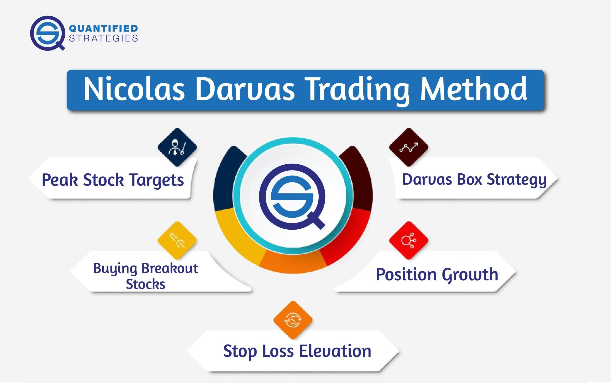

## Table of Contents

## Who was Nicolas Darvas?

Nicolas Darvas was a dancer and a stock market investor. He was born in Hungary in 1920 and became famous for his unique way of making money in the stock market. He wrote a book called "How I Made $2,000,000 in the Stock Market," which became very popular. In the book, he explained how he used a method called the "Box Theory" to pick stocks.

Darvas came up with the Box Theory while he was touring the world as a dancer. He noticed that stock prices often moved in a pattern that looked like boxes. He would buy a stock when it broke out of its box to a higher level, and sell it when it started to fall. This method helped him make a lot of money, even though he didn't have a traditional background in finance. His success story inspired many people to try their luck in the stock market.

## What was the background of Nicolas Darvas before he became a trader?

Nicolas Darvas was born in Hungary in 1920. Before he became a trader, he was a dancer. He started dancing at a young age and became very good at it. He traveled around the world with his dance partner, performing in many different countries. This gave him a lot of experience and made him famous in the dance world.

While he was traveling, Darvas didn't have much time to study the stock market in detail. He would read about stocks in newspapers and magazines when he could. He didn't have a traditional background in finance or economics, but he was curious and wanted to find a way to make money in the stock market. This curiosity led him to develop his own method of trading, which he later shared in his famous book.

## What is the 'Darvas Box' theory and how does it work?

The 'Darvas Box' theory is a way to pick stocks that Nicolas Darvas came up with. He noticed that stock prices often move in a pattern that looks like a box. The top of the box is the highest price the stock reaches before it starts to go down, and the bottom of the box is the lowest price it reaches before it starts to go up again. Darvas would buy a stock when it broke out of its box to a higher level. This meant the stock price went above the top of the box. He believed this was a sign that the stock would keep going up.

To use the Darvas Box theory, you need to watch the stock prices and draw boxes around them. When a stock's price goes above the top of its box, you buy it. But you also need to set a stop loss, which is a price below the bottom of the box. If the stock price falls to the stop loss, you sell the stock to avoid losing too much money. Darvas used this method to make a lot of money, even though he didn't have a lot of time to study the stock market because he was busy dancing.

## How did Nicolas Darvas apply the Darvas Box theory to his trading?

Nicolas Darvas used the Darvas Box theory to make money in the stock market while he was traveling the world as a dancer. He noticed that stock prices often moved in a pattern that looked like a box. The top of the box was the highest price the stock reached before it started to fall, and the bottom of the box was the lowest price it reached before it started to go up again. When a stock's price went above the top of its box, Darvas saw this as a sign that the stock was going to keep going up. So, he would buy the stock at that point.

To make sure he didn't lose too much money, Darvas also set a stop loss. This was a price below the bottom of the box. If the stock's price fell to the stop loss, he would sell the stock to avoid losing more money. This way, he could make money when the stock went up, but also protect himself if the stock went down. Darvas used this simple method to make a lot of money, even though he didn't have a lot of time to study the stock market because he was busy dancing.

## What were some of the key stocks Nicolas Darvas traded successfully?

Nicolas Darvas made a lot of money trading a few key stocks. One of the stocks he traded was Texas Instruments. He bought it when the price broke out of its box and went up. He made a big profit from this stock because he followed his Darvas Box theory and sold it when it started to go down.

Another stock Darvas traded was Thiokol Chemical Corporation. He noticed that the stock was moving in a box pattern and bought it when it broke out to a higher price. Just like with Texas Instruments, he made money by selling it when the price started to fall. These trades helped him make a lot of money and become famous for his trading method.

Darvas also traded a stock called Universal Controls. He used the same method of buying when the stock broke out of its box and selling when it hit his stop loss. This stock also helped him make a lot of money. By sticking to his simple but effective trading strategy, Darvas was able to succeed in the stock market even while he was busy dancing around the world.

## What were the major successes and failures in Nicolas Darvas's trading career?

Nicolas Darvas had some big successes in his trading career. He made a lot of money by trading stocks like Texas Instruments, Thiokol Chemical Corporation, and Universal Controls. He used his Darvas Box theory to buy these stocks when their prices broke out of their box patterns and sold them when they started to go down. This method helped him make over $2 million, which was a huge amount of money at the time. His success story inspired many people to try trading in the stock market, and he wrote a book called "How I Made $2,000,000 in the Stock Market" to share his methods.

Darvas also faced some failures in his trading career. One of his biggest mistakes was not sticking to his own rules. Sometimes, he would get too excited about a stock and buy it without waiting for it to break out of its box. This led to losses because the stock didn't always go up as he hoped. Another time, he didn't sell a stock quickly enough when it hit his stop loss, and he lost more money than he needed to. Despite these setbacks, Darvas learned from his mistakes and kept improving his trading strategy.

## How did Nicolas Darvas manage risk in his trading strategy?

Nicolas Darvas managed risk in his trading by using stop losses. A stop loss is a price below the bottom of the box where he would sell the stock if it fell that low. This helped him avoid losing too much money if the stock price went down instead of up. By setting a stop loss, Darvas could protect his money and only risk a small amount on each trade.

Even though Darvas had a good way to manage risk, he sometimes made mistakes. He would get too excited about a stock and buy it without waiting for it to break out of its box. This led to losses because the stock didn't always go up like he hoped. Another time, he didn't sell a stock quickly enough when it hit his stop loss, and he lost more money than he needed to. Despite these setbacks, Darvas learned from his mistakes and kept improving his trading strategy to manage risk better.

## What were the psychological aspects of trading that Nicolas Darvas emphasized?

Nicolas Darvas talked a lot about how feelings can affect trading. He said it's important to stay calm and not let excitement or fear make you do things you shouldn't. When he got too excited about a stock, he sometimes bought it without waiting for it to break out of its box. This led to losses because the stock didn't always go up like he hoped. He learned that sticking to his rules and not letting his emotions take over was key to successful trading.

Another big part of Darvas's approach was dealing with fear. He knew that it's easy to get scared when stock prices start to fall. But he found that if he stuck to his stop losses, he could avoid big losses. Sometimes, he didn't sell a stock quickly enough when it hit his stop loss, and he lost more money than he needed to. Over time, Darvas got better at managing his fear and sticking to his plan, which helped him become a more successful trader.

## How did Nicolas Darvas's approach to the market differ from other traders of his time?

Nicolas Darvas's approach to the stock market was different from many other traders of his time because he used a simple method called the Darvas Box theory. Most traders back then spent a lot of time studying charts and numbers in detail. But Darvas, who was a dancer and didn't have much time to study the market, came up with a way to trade based on the patterns he saw in stock prices. He looked for stocks that moved in a box pattern and bought them when they broke out to a higher price. This made his method easy to understand and use, even for people who didn't know a lot about the stock market.

Another big difference was how Darvas managed his feelings while trading. Many traders let their emotions, like excitement or fear, affect their decisions. Darvas knew this could lead to bad choices, so he made strict rules for himself. He used stop losses to limit his losses and stuck to his plan, even when he felt scared or excited. This focus on controlling his emotions helped him make better trading decisions and avoid big mistakes. His approach showed that you don't need to be a finance expert to succeed in the stock market; you just need a good method and the discipline to follow it.

## What can modern traders learn from Nicolas Darvas's methods and experiences?

Modern traders can learn a lot from Nicolas Darvas's methods and experiences. One key lesson is the importance of having a clear and simple trading strategy. Darvas used the Darvas Box theory to make decisions about buying and selling stocks. This method was easy to understand and follow, even for someone who didn't have a lot of time to study the market. Traders today can benefit from having a straightforward plan that they stick to, rather than trying to analyze every detail of the market.

Another important lesson is managing risk and emotions. Darvas used stop losses to protect his money and limit his losses. He also talked about how important it is to control feelings like excitement and fear. Sometimes, he made mistakes by letting his emotions take over, but he learned from those mistakes and got better at sticking to his plan. Modern traders can learn from this by setting clear rules for themselves and following them, even when the market makes them feel nervous or excited. By doing this, they can make more rational decisions and avoid big losses.

## How has the Darvas Box theory evolved or been adapted since Nicolas Darvas's time?

Since Nicolas Darvas came up with the Darvas Box theory, other traders and investors have taken his ideas and made them better. They've used computers and new technology to help them find the boxes more easily. Now, there are special programs and software that can draw the boxes for you and even tell you when a stock is breaking out. This makes it easier for people to use the Darvas Box theory without having to do all the work by hand. Some traders also mix the Darvas Box theory with other ways of picking stocks, like looking at a company's earnings or what's happening in the world.

Even though the Darvas Box theory has changed a bit, the main ideas are still the same. People still look for stocks that move in a box pattern and buy them when they break out to a higher price. They also use stop losses to protect their money, just like Darvas did. But now, traders can use more information and tools to help them make better decisions. The Darvas Box theory has stood the test of time because it's simple and works well, but it's also flexible enough to be used with new ideas and technology.

## What are some criticisms or limitations of the Darvas Box theory and Nicolas Darvas's trading approach?

One big criticism of the Darvas Box theory is that it can be too simple. Some people think it doesn't look at enough things about a company, like how much money it makes or what's happening in the world. They say that just watching the price move in a box isn't enough to know if a stock is a good buy. Also, the Darvas Box theory can give false signals. Sometimes, a stock might break out of its box but then go back down. This can make traders lose money if they buy the stock too quickly.

Another limitation is that the Darvas Box theory doesn't work well in all kinds of markets. It works best when the market is going up, but it can be hard to use when the market is going down or staying the same. Also, Nicolas Darvas's approach needed him to be very disciplined and stick to his rules. If he didn't, he could make big mistakes. Modern traders might find it hard to follow his rules all the time, especially when the market makes them feel nervous or excited.

## What are the key components of the Darvas Box Method?

The Darvas Box Method is a trading strategy that fundamentally relies on identifying price highs and volume to create ‘boxes’ on stock charts, which define potential entry and exit points. At the core of this strategy are several essential elements:

### 1. Price Highs
Price highs are critical in forming the upper boundary of a Darvas Box. The strategy identifies a price increase that breaks a previous high, signaling the possibility of a new trading range. Traders using the Darvas Box Method watch for stocks that exhibit strong upward momentum, breaking their preset high points. The formula for calculating the breakout point can often be expressed as:

$$
\text{Breakout Point} = \text{Current Price} > \text{Previous High}
$$

### 2. Volume
Volume plays an integral role in confirming the strength of a price move. An increase in trading volume during a breakout suggests strong investor interest and the likelihood of a sustained trend. In the Darvas method, significant volume serves as a corroborative signal, reinforcing the authenticity of price movements. A typical condition used is:

$$
\text{Volume Condition} = \text{Current Volume} > \text{Average Volume}
$$

### 3. Box Formations
Box formations are constructed by establishing both upper and lower limits on a price chart to identify a trading range. The upper boundary is determined by recent price highs, while the lower boundary is set by subsequent pullbacks or consolidations. This band, or ‘box,’ helps determine when to enter or exit a trade based on breakouts from these defined limits.

### Setting Stop-Loss Orders
Stop-loss orders are crucial in the Darvas Box Method to minimize risk and protect profits. Once a stock enters a Darvas Box, a stop-loss is often set slightly below the lower boundary of the box. This ensures minimal loss if the price turns against the trader's position. The placement of stop-loss orders can be calculated and adjusted programmatically, particularly useful in algorithmic trading environments.

### Complementing Tools: Technical and Fundamental Analysis
While the Darvas Box focuses on price and volume, integrating technical and [fundamental analysis](/wiki/fundamental-analysis) adds depth and context to trading decisions. Technical analysis might involve using indicators such as moving averages or relative strength indices (RSI) to further validate price movements.  

Fundamental analysis, on the other hand, involves assessing a company's financial health, market position, and external economic factors that may influence stock prices. These analyses can provide additional insights and support more informed decision-making.

In summary, the Darvas Box Method offers a systematic approach to capturing stock movements by focusing on price highs, volume, and structured formations. The inclusion of stop-loss orders serves to mitigate risk, while supplementary tools like technical and fundamental analysis enhance the strategy’s robustness and adaptability in varying market conditions.

## References & Further Reading

[1]: Darvas, N. (1960). ["How I Made $2,000,000 in the Stock Market."](https://www.amazon.com/How-Made-000-Stock-Market/dp/1614271690) Lyle Stuart.

[2]: Tharp, V. K. (1998). ["Trade Your Way to Financial Freedom."](https://www.amazon.com/Trade-Your-Way-Financial-Freedom/dp/007147871X) McGraw-Hill Education.

[3]: Pring, M. J. (2002). ["Technical Analysis Explained: The Successful Investor's Guide to Spotting Investment Trends and Turning Points."](https://www.amazon.com/Technical-Analysis-Explained-Fifth-Successful/dp/0071825177) McGraw-Hill Professional.

[4]: Murphy, J. J. (1999). ["Technical Analysis of the Financial Markets: A Comprehensive Guide to Trading Methods and Applications."](https://www.amazon.com/Technical-Analysis-Financial-Markets-Comprehensive/dp/0735200661) New York Institute of Finance.

[5]: Elder, A. (1993). ["Trading for a Living: Psychology, Trading Tactics, Money Management."](https://www.amazon.com/Trading-Living-Psychology-Tactics-Management/dp/0471592242) John Wiley & Sons, Inc.