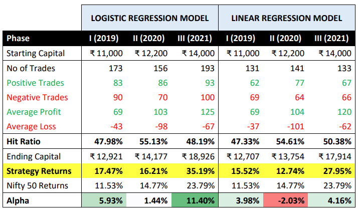

The stock market is a complex ecosystem offering diverse investment opportunities, yet it demands a strategic mindset for navigation. Various investment strategies can be employed to achieve success, with the Nifty Fifty and algorithmic trading standing out as particularly noteworthy. Both have seen significant evolutions over time, reflecting broader shifts in financial markets and investor behavior.

The Nifty Fifty represents a historic group of high-performing, large-cap stocks that captured the attention of institutional investors in the 1960s and 1970s. These stocks, known for their superior earnings growth and elevated price-to-earnings (P/E) ratios, were regarded as "one-decision" investments, suitable for long-term holding without frequent trading. The impact of Nifty Fifty stocks has waned over the years, yet their legacy persists, offering lessons in blue-chip investment strategies that remain relevant in the contemporary market environment.



Meanwhile, algorithmic trading has emerged as a revolutionary tool, transforming the way trading is conducted through the use of advanced algorithms to automate decisions. It enables market participants to execute trades at speeds and scales unattainable by traditional methods, aligning with the increasingly rapid pace of financial markets. By leveraging technology, traders can refine their strategies, enhance timing, and improve overall execution efficiency.

This article endeavors to illuminate these strategies, tracing their historical significance and investigating their modern applications. Through a comprehensive understanding of the Nifty Fifty's enduring principles and the cutting-edge capabilities afforded by algorithmic trading, investors can equip themselves to make informed decisions, ultimately optimizing their portfolios. An exploration of these areas offers valuable insights for both new and seasoned investors seeking to balance historical wisdom with technological innovation.

## Table of Contents

## Understanding the Nifty Fifty

The Nifty Fifty refers to a group of 50 large-cap stocks that emerged as favorites among institutional investors during the 1960s and 1970s. These stocks were particularly attractive because they demonstrated consistent earnings growth and maintained high price-to-earnings (P/E) ratios. This combination allowed them to be considered 'one-decision' stocks—meaning investors could theoretically buy and hold them indefinitely without needing to make frequent buy or sell decisions.

Key stocks within this group included prominent names such as General Electric, Coca-Cola, and IBM. These companies not only played significant roles in their respective industries but also commanded strong investor confidence, which they continue to have today. While the prominence of the Nifty Fifty has diminished over time, their approach to investment laid the foundation for contemporary strategies. The focus on blue-chip stocks—those of large, financially sound, and reputable companies—became a staple investment strategy owing to the stability and lower risk they typically present.

The essence of the Nifty Fifty serves as a lesson for modern investors, particularly in the context of exploring blue-chip stocks and adhering to long-term holding strategies. By investing in well-established companies with a track record of sustained growth, investors can aim to preserve capital while benefiting from potential capital appreciation and dividends. Essentially, the enduring appeal of the Nifty Fifty lies in its demonstration of the benefits of patient, long-term investment in companies that lead their industries, a principle that resonates with the core attributes of blue-chip stocks today.

## Modern Blue-Chip Stocks and Investment Strategies

Modern blue-chip stocks serve as a cornerstone for conservative investors seeking stability and reliability in their investment portfolios. These stocks typically represent companies that are well-established, financially robust, and hold a commanding presence within their respective industries. Such characteristics make blue-chip stocks appealing to investors who prioritize capital preservation and steady income generation.

### Characteristics of Blue-Chip Stocks

1. **Financial Solidity:** Blue-chip companies usually have strong balance sheets, consistent earnings, and a proven capacity to generate cash flow. Their financial robustness allows them to weather economic downturns more effectively than smaller or less established companies.

2. **Industry Dominance:** These companies often lead in their sectors, enjoying competitive advantages such as brand recognition, technological leadership, or superior operational efficiencies. Examples of modern blue-chip stocks include industry giants like Apple, Microsoft, and Johnson & Johnson.

3. **Dividend Payouts:** A hallmark of blue-chip stocks is their capacity to pay regular dividends, which can provide a reliable income stream for investors. Dividends represent a portion of the company's earnings returned to shareholders and can be an attractive feature for those seeking passive income.

### Investment Benefits

Investing in blue-chip stocks is particularly advantageous for those looking to safeguard their capital while [earning](/wiki/earning-announcement) modest returns. The historical performance of these stocks, with respect to market fluctuations, demonstrates a lower risk profile compared to smaller-cap stocks or speculative investments. Additionally, the reinvestment of dividends through compounding can significantly enhance long-term portfolio growth.

### Modern Investment Strategy

Incorporating blue-chip stocks into a contemporary investment strategy can be advantageous for individuals aiming for a balanced portfolio. A typical plan might involve:

- **Diversification:** While blue-chip stocks are generally stable, spreading investments across various sectors can mitigate industry-specific risks.
- **Long-term Focus:** Investors are encouraged to maintain a long-term perspective, as blue-chip stocks typically yield better returns over extended periods.
- **Dividend Reinvestment Plans (DRIPs):** These plans allow investors to reinvest dividends into additional shares, exploiting the power of compounding without incurring additional transaction fees.

### Considerations for Investors

For those seeking low-risk investment options, blue-chip stocks remain a viable choice. However, it's crucial for investors to conduct thorough research and continually assess the financial health and competitive environment of these companies. Utilizing analytical tools and financial ratios such as the Price-to-Earnings (P/E) ratio, Debt-to-Equity (D/E) ratio, and Return on Equity (ROE) can provide further insights into a company's performance and sustainability.

In conclusion, while the stock market involves inherent risks, the inclusion of blue-chip stocks can provide a foundation of reliability and potential profit through stable returns and income. Such strategies enable investors to construct robust portfolios aligned with their risk tolerance and financial goals.

 to Algorithmic Trading

Algorithmic trading involves the use of sophisticated computer programs and algorithms to automate financial trading decisions. By employing complex mathematical and statistical models, [algorithmic trading](/wiki/algorithmic-trading) has transformed how trading is conducted, allowing for the execution of trades at unprecedented speeds and volumes.

The main advantage of algorithmic trading lies in its capacity for high-speed execution. In milliseconds or microseconds, algorithms can process vast amounts of data, identify trading opportunities, and execute orders. This speed advantage is crucial in today's fast-paced financial markets, where price movements can occur in fractions of a second. Additionally, algorithmic trading reduces the impact of human emotions on trading decisions, leading to more consistent and objective investment strategies.

Algorithmic trading works by following a set of predefined rules and criteria programmed into the algorithms. These rules can include parameters for timing, price, quantity, and other market conditions. For instance, a simple algorithm might be designed to buy a stock when its moving average surpasses a certain threshold or sell when a particular resistance level is breached.

There are several advantages of algorithmic trading over traditional methods:

1. **Precision and Accuracy**: Algorithms can execute orders with high precision, minimizing errors and slippage. This level of accuracy is difficult to achieve with manual trading, where human factors often lead to inconsistencies.

2. **Speed and Efficiency**: Algorithms can analyze multiple markets and securities simultaneously, executing trades faster than any human trader. This efficiency enables traders to capitalize on short-lived opportunities in the market, such as arbitrage situations.

3. **Cost Reduction**: By automating trading processes, algorithmic trading can lower transaction costs, minimize manual intervention, and decrease the need for large trading teams.

4. **24/7 Market Access**: With automated systems, trading can continue around the clock, taking advantage of opportunities in different time zones without requiring constant manual oversight.

Understanding the basics of algorithmic trading is essential for traders aiming to incorporate modern technology into their trading strategies. Traders can optimize their strategies by choosing relevant algorithms and rigorously testing them under various market conditions. By doing so, they can enhance market timing and execution, ultimately improving portfolio performance and achieving better financial outcomes.

To begin exploring algorithmic trading, traders can utilize software platforms that provide the necessary tools for developing, testing, and deploying trading algorithms. Here is a simple Python example using the `pandas` library to calculate a moving average crossover strategy, often used as a basic algorithmic trading rule:

```python
import pandas as pd

# Sample stock data
data = {'Price': [100, 102, 104, 106, 105, 107, 109, 111, 110]}
stock_data = pd.DataFrame(data)

# Calculate moving averages
stock_data['Short_MA'] = stock_data['Price'].rolling(window=3).mean()
stock_data['Long_MA'] = stock_data['Price'].rolling(window=5).mean()

# Define a simple moving average crossover strategy
def trading_signal(row):
    if row['Short_MA'] > row['Long_MA']:
        return 'Buy'
    elif row['Short_MA'] < row['Long_MA']:
        return 'Sell'
    else:
        return 'Hold'

# Apply the strategy to generate trading signals
stock_data['Signal'] = stock_data.apply(trading_signal, axis=1)

print(stock_data)
```

In this example, a trading signal is generated based on the crossover of short-term and long-term moving averages, indicating when to buy, sell, or hold the stock. This illustrative demonstration highlights how programmatic approaches allow traders to automate complex analysis and decision-making processes, showcasing the transformative potential of algorithmic trading in modern financial markets.

## Implementing Algo Trading with Nifty Fifty Stocks

Combining algorithmic trading with Nifty Fifty stocks offers a potential edge in today's competitive markets by leveraging the historical robustness of these stocks with modern automated strategies. Here is a detailed guide on how to build such a strategy effectively:

### 1. Selecting the Right Instruments
The first step in implementing an algorithmic strategy with Nifty Fifty stocks is selecting suitable stocks from this prestigious group. While historical Nifty Fifty stocks like General Electric and Coca-Cola are still relevant, it may also be prudent to select modern equivalents with similar characteristics—high earnings growth, strong market positions, and stability. These criteria ensure that the selected stocks provide a reliable foundation for building robust trading algorithms.

### 2. Setting Entry and Exit Conditions
Defining precise entry and [exit](/wiki/exit-strategy) conditions is crucial for the success of any algorithmic trading strategy. These conditions can be based on various technical indicators, such as Moving Averages (MA), Relative Strength Index (RSI), or Bollinger Bands. For instance, a simple moving average crossover strategy might involve buying a stock when a short-term moving average crosses above a long-term moving average and selling when it crosses below.

```python
# Example: Simple Moving Average Crossover Strategy
import pandas as pd

def moving_average_crossover(data, short_window=50, long_window=200):
    data['Short_MA'] = data['Close'].rolling(window=short_window).mean()
    data['Long_MA'] = data['Close'].rolling(window=long_window).mean()
    data['Signal'] = 0
    data['Signal'][short_window:] = \
        np.where(data['Short_MA'][short_window:] > data['Long_MA'][short_window:], 1, 0)
    data['Position'] = data['Signal'].diff()
    return data

# 'data' is a DataFrame with historical stock prices including a 'Close' column
```

### 3. Managing Positions Effectively
Effective position management involves determining the size of each trade and managing the risk associated with it. This can involve setting stop-loss orders to limit potential losses and ensuring no single trade exceeds a specified percentage of the total portfolio. Techniques such as Value at Risk (VaR) or Conditional Value at Risk (CVaR) can be used to quantify and manage risk.

### 4. Testing and Optimizing Strategies
Before deploying a strategy in a live trading environment, it is vital to test and optimize it using historical data and market simulations. Backtesting involves simulating the strategy over historical data to evaluate its performance. This process allows traders to refine entry and exit conditions and improve risk management parameters to enhance profits while minimizing risks.

```python
# Example: Backtesting a Strategy
import numpy as np

def backtest_strategy(data):
    initial_capital = 10000.0
    positions = data['Position'] * (initial_capital / data['Close'])
    portfolio = pd.DataFrame(index=data.index)
    portfolio['Holdings'] = positions.multiply(data['Close'], axis=0)
    portfolio['Cash'] = initial_capital - (positions.multiply(data['Close'], axis=0)).cumsum()
    portfolio['Total'] = portfolio['Holdings'] + portfolio['Cash']
    portfolio['Returns'] = portfolio['Total'].pct_change()
    return portfolio

# 'data' is a DataFrame with additional 'Position' column after strategy signals
```

### 5. Leveraging Nifty Fifty Stability
The inherent stability of Nifty Fifty stocks can be beneficial when combined with the precision of algorithmic trading. This can reduce [volatility](/wiki/volatility-trading-strategies) often observed in algorithmic strategies, as Nifty Fifty stocks are typically less prone to extreme price swings. Traders should focus on the long-term growth and reliable dividend income that these stocks offer, alongside the agility provided by algorithmic trading.

By integrating these components, traders can build an algorithmic trading strategy that harnesses the enduring appeal of Nifty Fifty stocks with the technical prowess of automated trading. This blend of historic stability and modern efficiency can provide a resilient strategy capable of adapting to changing market conditions.

## Testing, Optimization, and Risk Management

Testing and optimizing trading strategies are vital processes for traders seeking to maximize their returns while minimizing risks. The utility of these processes lies in their ability to align a trader's strategy with the ever-changing market dynamics, thereby enhancing decision-making and performance.

Backtesting is a fundamental component of testing trading strategies. It involves applying a trading strategy to historical market data to evaluate how it would have performed in the past. By doing so, traders can identify potential weaknesses and strengths of their strategy before deploying it in real-time markets. An effective backtest requires a robust dataset, covering a range of market conditions to ensure the strategy's viability across different scenarios. Key metrics, such as the Sharpe ratio, maximum drawdown, and win/loss ratio, should be assessed to gauge the strategy's performance. 

Adjustments are often necessary to align strategies with the current market conditions. Market environments can change due to various factors — economic indicators, geopolitical events, or market sentiment shifts. Regularly revisiting and recalibrating strategies ensures they remain effective and relevant. For instance, a trading strategy optimized for high-volatility markets might need adjustment when volatility decreases, requiring modifications in entry and exit signals.

Risk management is indispensable for safeguarding investments, particularly in markets characterized by volatility. Setting stop-loss limits is a basic yet powerful tool for controlling potential losses. A stop-loss order represents a pre-set point at which a trader will exit a losing trade, preventing further deterioration of their portfolio.

To continuously adapt trading strategies, ongoing assessment of market trends and changes is essential. Traders might use moving averages, volatility indices, or other indicators to monitor market shifts. They should remain vigilant to modify their strategies as needed, based on their assessments.

The integration of these concepts can be illustrated through Python coding. For instance, setting stop-loss orders can be automated in a trading algorithm using Python, where a stop-loss percentage can be defined, and the code will execute orders based on this threshold:

```python
def apply_stop_loss(current_price, entry_price, stop_loss_pct):
    stop_loss_price = entry_price * (1 - stop_loss_pct)
    if current_price <= stop_loss_price:
        return "Sell"
    else:
        return "Hold"

# Example usage:
current_stock_price = 95
entry_stock_price = 100
stop_loss_percentage = 0.05  # 5% stop-loss
action = apply_stop_loss(current_stock_price, entry_stock_price, stop_loss_percentage)
print(action)  # Output: Sell
```

Understanding and implementing testing, optimization, and risk management strategies are critical for traders looking to enhance the robustness and resilience of their trading strategies. These practices not only protect investments but also support strategic growth in diverse market climates.

## Conclusion

Investing in the stock market requires a comprehensive strategy that can adapt to evolving market dynamics. The combination of historical lessons from the Nifty Fifty stocks with contemporary algorithmic trading techniques provides a distinctive investment approach that leverages both past wisdom and technological advancements. By studying the consistent growth patterns and strategic insights from the Nifty Fifty, investors can better understand the enduring value of long-term, stable investments. When this historical perspective is integrated with the efficiency and precision of algorithmic trading, investors are poised to enhance their decision-making capabilities significantly.

This article has highlighted the critical components of these two investment strategies, emphasizing their potential to inform and optimize investment decision-making. Algorithmic trading, with its ability to process vast amounts of data and execute trades at remarkable speeds, offers a competitive edge in today’s fast-paced market. Meanwhile, integrating the reliability and historical success of the Nifty Fifty stocks introduces an element of stability and resilience into investment portfolios.

For future traders, ongoing learning and adaptation are paramount. Embracing new trends and technologies will allow investors to stay ahead of market shifts and to incorporate innovative tools into their strategies. Emphasizing a balanced approach that takes into account both the potential advantages of new technologies and the proven stability of time-tested investment strategies is crucial in navigating the complexities of modern financial markets.

May your investment journey be successful, utilizing strategies that effectively balance risk and reward, paving the way for sustainable growth and financial well-being.

## References & Further Reading

[1]: Anderson, R.M. (2005). ["The Nifty-Fifty Re-Revisited."](http://economics-files.pomona.edu/GarySmith/papers/Nifty50/Nifty50.html) Financial History Review.

[2]: Lopez de Prado, M. (2018). ["Advances in Financial Machine Learning."](https://www.amazon.com/Advances-Financial-Machine-Learning-Marcos/dp/1119482089) Wiley Finance.

[3]: Aronson, D.R. (2007). ["Evidence-Based Technical Analysis: Applying the Scientific Method and Statistical Inference to Trading Signals."](https://www.amazon.com/Evidence-Based-Technical-Analysis-Scientific-Statistical/dp/0470008741) Wiley Trading.

[4]: Jansen, S. (2020). ["Machine Learning for Algorithmic Trading."](https://github.com/stefan-jansen/machine-learning-for-trading) Packt Publishing.

[5]: Chan, E.P. (2008). ["Quantitative Trading: How to Build Your Own Algorithmic Trading Business."](https://github.com/ftvision/quant_trading_echan_book) Wiley.